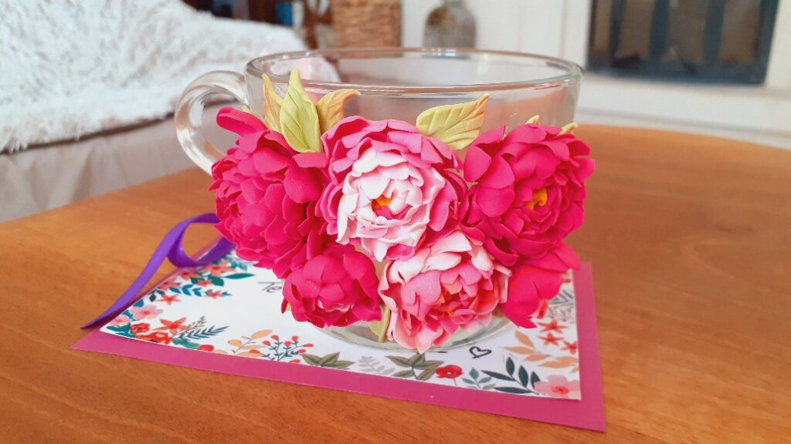

Oricât de devreme a fost, nu am putut să nu observ măreția momentului și a umorului Universului: 4:44. Priveam pe tavan proiecția ceasului și, pentru o secundă, am fost total împăcată cu și în moment. Era o frumusețe a clipei, habar n-am ce-o alcătuia, dar am simțit clar că atât corpul, cât și mintea mea, nu-i opun nicio rezistență. Pesemne că ora asta a avut un dar mic în ea, unul subtil, pe care nu l-am perceput, dar a avut și unul grosier, tocmai această frumusețe lină ce m-a îmbrățișat. 4:44 a trecut rapid dar eu am rămas trează, cu o aromă aparte în mine toată și cu o curiozitate de copil. Unde ne ducem noi când dormim? De ce ne ducem undeva sau, și mai adânc, de ce dormim?

De multe ori, în ultima perioadă, deși tânjesc după odihnă, parcă aș fenta somnul pentru o savurare de mai mult timp al meu. Nu m-ar deranja să fiu nemuritoare. Dacă am putea să ne odihnim dar fără să dormim, cât timp am avea! Să facem de toate pentru toți. Poate tocmai d-aia dormim: ca să nu le facem pe toate, toți.

***

Mi-e clar că nu mai adorm dar parcă nici să mă dau jos din pat n-aș vrea. E o liniște caldă, domnul meu și Spiky torc încetișor, fiecare în legea lui, e un drag atât de drag inimii mele care plutește în cameră și care mă ține în mrejele lui, încât nu pot și nici nu vreau să rup vraja asta. Nu acum.

Stau cuminte, cu ochii deschiși în bezna camerei, și-mi propun o evadare.

Sunt pe o colină toscană, din pântecul ei pornește o străduță străjuită de chiparoși inalți, de-un verde bogat, e drumul pe care am urcat puțin mai devreme la fosta fermă unde locuim acum. Din pridvorul casei de piatră veche, grea, butucănoasă dar cu istorie blândă, privesc cum soarele se joacă de-a v-ați ascunselea cu chiparoșii, pe canvasul drumului pietruit. E un aer tare, al dimineții, aburi de cafea parfumată se împletesc cu mirosul de fân proaspăt cosit, e nici cald dar nici rece, iar eu sunt plină de mine, de viață, de iubire, de fermă, de tot și toate și atât. E o pace și o împăcare în modul cum îmi coc ziua care împing spre inexistență orice greutate, orice grijă, orice gând de nebine. Ferma asta veche mi-adăpostește omul iubit și e coconul noii noastre vieții, departe de civilizație dar aproape de beatitudine. Mi-e atât de bine în acest moment, carnea mi se furnică de voluptatea vieții, sufletul parcă-mi saltă trupul în elanul lui de a trăi, sunt tot universul și tot universul e în mine!

***

Că tot zicea nenea Neale să n-ai gânduri de sponsorizare, alea care te pun repede "la locul tău" atunci când ai vreun vis și l-ai vrea și-n realitate DAR nu știi cum, poate nu iese, nu ai banii, nu ai timpul, ce-o să zică lumea (ăsta e cel mai tare gând), DAR-ul ăsta care omoară vise. Well, în dimineața asta, eu am simțit mirosul la propriu în nări iar pielea mi s-a făcut de găină pe bune. Deci, din bezna asta a unei camere din România, am putut să fiu pe o colină de Toscana. Cu totul, am fost acolo.

Apoi, m-au circulat două întrebări: dacă deja ai fost acolo, mai are rost să te duci for real? Și oare cât ia materializarea în fizic după ce am simțit potențialitatea cu toți porii? Când plecăm în Toscana?!

Am zâmbit larg și-am simțit, când nici nu terminase mintea să pună a doua întrebare, că răspunsurile nici nu contează, că ar vulgariza momentul ăsta perfect pe care tocmai l-am trăit. S-a împlinit ce trebuia să se împlinească și atât. Ce rost are analiza pe text?

***

Mama a decis că nu vrea smoothie, cel puțin o perioadă, așa că o las să se convingă și singură că fructele dimineața pe stomacul gol nu au nicio legătură cu transpiratul ei abundent peste noapte.

Pentru că nu mai am niciun pistol imaginar care să-mi fugărească mișcările, parcă nici timpul nu mai are vâltoare.

Obiceiul s-a încarnat în mine, mă văd cum mă duc pe repede-nainte, mă văd și cum trag frâna de mână, per total încerc să împac două momente cu tempo-uri diferite și să le molcomesc într-unul. Mi-e clar că ce-am bătătorit în patru luni, nu pot dezbătători într-o dimineață. Ș-apoi, refuzul mamei e unul temporar, ia să nu-mi obișnuiesc obiceiul cu chestii noi care nu trec testul timpului.

***

Chiar dacă nu-i duc smoothieul, tot mă duc să fac inspecția de curat și bun trai la ele în cameră. Tot mă duc să-i dau să pape lui Sassy. Tot trec să-i zic o "ziua bună" și să mă prind din răspunsul ei, verbal și non-verbal, dacă și-a mea o să fie la fel. Cât pot și eu să întrezăresc, că elementul surpriză e tot timpul pe aproape.

Ciudat, simt parcă fizic că am o activitate în minus. Habar n-aveam cât de mult se duc în fizicalitate activitățile repetitive, cum parcă ești ciung când nu bifezi tot ce bifai mecanic în fiecare zi. Deci are și-un corespondent în minte, aia care tinde ea să dețină controlul, să bifeze tot ce știe că e de bifat și apoi se liniștește. Mă bucur că mă observ, mă bucur că am văzut asta și vreau să văd dacă ajung la sevraj până se va decide mama să bea din nou smoothie. Hai că, vreau, nu vreau, e fascinant spectacolul oferit de propria-mi persoană! Clar, nu mă plictisesc!

***

Nu m-am mai uitat de mult la HGTV, un canal numai de design, așa că azi îl las să-mi ocupe timpul și mintea.

E o emisiune faină, de reamenajare, în care gazdele, de altfel el constructor, ea designer, sunt soț și soție. Mereu mi-a plăcut să-i văd, au o căldură în modul cum se privesc, în modul cum el o ține, mai tot timpul, fie protector de după umeri, fie de mână, fie de mijloc, e o romanță acolo pe care-mi place să o privesc. Azi romanța lor m-a trimis cu lupa la romanța mea de viață.

Cândva, în altă viață din viața mea, așa de departe mi se pare, mă uitam cu invidie la cuplurile care, cel puțin dinafară, păreau că sunt închegate. Pentru că ai mei au divorțat, crudă fiind, am luat asta ca fiind normalul relațiilor și, ajunsă la un moment critic, am făcut același lucru. Că doar ăsta era normalul. Mi-aduc aminte cât de uimită eram când aflam că colege de liceu încă sunt cu băieții de atunci, deveniți soți între timp.

Acum știu că nu contează care e normalul, că nici nu există un normal, știu doar că doi oameni pot să rămână împreună o viață întreagă dacă există voință și dorință. Și că povestea lor se scrie cu adevărat în intimitatea lor și, dacă e autentică, le iese prin toți porii. Fix ca la cei doi prezentatori.

***

Micul dejun a fost unul pentru amândoi, și pentrul Mr. H, și pentru mama, iar eu am fost dirijorul orchestral. Mi-a intrat în (prostul) obicei să ciripesc într-una, nu știu de ce țin neapărat să spoiesc o realitate taciturnă, dar o fac. Am profitat de prezența domnului meu, de care mama se jenează câteodată, și am anunțat-o că pe la prânz mergem amândouă la mall. Faptul că nu am întrebat-o, doar am anunțat-o, a luat-o prin surprindere, s-a creat un vid în mintea ei și nu a avut nicio scuză aproape, pe care să o scoată la defilare. S-a notat, mergem la mall, pe la prânz.

Noroc că la câteva minute după ce a urcat ea de la micul dejun, m-am dus să-i dau medicamentele, la țanc cât să o opresc din îmbrăcat. Ea deja se schimba să plecăm, deși am repetat de nșpe ori că mergem la prânz. Ultima parte nu a mai intrat pe poarta minții, a trântit ușa după "mergem". I-am zis că plecăm în patru ore, și am observat că dacă devin specifică, dacă îi dau calupuri de timp, am șanse mai mari să rețină decât dacă îi dau momente în timp ale zilei. Ok, am mai învățat ceva.

***

Cred că în garaj, dacă cumva aveam infiltrate vietăți, înaripate sau nu, nu mai mișcă niciuna. Soluția trăznet, bio de altfel, pentru curtea mea, mă așteaptă de două zile acolo și dacă nu o dau acum, pot s-o arunc, că nu mai are efect. Acuma trebe doar să mă conving că am învățat ceva din prima experiență și că nu o să mai fie la fel. Partea proastă este că nu am învățat nimic din prima experiență, că nu știu la care cotangentă am greșit atunci ca să repar acum, costum de cosmonaut sau apicultor n-am, așa că nu pot decât să sper.

Mi-am înfășurat strâns capul într-o eșarfă mare, de n-au rămas afară decât perechile de ochelari, două la număr, că dacă mai aveam, le puneam și p-alea, și un mic vârf de nas. Aceeași metodă, vermorel în cârcă, afară chiar nu bate niciun vânt, niciun vântișor și niciun vântuleț. Nimic, nada. Dacă și-acum mă ard, jur că data viitoare plătesc pe cineva să se ardă!

Well, din când în când, mai am și eu câte-un cuvânt de spus în fața Universului și se pare că azi l-am spus apăsat că niciun sfredeluș de usturoi, boia și detergent de vase nu s-a strecurat pe sub sau pe deasupra ramelor de ochelari. Am terminat rapid, recunosc că am dat multă soluție și pe lângă pomișori, că mai mult cu ochii închiși am dat dar, una peste alta, am dat-o pe toată, în toată curtea și, creme de la creme, nici nu a mai plouat!. S-a strigat Bingo azi!

***

Plecăm spre mall dar fac un mic ocol înainte să-i arăt de unde culeg eu salcâmul, să văd dacă socul e gata de cules, să vadă case frumoase, cu curți pline de flori, să se bucure și ea puțin și de altceva decât de mall. Am avut dreptate, chiar s-a bucurat, natura asta atinge toate sufletele, nu contează cum sunt mințile.

La mall, primul drum a fost la coafor. Vreau să se simtă bibilită, nu mai vreau să o tund eu acasă că nici nu mă pricep și o și văduvesc de experiența plăcută a unui coafor. Și aici am avut dreptate, și noroc, că am dat peste un tip care a tratat-o delicat, care i-a făcut și masaj la cap, a și aranjat-o, dar mai presus de toate, a tratat-o cald. Asta a impresionat-o cel mai mult. Mă bucur și am și un mic gând de invidie, că eu nu o impresionez că o tratez cald. Mă prind că mă compar cu un frizer, că e stupidă invidia, mă bușește un râs mic, mama râde și ea de râsul meu, deși nu știe cauza, și plecăm la braț să facem cumpărături.

Am lăsat-o să cumpere ce vrea ea, să-și facă poftele, am cumpărat rebus, am complimentat-o pentru tunsoare, a fost în delir de cât îi plăcea complimentul, am dus-o și la restaurant și, la plecare din mall, mi-a zis "O să dorm la noapte neîntoarsă. Sunt plină de ziua asta!"

Am simțit că i-a fost bine, nu-i nevoie de cuvinte pentru asta, se transmite prin energie, dar nu am putut să nu observ scăpările ei. Voia ardei, puneam ardeii în coș, în câteva secunde, se ducea din nou să ia ardei. Luasem rebusurile, eram cu ele în mână și ea mă presa să mergem la magazinul de rebusuri. Cel mai dur a fost la întoarcere, când admiram trandafirii crescuți pe gardurile de la stradă și ea m-a întrebat naiv:

La Andreea e la fel?

Care Andreea?

Cum care Andreea, fiică-ta!

Pe copila mea nu o cheamă Andreea.

***

Primesc sms că vine peste mine o livrare. Cum așteptam livrarea unui card, n-am citit detaliile sms-ului și nici nu i-am dat importanță. Neastâmpărul ăla pe care-l ai când îți vine acasă ceva ce ai comandat nu era în peisaj, pentru că nu comandasem nimic. Și totuși, curierul mi-a înmânat o cutie. Abia atunci am devenit atentă, doar nu mi-a trimis banca și cardul și niscai bani, mulți, pe lângă, de primesc o așa cutie.

Pe cutie scrie fragil așa că încerc, cât pot eu de mult, să nu fiu elefantă cum sunt de obicei când mă grăbesc. Deschid cutia și mă umplu de consternare, de uimire și de lacrimi: e o cană, împodobită cu bujori lucrați manual din lut polimeric. Autoarea gândului, timpului și gestului este Baby a mea, femeia asta faină pentru care actions means more than words, care și-a făcut un buzunar în viața ei, m-a strecurat pe mine acolo și n-a uitat să pună și niște bujori, să-mi bucure inima și ziua! Uite că și azi plâng, dar azi plâng de frumos, de cald de suflet și de suflet cald, de bucurie, de prietenie, de recunoștință! Și plâng și acum, când scriu și poate că o să plâng mereu când o să-mi amintesc acest moment de inimă. Doamne, cât bine-balsam mi-a făcut! S-a nimerit să fie fix după ziua deznădăjduită de ieri. Sau poate nu s-a "nimerit"… Mulțam cu recunoștință!

***

Domnul meu iese în oraș, mama e obosită și picotește, iar eu fac maxima aroganță de până acum, în patru luni, de a participa online la un MasterClass cu Neale Donald Walsch, pentru sufletul meu! O altă doamnă faină și-a rupt din viața ei bucata asta de informație și a împărtășit-o, iar la mine a făcut click.

Wow!

Ori lacrimile de mai devreme, o dată pornite, nu se mai lasă oprite, ori s-a dislocat în mine o placă tectonică de disperare amestecată cu frustare și a lăsat să iasă la suprafață o lavă caldă de înțelegere profundă a subtilității vieții. Am plâns aproape tot MasterClass-ul, și nu pentru că sunt eu extrem de sensibilă, ci pentru că am avut impresia că MasterClass-ul ăsta a fost pentru mine, exact în acest moment al vieții mele.

Când a enunțat primul mesaj, am simțit în mine o îmbrățișare totală a spuselor lui, ființa mea a salutat adevărul din el: toți suntem unul. În adâncul meu, și cred că în adâncul tuturor, pe fundul oceanului nostru interior, stă acest adevăr infailibil.

Încep, în ultima vreme, să mă prind de alt mesaj de-al lui, că nu există greșit sau corect, dar am avut și parte de surprize în înțelegere: dă altuia ce crezi tu că nu ai.

Aici, mi s-au ciocnit ceva neuroni până am priceput tâlcul. Dacă ai bani puțini, dă din ei altuia care are bani și mai puțini decât tine. Dacă crezi că n-ai timp, dă altuia, cu timp și mai puțin decât tine, din timpul tău. Făcând asta, se înlănțuie două lucruri interesante: dând cu adevărat, te vei contrazice, la propriu, că nu ai pentru că tocmai ai dat (!) - nu contează că din doi lei, ai dat unul, esențialul este că ai dat și ai conștientizat că da, am avut îndeajuns încât să pot da -  iar asta creează o semnătură energetică în Univers, Univers care funcționează ca o mașină de xerox - copiază emoția și conștientizarea uimită că chiar ai îndeajuns încât să dai și îți trimite înapoi că ai îndeajuns încât să dai. O altă definiție pentru abundență.

Le scriu aici că poate nu le uit. Deși eu nu mă întorc să citesc ce scriu.

***

Închid și eu, ca și mama, o zi plină! Și-am reușit să activez și recunoștința și s-o trimit înmiit înapoi pentru:

1. imaginația folosită cu creativitate! O altă formă de a spune că putem să facem orice.
2. Baby și o cană cu bujori! Speechless!
3. Neale și mesagera care mi l-a livrat pe Neale și mi-a programat sufletul la o consultație de suflet, atât de binevenită acum!

Clipa mea de frumos nu poate fi decât o cană cu bujori!

