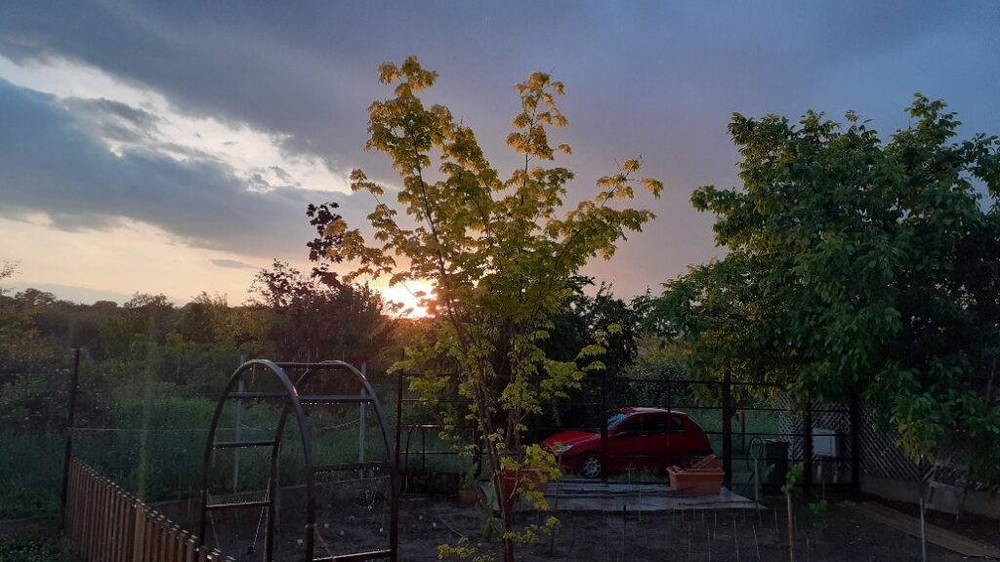

Trezirile încep să-mi fie line, parcă s-a înmuiat în sfârșit răzvrătirea din mine și a acceptat că n-avem altă variantă, nici eu, nici corpul meu. E drept că el încă mai trage nădejde și speranță că-l odihnesc un strop mai mult, dar nu mă pun cu împrejurările, că ies cam ciufulită din ele în ultima perioadă. Stau cumincioară, să vedem cum evoluează lucrurile. La cum mă știu, "iapă neîmblânzită" cum îmi zice Mr. H, nu cred că am integrat adevărul prea-dimineților, ci doar am ațipit o țâră monstrul.

Puiul blănos, care e incredibil de liniștită în ultima vreme, mă așteaptă la colț de pat, și mă fixează cu niște ochi de Bagheera. Dacă n-aș iubi-o, ar fi un pic straniu momentul ăsta în întuneric, când 2 biluțe galben-verde licăresc și se uită direct până-n adâncurile mele. Se zice că pisica întâi îți vede energia și abia apoi forma. Oricum ar fi, cred că la mine azi vede direct forma, că energia încă nu s-a adunat.

\*\*\*

Salut cu prezență liniștea asta din toată casa și mă învălui în ea. 

Eu am o relație specială cu liniștea și-mi place să o experimentez în diverse moduri. Îmi place să am căști care izolează super fain și să-mi aud bătăile inimii super clar. Îmi place să mă scufund cu totul sub apă, inclusiv cu capul, cu degetele apăsate pe urechi și să mă aud de sub apă. Tare mișto senzația asta! Mi-ar plăcea să experimentez camera întunecată - dark room - și este pe my bucket list, lista aia cu toate nebunelile mele pe care vreau neapărat să le bifez până la final de drum aici. 

Probabil că mie-mi curge prin sânge sora liniștii, pentru că dimineața, când pornesc robotul pentru smoothie, mi se strânge scurt corpul, parcă revoltat de zgomot. Ce tare, niciodată până azi n-am verbalizat și conștientizat răspunsul subtil al corpului meu la ne-liniște. Încep să-mi observ la grad de finețe, reacțiile, iar cele fizice sunt cele mai ușor de notat.

\*\*\*

Pentru că nu vreau altceva acum decât pacea asta scurtă, aleg să nu fac nimic. Nici terasă, nici treabă în bucătărie, aleg să stau cu mine și cu pacea în living. 

Acum câteva zile, o fiiință dragă mie mi-a trimis un articol cu 7 minute alocate nealergatului ăsta haotic prin viață, job, relații, case și timp. Răspunsul meu a fost că da, și eu partikip! la trasul frânei de mână. Uite că azi a venit declarația mea și mi s-a pus în fapt și-n dimineață. Chiar asta fac, nu neapărat că-s alergată deja-n zi, că-i încă la începutul ei, ci pentru că vreau să am cât mai multe momente d-astea cuminți în prezentul meu. Un adevăr brutal pe care-l trăiesc, la pachet cu multe minunății, de când scriu, este că azi e ziua 12, mâine ziua 87, poimâine ziua 132. Zău dacă știu unde aleargă timpul ăsta nebun și-mi ia cu el și viața. Așa că momente d-astea de pace sunt borne grele, de statornic, parcă vreau să torn în clipe beton să le țin în loc mult și bine.

Ce-mi place că un moment bun și cald atrage după el alt moment bun și cald, pacea mea blândă mi-a dat și-o mângâiere de meditație mică dar mare și de abia acum pot să plec în navigarea zilei. Mi-am spus meditației intenția, s-o sufle ea în pânzele zilei și să-mi dea ce-am nevoie să vâslesc cu drag și nu cu încrâncenare. Încep să simt crăpături pe ici pe colo, prin suflet, de la momentele alea care mă sparg în bucăți. 

\*\*\*

Cu micul spasm aferent robotului, m-am mișcat cu talent așa că mă reped și la mama, să văd cum e viața și la ele. E bună, cu excepția plângerilor inerente și adânc împământenite în felul mamei de a fi, transmis pe cale genetică și către subsemnata. Deschid larg geamul că e nevoie de aer curat iar ea se plânge că e frig. Dacă nu e frig, o doare ceva iar dacă n-o doare ceva, sigur e frig. Ignor cu zâmbetul pe buze, că așa îl înțepenesc eu când mă duc la ea și mai încerc norocul cu smoothie dimineața. Șoc și groază, e și ea de acord să reluăm smoothieul că chiar îi făcea bine. Abia acum înțeleg eu de ce-mi urează lumea să am putere și nervi de oțel, să nu mi se îndoaie de la țopăielile astea din da în nu, din nu în da, acum e bine, în ziua următoare ce era bine ieri devine rău și tot așa. Trebe să-mi croiesc o platoșă cu niște fire de indiferență, unele de toleranță, altele de înțelegere a bolii, și multe de grijă și dragoste. Cât s-o putea.

\*\*\*

Timpul meu magic nu e pentru mine azi, că sunt multe în programul artistic al zilei, timpul nu e frate cu Păsări-Lăți-Lungilă și nu mi le cuprinde pe toate, așa că îndes pe unde pot, ce pot.

Mi s-a uscat salcâmul și trebe aleasă floarea și pusă în pungile de hârtie, scris și datat și depozitat pentru ceaiul meu chiar de toate zilele. E migăloasă treaba dar pentru că-i uscat bine, merge repede. Ascult și un podcast fain, ceva ușurel, o poveste de viață și-mi dau seama că toți, dar absolut toți, avem povești fascinante, pline de wow-uri, pline de traume dar și de trăiri sublime și că esențial este să nu te lași impresionat chiar tu de povestea ta, mereu și mereu. S-o lași să curgă, să pui curiozitatea înaintea suferinței, cu singura mențiune că trebe să faci asta zilnic, un fel de igienă personală. Eu încă sunt învățăcel la faza asta, cu curiozitatea. Câteodată-mi iese, alteori nu. Dar I keep walking.

\*\*\*

Mic dejun tras la xerox cu cel de ieri, cu tot cu poveștile desenate în alte culori azi, aceeași Mărie cu altă pălărie. Ca să mai schimb subiectul, îi propun să vină cu mine, să fac niște cumpărături mici, în general fructe și legume, că astea se termină cel mai repede. Nu vrea, o doare un picior. Oare de ce nu mă miră?! Dacă mai stăteam puțin, apărea și domnul meu la micul lui dejun și poate o convingeam pe coana mare, la fel ca data trecută. Ok, nu vine, dar hai să facem lista împreună. Câteodată, nici eu nu știu de ce nu înțeleg că ea nu mai poate să scoată informația, că e ca un sac fără fund: orice pui în el, se duce Dumnezeu știe unde, în ce gaură neagră, că nu mai găsește, nici picată cu ceară. În afară de câteva chestii, mereu aceleași, nu mai reține nimic. Așa că o las să se ducă sus, dar măcar am gentilețea să nu o fac să se simtă mai puțin. Mă irită, încă, nu știurile ei dar bine-mi face, că eu sunt cu mintea-ntreagă și ar trebui să pricep că unde nu e, nici Dumnezeu nu cere. Doar eu bat ca bezmetica la niște porți care nu se vor mai deschide vreodată.

\*\*\*

Domnul meu iar pleacă cu jobul și iar mă lasă mai puțină. Mult prea puțină. E un mare atașament între mine și el, îl simt dar nu mă pot stăpâni, de fapt nu vreau să mă stăpânesc. Cred că e și vice-versa. E un sentiment mișto ăsta care mă traversează și-l privește doar pe el, așa că nu vreau nici să-l diluez, nici să-l domolesc. Îl las așa, cu tot sclipiciul, și mă bucur de el, așa plin. Iar când pleacă, ia cu el și mult din mine. Noroc că vine repede, deși repedele ăsta e și el relativ.

\*\*\*

Am cumpănit și lungit micul dejun cu omul drag iar la cumpărături, am fost numa' pe fugă, să mă-ntorc repede acasă. 

O singură dată-n viața mea am mai trăit asta și o privea pe măița mea, mama tatălui meu, care m-a crescut până m-au dat ai mei la școală. Femeia asta a fost singura care mi-a arătat căldură și am toate amintirile cu ea extrem de vivide în mine, în sertare speciale, unde nu se pune niciodată praful. Probabil că ăsta e și motivul pentru care încă o visez, după 40 de ani de când nu mai e fizic aici. Când venea măița la noi acasă, în vizită, eu nu puteam să ies afară la joacă. Pur și simplu, nu puteam să plec afară și să o las pe ea în casă, fără mine și eu fără ea. Am sorbit toate momentele cu ea atât de intens că d-aia le și am atât de colorate-n carnea memoriei. Când măița mea era cu mine, nu mai exista nimeni și nimic nu mă tenta. Nici măcar joaca cu copii afară. Preferam să stau cu ea, să o văd cum face treabă, cum culege ea cu degetele scamele de pe mocheta neagră cu flori mari grena, cum șterge un praf imaginar de pe mobilă, cum fuma țigările alea nenorocite, Carpați, care i-au și pus capacul de lemn mai repede decât trebuia, decât eram eu pregătită. Pierderea ei a fost tragedia vieții mele. 

Uite că, după un ciclu de 40 de ani, mă trăiește din nou trăirea aia, atât de mișto și atât de totală.

\*\*\*

Mi-am lăsat omul să-și ia zborul, la propriu, și m-am refugiat în câmp, la cules de soc. Am ochit eu, când am cules salcâmul, un soc singuratic, în mijloc de câmp și azi m-am dus direct la el. Socul este unul dintre cei mai puternici atrăgători de purici negri. Pe tijele mici ce susțin cimele, se strâng mii de purici negri, ce sunt o pacoste apoi la procesul de uscare. Pentru că socul ochit de mine era în the middle of nowhere, fără alți copaci prin-mprejur, iar la nivelul solului era doar iarbă, am cules niște cime cât palma de mari, curate, fără pic de purici, parfumate și lăptoase, de-ți venea să le mănânci de frumoase ce sunt. De mult n-am mai găsit așa minunății, am mulțumit la greu pentru norocul ăsta și mi-am umplut 2 pungi mari, până la refuz. Am avut grijă să nu-l rănesc și i-am promis că, la anul, dacă avem amândoi zile, ne reîntâlnim, în același loc, la aceeași oră. 

\*\*\*

Îmbibată de parfum, am ajuns euforică acasă dar n-am avut cu cine să împart bucuria că mama doarme. Nu-i bai, am văzut pe cameră că a desfăcut rebus și doar ce-am intrat eu pe poartă, ea s-a pus la somn. O las în pace, oricum am treabă cât cuprinde.

Întind socul la uscat, e o nebunie de miros în toată casa, am întins și la Mr. H în birou, că nu mi-a ajuns masa mare din living. Deși l-aș bibili și descânta până mâine, trebe să ies să pregătesc zona pentru roșii. Le-am scos afară, s-au adaptat peste noapte, trebe să le pun în pământ cât mai repede.

Spikylina noastră, deși sterilizată, are un pretendent ce o vizitează aproape zilnic, Hitlerică. Și el, ca un golan ce este, are o mare pasiune de a se tăvăli peste florile mele, ca să-și lase mirosul în care vine domnița și se tăvălește. Am tot pus eu furculițe de plastic, bețigașe chinezești, tot felul de impedimente dar tot au reușit să-mi strice niște iriși, așa că la roșii nu mă risc. Mi-am delimitat zona unde le pun, am împrejmuit-o cu plasă de gard, joasă, am făcut semnele în pământ și am calculat distanțe. E prima oară în viața mea și sunt la faza de centimentru, să fac ca la carte. E ca la primul copil. Nu știu din experiență proprie cum e la al doilea, dar nici nu-i greu de imaginat, pesemne că la anul nu o să mai dădăcesc atâta răsadurile, poate le cumpăr deja mari, o să ard niște etape care acum mi-au dat bătăi de cap și de inimă.

Am terminat la țanc, că s-a pornit o ploicică în ropot, e și soarele-n apus, e o splendoare să privești partea asta din filmul naturii. 

\*\*\*

Poate e timpul să mă opresc, mama, după suc și pastile, s-a culcat la loc, nici n-a vrut să audă de duș, pisicile sunt primenite, mirosul de soc plutește mișto iar eu îmi scorez recunoștința pentru:

1. Dimineți line!
2. Abundența în de toate în jurul meu și în viața mea!
3. Inspirația zilnică de a scrie! Simt că-s un canal de exprimare și mi se pare fantastic cum curge totul.

Frumosul meu este doiul din:

