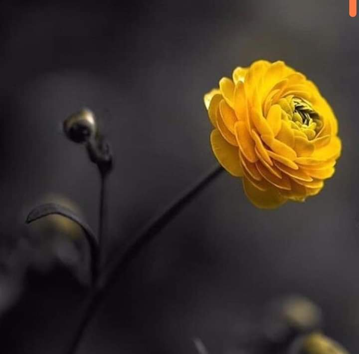

Am avut o noapte intensă și febrilă, la propriu. Iubita asta nouă a domnului meu, viroza, e tare înflăcărată și l-a împresurat cu mâini lungi și fierbinți, de a făcut 39 de grade de la intensitate. După ce i-am dat o frecție cu carmol peste nas, l-a supus la niște transpirații, stil inundație. La maxim două ore, trebuia trezit și schimbat, în alte două ore, tratamentul cu antitermice, plus hidratarea obligatorie. Așa că somnul meu a fost mai mult o veghe, legănată de susuratul difuzorului de uleiuri esențiale. Spre dimineață, a cedat febra și a adormit adânc ca un copiluț fain ce este. Eu mi-am luat tălpășița că deja a sosit prea-dimineața mea și mama s-a trezit.

\*\*\*

Poate că sunetul ăla liniștitor de la uleiuri sau poate uleiurile în sine, mi-au imprimat o molcomie în mișcări că și dacă vreau, nu-mi iese nicio mișcare mai cu avânt. Și dacă nu-mi iese, nici nu mă forțez. O fi vreun sens acolo și o să-l văd în episodul următor al zilei.

\*\*\*

Am terminat micul ritual al prea-dimineții, Spiky a fugit în hălăduială, mi-am pus botnița să nu-i dau nimic mamei și am urcat la ele. Mama nu înțelege de ce am masca pe față, îi aduc aminte că lui Mr. H nu i-a fost bine și că nu vreau să-i aduc și ei vreun pui de viroză, și că nu stăm la taclale azi că nu vreau să mă învârt mult pe la ea, prin cameră. Și oricum, pe căldura asta, cu masca pe față, e orice numai o plăcere nu, să stai la vorbe, la ceas mic.

Înțelege pe moment, peste vreo câteva minute mă întreabă din nou de mască, acu' chiar vreau să imprim o țâră de viteză că, pe fundalul ăsta de oboseală, se așează praful tare repede și clar plec scămoșată deja de la ea.

\*\*\*

Mă prinde oboseala pe la ochi, care mă ustură un strop, dar trebe să-i fac ceaiul domnului meu, să-i pregătesc vitamina c și să mă duc să-i dau pastilele. Doarme atât de adânc și de liniștit că parcă mi-e și milă să-l trezesc. Din nou mi se leagă de creanga aia din creier întrebarea: unde ne ducem când dormim? Pentru că avem așa o liniște și o pace pe figură că parc-aș vrea să știu ce o determină, să fac o replică și trează. Că la somn nu prea validez cartela în ultimul timp.

\*\*\*

Gata, toți sunt primeniți și drăgăliți, e timpul și pentru mine. Deși nu vreau să recunosc și să bag în seamă, de parcă așa ar fugi din realitate, începe să mă râcâie în gât. Până nu mă doare ca lumea, îmi place să-mi fabric o realitate pe lângă, în care râcâiala asta e doar o părere.

În timpul ăsta mic pe care-l mai am azi, mă uit la design, la diverse, fără o țintă anume, las ochii obosiți și usturători să admire ce vine, și nu bag nicio minte analitică la mijloc. Nu intervine nicio exclamare internă "wow, ce idee faină" nu pentru că n-ar fi multe așa, ci pentru că am decis să nu fac niciun efort, să nu mi se scurgă energie, și-așa mică, spre nicăieri. E mișto participarea asta neparticipare la viață. Poți să iei din clipă tot dar clipa nu te suge de energie. 

Wow, cât de tare e starea asta! Am primit azi, cadou de fată bună, îmi place mie să cred, o mică mostră de neviață susținută de viață. Mie, care mereu am zis că trebe să te implantezi cu tot ce ești, cu toate simțurile-n realitatea asta pe pământ, mi se arată printr-o crăpătură mică-mică de ușă, că neviața poate fi mai viață decât consideram eu, când devii observator prin simțuri la ce e în jur dar nu-ți risipești picătură de energie pentru analiză, pentru încadrare, pentru catalogare. Că mintea asta face, fișiere în baza aia mare de date, că în viitor poate o informație d-asta te va salva. Or avea dreptate și cei din kabbalah când spun că stăm într-o cutie cu cinci găuri. Găurile astea sunt, la figurat, porțile de intrare a luminii în cutie, iar la propriu, sunt simțurile cu care culegi informații la flux continuu despre mediul înconjurător. Că altfel, creierul, vorba unui doctor de la noi, este o masă de grăsime într-un acvariu, fără picătură de lumină. Fără simțuri, suntem deconectați. D-aia la mama se închid treptat canalele și mor neuronii. Vrem, nu vrem, suntem suma interacțiunii neuronale și ea poate să fie supraunitară sau subunitară, să dea cu plus sau cu minus, vorba aceluiași doctor.

\*\*\*

Ploaia asta multă ce a căzut ieri parcă mi-a spălat din disperare sau se așează confortabil acceptarea-n mine, că parcă am niște muguri noi de încredere în inimă. Vorba lui Sadhguru, speranța e deșartă, așa că încerc să înlocuiesc speranța cu încrederea, să trec de la Spectator al vieții care mi se întâmplă la Creator al vieții pe care mi-o doresc. Oho, sunt atât de mică pe cărarea asta, un punctișor ce abia mă văd acolo, dar sunt hotărâtă să merg mai departe. Mai cad, îmi mai julesc genunchii și inima, mai scuip supărarea-n dreapta și stânga că-s umană și nu-s perfectă, dar știu că-s construită dur și sunt hotărâtă. Dac-aș putea să fac trecerea de la privitul în retrospectivă la cel în perspectivă, ar fi un mare punct în jocul cu viața. O iau și eu încet, nu mai ard etape, și-oi vedea.

\*\*\*

Am adus-o pe mama la micul dejun și mă țin tot la distanță de ea. Deși nu am chef, reușesc să fac o conversație scurtă, alta decât cum îi face ei pisica cu lăbuța când vine în pat, cât de mult o iubește și tot restul speech-ului matinal. Îi povestesc de florile din curte și se ridică să le vadă. Iar mi se pare că mama a intrat la apă, că e mică și puțină. Nu știu cum o fi la alții, dar pe mine mă intristează brusc și total acest spectacol al neputinței bătrâneții. Și nu doar la mama, la toată lumea.

Azi, de 1 iunie, ziua inocenței, îi fac o promisiune copilului din mine că voi începe să am grijă de corpul și mintea mea. E o promisiune puternică, susținută cu tărie de toată respingerea asta a mea cu care privesc demența mamei și modul cum viața ei s-a lăsat pe viața mea, și la figurat dar și la propriu. Azi îmi promit eu mie să nu devin nici povară și nici spectacol greu pentru alții. Mai rămâne de văzut cum fac asta…if there is a will, there is a way. Mereu.

\*\*\*

Bifează și domnul meu micul dejun, într-o stare mult mai bună decât noaptea trecută, iar eu adun și de aici un mugure de încredere. Da, frate, viața merge oricum mai departe, hai mai bine să merg și eu, decât să mă pun contra curentului.

\*\*\*

Mi-au venit soluțiile bio comandate de pe net și pentru că azi cică nu plouă, mă risc. Mi le-am preparat, le-am pus în vermorel și am plecat prin curte, să le șprițez. Acum, cât sunt fructiferii mici, merge cu vermorelul dar de la anul clar trec la nivelul următor, îmi iau atomizor. Datul la pompa vermorelului nu e chiar o plăcere iar azi, pentru mine, e chiar durere. Dar am soluția făcută, îi dau drumul să alunge ea puricii și afidele și alți dăunători că soluția cu boia și usturoi, aia de mi-a făcut praf ochii, nu a funcționat atât de tare pe cât mi-a injectat mie ochii. Ce-mi place la soluțiile bio este că nu sunt toxice nici pentru om, animale și, cel mai important, pentru albine. Sunt scumpicele dar e prima oară când le iau, urmăresc efectul și apoi plec în deconstrucția lor: văd ce au în componență și cum pot să le recreez cu ce am prin casă, strâns de mine ca furnica.

M-am întors în casă stoarsă de vlagă, transpirată, cu mici pusee de frisoane. D-aia mă și durerea mâna de la datul cu vermorelul, pentru că de fapt au început să mă doară muschii, mă doare cărnița pe mine. Fratele porc, sau sora scroafă în cazul de față, corpul meu de pământ, începe să-mi dea semne de viroză. 

\*\*\*

Bag repede un duș și mă pun pe fugă să bifez tot ce trebe făcut în cazul în care cad. Nu știu cum am putut spera că dormind în același spațiu cu un virozat, virușii, de rușine, mă vor ocoli și nu se vor băga și-n sistemul meu! Naivă, as usual.

Probabil că neavând atâta inflamare-n corp, pentru că nu consum carne sau lactate, reacționez mai blând și pot încă să fac sucul proaspăt pentru toată lumea, să-i duc prânzul lui Mr. H, la pat, să-i pregătesc mamei grătar și să-i așez masa, să strâng și să spăl după toți și apoi să mă scurg pe canapea. Mă îmbrățișează și pe mine strâns amantul din peisaj, virozul, așa că mai scot fructele din congelator pentru smoothie și mă las să alunec în pat, după ce iau niște uleiuri esențiale și o vitamina c. Plus multă apă. Să vedem care pe care.

\*\*\*

Ridicatul din pat se lasă cu faultări de corp, simt cum înjunghie de peste tot dar trebe să-i duc sucul mamei și pastilele și să-i dau să pape lui Sassy. Ca să nu o mai dau în tragedie, am avut o chicoteală mică la gândul că dacă mor, eu tot trebe să reînviu să-i aduc mamei cele necesare. Nu e-n cărțile mele statul și zăcutul. Dar știu că oricum totul e o alegere personală, aș putea să nu fac nimic dar nu vreau să-mi asum consecințele, mai ales când ele privesc o altă viață.

Mai aduc un castron de fructe pentru Mr. H și gata, nu-mi mai îndes nimic în program. Gâtul mi-e în flăcări, corpul mă doare, tusea mă gădilă iar ochii mă ustură. Nu e sfârșit de lume, nici măcar nu e sfârșitul meu, dar azi mi-am promis că am grijă și de mine și vreau să încep. Timid, pas cu pas, că nici lumea nu a fost creată într-o zi.

\*\*\*

Pentru ce sunt eu recunoscătoare azi?:

1. Pentru convorbirea cu medicul veterinar care mi-a dat un confort mental extraordinar și mult mai multe informații clare! Dacă Maya a trăit deja 4 ani cu acest șunt și dacă susținem ficatul cu tratament de acum înainte, poate să trăiască mult și bine! So be it!
2. Pentru culoarea galben, care mi s-a strecurat în suflet și-mi suflă zâmbet în vene!
3. Pentru iubire, aia care mă face să fac de toate, pentru toți și să încep și pentru mine!

Clipa mea de frumos este:

Ranunculus
