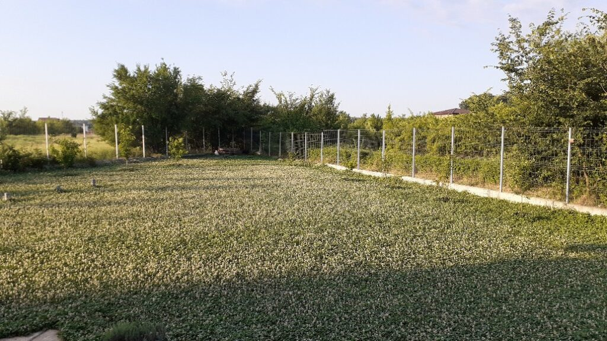
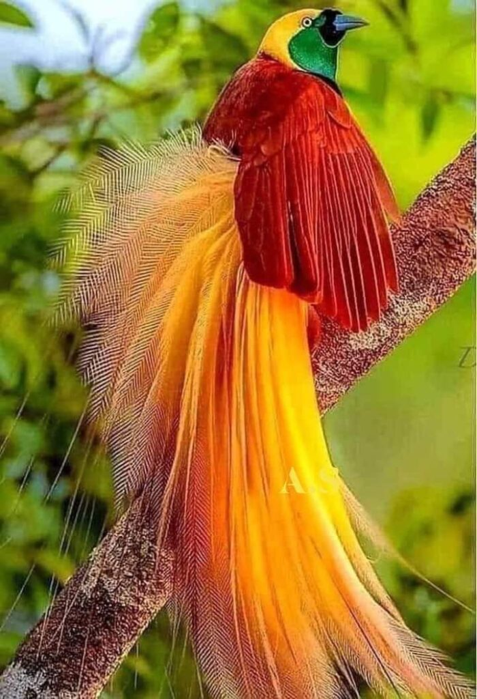

Aseară nu am avut somn. Parcă ironia Universului s-a vărsat la mine-n viață, după ce că de abia am trecut ziua, acu' nu reușesc s-o închid cu un dormit.

Pentru că domnul meu mi-a permis cadrul în care să-mi deschid petală cu petală din ce sunt eu, nu din ce dădea bine să fiu, împart cu el intimități mici cu impact mare, pentru mine. Așa am aflat eu că nu toată lumea, când închide ochii, vede culori, forme, o întreagă lume fascinantă. Sunt frânturi necunoscute sau uitate din vieți cunoscute și uitate. Poate. Cert este că nu recunosc nimic din tot ce văd, lucidă, cu ochii închiși, înainte de alunecarea-n somn.  Eu am crezut că așa e la toată lumea. Păi nici nu-i de mirare că cu imaginile astea mii, cu gândurile zeci de mii, somnul meu vine greu. Asta pe lângă faptul că, în afară de epuizarea la care m-a supus starea proastă a corpului, azi nu am făcut niciun efort care să mă "îndreptățească" la o odihnă.

Tusea asta aproape continuă și uscată, care o să-mi dea pătrățele pe abdomen dacă va continua în același ritm, mă împiedică și pe mine dar deranjez și-n jur. Așa că, cu pisică și păturică, am coborât să dorm la parter, când se va milostivi moș Ene să vină pe la gene.

A venit și-am stat împreună doar 4 ore. Atât s-a putut și atât s-a dat. Bune și alea.

***

Ce bucurie și pentru ochi, și pentru inimă, să văd trifoiul! E o ușurare reconfortantă, e ca o renaștere și pentru mine.

Nu sunt încă refăcută, dacă aveam speranțe, dar simt nevoia să ies în curte. S-au mai trecut irișii, în schimb roșiile, parcă din solidaritate cu mine, se usucă pe picioare, ca de febră. E și normal, nu le-a udat nimeni, apa din cer nu a căzut, iar ele nu-și pot lua singure apa din bidoanele puse la soare, lângă. Cătinel, m-apuc să le ud că deocamdată mă țin picioarele, nu se știe mai târziu.

După ce am udat totul, și mi-am mai tras și eu nițică seva din asta și de la mama natură, mă apuc de ritualul dimineții, pentru că mama e trează și așteaptă. Mi se pare genial cum am reușit să simt, privind prin camera de supraveghere, ce vrea, ce simte, ce așteptări are ea. Evident, în linii mari.

***

Nu știu cum s-a lipit informația de mintea ei, dar mama a reținut că nu suntem bine și că ne izolăm să o protejăm pe ea. În dimineața asta, mă întreabă cum e Mr. H și apoi verifică și starea mea. Deși mintea, antrenată aiurea, pleacă imediat pe firul gândului de invidie cu miez de tristețe, mă redresez în mine rapid și realizez că la mama oricum prioritățile sunt acum distorsionate. Diavolița din mine-și bagă coada și mă întreabă dacă i-am fost vreodată prioritate. Cui îi mai pasă acum?

Tot dialogul ăsta interior s-a derulat în secundele în care i-am lăsat smoothie-ul, pastilele și i-am pus lui Sassy să pape. Am noroc că Universul mi-a luat pe de-o parte capacități dar i le-a dat pe de altă parte mamei, care-și face singură, pe cât posibil, curat. Iar asta, în condițiile date, e un ajutor fantastic.

***

Plecatul de la ea din cameră nu echivalează cu încheiatul discuțiilor mele interioare. În zilele astea fierbinți, când am fiert în suc propriu, am avut o mulțime de trăiri, o amestecătură câteodată grețoasă de întrebări, de tristeți, de coji sub care puroiul nu s-a vindecat. Nu cred că am vindecat copiluța din mine cu totul. Da, am spălat și curățat și integrat părți din ea dar abandonul ăsta la care m-au supus ambii mei părinți revine ca o obsesie murdară, semn că spațiul în care s-a acumulat este mult mai vast decât ăla pe care l-am primenit eu.

Nu vreau să mă încarc cu prostii, că asta sunt, sunt prostii-balast, pe care le târăsc după mine și care mă sug de energie. Mă așez cuminte în living și-mi dau seama că am în mine prea mult spațiu încărcat inutil. Ca să intre obiceiuri și lucruri faine, trebe să fac loc înăuntru, să le dau afară p-alea împuțite, uitate prin colțuri, mici aglomerări cu mare impact. Dacă ar fi așa de ușor să fac curățenia din mine, cum o fac p-aia din casă! Diferența între ele, este că aia din interior trebe urmărită zilnic, clipă de clipă. Nu înțeleg, acum, în liniștea durerilor mele, în colțarul din living, de ce trebe să pară atât de complicat totul? De ce nu aspiri rahaturile o dată, dai cu mopul o dată și gata, pornești la drum nou, cu înțelepciunea că, deși știi cum se dă și cu aspiratorul, și cu mopul, nu mai e nevoie să le faci? Pentru o secundă, am putut să mă văd de sus și să-mi dau seama de absurditatea tuturor prostiilor cu care-mi încarc zilele, sufletul și viața. Și deși le văd, deși firimiturile lăsate de mama peste tot sau lipsa căldurii sunt infime, infime, infime în imensitatea Vieții ăsteia, nu pot să mă scutur și să mă aleg de neghină.

Azi m-a chinuit amintirea mâinii mele rupte. Puiucă fiind, priveam cu admirație și cu o iubire profundă, la sora mea, mai mare cu cinci ani. Unde era ea, o urmam, ca un cățeluș, și eu. Așa se face că ne dădeam în leagăn, din ăla vechi, metalic, cu scaune pe o parte și pe alta iar la mijloc loc de stat cu picioarele, iar eu, de când mă știu, am avut rău de mișcare. Cu cât îi spuneam să se oprească, cu atât făcea vânt mai tare. Până când, terorizată, am dat drumul la mânuțe și am zburat prin aer. Căderea pe pământ a fost aproape instant urmată de lovitura metalică a leagănului, care m-a strâns între pământ și partea unde-ți țineai picioarele. Rezultatul a fost mâna dreaptă ruptă în trei locuri, plus vânătăi și dureri de cap. Nu asta m-a durut cel mai mult, ci faptul că ai mei m-au internat la un spital din alt oraș și m-au lăsat acolo 10 zile, până m-au externat. Nicio vizită, niciun pachet, nimic. Am trăit atunci, și trăiesc și acum când îmi amintesc, o uimire tristă și o singurătate cumplită. Acum nu-i mai judec și cred că nici atunci nu i-am judecat, dar știu că nu am vindecat tot ce trebe vindecat. Simt. Și nu cred că-s dereglată de starea proastă a sănătății mele de acum.

***

O chem pe mama la mic dejun, eu stau cuminte tot pe colțar, nu pot sta cu ea, nici chiar cu botnița, acum. Amintirea asta ce tocmai m-a vizitat e prea caldă-n mine și nu vreau ca ochii mei să fie întinați de vreun sentiment de învinovățire. Plus că oricum nu prea pot sta mult în picioare iar cu cât am putut, am udat curtea.

Nu m-a văzut nici când a coborât să mănânce, nici când a urcat. În schimb, eu am putut să o urmăresc cu privirea. Pare descumpănită, pierdută și tristă. O înțeleg, de câteva zile vorbesc și stau minimal cu ea, fie eu, fie domnul meu. Fără strop de socializare, nu pare prea fericită. Dar nu am ce să fac, trebe să trecem și hopul ăsta și "totul o să fie ca înainte". Expresia cea mai liniștitoare din lume. Și cea mai falsă. Nimic nu va mai fi ca înainte. Niciodată. Iar asta, după ce-ți micește o țâră inima, realizezi că nu e nici de rău, nici de bine. Doar e și atât.

***

După micul lui dejun, domnul meu mă acompaniază, tăcut, în living. Mereu mă liniștește când e în preajmă, mă simt cam cum se simte Spiky când îi suntem în zonă, în siguranță. De fapt, el activează profund sentimentul ăsta care trăiește oricum în interiorul meu, la fel ca toate celelalte sentimente și senzații. Că doar viața se întâmplă în mine, cu toate rahaturile dar și cu toate beatitudinile ei. Așa că legănată de liniște, de vibe-ul bun al iubitului meu, am alunecat într-un somn mic și plăcut. Tare bine a fost și tare bine mi-a făcut. Numa' cât să mă ajute să pot pregăti prânzul. Și să pun la spălat câteva mașini de rufe, să scot mirosul de carmol din pat, cameră și nasurile noastre. A fost bun, dar amintirea lui nu e la fel.

***

Pregătirea prânzului și celelalte treburi la care m-am înhămat au fost ca un test de rezistență. Știu că eu sunt încăpățânată, știu că nu pot sta locului, oricât de rău îmi e, dacă simt că pot, mă ridic să fac, dar azi am vrut să văd cât de mult pot duce. Cred că, în viața asta, e esențial să ai curaj. Pentru orice, cât de mic sau cât de mare ar fi acel orice. Să încerci ceva nou, să faci un efort când crezi că nu mai poți, să fii tu, fără spoieli inutile, să spui clar ce ți-e-n minte și pe suflet, toate se închid frumos dacă ai curaj. Altfel, te arzi pe la inimă sau te ciuntești pe la personalitate și nu împlinești ce ai venit să împlinești, să fii tu, pur și mișto.

Așa că am făcut și prânzul, am spălat și întins și rufe, am mai strâns pe ici pe colo, timp în care-mi urmăream corpul. Duce? Duce. Bun, mai băgăm.

***

Well, când nu știi unde să te oprești, te oprește neputința. Am împins prea mult limita, cu nesimțire, iar în timp ce-mi făceam duș, mi s-a făcut rău. Un rău d-ăla în care m-am prăbușit și nu mai puteam să mă ridic. Strigătele mele nu au ajuns până la domnul meu, pentru că de fapt nici nu trebuiau să ajungă. A fost momentul în care am experimentat și sorbit până la ultima picătură, neputința pură. Cred că mi s-a scurs tot sângele din cap, nu reușeam sub nicio formă să mă ridic, mâinile nu aveau putere, îmi priveam degetele cum se albesc, simțeam cum iese din mine energia și primul și singurul gând a fost: asta e neputința! Asta trăiește mama! Evident că ea nu e atât de conștientă de ea cum ar fi orice alt om, dar asta înseamnă să fii neputiincios. Să nu mai poți. Mda. Teribilă senzația. Și la mine n-a durat mult, pentru că am avut inspirația să dau drumul la apa rece, care m-a curentat și mi-a dat un spor de adrenalină, ce m-a ajutat să mă ridic și să ajung în pat. Dar cum ar fi să ai neputința asta mai tot timpul? Universul mi-a pus întrebarea asta în carne azi și nu mi-a plăcut cum se simte.

***

Tot restul zilei am avut un nor pe suflet, o apăsare, ca și cum ceva dramatic ar urma să se întâmple. Am stat cuminte, cât am putut, în pat, cu tusea asta chinuitoare, instructoare de abdomene, și cu gândul la mama.

Azi m-am tot mutat de pe un scaun pe altul, virtual, de puncte de vedere. Pe-un scaun am văzut că poate nici mamei nu-i ușor, că a bătut-o și pe ea vântul vieții și s-a aciuat pe unde a putut, că s-a dezrădăcinat din locul unde a trăit mai toată viața, nu are și ea decizia vieții ei în mâinile ei. Că percepe ea totul așa cum este sau nu, e irelevant. Scaunul ăsta a fost ca să înțeleg eu perspectiva ei. Apoi m-am mutat pe scaunul meu. Iar aici nu reușesc, orice aș face, să împac cele 2 situații: dorința mea de viață trăită din plin, liberă, cu plecări, cu stat doar cu omul iubit și dorința mea de a avea grijă de ea. Invariabil, aici mă bușește plânsul, de fiecare dată, pentru că nu știu cum să le împac, fiecare scaun smulge din mine jumate, doare al dracu' și nu știu cum să fac. Așa că plâng și mă rog să am claritate în decizie.

***

O zi cu 10 trepte mai sus decât ziua de ieri, ca de obicei, amestecată, dar îmi dau seama că eticheta asta sună a judecată. Nu e, e o sumarizare a unor momente de viață, cu recunoștință pentru:

1. Trifoi!
2. Curaj!
3. Scaunul neputinței!

Clipa mea de frumos este:

Bird of Paradise
