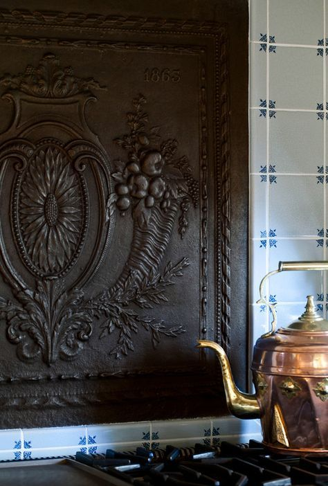

Trezirea vine, zilele astea, și ca o eliberare și ca o nebucurie. Boala asta a înglobat în ea cele mai urâte momente pe care le are un om: nopți cu coșmaruri și zile cu dureri și neputințe. Parcă nu lasă niciun spațiu, oricât de mic, de umplere cu bine, un tampon care să mă lase să respir un strop. Până una-alta, m-am trezit din nebunia de vise oribile pe care le croșetează o minte inconștientă și trebe să pornesc către bucătărie. Doar știu, din experiența dimineților trecute, că nu am multă putere în mine și vreau să o direcționez către ce am de făcut. 

\*\*\*

Ridicatul pe verticală se lasă cu amețeli, e și normal dacă dorm atât de prost, mănânc și mai prost iar starea generală e nașpa. Dar cu voința cu care m-am echipat mereu, am pornit ușurel, însoțită de Spiky, către parter.

Data viitoare, când o să-mi mai țâșnească spre buze cuvintele "mai repede", în spatele mamei, o să-mi aduc aminte cum, în prea dimineața asta, nu pot mai repede. Mă sprijin de perete și de mâna curentă și mă cobor ca și cum nu vreau să deranjez nimic înăuntrul meu, ca și cum nu vreau să trezesc răul ăla care stă de vreo săptămână în corpul meu și-l chinuie. Mi-a luat ceva timp și am ajuns la parter transpirată. Giiiiz, și e de abia dimineață! Iar ieri, parcă eram mai bine!

\*\*\*

Sacadat și întreruptă de șederile pe scaun dese, am reușit să-mi îndeplinesc ritualul. Nu vreau să renunț ușor la a-l face pentru că este unul din puținele lucruri care îmi ajută corpul în refacerea asta greoaie: apa caldă dă un start corect organelor iar smoothieul meu infuzează cu bun interiorul meu. Azi îmi pun intenția și-n apă, și-n smoothie să mă ajute să mă ridic mai repede. Nu doar că neputința se simte nașpa, nu doar că durerea mă copleșește și-mi îmbracă mintea-n gânduri negre dar netrăirea asta generală e pâcloasă și grețoasă și mă ține suspendată undeva: nu sunt nici în viața mea dar nici în afara ei. E o stare ciudată și aiurea pe care vreau s-o limpezesc cumva.

\*\*\*

Mulțumesc Universului că s-a trezit și mama, că vreau să bifez și la ea, ca să mă pot așeza la orizontala care mi-a devenit obicei în ultima vreme.

Echipată cu tot ce trebe, intru la mama și las ce am de lăsat, pentru ea și pentru Sassy, și ies repede pentru că din camera ei mă înhață o altă stare tâmpită. Mama iar este placidă, nici veselă, nici tristă, e liniară iar mie frecvența demenței, așa la prima oră, îmi dă cu fiori. Pur și simplu, în prea dimineața asta sunt atât de slabă și slăbită că prefer lașitatea unei fugi decât rămânerea acolo unde m-aș fi înfășurat și-n trăiri generate de o minte absentă.

\*\*\*

Am simțit că a dispărut, de ceva timp deja, magia din timpul meu magic. Nu știu ce-am făcut sau ce n-am făcut de am risipit praful ăla mișto ce-mi sclipea prin dimineți, cert este că-n ultima perioadă e un timp sec. Azi aleg să mă uit la televizor, la documentare, dar sunt și eu destul de absentă. Culmea e că nu pot să spun pe unde mi-e mintea și pe unde-mi umblă gândurile, e o împrăștiere de mine de nu mai reușesc să mă adun și să mă-ncheg într-o bucurie, oricât de mică ar fi. Și timpul trece și trebe să pregătesc micul dejun al mamei.

\*\*\*

Mecanic și doar cu sentiment de bifă, o anunț să coboare și deja simt că am obosit peste măsură. Urcatul și coborâtul scărilor mi-a pus capac azi așa că mă reîntorc la orizontala mea cea de toatele zilele. 

Am observat că dacă nu mișc sau nu zic ceva, mama nu mă vede în living. Trece, cu ochii după Spiky, iar privirea ei alunecă absentă peste corpul meu. Pur și simplu, văzul nu cuplează cu mintea să-i spună că eu sunt acolo. Dar pentru că nu vreau nici să forțez, dar în primul rând nu am chef de socializare, nici nu mă mișc și nici nu zic nimic. Stau cuminte și aștept să termine micul dejun.

\*\*\*

Cam atât am avut în borcanul de energie pentru azi. Cu greu mă mai ridic din când în când, foame nu mi-e și n-aș mânca deloc, doar zac în living.

Între viață și moarte, e doar o respirație. La propriu. Atât de plăpând e mosorelul nostru aici. Dar noi ne înhămăm cu munți pe spinări și suflet, avem impresia că trebe să muncim multe, să facem multe, să câștigăm, să avem. Nu putem, fir-ar să fie, doar să fim. Mie una nu-mi iese decât rar. Dar, dacă e să fac o contabilitate pură, la sânge, fără brizbrizuri atașate, momentele alea de ființare au fost cele mai frumoase din viața mea. Pe alea le-a reținut inima mea cel mai bine. Alea și pe cele care m-au traumatizat. Restul e umplutură. Din păcate, sunt atâtea umpluturi în punga mea de viață, că-mi pare rău pentru ea. Și-mi promit să fiu mai atentă la inspir-expir și la ce se întâmplă între. Că e o clipire de gene și o exaltare de viață, care trece ca un fluturat de aripi. 

\*\*\*

Un castronel de ciorbă mi-a pus capac, m-a îngreunat și îngrețoșat neașteptat de mult. Am scos și asta de pe meniul meu, și așa destul de sărac. Nu-mi vine deloc să mănânc dar o fac de gura celor din jur. Și greșesc, pentru că organismul meu nu e pe aceeași lungime de undă cu mine și se lasă cu rău, peste răul deja instalat. Senzația asta de mers prin ceață densă începe să mă locuiască și, deși mă scutur a neplăcere, n-am forța necesară să risipesc abureala asta care mi s-a așezat pe creier și pe viață. Stau din nou întinsă și, de la atâta orizontală, începe să mă doară spatele, cu durere lăsată pe piciorul stâng. Ce mai contează o durere în plus?! Cam cum aș putea să fac să nu mai stau atâta la orizontală când la verticală nu mă țin arcurile?! Nici nu mă agit să-mi răspund, bag indiferentă înc-o durere în mine și aștept să se scurgă timpul. Din viața mea sau al vieții mele. E o linie blurată azi între cele două.

\*\*\*

Au venit copii în vizită. Suntem toți echipați cu botniță iar eu sunt tot la orizontală. Doar o țâră mai gureșă, de drag de ei. Nu știu când am făcut trecerea, în mine, de la puiul meu la o femeie pe picioarele ei, dar azi am stat toți patru la discuții și planuri ca între adulți. Pe nesimțitelea, am eliberat senzația de pui al meu dar nu și dorința mea de a o ocroti. E mișto să văd dezlipirea asta în mine și-mi dau seama că a fost forțată de venirea mamei la noi. Este un efect lateral dar e unul bun. Nu mă mai consum inutil, înțeleg în mine că copila mea a crescut, că-i pe drumul ei și că experiențele care o lovesc de acum înainte sunt mâna Universului care-o sculptează. Azi am fost împăcată cu asta. Și bucuroasă că mi-am scos mâinile invizibile ale grijii din câmpul ei de energie, nu mai tulbur acolo nimic cu intenția mea mămoasă de a i le aranja pe toate, de a-i face numa' cald. 

Deși m-a bucurat, vizita m-a extenuat așa că, după plecarea lor, am schimbat orizontala de la parter cu cea din dormitorul nostru, gata de încă o noapte pe care o rog, cu puterea pe care o mai am, să fie fără coșmaruri.

Când să alunec în zona aia în care nu mai sunt eu, telefonul copilei m-a smuls cu brutalitate și adus înapoi. A ajuns acasă dar a apucat-o vomitatul și nu știe ce să facă. Din experiența mea vastă cu capitolul ăsta, scot rapid sfaturile, iau vocea calmă ca s-o liniștesc și simt că i-am transmis liniștea. Să lase să iasă tot ce e de ieșit, să se hidrateze și să doarmă. 

\*\*\*

Asta fac și eu, și pentru că am exersat ceva zile și-a devenit parte din seară, îmi trec în revistă recunoștința pentru:

1. Realizarea că coșmarurile nu sunt reale!
2. Domnul meu în viața mea!
3. Maturizarea mea la pachet cu maturizarea copilei mele!

Iar clipa mea de frumos este:

