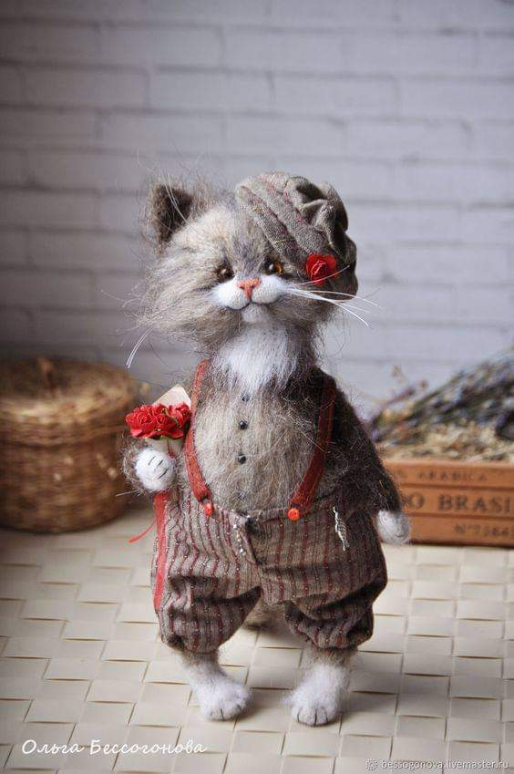

Am dormit dusă, corpul ăsta nu vrea să-mi spună unde, iar trezirea a fost un strop plumburie. Printre pleoapele ușor întredeschise intră violent o dungă de lumină care forțează involuntar pleoapa să cadă. Mă mai delectez puțin cu moliciunea momentului și încerc o a doua deschidere. Deși mai participativă, pleoapa tot nu e hotărâtă.

Păi dacă tot nu merge unsă trezirea fizică, hai să mă trezesc emoțional pentru o nouă zi. Deși în interior sunt deja sharp, lălăiala asta, du-te vinoul ăsta între ochi și lumină, parc-au pus și-n intenția mea niște abrambureală. M-am prins că-mi scapă cuvintele și ideile de la o secundă la alta și-am zâmbit îngăduitoare în mine. Eu vreau să-mi creionez intenția și vreau să fiu cu toată ființa acolo când o înalț dar e ceva uman, carnal, care mă adoarme pe bucățele de secunde și trebe s-o iau mereu de la început. Și nu mai am aceleași gânduri și cuvinte și am amețit draga de intenție de nu știu dacă mai înțeleg chiar și eu ce-am vrut să zic.

Pentru limpezire, forțez ochii, mă invadează lumina și-mi cucerește spațiul și singurul gând în acel spațiu a fost: wow, dar e deja multă lumină! Cât o fi ceasul?! S-a dus ea știe unde intenția mea să-mi clarific intenția și-au venit să mă locuiască gânduri mundane, banale, gândurile alea care-mi consumă atât de mult timp dintr-o zi. Ca să nu le supăr și să vină cu prietenii lor, să fie și mai multe, le privesc, le las să treacă și mă înnod mereu la ultimul cuvânt rostit în mine să-mi finalizez ceremonia intenției. Am reușit, mai pâclos decât în general, dar mă bucur că nu am abandonat.

***

Cerul mi-e copil azi, albastru senin și vesel, fără umbre noroase. Apa călduță alunecă încet, sunt toată pașnică, nu mi se zbate haotic sau a grijă niciun gând din astea care mă traversează rachete.

Eu nu cred că cineva poate să fie prezent și atent la toate gândurile care-l tranzitează. Pur și simplu cred că este imposibil uman, ar însemna să stau tâmpă, cu privirea-n gol, urmărind cum se nasc, ca niște ferestre pop-up d-alea de laptop, unul după altul, să nu mă apuce efervescența la niciunul, să–l privesc cum vine și pleacă și apoi apare altă fereastră, altă privire și tot așa și, nici așa, nu cred că mi-ajunge timpul fizic. Cum și eu sunt plecată puțin, chiar am făcut un calcul la 60.000 gânduri în 24 ore, adică 86.400 secunde, înseamnă să aloc fiecărui gând 1.44 secunde dar să nu mai dorm deloc. Concluzia mea, după matematica de mai sus, este că dacă nu poți dilata cele 24 de ore, poți contracta cele 60.000 de gânduri. Poate că asta fac ăștia mai luminați că mie, chiar dacă-s în băi de lumină în fiecare zi, nu-mi iese "dăloc".

***

Mama e deja trează, am simțit înainte să verific camera, era prea multă lumină ca ea să mai doarmă. Stă în pat, nu cu tableta, nu cu rebusul, și se uită la televizor. Am reușit să fac o diferențiere clară între zile, care mă ajută puțin să navighez prin și printre ele: când are rebusul sau tableta în brațe, are ceva mai multă prezență în ea decât când nu-și solicită mintea cu vreo activitate și-o lasă să zburde pe imașuri, parte din ființa ei conectându-se oleacă tâmp la televizor. Așa că mintea mi-a servit repejor, să nu cumva să mă apuce hărnicia și să croiesc o altă cărare neuronală, gândul că nu se lasă cu roz în dimineața asta la coana mare. M-am văzut cum mă duc din inerție pe același drum ca-n dățile trecute și am simțit până și mica strângere din corp la gândul că va fi nu tocmai plăcut. Toate astea fără ca măcar să fi pășit în clipa aia, toate constructele astea sunt doar imaginația, nici măcar n-am urcat la ea. Deși tocmai ce-am bifat o struțo-cămilă, am deraiat folosind un tipar vechi dar am și observat deraierea, am fost și participant și observator, am rămas c-un gust aproape fizic, de amar, în mine.

***

Ca să nu mă mai țin în suspans, mă duc la coana mare și parcurg cu conștiinciozitate stupidă pașii pe care mi i-am imaginat jos: mama e și nu e cu mine azi, îi las smoothieul pe masă, îi dau lui Sassy să pape și nici măcar nu-mi aduc aminte că ieri am sesizat că ea e viața constantă conștientă, dacă pot s-o numesc așa, din camera mamei, și mă duc în baie să mă apuc de curățat. Putoarea de la mama din baie îmi lovește ficatul greu în dimineața asta și-mi vine să dau cu tone de domestos, peste tot, inclusiv în nas, să n-o mai simt. Izurile combinate cu căldura și umezeala nu-mi dau practic nicio șansă și icnesc atât de des, că mi se pune un cârcel în capul pieptului, o răsucire și-o strângere puternică parcă și-au propus să nu mă lase să respir cum trebe. E adevărat că nu e nici locul și nici momentul unde aș trage aer adânc în mine, dar cât să nu mă îngălbenesc ar fi minunat să am putirința să respir.

Deja mă împachetez în iritare așa că mă mișc cât pot de repede și plec, fără dialoguri sterile cu un om care nu-i prea comunicativ și nici cu toate acasă, azi. După mica oroare ce tocmai am trăit-o, ultima dorință, după ultima dorință ever, ar fi să stau la taclale acum.

***

Îmi trebe un timp, să las zbaterea asta din capul pieptului să se liniștească și să se desfacă lin, ca să pot să-mi savurez și eu smoothieul. Acum nici nu mă pot gândi la el.

Intru direct în timpul meu liber și ies afară să-mi ud puțin curticica de flori și să iau pulsul naturii. Poate spală ea, prin imagini și mirosuri, imaginile și mirosurile momentelor ce-au trecut. Afară, mă încarcă iar o stare de liniște și-mi dau seama că mama natură a fost, de-a lungul vieții mele până acum, mama care nu m-a dezamăgit niciodată. M-a ținut în brațele ei când am avut nevoie, în sânul ei mi-am cules cele mai faine trăiri, în ea am descărcat cele mai nefaine trăiri dar mi le-a luat, mi le-a șters și nu a suflat un reproș înapoi, data viitoare primindu-mă cu aceleași brațe vibrând de viață verde. A fost nevoie de o senilizare a mamei de carne ca să o văd și să-mi apreciez mama de suflet.

***

Ca și cum mi-aș fi strigat scurt momentul ăsta neplăcut în lumea mea, cei care fac parte din ea au simțit nevoia să mă cuprindă-n timpul și gândul lor: o doamnă dragă mi-a trimis clipa ei de frumos a zilei care m-a topit și pe mine de drag,

o altă doamnă dragă mi-a trimis o îmbrățișare prin mesaj, copila mea mi-a trimis un reel superfunny pe instagram. Parcă s-au adunat toți care sunt cuplați la mine în momentul ăsta mic din zi și din viață, să facă scut între mine și mizeria asta umană, și la propriu și la figurat, pe care trebe s-o curăț din ce în ce mai des.

Poate nu mereu îmi iese, dar azi, energia aia mișto din spatele gândului și gestului, mi-a înălțat o țâră spiritul și-am decis să mă scot din josul unde am alunecat și să-mi ridic starea urmărindu-l, din nou, pe Rajiv Surendra. Îmi place tare mult băietul ăsta, e o enciclopedie ambulantă și are așa un har de a spune lucrurile, că pe mine mă lipește de ecran sau monitor de fiecare dată. Fie că povestește cum să-ți faci patul, atât de banalul făcut de pat, fie cum să decorezi un dormitor când ai oaspeți, are așa o adâncime în ce spune că mă vrăjește total. Mi-a făcut plăcere maximă să-l văd și ascult, am învățat de la el și azi o groază de chestii mici dar superbe prin simplitatea lor și chiar am putut să-mi numesc, overall, timpul liber ca timp magic.

***

Domnului meu nu i-a ieșit din prima alinierea spiritului cu trezirea corpului așa că azi mă inundă cu tăcerea. Îi respect liniștea, îl las cu bolul lui de cereale și eu îmi văd de ceaiul meu de toate zilele. Pregătesc micul dejun al mamei și o aduc și pe ea jos după ce domnul meu pleacă la el în birou.

***

Neașteptat, că doar ăsta e sloganul demenței, mama a început să turuie.

Aceleași povești, a mai adăugat câteva tușe personale noi pe ici, pe colo, dar în principiu nu aduce povești noi la suprafață ci le mermelește pe aceleași pe care le-am tot auzit. Recunosc, fără ipocrizie, că nu am răbdare mereu să ascult aceleași lucruri, să particip la ele, să râd ca și cum nu le-am auzit niciodată. Iar azi, n-aveam răbdarea la mine. Dar am un bun simț exacerbat așa că am stat vreo oră și ceva, până a început să mă mănânce pielea, la propriu, de nerăbdare. Azi n-am putut nici să tai frecvența cu ea, nici să închid urechile și nici să nu aud, pentru că parcă mă simțeam prost să n-am reacții la ce spune, când ea râdea în hohote pe alocuri. Nu m-a lăsat inima să stau impasibilă, stană de piatră, când povestește.

Dar am observat cu claritate că mama accesează două casete mari și late de timp de unde scoate amintiri: una din vremuri de demult, pe care ea le vede acum foarte aproape și cealaltă din vremuri recente pe care ea le percepe vechi rău. Există în mintea ei, și azi a repetat asta de multe ori până am priceput, o barieră și-o delimitare clară între cele două: "când m-am îmbolnăvit". Din delicatețe, n-am întrebat-o la care boală se referă, la cancere sau la faptul că uită, că nici acum nu pot să spun, în prezența ei, demență sau Alzheimer. Dar ea și-a rupt, și asta conștient, viața în două și, cum îi e obiceiul, îndeasă bucata care nu-i place în niște întunericuri de unde nu cred c-o să mai iasă vreodată.

Îi priveam ochii în momentele poveștilor și m-a frapat cum își schimbau lumina în funcție de poveste: dacă o lăsam să se ducă-n copilăria ei, de după viol și până în liceu, ochii ei străluceau de încântare, de bucurie, de plăcere, dacă însă o aduceam în prezent, lumina aia pâlpâia ce pâlpâia, din ce în ce mai mic, până aveam în față doi ochi morți și goi. Frapant de carnal.

Începe să nu-și mai aducă aminte nume, mai deloc, din viața ei recentă, dar e capabilă să-mi spună numele unei amante cu care a înșelat-o tata și fix momentul când s-a întâmplat. Momentele marcante din viața ei au scrijelit o durere adâncă probabil la momentul petrecerii, că uitarea asta nu se așează pe urmele rămase zdrelite în ea.

Cu toată nerăbdarea mea, sufletul meu și-a scos pălăria în fața sufletului ei rănit, în semn de respect și-n semn de comuniune. Îmi pare tare rău că mama, artistă în cuvinte și-n rebus complicat, n-a fost în stare să-și articuleze experiențele traumatizante și să le scoată la albit, cât încă se mai putea face ceva. Rușinea, mândria, izolarea, neîncrederea în oameni i-au închis gura atunci și îi inchid mintea acum. Și ca ea, sunt milioane. Și ca ea, am fost și eu și încă mai sunt dar măcar am realizat că mă pot vindeca, că mă pot face bine, dacă mă dezbrac de inutilități, de tot felul.

***

De vreun an, din pandemie, am decis eu că vreau să-mi fac testamentul. Iar domnul lui, pe al lui. Cum eu nu (mai) cred că un act ține doi oameni unul lângă altul și înduplecă privirea unui bărbos, am ales să îndur cazanul de pucioasă al aceluiași bărbos (vorba vine) și nu mă mai dau măritată. Acum când mi s-au așezat piesele de puzzle corect și cu zgomot, cu atât mai mult zic pas. E un construct al unei societăți ce n-ar nicio legătură cu nimic. Doar că, pe alocuri, trebe să mă mulez strâmb după niște reguli strâmbe care ar putea faulta vieți dragi mie, în momentul trecerii pârleazului, către other side, de către mine.

Așa că azi, după micul dejun al mamei, am dat fuguța la notariat, să văd ce și cum. Nu-i așa mare lucru, doar trebe să trimit actele și ei redactează.

Mda, actul în sine de a-ți face testamentul te trece prin niște ape.

Chiar dacă nu mi-e frică paralizantă de moarte, parcă n-aș vrea să dau ochii cu ea acum. Și fac pariu că dacă mă întreabă cineva peste 10 ani dacă mi s-a schimbat părerea, tot așa aș zice, că pas, mai vreau nițel. Și peste 20 de ani la fel. Pentru că simt cum car în mine generații de oameni care se vor nemuritori, care nu sunt pregătiți niciodată. Poate, dacă am grijă de mine și la mine următorii 10 ani, schimb ceva în conștiința asta ce-o târăsc drept moștenire.

Apoi, parcă mă strânge tare pe la inimă să plec de lângă ai mei dragi. N-am niciun dubiu că se vor descurca, dar am un atașament egotic și dureros în mine pentru ei, mă simt la propriu întrepătrunsă cu ei, mirosurile lor îmi răscolesc carnea, văzul lor îmi liniștește inima. Pierderea lor în neant, cum o percep eu acum, parcă nu-mi surâde.

Bagatelele astea cu materialele care-cum le-mparți, mi se par cele mai strâmbe din tot procesul dar, în societatea în care trăim, sunt cele mai corecte. Pe ele se pune accentul, ca și cum ești dator cuiva, cu ceva. Am venit goală și voi arde probabil îmbrăcată, în rest e dust in the wind. Dar uite că praful trebe să-l împart corect, să nu rămână nimeni pe străzi, frica asta de nimic și nevoia de siguranța unui acoperiș aruncă praful ăsta-n ochi și nu mai vedem că sunt balast.

Balast sau nu, mi-a luat vreo 2 ore să scanez și să trimit toate documentele după care m-am întors la ordinarul zilei mele, ordinar infuzat cu adevărurile simple ale vieții.

***

Am o liniște în mine pe care o cresc cu liniștea din jurul meu.

Mă apuc de gătitul prânzului și mă felicit curat pentru pasul ăsta făcut: acum 7-8 ani, escaladam un munte pe care mi-l plantase-n ochi o societate bolnavă emoțional. Voiam bani, casă, mașină, poziție, recunoaștere, voiam să fiu miezul de la dodoașcă, cum zice domnul meu. Egoul meu îmi dădea aripi cu care le bifam pe rând, dar îmi săpam dramatic corpul și spiritul. Când aveam elanul cel mai mare și aveam impresia că sunt acolo, pe creastă, nu top of the top, dar deasupra multora, am căzut. Doar se știe, căderea e mai cu aplomb dacă ești, sau te percepi, mai pe culmi. Până jos, m-am făcut țândări. Dar eu nu m-am oprit jos, am luat-o vertiginos spre fundul mării. Din șoimul perceput m-am făcut amibă. A fost greu. Nici acum nu știu cum am trăit prin asta.

Dar din amiba aia am crescut mai șoim decât aș fi ajuns vreodată. Și mulțumesc cu tot ce sunt acum pentru cădere și-mi mulțumesc acum imens pentru creștere. Am prins adânc în mine credința că orice "cădere" e un dar de creștere, orice mă lovește peste ochi și inimă în episodul ăsta, în episodul următor e balsam pentru aceiași ochi și aceeași inimă.

***

Prânzul cu mama e sora mai în vârstă a micului dejun: deși a scuturat de praf de dimineață poveștile, le scoate din nou, mi le prezintă la fel și mă pune în dilemă: mai vreau o oră de mâncărime de piele sau tai cordonul ombilical brusc și fără sângerare? Chiar dacă sunt liniștită în interior, chiar dacă definiția karmei îmi sună cu ecou în minte, n-am chef. Și nici nu pot să mă fac să am chef. Vreau și eu să mănânc și atât, să mănânce și atât. Începe o poveste dar eu nu mă angajez în ea. Deși n-am chef, n-am tăria de caracter s-o spun direct, așa că mă folosesc de subtilitatea neparticipării mele în discuție. De parcă mama ar putea sesiza asta! Ea merge ca tancul înainte, cu potopul de vorbe aruncate peste liniștea mea. Cedez eu și-mi asum. Pasul ăsta cu asumarea a fost noutatea care a setat tonul restului de prânz: nu m-am mai ambalat în interior până la gradul de paroxism cu mâncărimi, am putut s-o ascult și am rămas cu liniștea nebruscată în mine. Bună treabă!

***

Spikylina mi-a fost parteneră pentru juma' de oră de citit, cât să mai las marele galben să se domolească din dogoare, să m-apuc de trifoi. Nu-i nici mare, dar nici mic, însă fac 2 în 1 azi: adun mulci nou pentru roșii și flori, că arde soarele ăsta din ce în ce mai tare iar mulciul ține umezeală și răcoare la baza tulpinițele și după ce-mi fac plinul de mulci, tund fără sac, să las tocătura în curtea mare și să văd cum se comportă, dacă arde trifoiul sau asta e modalitatea cea mai eficientă timp/efort pentru viitor.

Mi-a plăcut la nebunie tunsul, un strop de efort versus ce mi-a dat înapoi, am început cu un dans cu albinele ca să le dau la o parte din calea mașinii, fluturi noi au apărut în curte, e un miros de caprifoi în aerul uscat de-mi mângâie nările și fac și niște mișcare, să mai pun sângele în circulație. Apoi, a pus și Universul umărul la gimnastica mea și s-a-ndurat să întunece cerul și să dea stropi mari. Albinele s-au adăpostit iar eu am schimbat "dancing în the rain" cu "tunzând în ploaie". O nebunie mișto, mai ales că n-a fost d-aia cu potop ci doar așa, un duș mic.

Spiky m-a urmărit de la umbra gardului, unde s-a tolănit leneșă și s-a prelins pe lângă gard, din loc în loc, o dată cu deplasarea mea în grădină. Stropii nu o coafează, așa că s-a retras și mă privește princiar de pe terasă. Nu mă scapă din ochi, vrea să fie ea sigură că sunt și rămân acolo. Un strop de iubire, un strop de interes, ambele sunt în ea, mi-e dragă anyway. Însă mi-e un dor nebun de Maya mea…

Dacă aveam vreun dubiu că Universul chiar a vrut să mă ajute cu ploicica, să-mi elibereze calea de albinuțe, după ce am terminat de tuns a ieșit soarele și mi-a spulberat orice neîncredere. Ele s-au întors pentru încă o juma' de oră de muncă și le văd cum se scufundă cu juma' de corp în lavandă. Mulțam bărbosule!

***

Clasez ziua de azi în borcanul de zile-amalgam, cu multă prezență a mea în ea și mai puțină a mamei. Iau ce-mi vine din partea asta cu demența, sau mă strădui măcar, așa cum vine, câteodată mă clatină, câteodată mă întărește, dar nu mai vreau să șterg zile din viața mea ca și cum nu le-am trăit. Vreau să trăiesc și vreau să mă cârmesc să le trăiesc frumos. Până mi-o ieși, bag în sânul Universului recunoștință pentru:

1. Cerul meu albastru-copil!
2. Asumarea unui moment neplăcut care s-a transformat, surprinzător, într-un moment natural!
3. Pământ, curte, trifoi, tuns, ploaie!

Clipa mea de frumos azi, generată de un om drag:

https://www.youtube.com/watch?v=oisZMh9xVDU
