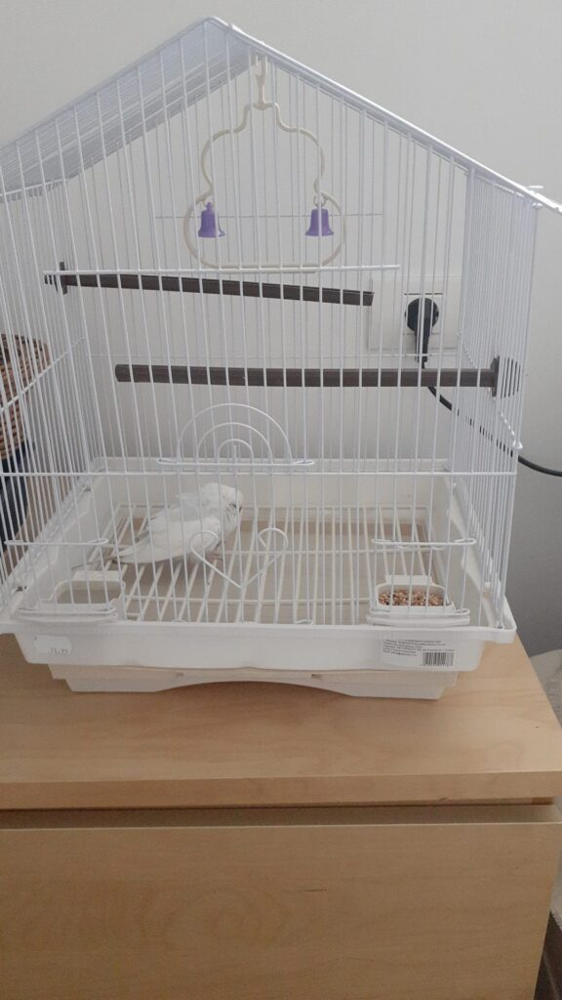

A avut noaptea asta o aromă așa de mișto, cred că mintea mea subconștientă a preluat ideea că nu-mi ajunge timpul cu al meu domn și a croșetat numa' vise cu el, toate faine.

M-am trezit cu o stare de bine împletită și-n corp, durerea a plecat în vacanță, pesemne la pontonul unde-am călătorit ieri. Am o ușurință-n mine și o aromă caldă de bun. Mi-am văzut binecuvântările, două dintre ele, frumoase și frumos așezate de-a dreapta și de-a stânga mea, Mr. H și spicata Chichirică iar restul efectiv mi-au defilat pe podiumul inimii, simplu și fără efort. Mi-am luat timp să le las pe îndelete, să mă cuplez în interior cu fiecare, să le simt, nu doar să le rostesc și să le dau drumul în eter. Vreau să imprim momentului prea dimineții cât mai multă conștiintă și prezență, mi se pare mie că acest cocktail e unul dătător de fericire curată. Simt că totul e în mine și fiecare diamant din ăsta pe care-l scot la suprafața realității îmi validează acest simțit-știut: clar iese să-mi lumineze drumul, în traseul ăsta pe care-am pornit, în contextul ăsta de viață în care mă aflu.

Mândra coconet deja scoate niște chi-chi-uri scurte, e la ușă și face ture neastâmpărate. Îmi transferă și mie o țâră de energie de neastâmpăr și un strop de curiozitate de a vedea cum sunt capabilă să-mi croiesc ziua azi. Că la mine e și tiparul și foarfeca, doar trebe să-l aleg din infinitele tipare de zi aflate în magazinul de zile la care ne ducem zilnic și să tai clipele nu în miezul lor bun ci să le decupez corect pe margine.

***

În drum spre bucătărie văd că mama e trezită de ceva timp probabil, că-și face patul și puțină ordine prin cameră. Ok, e ea azi și respir ușurată și plin, îndeajuns încât să devin conștiență că privitul pe cameră îl fac, inconștient, cu respirația ținută. Când am expirat, parc-am aruncat grija aiurea adunată-n clipa aia de privit și m-am simțit o țâră mai liberă de grijă și mai plină de spațiu pentru altceva, de data asta bun.

Am parte de-un cer intens, cu albastru puternic la bază, cu pete bine conturate de nori pufoși din loc în loc și cu dungi, ca și cum pictorul a șters niște tușe așa, într-o relaxare, tot de nori albi, dar deșirați. Îmi place cerul azi că parcă comprimă cam tot ce-ar putea să vină pe cărare, fie clar și intens, fie șters dar prezent.

Cu tupeu, îmi iau minutele necesare să mă delectez cu apa caldă, cu lămâie, cățărată pe albastrul infinit și pe o lipsă de griji. N-am nicio încordare deși simt gândul mic că ar fi bine să mă grăbesc, să mă duc sus. Mi-am imprimat tâmpit graba asta în prea dimineți și acum mă ia pe dinainte. Nu am de ce să mă grăbesc! Las zgubilitica agitație să se stingă de la sine, mă concentrez pe respirație, pe căldura mică pe care o generează nările mele în cana și ea aburindă și pe intenția mea ca azi să-mi fie bine. Nu-mi definesc binele pentru că nu mereu ce vreau e și ce am nevoie și, de multe ori, mă-ncurc în a vedea ce am nevoie. Așa că las să se desfacă în fața mea ce trebe să se desfacă și mă străduiesc să fie eu deschisă să accept.

***

Mama vrea pixuri. Nici n-am deschis bine ușa că m-a luat din prag: ușor nervoasă, cum a făcut mereu ca să imprime greutate vorbelor care-i ies pe gură suflate cu o țâră de țâfnă, se plânge că ea n-are niciun pix care să scrie. Cunosc stilul clasic de tânguială, știu și câte pixuri are și știu și de ce nu scriu: pentru că ea stă în pat, întinsă și își ține rebusurile pe verticală, la fel și pixurile. Iar astora, c-așa-s ele construite, le fuge pasta în poziția culcat. I-am tot explicat, am luat pixuri cu nemiluita până m-am prins că trebe să zic ca ea și să fac ca mine: îi iau pixurile care "nu scriu" și îi aduc, "de la mine", pixuri bune. Exact ca la copiii mici. Mereu a mers șmecheria asta așa că și azi, ca să calmăm agitația asta așa de matinală, aduc pixuri care scriu. S-a liniștit, și-a mutat atenția pe smoothie iar eu pe Sassy și pe curățenie.

E un miros greu, deschid fereastra larg și o aud, cum zice de ceva vreme, "de abia l-am închis". Nu știu în care realitate, dar în asta care ne cuprinde fizic pe amândouă, nu. Ca și cum agitația pe marginea pixurilor a fost flacăra din ziua ei, după ce s-a liniștit, parcă a și dispărut viața din ea. Azi sunt capabilă să articulez clar: mamei i-a dispărut bucuria de viață. Total. Nu sesizez la ea bucurie de la nimic și nimeni. Are o intangibilitatea cu care s-a înfășurat, pare că nimic și nimeni nu o mai atinge de niciun fel. E mai mult un simțit dar cred că nu are niciun sens să m-apuc să găsesc capătul și să-ncep să destram vălul ăsta că, dacă nu e el, se apucă de altul. E un simțit că mama înaintează în viață din inerție și atât.

***

Stau în liniștea mea din living și, antrenată deja, urechea percepe niște sunete ascuțite afară. Parcă se apropie de fereastră și se depărtează, iar vin, până când, brusc, apare Spiky pe pervaz, în spatele plasei de la fereastra deschisă. Are în gură din nou, un cadou pentru mine, iar eu mă înfior toată. Deschid plasa, evident că o dau jos dar am noroc că ea mă ascultă și, mai important, are ceva pentru mine, așa că revine pe pervaz și intră în casă. Are o păsărică în gură. Închid geamul cu totul și, într-un moment de neatenție, o prind de ceafă și deschide gura. Este un papagal mic și alb. Îl iau repede să nu-l înșface scorpia asta din nou și fug cu el în bucătărie. Mă ciupește dureros de degete dar îl înțeleg. Mereu mă felicit că, în situații de criză, mintea lucrează febril în spatele șocului prin care trec și acum îmi trimite pașii spre garaj, de unde iau cușca pentru deplasări a Chichiricăi să-l pun, pentru moment, pe Ciupilică. Caut pe net să văd ce să-i dau și ce să fac. Îi pun apă într-o cupă mică, mix de semințe și bucățele de măr pe o farfuriuță și îl iau în brațe, să-l liniștesc. Îi vorbesc calm, cu drag, îl mângâi pe căpșor și-l pup, e și el un iubărici că închide ochișorii când îl mângâi, m-ar mai ciupi dar se răzgândește, e un moment de tandrețe între noi doi. Ce fac eu cu ăsta mic?!

Îl duc în camera tehnică, acopăr parțial cușca, să stea liniștit și scriu pe grupul de facebook al satului o postare, să anunț apariția lui la noi și dispariția, sper eu, de la altcineva, care-i sesizează lipsa.

***

Tot timpul meu liber n-a fost decât un du-te-vino între living și camera tehnică, să văd ce face micul puiuc alb cu păreri de albastru pal pe aripioare.

Ca o părere a trecut micul dejun al domnului meu, ca o părere mai densă a trecut și cel al mamei. Amândoi s-au minunat de Ciupilică, domnul meu mai cu emfază decât coana mare, iar eu deja eram hotărâtă să fug să cumpăr colivie și papa pentru peruși. Mai am de luat și bec pentru veioza salină care stă noapte de noapte aprinsă la mama și care ieri a sucombat brusc, plus ceva fructe, așa că plec rapid ca să revin la fel de rapid.

Totul a început cu o serie de sincronicități. Ca orice femeie care se respectă, nu găsesc cheile în rucsac, unde știam că le pun de obicei, așa că întorc dosul pe față și nici urmă de chei. Dar, surpriza emisiunii, ca să înțeleg de ce nu găseam cheile care se vedeau cu ochiul liber fix în tăvița lor, găsesc 2 becuri de care mă pregăteam să cumpăr, pentru veioza salină. Am cumpărat mai demult și, tot ca o femeie care se respectă, le-am uitat printre carduri, agendă, șuruburi (asta e partea masculină din femeia care se respectă) și altele. Oricum mă duc să mai cumpăr, să fie.

În sinea mea, doresc să-i amenajez lui Ciupilică un locșor pentru scurt timp, nu-mi pot imagina că stăpânul sau stăpâna lui nu vede că nu-i în colivie. Așa că nu mă opresc la Animax pentru colivie, ci mă întorc spre casă cu intenția să împrumut una de la un cabinet veterinar din sat, unde-s niște medici tare dedicați. Numa' bine că ei nu au și nici nu țin colivii așa că am făcut stânga-mprejur și m-am reîntors de unde tocmai ce plecasem. Aici, îi povestesc tipei de la Animax întâmplarea care mi-a dat viața peste cap azi și ea, în timp ce-mi asambla o colivie, îmi spune: "Să știți că dacă îl donați, eu îl vreau cu mare drag, că e ziua copilului acum pe 18 și vrea papagal. Îi iau eu și pereche, pentru că ei nu trăiesc decât așa". Eu, când aud de animale-păsări-cadou, mă strepezesc toată, dar tipa era tare sinceră și chiar părea că știe ce vrea și ce să facă cu un peruș. I-am luat numărul și i-am promis că, dacă nu-l revendică nimeni, e al ei. Dar eu îl aștept pe stăpânul care sigur are și perechea lui Ciupilică. Deci, ca să revin la sincronicitate, d-aia a trebuit să mă întorc la Animax, pe care-l ocolisem prima tură, să aflu că există variante și să aflu că de fapt Ciupilică este Ciupilica, este o ea, după culoarea ceromei, a centurii de deasupra nărilor de pe cioc. Draga de ea, sigur are pe vreundeva, un Ciupilică care o așteaptă. Cam cum îl aștept eu pe stăpânul ei.

***

Ajunsă acasă, descarc toate cumpărăturile și fug la mândra mea perușă albă, să văd ce face. O iau la giugiuleală, face și ea un mic noroc în palma mea, și o transfer în noua colivie, palat luminos, comparativ cu cușca lui Spiky. Are apă la discreție, papa cu mei specială pentru ea, acum să se odihnească, să stea cumințică, cum mi-a zis veterinarul și să ne caute stăpânul. Care, la 5 ore de la anunțul de pe facebook, nu apare de nicăieri.

Recunosc că nu-mi stă mintea la nimic, nu-mi vine să fac nimic, vreau să o verific tot timpul și vreau să se ducă la ea acasă, în locul unde e obișnuită dar, mai ales, unde mai are un confrate înaripat. Sau mai mulți. Stă cuminte, eu o percep tristă și nu-mi place că o percep și bleagă. Am tot verificat-o, nu are nicio rană, poate să și zboare și totuși parcă a luat-o pe o pantă descendentă.

Verific facebook-ul mai tot timpul, în afară de inimioare și de câțiva "up", care habar n-am ce înseamnă, niciodată nu m-am prins de ce scrie lumea comentarii cu Up, nimeni nu revendică suflețelul ăsta alb gingaș. Am lăsat baltă toate treburile și am stat cu ea. I-am mângâiat căpșorul mic, am scărpinat-o prin jurul gâtului, scotea mici gângureli, mă privea, apoi se culcușea în căușul meu, m-am atașat instant de pufuleața asta atât de diafană. Giiiz, dacă eu mă topesc aici de dragul ei, după câteva ore cu ea, cum de nu o caută nimeni?!

***

Nu-mi vine să plec de lângă ea dar nimeni și nimic nu concurează cu prânzul domnului meu. Îi șoptesc că mă întorc repede și plec, cu un zâmbet dar și cu o strângere de inimă.

Desfac coincidențele și-n fața lui Mr. H, și mă bucur, a câta oară, că-i deschis să înțeleagă tot ce ce-i spun și trăiesc. Amândoi suntem plini de încrederea că, din moment în moment, cineva va scrie postarea așteptată "E a mea. Vin s-o iau!". Avem și scuze pentru întârziere, ne mai livrează și copila mea scuze, suntem plini de încredere și de scuze într-un timp care trece greu, pentru mine.

***

În momentul în care am deschis ușa camerei și am văzut-o jos, pe "podeaua" coliviei am știut și de ce am avut tot timpul apăsarea aia în mine. Ciupilica a trecut podul spre curcubee continue și de acolo își privește cu drag perechea, poate. Corpul meu a știut tot timpul adevărul, a știut ce avea să se întâmple, d-aia am și avut, continuu, umbra aia pe inimă, d-aia voiam să iasă la rampă proprietarul cât mai repede.

Am luat puful mic, incredibil cât de repede se răcește un trupușor mic-mic, și-am îngropat-o la umbra pinului din curtea noastră. Și-am plâns și m-am revoltat și iar am plâns și iar m-am revoltat. Nu știu de ce și pe cine dar tare am simțit nevoia ca cineva să fie responsabil pentru viața asta mică care mi-a încălzit inima mie și și-a răcit-o pe a ei. Dar, postarea mea de pe facebook, adună inimioare și up-uri și-atât.

***

Cu ochii roșii, de zici că mi s-au înecat toate corăbiile, o aduc pe mama la prânzul ei. Mă rog, în sinea mea, să mănânce repede și să nu mă solicite că nu am starea emoțională potrivită. Evident că ea n-are nicio vină, dar parcă nici eu nu mă pot disocia de mine aia de acum câteva minute care plângea de mama focului și să fiu acum o gureșă, doar ca să întrețin o atmosferă. Chiar mi-a trecut prin minte că eu, la mesele mamei, nu sunt vorbăreață sau gureșă, sunt literalmente bufon. Dar bufonul azi are nevoie de un moment în care să-și plângă o moarte mică.

A uitat că de dimineață a văzut un papagal, vrea să știe dacă, la cumpărături, i-am luat și ei prăjiturica preferată și, mulțumesc Universului, se duce, mergând încetișor, și mică, din ce în ce mai mică, la ea sus, lângă Sassy.

***

Mă înghite cu totul tristețea. Plâng cu scâncete dureroase pentru Ciupilica, pentru mama, pentru Sassy, pentru perechea perușei albe, pentru stăpânul ei, pentru moarte, pentru mine, pentru tristețe. E un amalgam dens în mine și curg lacrimile pârâu.

Nu înțeleg ce trebe să înțeleg din ce am trăit azi, cu Ciupilica. Să mă îngrozesc de senzitivitatea mea, de dezgolirea asta sufletească a mea care plânge cu lacrimi mari moartea unei ființei cu care a stat doar câteva ore? Ce mă fac când va pleca, după curcubee, unul drag? Asta trebe să gândesc? Să mă bucur că am giugiulit ultimele clipe ale unei ființe ce se pregătea, sub ochii mei, de marea trecere, și eu habar n-aveam? Să fac cadou copilului, ce-și serbează ziua "acum pe 18", 2 peruși albi? Ce ar trebui să înțeleg eu? Vreau un strop de claritate, că am căzut în butoiul cu tristețe, și-i greu și nu văd clar.

***

Nu-mi mai trebe nimic dar ziua încă nu s-a hotărât să mă lase așa, tristă. Nu, trebe să fiu o tristă scârbită, care pilește copite de i se întunecă imaginea din cauza acelorași lacrimi care nu vor să rămână în interior. Plâng și pentru calvarul ăsta care e abia la început. Și, dacă aveam vreo emoție că mă vede mama, aveam degeaba. Nu mă vede.

***

Ultima fisă din ziua asta am băgat-o într-un duș lung, am lăsat apa asta să spele toată ziua asta de azi, să mă ajute să văd curat ce trebe să văd, să nu mă duc la somn cu bagajul ăsta trist, să nu mai plâng când parcă simt în căuș o pufuleață care închidea ochișorii la scărmănat, să scurtez un pic jelania dar să nu o înăbuș, să-mi permit mica pierdere albă dar să mă și adun și să pricep că-i doar o trecere din material în imaterial, înapoi, la casa originală, de după curcubee.

***

Nu știu ce bilă să dau acestei zile. Anesteziată puțin, nu am nicio claritate asupra ei dar pot să-mi numesc recunoștințele:

1. Cerul meu intens!
2. Pufuleața mică albă, Ciupilica, și tot ce-a zdruncinat ea în mine azi!
3. Apa asta ce mă primenește și mă pregătește pentru mâna somnului!

Câteva ore de frumos din această zi:

Ciupilica
