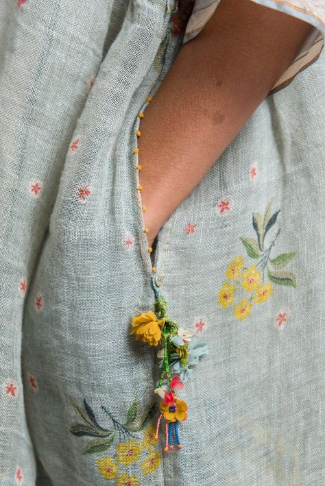

M-am trezit înaintea soarelui, destul de ușor și de limpede. Puținele ore de somn condensat au echivalat probabil un somn mai lung dar mai destrămat. Indiferent cum e, iau notă că sunt bine, și-n corp, și-n minte.

Ca să nu mă arunc cu tenta aia de bifă în ritualul mic de mulțumire mare, îmi las câteva secunde, ca un fel de timp-antreu, în care doar respir și nu mă alerg spre nimic și spre nicăieri. Din spațiul ăsta mic creat, în intimitatea mea cu Universul, pleacă ușor, una câte una, mulțumirile mele. Sunt într-o stare blândă, cuminte, umilă. În secundele în care încarc butelcuța de mulțumiri pentru lansare în eter nu mă tranzitează niciun gând-țânțar, nicio agitație sau grabă. Nu sunt eu prea dusă la biserică, dar senzația pe care o încerc acum seamănă cu cele de stat în biserică, o liniște aproape nefirească omului obișnuit să facă, o liniște de stat și atât. Pare că mi-am învelit ritualul într-o mică biserică dar nu în sensul ăsta perimat în care se întâmplă acum ci în sensul ăla în care se adună inimi curate și se unesc într-o energie faină care sfințește locul. Prin energia bună pe care am lipit-o momentului de mulțumire, am ajuns la o stare de un nimic minunat. 

Câte odihnă stă în clipele de nimic! Cu un boost de fresh, după acest ritual care capătă în fiecare zi noi și noi valențe, sau îmbracă noi și noi forme, mai fac o tatonare de corp, să mă asigur că-s bine, nu e nimic înțepător pe nicăieri așa că-mi încep coborârea înviorată, odihnită, împăcată.

\*\*\*

Spiky nu-i tocmai liniștită, are un zoomie, a apucat-o alergatul peste tot, acum e pe colțar, acum e pe marginea lui, bagă viteză până pe podest, la jumătatea scărilor, iar viteză pe colțar, cred că la tura viitoare se agață de candelabru. Are energie de consumat rapid așa că o las să se destrăbăleze, oricum nimic nu poate opri un zoomie când deja s-a pornit. Cel mai bine e să nu-i stau în cale, așa că mă scurg spre bucătărie, la sorbit apă și o bârfă scurtă cu albastrul.

Deși încerc să sorb, înghițitută cu înghițitură apa caldă, în dimineața asta am avut un corp însetat, că n-am putut să mă opresc decât când am ajuns la jumătatea halbei de juma' de litru. Și nu m-aș fi oprit nici acolo, dacă n-aș fi avut un gând-frână, ca să apuc să torn un strop de intenție în ceva stropi de apă.

Bucătăria noastră dă spre vest, dar la vreo 200 de metri de noi este o casă în geamurile căreia se oglindește mărețul galben când răsare. În dimineața asta, nu știu cum am reușit performanța să mă așez într-un punct din bucătărie în care reflexia galbenă din casa vecină să se adune toată în lentila stângă a ochelarului că efectiv, în timp ce-mi sorbeam restul de apă, am simțit că sunt invadată în tot corpul de galben. A fost scurt momentul, că mi-am mișcat capul fără să știu ce context minunat stric, dar suficient cât să încălzească un interior care oricum s-a trezit hotărât să-i fie cald azi și bine.

Mi-am potolit aurul din interior cu albastrul cerului, senin în dimineața asta, deși azi noapte am auzit stropi de ploaie. S-a spălat și el, s-a scuturat și e gata să coloreze inocent capătul de sus al lumii în care ne învârtim trăirile.

\*\*\*

Poezia ce tocmai am trăit-o în bucătărie e o antiteză imensă pentru camera mamei. Doar ce am făcut curățenie ieri, azi e mizerie inclusiv în dormitor, nu doar în baie, așa că mă recalibrez și cobor cu picioarele pe pământ, sau, și mai corect spus, direct în rahat. Strâng covorașul de la baie să-l duc la spălat, curăț și frec ce trebe, nu comentez nimic, mama fie nu vede, fie se face că nu vede, doar Sassy ce mai zice câte-un miau, dar cu voce mică, parcă simte ea că nu-i caz de ambalare, că nu-i taman o energie de drăgăleală prin aer.

Îmi dau seama că la capitolul ăsta e doar relatare, nu mai e nicio implicare emoțională. Nu mă mai plâng de ce e nevoie să fac, fac și atât, nu mă mai oripilează ce fac, fac și atât. E ca o observație detașată doar că-i imprimată în acțiuni. Ce să zic, nu cred că-i abrutizare dar indiferent ce e, mă bucur că e. Așa nu mă mai gogoșesc nici eu în disperare și nici nu mi se mai mărește ficatul aiurea. Sper.

Ce-i drept, acțiunile de curățenie îmi bagă o țâră de viteză în vene, să plec cât mai repede de acolo, plus că nu pot, încă, s-o disociez pe mama de mizeria din baie și câteodată mi-e greu. Nici acum nu pot mânca cu ea la masă, de când am început pilitul copitelor, iar eu credeam despre mine că nu așa de scârboasă. Uite că am și eu niște limite și, dacă nu-s silită, nu vreau să le forțez aiurea. În momente ca astea, apreciez imens mult comentatele "badante", femei plecate de la noi să aibă grijă de bătrânii demenți ai altor țări, prin ce trec ele pentru niște bani, e uluitor. Nu doar timpul și-l vând ci și liniștea interioară pentru că imaginile hidoase rămân în tine, oricât ai vrea să nu.

\*\*\*

Azi am timp magic de delectare. Îl merit și mi-e tare dor de el. Vreau design și mă umplu de design.

Am o pasiune (cum altfel?!) pentru tapet și textile și-mi place la nebunie să văd combinații cuminți sau nebunești, mă atrag deopotrivă ambele. Pentru că în mine, am împletite, o Bianncă cuminte, care se menține-n tipare și limite și o Bianncă atipică, pe care o doare-n cot de reguli și de părerile altora. Tind eu să cred că balanța înclină mai mult către ultima și totuși, în casa noastră, pare c-ar locui prima. Poate și pentru că trebe să țin cont și de părerea domnului meu, care nu agreează atipicul, dar mă agreează pe mine. Hahaha! Deși, dacă mă uit prin casa noastră, chiar dacă nu a îmbrățișat de la început ideile mele fanteziste sau funcțiunile noi pe care le-am dat unor lucruri folosite pentru altceva, cu timpul a ajuns să le vadă frumusețea și să le aprecieze. 

Am două fotolii franceze vechi, nu cred c-au bătut suta de ani ca să le zic antichități, dar vintage sunt clar, pe care le-am luat la un preț de nimic de pe olx și pe care vreau să le recondiționez. Le-am dat jos materialul vechi, clasicul material plușat și le-am curățat. Cred că am scos sute de cuișoare și de capse dar acum sunt gata să îmbrace straie noi numa că eu nu le-am găsit, până acum, materialul care să mă facă să zic, "hell, yes!". Azi am găsit nu doar unul, ci două și o să le prezint comitetului casei, format de Mr. H și copila mea și o să decid tot cum simt eu, până la urmă. Că a mea copilă e mai conservatoare iar domnul meu e mai cuminte în alegeri. Și apoi, dacă nu ne place cum iese, pot oricând să le dezbrac și îmbrac altfel, că până la urmă e munca și efortul meu la mijloc. Până atunci însă, eu sunt chiar fericită cu alegerile făcute. 

\*\*\*

O aduc pe mama la un mic dejun întârziat, domnul meu e plecat la birou azi așa că-s curioasă dacă mama se mai lăfăie cu mine la povești când știe că el nu e acasă. 

Chiar în timpul micului ei dejun, brusc dar violent, a început durerea de cap. Frate, dar ce-am făcut, pe ce bec am călcat de s-a pornit așa, dintr-odată?! Zici că cineva a apăsat pe întrerupător și-a poruncit "Să fie durere!". Încerc să fiu atentă la mama, dar toate antenele mi s-au întors, la fel de brusc, spre interior să sondeze ele posibile cauze. Să fie un efect întârziat al mizeriei de dimineață? Să fie vreo turbulență prin câmpul meu de energie generată inconștient de mama și capturată, la fel de inconștient, de mine? Nu respir cum trebe? Niciun răspuns nu-mi vine așa că mă întorc la mama, care n-are povești în meniul zilei, cu toată lipsa domnului meu. 

Observ, de câteva zile, cum își face dumicați din mâncare și îi înșiră pe farfurie. Încă mestecând la mâncare, se apucă de strâns, ca și cum a terminat. Are o grabă în sânge și, fără să vreau, mă gândesc cu groază ca va veni un moment în care nu va mai vrea nici să coboare. Își micește teritoriile între care se mișcă, într-un ritm iute. Cu greu o mai scot în curte, oricât mi-aș lăuda eu nu știu care floare sau aș încânta-o cu cules de mure. Nu vrea să iasă și basta. În alte dăți, când Mr. H era plecat, stătea și câte-o oră cu mine, la povești. Acum, își numără dumicații și cu ultimul încă în gură, deja a pornit spre "la mine, sus".

\*\*\*

Printre lecții despre pămât fertil, răsaduri, straturi înălțate și macerate bio, toate din cursul de permacultură, strecor și rufe la spălat, dau și indecși la utilități și mă apuc de șlefuit niște scaune. 

Cred că într-adevăr statul pentru mine este o piesă de încercare, nu pentru că n-aș fi capabilă dacă aș fi nevoită, ci pentru că mie mi se pare că mereu e ceva de făcut. Sunt mereu curioasă să fac lucruri noi și, pentru că-mi consum timp mult cu lucrurile care trebe făcute, gen curat și mâncare, de câte ori prind o fereastră de timp, o umplu repede cu ceva inedit. 

Îmi place mult să stau în garaj, în atelierul meu, îmi place mult lemnul, mirosul lui, fibra lui. Asta mi-a venit în vene pe linie paternală, sau mi-a intrat în sânge în copilăria mea îndepărtată, în atât de puținele clipe petrecute cu cel ce trebuia să-mi fie tată dar în boxa aia mică, cu miros de mucegai, de la subsolul blocului, era doar sculptor iar eu ucenică, fără să știu. Am o răbdare de fier să șlefuiesc detaliile ondulate ale unei piese de lemn în stil baroc și un extaz în aceeași măsură să văd rezultatul, mai mișto decât mi l-am imaginat. Strâng, cu sfințenie parcă, orice bucățică de lemn, mai ales vechi, și îi găsesc, mai devreme sau mai târziu, o utilitate. Îmi place, sadic aș spune, mirosul de terebentină sau de diluant sau de chit de cuțit. Și totul a pornit cu un set de 6 scaune jalnice, luate de pe olx de la un tip din Timișoara care, aproape că mi le-a făcut cadou într-un Crăciun, acum mulți ani, când încă nici nu pornise mugurele casei noi, Ever After Cottage. Vedeam în structura lor de lemn curbat atâta frumusețe că aproape m-a durut că ceilalți nu văd la fel. Asta m-a ambiționat să le pun lor ochi noi și scaunelor să le redau strălucirea, dar acum știu că era doar scânteia care mi-a aprins ce stătea mocnit în mine: un nou drum, drumul meu, pasiunea mea. Nu pentru bani, ci doar din pasiune.

\*\*\*

Prinsă cu totul în acțiune, am scăpat din lentile camera de supraveghere de la mama dar m-a trezit scurt un zgomot din bucătărie. Din doi pași am fost acolo și, surpriză, mamei îi e foame! Asta chiar că nu mă așteptam, agreasem cu ea la micul dejun că pregătesc prânzul pentru ora 15. Și e doar 13. Nu contează, ei îi e foame. Deși nu-mi place tonul ăsta poruncitor, o anunț că în 20 de minute o să fie gata. Poate să stea cu mine sau se duce sus și o aduc eu. Sau, și mai bine, stă pe terasă, la aer. Se duce la Sassy.

Ieșirea ei din raza mea vizuală nu a coincis cu ieșirea ei din gândurile mele și începe dansul: mă apucă dialogul interior cu ea și mă enervez că n-am și eu o predictibilitate cât de cât în zi. Mă prind că m-am enervat, când aud zgomotul wokului trântit pe blatul de granit și încep să-mi observ iritarea. Ce prostie, de ce îmi otrăvesc chimic corpul cu iritarea?! În momentul în care m-am detașat de mine aia nervoasă și m-am privit, s-a topit starea de nervi. Instant! Incredibil! Apoi m-a apucat graba, să termin repede, că-i e foame. Când am scăpat cutiuța de smântână vegană peste ciuperci, m-am prins și de viteza ce mi-o imprimam prostește. Ca să o contracarez, mi-am adus aminte că fiecare își duce consecințele a ceea ce decide iar mama azi, a decis că mănâncă la 15. Nu m-a temperat asta ci faptul că m-am fript zdravăn când am pus mâna pe lingura lăsată în wok, deasupra focului. Cu un "'tu-i mama ei de treabă!" scurt, am înțeles că Universul îmi dă semne să nu mai dau atât în fiert, că da, fiecare trebe să-și asume. Ok, așa e. Lovitura de uchimata a venit însă când mintea a spus tăios: da, dar ea nu mai e funcțională, ce să-și asume?! Mda, dă cu virgulă și dă cu oleacă de vină în sistem. Pe care o opresc la ușă și dau naibii toată construcția care mi-a ținut mintea și timpul blocate-n tâmpenii când totul e simplu: mamei îi e foame iar eu gătesc și o să mănânce. Nu pot sufla în gaze să se facă mai repede și nici ea nu e vinovată că îi e foame mai devreme decât a zis. Frate, sunt atât de simple lucrurile și dacă nu m-aș complica pe la Oradea ca să ajung în Prahova, aș vedea crystal clear asta. As simple as that.

De la momentul ăsta, toate s-au descleștat, am terminat, mama a mâncat tot, cu poftă și totul s-a închis frumos. Nu puteam să fac așa de la bun început?!

\*\*\*

Am primit semnalul că manipularea emoțională nu e un lucru frumos de făcut. Hahaha! Știu!

Deși intenția a fost posibil să mă simt o țâră rușinată, eu m-am bucurat în loc. Pentru că știu că toți ne scăldăm in the same shit. Sunt foarte puțini cei pure by heart adevărați  și o grămadă de pure by heart că așa dă bine. Ce mă bucură pe mine este că, dezbrăcându-mă de falsele văluri de dat bine sau de ascuns bine de văzul lumii, am putut să văd extrem de limpede că toți suntem din același aluat și, mai devreme sau mai târziu, într-un context sau altul, toți manipulăm emoțional, cel puțin o dată în viață. Dar ăștia cu "cel puțin o dată" cred eu că sunt rari sau nu există. E o vorbă celebră: cel fără de păcat să arunce primul piatra. Eu n-am nicio jenă și nici nu mă simt rușinată iar de stat la luat pietre stau, dar numa' de la cei pure by heart adevărați. Am eu așa o vagă bănuială că stau degeaba, că nu vine piatra. Și iar mă bucur că, întocmai ca la Alcoolicii Anonimi, am făcut primul pas să identific unde era duda și de atunci muncesc constant s-o vindec. Avem păcatul în sânge, oricât ne-am da noi de sfinți dar e mișto să ne prindem că-l avem toți să nu ne mai credem strâmbi doar noi și și mai mișto să facem pași în a-l spăla d-acolo. Fără rușine și fără arătat cu degetul. Când indicele mîinii arată către altul, degetul mijlociu, inelarul și degetul mic sunt îndoite și arată către însuși posesorul mâinii. 

\*\*\*

Mi-am petrecut după amiaza cu Spiky, în liniște și-n studiu. 

Liniște întreruptă la un moment dat de vocea mamei, care vorbește la telefon. N-am auzit telefonul sunând, semn că, surprinzător, a sunat ea. N-am prins momentul exact așa că nu știu dacă a fost nimereală sau a făcut pașii scriși de mine pe hârtia de lângă telefon. N-am ascultat niciodată convorbirile ei cap coadă dar azi am fost curioasă. Vorbește cu prietena ei și tot ce spune este fie o scorneală, fie o exagerare. Dar toate, fără excepție, sunt spuse pentru a se lăuda, a-și alimenta utilitatea pe care probabil că nu și-o mai simte. Îi spune femeii de la celălalt capăt că domnul meu e plecat de o lună în străinătate și eu i-am spus ei că sunt extrem de fericită că e cu mine în casă, că altfel mi-ar fi tare urât. Norocul meu că e ea la mine. Îi spune că Sassy e atât de frumoasă pentru că o spală și o piaptănă întruna, îi dă să pape numai mâncare scumpă și are nisip cu miros de lavandă sub fund. Îi spune că are un copil bun pe care s-a chinuit să-l crească singură dar că l-a crescut bine, uite ce frumos îi întoarce osteneala. O ascult, și pe măsură ce o ascult, mă apucă compasiunea. Twisted mind! E o minte care interpretează totul doar în modul în care îi servește, într-un corp gârbov, ambele rămase într-un timp din ce în ce mai mic. Nici nu m-a mai speriat, nici nu m-a ofensat, nici nu m-a intrigat nimic din tot ce a zis. Am înțeles nevoia ei de validare externă, dusă la extrem acum de o minte care a pierdut limite, și văd toate tertipurile prin care vrea să o obțină. Pentru mine, cerebrala, disociată de emoțional, e un studiu de caz interesant și aproape, constant în ochii mei, care se formează să granuleze nuanțe. La mama e doar accentuat, știu și văd în jurul meu persoane care nu-s demente și fac la fel. Din nou, e o linie blurată între definiția normalului și anormalului.

\*\*\*

Îmi închei seara în miros de unghie pilită și aromă de ego care urlă: cât îi curăț mamei copitele, ea îmi poveștește discuția cu prietena ei, evident cu înfloriturile de rigoare și repetă, la aproape fiecare pilit, cum toată lumea din oraș întreabă "dar unde  e Lia, unde a dispărut?! când vine Lia acasă?!" Nu mă costă nimic să-i dau validarea de care are atâta nevoie pentru că cealaltă variantă, aducerea ei bruscă în realitatea mea, pe lângă că e foarte brutală, nici nu are sorți de izbândă. Dacă ea vrea să fie vedetă, o ajut să fie. Și, pentru prima oară în ultima vreme, mamei i se așterne un zâmbet larg și mulțumit pe față. De ce m-aș război cu un adversar fără de moarte, egoul?

\*\*\*

Zi faină, cuminte, bună. Prea bună, prea ca la țară, hahaha! Și, tot ca la țară-mi număr recunoștințele:

Unu: pentru nimicul plin de reset al clipei prea dimineții!

Două: timpul magic și textilele!

Trei: claritatea mea mentală!

Clipa mea de frumos:

P.S. Azi s-a făcut juma' de an de când scriu zilnic. Și-am vindecat mulți ani prin asta.
