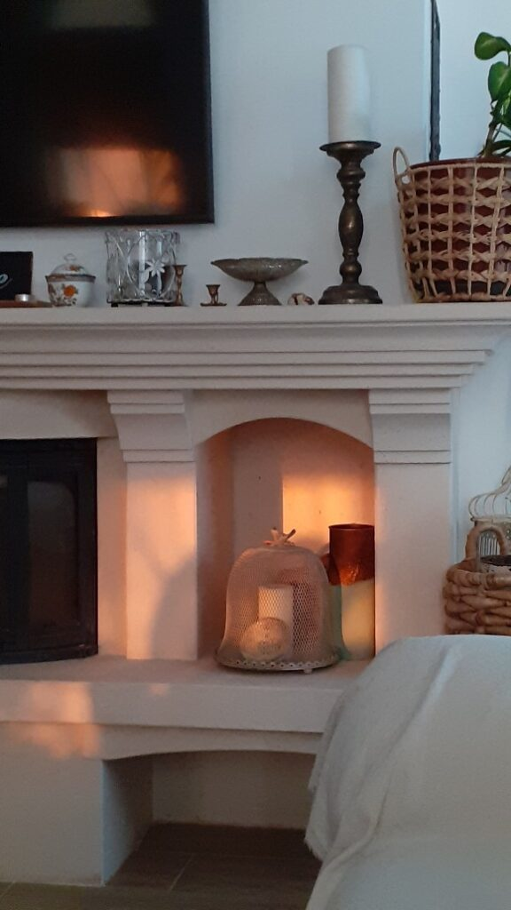
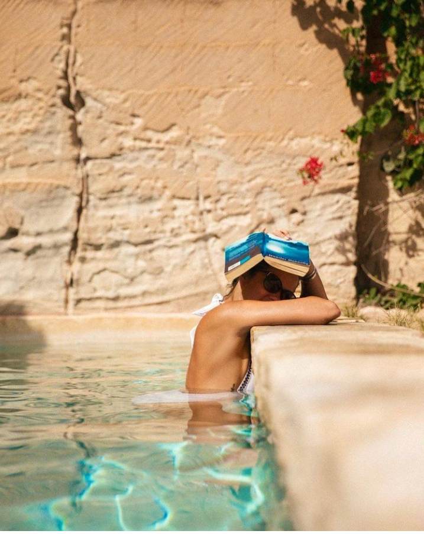

Nu înțeleg deloc expresia "cu noaptea-n cap", dar mi-e extrem de clară "cu noaptea-n ochi". Deși sunt din ce în ce mai obosită, corpul meu parcă a intrat într-o cursă tâmpită de-a-ndoaselea, în loc să îndes în toate cotlonașele mele cât mai mult somn și/sau odihnă, el îmi dă trezirea după și mai puține ore dormite. Abia am ațipit de noapte bună, că m-am și trezit de prea dimineață nebună de-a dreptul. Eu și sistemul de irigație ce suntem treji la ora asta. El măcar are un scop, al meu care o fi oare la ora asta nesimțit de mică?!

Măcar acum, poate, mintea o să mă lase să-mi fac ritualul de recunoaștere a ce e cu adevărat important, liniștită și adunată în moment, nu mă mai împrăștie pe nicăieri, spre toate alea multele câte sunt de făcut. Vorba bătrânilor, "Niciodată nu vei termina ce e de făcut!" iar niciodată ăsta aici e pe bune.

***

Cum somn nu mai am strop, mintea e pe poziții dar e blândă încă, în cameră e așa o atmosferă întunecată dar caldă și calmă, totul s-a aliniat pentru micul meu moment de mine și tot restul.

Chiar dacă devreme, mulțumesc Inteligenței Universale că mi-am deschis simțurile și azi și am așa o pornire plină, dar nu de a-i cere ei, ci de a-mi cere mie să-mi fac ziua de azi frumoasă. Apoi, în mine nasc emoțional cele 2 situații antitetice: cei ai mei dragi în viață și sănătoși, cât se poate, și opusul ei, scenariul cel mai sumbru din viața unei ființe mai mult umană decât ființă. Din paralela asta, pleacă cu multă fervoare recunoștința că-n realitatea mea primul scenariu este valabil, cu mici nuanțe, care de fapt mă privesc tot pe mine, sunt tot pentru dezvoltarea mea. Un zâmbet de bine mi s-a pus în inimă. Apoi mulțumesc candid și pur, fix cum sunt și ele, pentru celelalte ființe din viața mea, necuvântătoarele și zâmbetul ce tocmai s-a pus, dă-n dospit. Mulțumesc și pentru "adiționalele" care-mi fac viața comodă, pentru lucrurile materiale care au și ele rostul lor, pentru abundența care mă înconjoară de la firele de trifoi până la micile momente de bucurie pe care aș putea să le savurez dacă m-aș opri din drame, pentru tot și toate și nu ignor să mulțumesc și pentru obstacolele astea de care mă tot lovesc, doar ca să văd înțelepciunea ascunsă de după ele. Atât de blând mi s-a scurs mica ceremonie, că a lăsat în urmă balsam în mine, ce mă unge fain în noua zi.

Trupul mi-e trezit deja, nu-s nici în stare de alertă, dar nici în stare de blegeală, cumva orele astea puține de somn au făcut ele neștiute o medie și când mi-a sunat alarma-n mansardă, starea se instalase cu succes în corp. Ooo, tocmai pe el, dragul de el, corpul, l-am uitat din tirada de binecuvântări, așa că, pentru că aici nu e ca la biserică, în zilele de cutare și cutare, între orele x și y, la mine în peisaj pot să trimit oricând, orice mulțumire aș avea, înalț cu tărie un mare mulțam pentru ușurința pe care corpul meu o are acum. Cred că e unul dintre cele mai importante lucruri din viața asta, să țin carcasa în stare cât mai bună, ca să-mi pot da experiențe cât mai mișto și de care să mă și bucur.

***

Bănuiam că n-o să am poșetă Spiky în deplasarea către parter, blănoasa s-a întors pe cealaltă parte, la propriu, și n-are niciun chef de mișcare. Îi las pe amândoi în visele lor, dacă le-or avea, și mă duc să mai fac un pas spre visele mele, pe care încă le am.

În timp ce-mi repet conștient mantra băutului de apă caldă cu lămâie, îmi sondez dedesubturile și pipăi puțin interiorul. Tristețea e încă acolo, ca o cocoașă-n netezimea mea dar parcă și-a mai îmblânzit intensitatea. Chiar dacă-mi vine în primul rând să mă lipesc de lipsuri, de pierderi sau de negativ, binele, care stă cumincior în mine, mi-aduce aminte că după furtună, întotdeauna iese soarele.

***

Mersul la mama este și primul test al zilei. Pe lângă duritatea testului în fizic, pe care îl duc oricât de nașpa e, de obicei e test emoțional, pe care de cele mai multe ori l-am cam picat.

O fi de la căldură, o fi de la demență, mamei îi pute mai tot timpul în ultima perioadă. Nimic, sau, ca să nu fiu atât de categorică, aproape nimic nu îi place sau convine. Ba e prea cald, ba e prea frig, ba e lumină, ba stă pe beznă, ba nu merge "nenorocita asta de tabletă", ba s-a săturat de ea.

Azi s-a săturat de transpirațiile astea care-o fac fleașcă de se schimbă de o mie de ori pe zi, așa că, pe lângă suprimarea smoothieului și sucului de după amiaza, parcă n-ar mai bea nici apă, ca să nu mai aibă ce să iasă prin piele. La asta nu mă gândisem dar are demența grijă de toate și nu obosește să mă surprindă. Am eu așa un feeling că acum doar e începutul, cam ca aia "când ești prost de mic, când ești mare doar te joci", simt eu, oripilată deja, că demența nu s-a făcut mare.

Mă uit la chipul ei să văd dacă glumește sau e pe bune și, e pe bune. Încerc să nu mă impacientez că eu nu cred că poate sta fără apă. De fapt, realizez că un om normal nu poate sta fără apă, dar oare cum o fi la unul cu Alzheimer? Oare intervine corpul, prin instinctul de supraviețuire, și preia controlul când mintea s-a dus naibii? Evident că nu voi sta să verific asta, voi găsi tertipuri să bea apă, asta clar. Ș-apoi, poate uită de ideea asta creață, la fel cum uită că-mi zice de o sută de ori pe zi cum o freacă Sassy cu lăbuța când vine în pat, lângă ea.

Strâng și schimb și spăl și frec și mă întăresc să las să treacă pe lângă mine, fără să mă atingă, starea asta a ei de continuă nemulțumire. C-o am și eu pe-a mea, n-am nevoie să mai alipesc și de la alții, că doar nu colectez nemulțumire neagră pentru zile albe.

***

Mă afund cu plăcere în permacultură și-n căutatul de leacuri naturale pentru problemele, mai mici sau mai mari, ale naturii din curtea noastră. Piersicii, deși nu s-au îmbolnăvit și mai rău, au rămas așa într-o stagnare, într-un hold în care piersicile, destule, nici nu se strică, nici nu se coc. Arțarii încă nu dau semne de revigorare dar pierd frunze consistent. La roșii, nu mi-e clar dacă e vreo insectă care le atacă sau e rezultatul arsurii solare sau unei lovituri mecanice. Două din cele 6 vițe de vie au pe alocuri puncte albe, multe și mărunte de aproape nu mai e strop de verde și de viață-n frunză.

Nu mă pricep, sunt învățăcel, dar internetul abundă de informații, așa că m-am pus pe săpat, virtual de data asta, nu d-ăla de făcut gambe. Și, că doar internetul e o oglindă, unii zic într-un fel, alții fix opus și dansează toate astea-n mine până întâi mă zăpăcesc, apoi le citesc din nou și ușor-ușor încep să facă sens. Cine s-ar fi gândit că-n trusa de grădinărit ar trebui să există lupă?! Eu una, nu! Dar ca să mă dumiresc ce are vița de vie, îmi trebe să mă uit cu ea pe dos, să văd ce ființe oribile suc seva bucătăriilor astea care țin în ele viitori struguri. Există atâtea remedii naturale încât eu mă mir că până acum am crezut "bălăriile" celor care-mi decretau, din propria experiență, că fără chimic nu se poate.

Lumea plantelor imită lumea umanilor iar vindecarea lor poate fi exact ca la umani: prin medicina alopată, cu chimicale sau prin medicină alternativă, cu mama-natură. Alegerea e la noi, always was and always will be.

***

Pe binecunoscutul principiu "una caldă, alta rece", micul dejun al mamei e aia caldă iarnă și aia rece vara, că mănâncă tot, fără dumicați și fără comentarii. Tăcută, parcă i-a secat fântâna de povești din adâncurile alea de timp, unde a fost fericită, că nu mai aduce nimic la suprafață. Are o absență profundă, câteodată am impresia că e atât de plecată habar n-am unde, că nici nu mă aude, atât de lipsită de reacții, verbale sau non-verbale, este. Nu există în acele momente nicio diferență între mine vorbind cu ea, sau mine vorbind cu un perete. Am hotărât să o las pe ea să-mi arate când e capabilă să țină o discuție și când nu, așa că azi am priceput nu-ul și îmi conserv energia pentru altceva. Deși mi-e ciudat să stau cu ea la masă, pentru ea, că eu nu mănânc și să stăm într-o tăcere totală, dar mă învață să trăiesc cele mai inconfortabile stări, că și astea există pe pământ și trebe experimentate. Fără să fiu melodramatică, am în mine speranța mare că nu o să mă învețe stări d-alea dure-dure, doar pentru că există și pentru că "de ce nu?"

***

O altă "rece", adică super faină pe canicula asta, este verva domnului meu, cintezoi de la prima oră, a lui, că la mine parcă-i deja miezul zilei, trezită de atât de devreme. E vesel, se simte briza de concediu, doarme cât vrea, face ce vrea, iar astea se resimt în aerul din jurul lui. Ce bine, că am nevoie și de veselie și de bucurie, s-o mai văd și la alții, să simt cum se simte și la alții și să mă molipsesc.

Nu reușesc să scap de prădalnica senzație de regret că eu nu pot face ce vreau. Chiar nu știu de unde s-o apuc, s-o scutur și fie să scap de ea, fie să găsesc o cale să fac ce vreau. Deși, în genere, sunt omul soluțiilor, pe mine nu mă coafează deloc răspunsul clasic "nu se poate!" sau enunțul grav, de zici că e apocalipsa "avem o problemă!", zău dacă mă pricep cum să mă scot din rahatul ăsta de părere de rău. Dacă ar fi fost la altul, cred că aș fi văzut calea, dar la mine, băgată prea la finețe, prea la ultimul detaliu în miez de situație, nu-mi pot lua distanța necesară, să-mi sară în ochelari ideea aia salvatoare.

Aș vrea să mă apuc din nou de bricolat, dar cel mai mult îmi lipsește lucrul cu lemnul. Am două scaune cu un schelet de lemn fain, pe care aș vrea să le fac wow, am în cap imaginea lor finală și de juma' de an nu am găsit o zi să mă apuc de șlefuitul lor. Mai am un scaun superb, care nu are șezut, dar are o osatură minunată, pe care-l visez cu straie noi și n-am apucat nici măcar să tai lemnul pentru șezut. Am două picioare butelcuță, cele mai frumoase picioare pe care le-am văzut vreodată la o masă, din care vreau să fac două mese de cafea și nu m-am îndeletnicit măcar să măsor ce diametru de blat ar putea să țină în echilibru piciorul. Am atât de multe în garaj/atelier și în cap și nu reușesc să le colapsez în timp, în realitatea asta ocupată cu spălat, curat, gătit, pilit, cumpărături și iar de la capăt.

Să nu uit, de mâine să încep să fiu recunoscătoare clarității, poate, lăudată și apreciată, dă roade și-mi aduce pe tavă, sub ochii de carne, soluția.

***

Pentru că nu a avut succes friptura de porc, prea "talpă" pentru gusturile mamei, dau o fugă să iau grătar de pui, că poate l-o aprecia. Ca mai aproape tot timpul, ieșitul din perimetrul în care-mi trăiesc majoritatea clipelor se lasă cu mișto, cu lucruri noi, cu gustat de situații.

La Mega-ul din sat, în timp ce mă uitam cu ochi pofticios pe la rafturi, aud șușotelile doamnelor care aranjează produsele în raft:

-   L-ai văzut?
-   Da, ce tupeu!
-   Eu n-aș mai avea curaj să ies din casă!

Că mi-s tare curioasă, aflu repede și despre cine e vorba. Marele maestru de ceremonii cu valuri și spumele mării, la mare modă și-n gura tuturor pe internet, conțăran cu noi, Buhnici. Aproape că m-a bușit râsul, dar mi-am văzut liniștită de ale mele, cu mintea la inepția asta care e ipocrizia ființei umane.

Ca și-n cazul lui Will Smith, care a făcut-o "lată" la nivel mondial, și băietul asta, de s-a făcut "vedetă" în doi timpi și trei mișcări, și-a furat-o la greu, de la multe femei și câțiva bărbați. Plus niște rezilieri de contracte, disocieri și spălări de imagine.

Nu am studiat cu subiect și predicat zicerea de duh a lui George, că nu era pe palierul meu de interes dar, din avionul de unde privesc eu, nu înțeleg cum femeile, mai grase, mai cu celulită, mai slabe și osoase, mai strâmbe sau manechine, superbe sau nu, au dreptul să defileze mai mult goale pe o plajă iar omul ăsta n-are dreptul să-și spună părerea, că ofensează. Eu pot să fac pariu, că doar îs femeie și-am avut și mai am și acum, invidii sau bucurii, după context că: 1. dacă e o femeie faină, de-ți face plăcere s-o privești și privirea alunecă armonios, ca femeie te strânge și parcă te chircești oleacă, indiferent cât ești de bine sau nebine tu însăți, ca bărbat, e posibil să-ți curgă niște băluțe dar, tot contextual, să nu le lași la vedere, fie că-ți iei castroane sau ți se taie porția, fie să nu cumva să-i dai satisfacție femeii, că ți-a acaparat privirea și pofta momentană; 2. dacă e o femeie ce nu se mulează pe tiparul 60-90-60, ca femeie te bucuri că n-ai competiție, ca bărbat o ignori sau o judeci că n-are grijă de ea și nu-ți activează nicio glandă salivară. E așa de când e lumea și pământul și va fi așa cât e lumea și pământul. Că sunt nuanțe, da, sunt clar, dar, ca-n clopotul lui Gauss, sunt alea marginale, grosul e ăla de mai sus. Numa' că cultura noastră de ambalaj și de carton se opărește toată când unul, într-un moment de slobozenie sinceră, se scapă cu ce are-n gușă și-n căpușă. A curs atâta "cerneală" pe internet pe subiectul ăsta și atâta analiză pe text s-a făcut, de ziceai c-a stârnit dragul ăsta al patrulea război mondial sau a împânzit România cu nu știu ce plagă. Nope, e doar ipocrizie at its best. Fiecare e liber să facă și să zică ce vrea, când o să ne intre asta în sânge, o să mai creștem vibrația colectivă cu încă o țâră. Pentru că, ce uităm sau nu știm, este că fiecare își duce karma după el și, mai devreme sau mai târziu, și-o asumă. As simple as that.

***

Mi-a luat ceva timp să termin analiza promisă iubitului copilei mele, am terminat fix cât să pregătesc prânzul pentru noi doi, că al mamei sigur va fi mai încolo, la cât de bine a mâncat de dimineață.

Își mai arată colții tristețea pe alocuri, câteodată pic brusc ca într-un hău, e un stropșor de labilitate emoțională aici, mi se umplu ochii atât de repede de picuri mari, că nu apuc să fac nimic să opresc prăvălirea lor. Le las să se ducă, sper că mă răcoresc, o și fac pentru o bucată de timp, apoi o iau de la capăt. La prânzul cu domnul meu, era ultimul lucru pe care voiam să-l aduc la masă și totuși, pe nepregătite, ochii mi-au plutit în plâns. Norocul meu a fost spălatul de vase și de stare, că am închis relativ frumos un timp care nu avea cum să fie decât frumos.

***

De abia îmi mai țin capul drept și ochii deschiși, parcă pierd prin tălpi, cu fiecare pas pe care-l fac, bucăți mari de energie. Ca să scurtez efortul, mă duc să o iau pe mama la prânz. De curiozitate, o întreb dacă îi e foame și dacă da, de ce nu coboară. Da, îi este. Păi cum să coboare singură?! Simplu, pe scări. Nu se cade. What?! Nu dezbat pe larg subiectul pe scări, ci o aștept să ajungă în bucătărie, să văd care e mecanismul ăla sucit din mintea ei de azi, sau de dintotdeauna, care nu o lasă să coboare singură.

Cu pașii ei mărunți și deși, cu ambele mâini în laterale ca și cum se ține de niște balustrade imaginare în înaintarea ei prin spațiu, vine legănându-se. A rămas cu ceva reflexe de pe vremea când cochetărie era numele ei mijlociu și se duce direct la chiuvetă, să se spele pe mâini. Numai că ea doar trage de clapa robinetului până reușește să-l deschidă, bagă palmele sub apă și gata, s-a spălat. Mereu trebe să fiu atentă pentru că așa face și la ea, cu tot săpunul pus peste tot în baia ei. O reîntorc, îi dau eu cu săpun pe palme și apoi se așează la masa deja pregătită.

O las să savureze mâncarea și simt că nu e cazul unor discuții acum. La ce m-ar ajuta să pătrund o idee întortocheată de-a ei? La nimic, oricum modul cum sucește sensurile nu e liniar, nu e ca și cum dacă înțeleg cum construiește ea o scuză acum, sigur pe următoarea o să i-o pot intui. Aiurea, nu pot să intuiesc nimic și cu cât mă pătrunde înțelegerea asta mai repede, cu atât mai bine.

Mestecă încet, greu iar pentru oboseala mea și greutatea din pleoape parcă e derulat cu încetinitorul. Îi spun că după prânzul ei, mă duc să dorm, nu știu dacă m-a auzit sau nu, că nu și-a ridicat ochii din farfurie și nici nu a zis nimic. Abia când am urcat cu ea, la etaj, și i-am repetat de ce urc, a intrat la ea informația. La ora asta?! Are și ea dreptate, în felul ei, și ochii mei, în felul lor. Mai am doar o oră și ceva până trebe să mă prezint la datoria scabroasă a pilitului. Fie ce-o fi, încerc.

***

Nici n-am dormit, nici n-am nedormit, am stat într-o stare de veghe, de suspendare, de așteptare, o lălăială, cât de cât odihnitoare, măcar pentru ochii închiși și pentru mușchii încordați pe care mi i-am destins cât de mult am putut.

Corpului nu-i trebe atât de mult cum credem noi, dacă-i dai fix când are nevoie, fix ce are nevoie, bagă foc la furnal și te duce mai departe, nesperat de ușor.

Așa se face că am dus momentul serii de la mama mai ușor decât întipărisem în creier că este și am putut să mă bucur prezentă și de-un apus fain, cu lumini și umbre și afară, și-n casă.

***

O zi cu început, cuprins și încheiere interesante, cu puțin mai puțină tristețe și melancolie, cu mai multe lacrimi, dar poate o fi nevoie de ele să spele ce e de spălat, dar și cu recunoștință pentru:

1. Mai mult timp! (deși mai puțină noapte)
2. Starea de bine a domnului meu!
3. Corpul meu, prieten de nădejde!

Clipa mea de frumos este:

de sezon :)))
