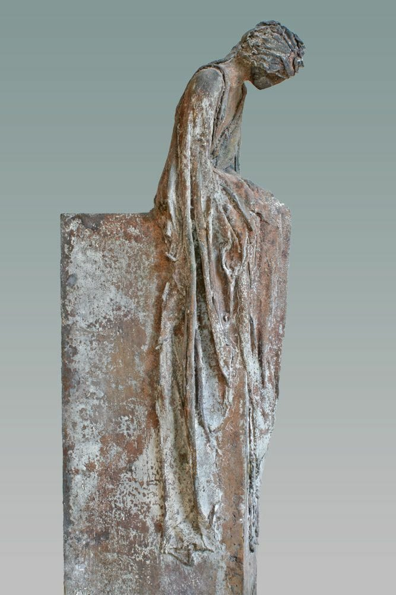

Dimineața asta a pornit prost din start. Am avut o noapte ciudată, m-a durut brațul de la vaccin și nu am putut sta decât pe o parte, la un moment dat am avut o senzație de frison, am fost agitată și nu se mai termina parcă.

\*\*\*

M-am trezit, am văzut pe cameră că mama încă doarme dar nu am avut stare să mai stau măcar minuțelele în care să-mi pregătesc mental și emoțional spațiul pentru ziua ce se așternea în fața mea.

Am coborât să mă apuc de ritualul bine stabilit, puțin iritată că nu apuc să mă satur de somn, să mă odihnesc și eu. Numa’ bine că o data ajunsă în bucătărie, mi s-a făcut rău. Brusc și pe neașteptatelea. M-a luat o stare de leșin de m-aș fi scurs pe gresie și acolo aș fi rămas. Am transpirat într-o secundă atât de abundent încât mi s-a făcut fleașcă bluza de pijama. Iar eu nu mă pot lăuda că-mi drenează rinichii prea bine așa că acest transpirat chiar m-a pus pe gânduri.

M-am apucat ușurel să fac totuși ce era de făcut pentru că am văzut pe cameră că s-a trezit și coana mare. Dar mă mișcam cu încetinitorul, oricât aș fi vrut să fac mai repede, corpul meu nu urma comanda de la creier. Mi-a venit și să vomit, era un amalgam de rău fizic și o agitație emoțională. Dacă mie mi se face rău, ce fac cu mama?! Dar de la ce mi-e rău? O furtună în secunde.

M-am adunat, mi-am dat cu apă rece pe față, am terminat treaba și m-am dus la ea. În fiecare dimineața iau în piept și nări mirosul greu când intru la ea. Dar azi, mi-a fost aproape imposibil. Îmi venea să vomit dinainte dar când am intrat parcă cineva m-a lovit atât de brusc și de dur în plex încât niciun efort intern de-al meu părea că nu va împiedica voma. **Nu știi cât ești de tare decât atunci când chiar trebe!** Ca să nu o sperii pe mama, am făcut eforturi supraomenești să vorbesc, zâmbesc și să curăț ce e de curățat. Am deschis larg geamul, doamne, ce bine mi-a făcut gura aia de aer înghețat dar proaspăt!!

\*\*\*

Ajunsă jos, am lăsat să iasă din mine tot ce adunasem. Eram nervoasă pe situație, pe mama că a generat această situație, pe Univers că mă face să trec prin astea, pe mine că nu îmi creez realitatea aia pe care mi-o doresc deși, la nivel cel puțin conceptual, știu ce trebe să fac și am și uneltele să o fac! Apoi a ieșit balaurul victimizării: frate, dar mi-e și mie rău! Nici când mi-e rău nu pot să stau, să nu fac? Nu e corect! Mă apucă disperarea, nu mai văd nicio speranță, îmi vine să urlu, am senzații aproape fizice, carnale de luptă, de bătaie, îmi vine să lovesc, să țip, să iasă naibii tot răul ăsta din mine!

\*\*\*

Nu am fost în stare să folosesc singurul meu timp curat, fără întreruperi, dintre smoothie și micul dejun. Nu mai voiam să văd nimic, aveam resemnarea în oase, mă irita până și gândul să mă uit la ceva fain ca să mă distragă. De ce aș face-o? Realitatea mea este la propriu de rahat așa că nu mă mai învârt pe după cireș că nu va mirosi a trandafir. Decât atunci când o să fiu capabilă să ACCEPT ceea ce este și să mă mai și bucur de ceea ce este! Iar acum nu vreau să fac asta. 

\*\*\*

M-am dus să o iau la micul dejun pentru că, evident, uitase de asta.

Mamă, ce m-a iritat micul dejun! Repetă întruna, ca o moară stricată aceleași lucruri: cum face pisica ei cu lăbuța ca să o facă atentă la ea, cum dacă pisicile nu ar fi drăgălașe, oamenii nu ar mai avea grijă de ele, cum face ea 74 de ani, cum face pisica ei cu lăbuța ca să o facă atentă la ea, cum dacă pisicile nu ar fi drăgălașe, oamenii nu ar mai avea grijă de ele, cum face ea 74 de ani, cum face pisica ei cu lăbuța ca să o facă atentă la ea, cum dacă pisicile nu ar fi drăgălașe, oamenii nu ar mai avea grijă de ele, cum face ea 74 de ani, și tot așa over and over!!!

Azi nu mai am nervi, azi nu pot să mă fac că e prima oară când aud, azi nu-mi pot controla iritarea. Dar ea nu vede. Ea vorbește întruna și mereu aceleași lucruri. Of, doamne, cât de urâtă e boala! Și eu acum că mă supăr pe ea că e ca un cd player stricat care redă aceeași melodie non stop. Dar asta simt, gândesc, trăiesc azi și face parte din experiența asta pe care mi-a copt-o viața.

\*\*\*

Am descoperit și cauza stărilor emoționale și fizice proaste. Din cauza șocului pe care l-am trăit cu mama, menstruația mea a întârziat vreo 11 zile. Încă o dovadă palpabilă că traumele sapă adânc în corpul fizic. Așa că astăzi, am reintrat în normal iar la mine acest normal lunar presupune dureri cumplite. Parcă mă sfâșie cineva bucățică cu bucățică. (Pentru cine e ofensat sau șocat sau în orice fel de aceste dezvăluiri, move on. Sau forward. Suntem oameni, unele suntem femei și nimic din ceea ce trăim nu ar trebui să fie tabu. Am crescut în niște programe tâmpite “nu e frumos să spui asta!”,  “nu trebe să vorbim despre asta!” iar eu, mai mult decât alții, nu m-am abătut de la cărarea pavată cu prejudecăți. Pentru că voiam să fiu plăcută, iubită, văzută, acceptată. Uite că după juma’ de viață nu mă mai interesează asta. Și ar fi bine ca toată lumea să facă asta, ca să nu ne mai spoim realități exterioare care n-am niciun design comun cu ce e în interior!)

Bine măcar că știu ce am. Evident că asta nu mă scutește de la a pune rufe la spălat și de la a pregăti mâncarea pentru prânz. Cocoșată de durere, le-am făcut pe toate.

\*\*\*

La prânz a văzut că mă mișc greu și îndoită de mijloc și i-am spus ce am. A mâncat tot și a plecat la ea sus rapid. 

\*\*\*

Eu m-am apropiat de mama târziu în viață pentru că multă vreme am judecat-o pentru egoismul ei. Nu am putut să văd (și nici nu am știut) cât de broken era și ea, cât de greu îi fusese și ei în viață. Eu am judecat aparența, suprafața, nu am știut eu în copilăria sau tinerețea mea că traumele pe care le cărăm în ADN și la care mai adaugăm și noi cu generozitate pe parcursul vieții, te mutilează și te transformă, câteodată atât de subtil și de ascuns. Trauma violului la ea a săpat vreo 60 de ani în trupul ei până s-a manifestat fizic în cancere.

Ce mi se pare însă fascinant este că ea și-a adus aminte de viol în timpul chimioterapiei. Ascunsese atât de adânc că nici nu mai știa. Acum știu că această amintire, faptul că a articulat-o în fața mea, că a scos-o la lumină, că a aruncat în afară răul din ea, a ajutat la vindecarea celor 2 cancere.

Revenind, ce vedeam eu egoism la ea era de fapt un mod de a face față unor situații care nu îi plăceau. Așa face și acum: nu-i face plăcere că eu sufăr dar pleacă, ca să nu mai vadă.

Azi, deși știu ce știu, m-a iritat lipsa ei naturală de grijă maternă. Că asta mi-a lipsit toată viața mea. Înțeleg de ce face ce face dar asta nu șterge toți anii ăia în care am făcut ORICE să mă simt iubită, sau măcar văzută. Și iar mă enervează. N-am rezolvat încă acest conflict al meu cu ea? Ba da, l-am închis dar e normal să am reacții. Sunt umane iar eu sunt o ființă umană care experimentez, în costum de carne, emoții. Nu vreau să mă mai învinovățesc că simt ce simt. 

\*\*\*

Am mai încercat să dezțelenesc pornirea blogului dar eu sunt clar atehnică. Sunt creativă, pot construi chestii dar astea digitale gen site/blog nu-mi sunt la îndemână. Cu un ochi pe cameră, o observam cum doarme, în 10 minute se trezește, iar se culcă, iar se trezește și tot așa. În sinea mea, mi-am zis că azi nu mă duc la table, că am dreptul ăsta la cum mă simt. Când o văd pe cameră că nu are ce face și se plictisește, nu mă lasă inima să o las așa.

Am urcat, “hai să jucăm table!”, s-a luminat la față imediat, nu mai știa de ce merg aplecată, nici nu mai conta oricum. Măcar am făcut-o să bea toată apa din sticlă. Nu vrea suc, nu vrea iaurt, nu mai vrea nimic de mâncare. Numai bine că și-așa nu mă simt în stare să mai trag de mine. Îi dau pastilele și plec.

\*\*\*

Prost a început, prost s-a și încheiat. O zi plină cu nervi, cu conștientizări, iar cu nervi, cu resemnare pe alocuri dar atât m-am priceput azi.

Mâine o iau de la capăt. Adică sper să am o nouă zi. Și implicit o nouă șansă să fac lucrurile altfel.
