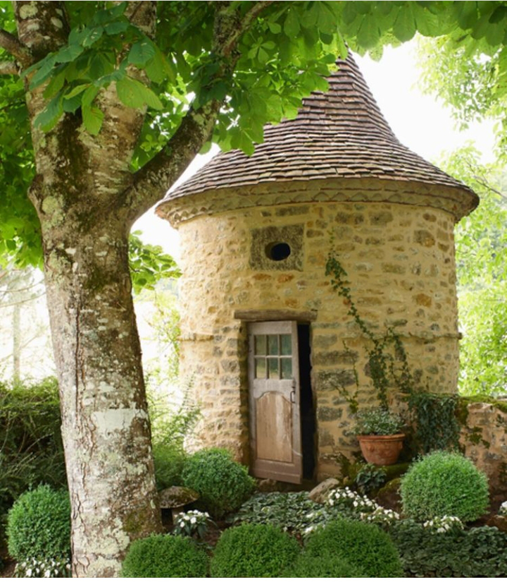

M-am trezit gata obosită. Bine că mi s-a luat de-o grijă, dacă cumva aveam gânduri că nu știu cu ce să-mi ocup timpul și lista de to do-uri, mi-au trecut. Nu e cu plumb greu, ci e cu o sfârșeală, ca și cum am tras toată noaptea la plug și acum, când să-nchid și eu ochii a pauză, iaca e dimineață și trebe să mă trezesc. Oboseala asta nu vine de regulă singură, are în "apărarea ei" o turmă de gânduri, care mai de care mai răzvrătit: că m-am săturat, că vreau să fac ce vreau și să dorm cât vreau, că ce bine-ar fi acum, într-o căsuță la munte, să deschid larg și să invit pădurea să-mi intre-n carne, că e nașpa, că multe și mărunte și-mi simt, la propriu, cum fuge mintea cărată când de unul, când de altul, de mă amețește zigzagul ăsta și mai rău. Într-un act acerb de voință, pun piciorul-n prag, mă adun de unde mă împrăștii cu așa o nonșalanță, și mă unesc într-un singur gând și-o singură acțiune: să mulțumesc. Chiar și-așa obosită sau mai ales așa obosită. Pentru că simpla enumerare a toate câte le am și a toate prin câte trec, umple în mine un ulcior mare, mare, cât inima mea de mare, de bune și de bine. Și chiar dacă și lucrurile pentru care mulțumesc sunt trecătoare, azi le am, mâine poate nu, știu eu, mai presus de orice minte și inteligență proprie, că vor veni altele să mă-nsoțească pe traseu dar în modul cel mai sigur cu putință, oboseala va trece.

Durerea de șale e tot acolo dar acum știu, din experiența zilei de ieri, că se înmoaie o dată cu mișcarea așa că o clasez și pe ea la trecătoare. De altfel, eu toată-s trecătoare, dar vreau să-mi aplec atenția și energia pe chestii care-mi aduc înapoi o valoare, vreau să investesc doar eficient. E o propunere ce-mi stă pe buza sufletului de ceva timp, acum o articulez și sper să trec la implementare d-aia continuă, nu cu azi da, o săptămână ba.

Cu mintea mi-a fost mai ușor decât îmi e cu corpul, pe care niciun argument parcă nu-l clintește din pat, unde-ar mai vrea un strop de leneveală. Stai să mă-ntind nițel, ooo, da ce bine e să stai pe partea dreaptă, nici cu stânga nu mi-e rușine, îmi privesc domnul cum doarme, frumos la pătrat, și el și somnul, o simt pe Spikylina cum stă ca un arc, gata să sară și să plecăm și eu tot nu vreau să mă-nalț într-o verticală. Ca întotdeauna, lumina ce se îndesește și limpezește și camera ce-mi arată o mamă trezită, în așteptare, sunt cele care reușesc să-mi urnească un corp obosit. O să vină și ziua în care o să mă odihnesc. Nu e acum, dar va veni. Zăhărelul clasic.

***

Deși e sâmbătă, nu mai am senzația aia care mă-ncerca în zile de weekend. Poate că a învins cerebrala din mine care a colorat zilele la fel, a șters roz bombonul ăla imprimat aiurea pe două zile din șapte, când toate-s la fel ca importanță și totuși atât de diferite prin experiență.

Îmi beau apa simplă, nu vreau lămâie, dar parcă nici ea n-alunecă ușor. E o încăpățânare în corpul meu azi, asta e clar. Nimic nu-i place, nimic nu-i convine, nici apa nu-l hrănește, nici albastrul nu-l potolește-ntr-o pace. Iau notă de ambele variante și observ cum, dacă las cârma la fratele porc, cotește către dramatic. Am în față două alegeri: să mă bucur de apa bună, de un celest ce-a venit la întâlnirea de azi, de un verde care se adâncește pe măsură ce ne îndreptăm spre toamnă, de mine în viață, capabilă să văd și să trăiesc astea sau să nu bag în seamă nimic din toate astea și să gogoșesc oboseala care-mi urlă-n toate fibrele. Natural aș merge doar pe prima dar pentru că-n viața mea am croit alt drum și l-am bătătorit cu atâtea alegeri doar pe el, superficialul ăsta mi-a devenit natural și mă duc, inconștientă, pe cărarea aiurea. Am văzut ce fac și-am încercat un viraj, timid, dar totuși viraj. Poate nu-mi iese cu bucuria de viață dar sigur n-am lăsat oboseala asta să mă mestece și să mă scuipe în butoiul cu aoleală, stau pe marginea lui și mă încăpățânez să nu cad. Uite că nu vreau ca să plătesc oboseala asta, trecătoare, cu o zi din viața mea! N-oi exalta acum de bucurie de viață dar nici nu mă pun în fund. Pornitul la drumul zilei e mai ușor mai de susul unde m-am priponit acum decât de la josul în care-aș fi înțânat dacă mă lăsam cuprinsă. E o mică victorie.

***

Cu ruga mică-n minte să nu găsesc nebunie la mama în "apartament" și cu smoothieul în mâini, pe lângă pliculețul blănoasei roiale și medicamentele mamei, am intrat la ele. Mama stă deja pe tabletă, iarăși a renunțat la rebus, de câteva zile nici n-a mai pus mâna pe pix, și e prinsă cu totul acolo. Demența asta e o sugativă de atenție, pe fanta minții ei a intrat tableta acum și acolo s-a mufat cu totul. Nu mă gratifică nici măcar cu privirea dar mie mi-e bine așa. Îi las cana plină de sănătate pe masă, îmi hrănesc frumoasa soră cu blană de angora și mă strecor în baie să strâng ce e de strâns. Sper să fie de la litiera necurățată a lui Sassy, dar e un miros de urină în baie de mă strânge brusc în stomac. Deschid larg geamul, mă apuc să spăl și să strâng și sper eu iasă cu totul mirosul ăsta ce-mi aduce aminte de beciurile insalubre de la mine din oraș, unde noaptea toată lumea se ușura. Arunc repede gândul ăsta și-mi promit că mâine, dacă tot așa miroase, să scot totul și să bag la spălat, să frec cu domestos fiecare centimetru și să nu las să se așeze mirosul ăsta oribil în baia asta mică.

***

Nu am timp liber pentru că vreau să profit de răcoarea dimineții și să calc. Am împrumutat de la copilă stația de călcat și am un coș mare de rufe ce așteaptă, de ceva timp, netezirea. Dacă domnul meu lucrează de acasă iar eu nu mă mai împăiez deloc, hainele ce trebe călcate s-au redus simțitor așa că n-am mai materializat nevoia de a avea o stație proprie de călcat. Dar acum s-a strâns, plus că mi-am spălat și perdelele și draperiile și astea chiar trebe călcat ferm.

Sunt mișto stațiile astea de călcat dar, frate, ce te aburesc! Iar dacă pui mâna unde nu trebe, în fața mașinii, jetul puternic de abur fierbinte arde ca naiba. Am deschis larg ușile de la living, ce dau spre curte și-n timpul meu liber m-am apucat de primul to do al zilei. Ce împietare! Mă împacă doar gândul că tot mie mi-ar fi fost mai greu, mai târziu, când încep căldurile.

Pentru că am și eu microbul perfecționismului în sânge și ăsta preia controlul aiurea câteodată, evident că n-am terminat ce aveam de călcat rapid, până în micile dejunuri ale celor cu care-mi împart și viața și casa. De abia am călcat, la perfecție, draperiile din living și s-a înființat domnul meu la bucătărie. Scuza perfectă pentru o pauză de la aburirea asta colosală.

***

Azi vine din nou nenea instalatorul așa că mari planuri pentru zi nu poate să-și facă el, că eu le știu pe ale mele, limitate oricum. Mai comentăm o știre, mai deșirăm un gând și gata, s-a făcut de mic dejunul coanei mari.

Care deja s-a schimbat de vreo cincizeci de ori până acum și așteaptă. Așteptarea asta și-a împregnat-o adânc în memorie, începutul ăsta a intrat acolo și-l face mecanic, știu sigur că nu știe ce așteaptă, doar așteaptă și atât. Mintea ei păstrează fracțiuni din acțiuni și doar p-alea le pune în practică. Pot eu să-i repet de zece ori pe zi că atunci când îi e foame sau are vreo nevoie sau doar vrea să coboare, să iasă din cameră, poate și chiar o rog s-o facă, ea nu reține această rugăminte, câteodată nici nu cred că trece de urechile ei.

O aduc mofturoasă la masă, nimic din ce am n-ar vrea, eu încerc să rămân calmă și la suprafață dar mai ales în interiorul meu, îi scot tot ce ar putea mânca pe masă și o las să aleagă. Într-un final, pesemne că a avut un ecou în mintea ei modul cum mi-am prezentat roșiile, a ales brânză cu roșii. Decât deloc, bun și așa, mai ales că roșiile sunt crescute de mine și sunt 100% naturale. Nu aș fi convins-o cu salată de roșii și atât, chiar dacă i-aș fi pus trei soiuri diferite, fără brânză, legumele simple nu reprezintă un deliciu pentru mama. Nu pot găsi drumul către adevărul ăla pe care îl știe, intrinsec în ea, că doar legumele și fructele sunt adevărata hrana pentru om, cum nu-l găsesc nici pentru mine, de cele mai multe ori, așa că nici nu mă mai chinui. Mănâncă absentă și pleacă la fel.

***

Nenea instalatorul, deși a zis că vine de dimineață, se lasă iar așteptat, tot cu emoții. Nu mai fac scenarite, că dau o fugă să iau niște pui să-i fac mamei o supă cu găluști și câteva snițele cu fulgi de porumb mărunțiți. Nu sunt de acord cu prăjeala dar decât să alerg să cumpăr, mai bine fac în casă.

Bag și o bougatsa vegană la cuptor și simt că mi-am luat partea de căldură și de abureală pe o lună. Sunt fiartă și coaptă și-n stările astea m-a găsit meșterul, deja familiarizat și cu noi, și cu locul. Bineînțeles că, din nou, apare neprevăzutul și domnul meu trebe să mai cumpere câte ceva, ba o țeavă, ba un cot, iar eu să suplinesc cu prezența și atenția, poveștile omului despre ce a mai făcut de ieri până azi. Îmi vine în minte modul în care m-a stors de energie ieri și azi vreau să suprim supapa aia. Îl ascult dar am o rezervă, mă păstrez mai prezentă la mine și mai puțin la el.

Dacă ești atent la povestirile unui om, la un moment dat observi cât de repetitivă este ființa umană. Cu cât mai detașat ești emoțional de poveștile cuiva, cu atât le vezi mai limpede și le simți, parcă la propriu, cum îl acaparează pe omul care le trăiește over and over. Tiparul și esența poveștilor e ceeași, doar contextul diferă. Cât de limpede am văzut asta azi, la omul din fața mea, care varsă pe masă situații în care el s-a descurcat și-n care a făcut față cu brio și-n care a fost mai șmecher și-n care nimeni altul nu s-ar fi descurcat. Mai limpede ca acum nu mi-a fost niciodată: o lecție neînvățată va lua nenumărate fețe, va veni în viață sub diverse experiențe să învețe lucrul esențial pe care ființa umană, cu obidă parcă, nu reușește să-l vadă. Să ia diamantul din lecția aia și, cred că chiar mai important decât văzutul, este integratul și practicarea diamantului în viața de zi cu zi. Degeaba mental am prins, într-un final, lovită la glezne de nșpe ori, că împăierea e o spoială nu doar periculoasă dar și dureroasă, până nu m-am spălat de ea conștient și încă o fac, experiențele care o conțin încă-mi dau peste ochi și inimă.

Dacă reușești să faci un pas, doi, în spate și să asculți cu ochi limpezi poveștile unui om, se vede că-s doar câteva tipologii mari și late: fiecare a avut o viață grea, fiecare a fost (sau mai este) o victimă a vieții, conjucturilor și oamenilor din jurul lui, fiecare a fost mai tare sau mai bun sau mai puternic (decât altcineva) la un moment dat în viața lui (sau la mai multe, depinde de îmbățoșarea de ego).

Și am mai observat un lucru care mi s-a părut tare mișto: nimeni, niciodată, cel puțin mie nu mi s-a întâmplat, nu mi-a povestit ceva extraordinar din viața lui cu bucurie și doar ca fapt divers. Orice poveste are înșurubat în jurul ei egoul persoanei care povestește, subliniează acut, bolduit și cu caps lock dacă se poate, cât de greu a fost până a răzbit. Nimeni nu povestește cu accent pe partea bună, ci toți accentuăm cât ne greu a fost. Greutatea asta pe care o accentuăm de fiecare dată, că doar nu ne spunem o singură dată povestea și atât, nuuuu, noi o tot repetăm la oamenii noi pe care-i întâlnim la tot pasul, ei bine, greutatea asta se multiplică și la un moment dat ne prăbușește sub ea. Pentru că noi n-am ușurat pe nicăieri, noi am gogoșit, cu timpul am adăugat niște înflorituri, că dau bine și uite așa suntem captivi într-o buclă de poveste de viață grea și vrem să sugem cu ea atenția și compasiunea și aprecierea celor din jur. De parcă povestea noastră suntem noi. O regurgităm over and over, în funcție de context, o reînviem mereu și nu ne mai dăm seama că noi am trecut de momentul ăla acum un an, doi sau zece. Ne cramponăm tâmpit în povești și nu (mai ) știm să le spun doar ca forme de exemplificare, doar ca pilde. Că ele, în structura lor intrinsecă, asta sunt, pilde și experiențe-învățător, dar nu mai știm să le citim. Am evoluat tehnologic și involuat în intuiție.

D-aia m-am simțit atât de epuizată ieri, omul ăsta repetă poveștile lui non-stop, la toți la care intră să repare diverse doar că eu, mai senzitivă, m-am cuplat la cazaul lui gol de energie și spațiul ăla, însetat de validare, mi-a furat pe nesimțitelea aproape toată energia. Brrr!

***

Am mers la sigur cu prânzul cu mama, care a mâncat cu poftă. Destul de absentă, m-a întrebat de unde am luat puiul, de parcă are avea vreo relevanță. De la măcelărie?

Yuck, cât de urât sună până și cuvântul, d-apăi conținutul unui astfel de magazin. Produsele de acolo, ca de altfel din orice galantar care vinde carne, ajung acolo în urma unui măcel, a unei crime împotriva unei ființe vii, care nu se poate apăra. I-am răspuns mamei, că m-a întrebat, ca de obicei când e vorba de un loc, în ce direcție de magazinul. Are ea un fix cu direcția, m-am prins de el și îi satisfac mereu curiozitatea asta. În mine însă s-a culcușit rapid un pui de tristețe și o uimire că ceilalți oameni nu reușesc să vadă ce văd și eu, că umplerea burții lor contează mai mult decât o viață luată. O viață! Oi fi sensibilizată, oi fi dusă cu capul, dar eu nu pot să pun egal între un maț și-o poftă și o viață scurtată brusc. Nu pot și am uitat cum era când o făceam. Din punctul ăsta de vedere, am devenit ipocrită. Dar tare mult mi-aș dori să dispară măcelăriile, abatoarele, culoarele morții… Câți din cei ce nu-și înfrânează pornirile carnivore or fi văzut ochii un animal exploatat o viață întreagă, care știe că e dus la moarte? E plin internetul de altfel de filmulețe, ignorate zgomotos  de cei care ar trebui să deschidă ochii să le vadă, dar le refuză și ne rănesc profund tot pe noi, care-am ales să înțelegem.

***

Oboseala și căldura m-au toropit de tot, așa că după amiaza se scurge călduroasă cu mine la orizontală. Nu pot să dorm, deși-mi doresc, pentru că nu mai e mult până mă duc la pilit de unghii și pentru că parcă aș vrea să fac ceva și pentru mine, să nu treacă ziua asta doar în to do-uri pentru casă. Aș vrea să citesc dar îmi joacă literele în fața ochilor, așa că-mi pun căștile și ascult muzică de meditație. Poate s-o lega de-o plecare într-o lume plină de posibilități, de unde să-mi iau stropi plini de energie faină, să mă scald puțin prin nimicul ăla atotcuprinzător și atotțiitor, să mă prind în jocul vibrațional ca o undă mică ce contribui și eu, cu muzica mea, la cântecul Universului. Meditația este cel mai personal lucru care i se poate întâmpla unei ființe umane, poate și pentru că doar ea o poate înțelege, că doar pentru ea e croită meditația aia. Am "învățat" greu să meditez, dar e cea mai frumos curs pe care l-am practicat până m-am prins că trebe doar să mă las să simt, să las toate alertele pe mute, toate grijile să le dau jos de pe clocoteală, să nu mai las controlul să mă ducă în zone safe, să mă predau cu totul clipei, cu minunile ei. Cine nu are meditație, să-și fabrice, că e cea mai dătătoare de viață și de realitate dintre experiențele umane.

***

E o mare discrepanță între tărâmul ăla cu adevărat magic din care-am coborât la tenebroasele unghii. Nici nu cred că puteam să găsesc ceva mai antitetic de atât, dar practic prezența așa cum zice prietenul Tolle, (încerc să) primesc tot ce vine, ca și cum știu că ar trebui să vină.

Bifez rapid sarcina asta grosieră și mă mai delectez cu o întâlnire călâie cu apa mea dragă. Aproape că intru în meditații mici și scurte în momentele în care apa-mi curge peste față iar în spatele ochilor închiși sunt imagini fără forme, dar pline de culoare. Am înțeles mai demult, în cursul Pace cu mine, că energia nu are forme, doar ființa umană are nevoie de ele ca mintea să poată face sens din realitatea asta materială în care ne învârtim. La mine, în spatele ochilor închiși, sub cascada de apă demențială, e o explozie de culori, fără forme, care mi-aduc în dar tot o explozie de trăire: e fabulos să fii în viață!

***

Cu asta-mi închei ziua asta, într-o notă mare, optimistă, bună tare doar pentru că avut aplecarea și atenția să acord clipei importanța pe care o merită și-a meritat-o dintotdeauna. În mine e o lume fascinantă care n-are mare legătură cu ce e în lumea din afara mea dar împletirea lor e bestială ca să sorb the best of both. Trimit un gând de drag pentru:

1. Ziua asta nouă în viața mea!
2. Limpezimea interioară care m-a pus într-un scaun, ca la cinema, să văd ca pe-un film poveștile de viață, a mea sau a altora, fix așa cum sunt ele și nimic mai mult!
3. Universul ăsta minunat care mă așteaptă mereu în spatele ochilor mei închiși!

Clipa mea de fain este:

