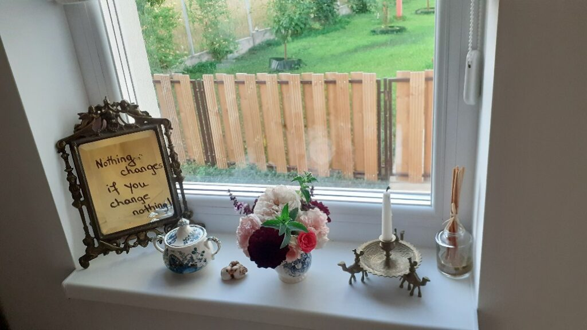
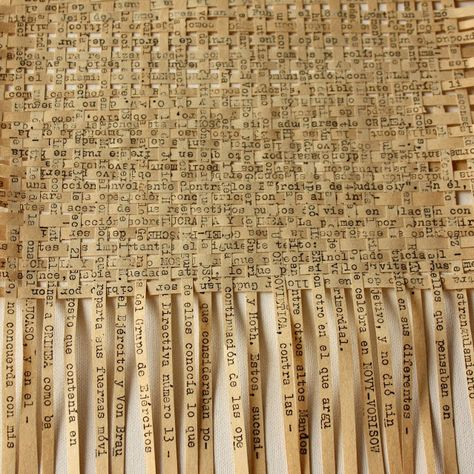

Cred că ar trebui să se inventeze nopțile de 2 în 1 sau, și mai și, de 3 în 1, adică să se comprime somn într-o noapte cât ar intra în trei. În felul ăsta, cu câteva făinuțe d-astea, poate m-aș aduce la zi și nu mi-ar mai pica atât de greu unele dimineți, cum e asta ce mi se cască și mă-nghite nemestecată și netrezită deloc. Am dormit blană toată noapte, bănui eu că fix pe partea pe care m-am culcat, p-aia m-am și trezit, dar nu m-a cuprins somnul decât prin miez o țâră, nu mi s-a întins și pe la periferii, nu m-am imbibat și săturat de el și nici el de mine, sper eu. Ochii mei refuză lumina, corpul îmi refuză mișcarea, doar mintea e captivă-ntr-un "subaltern" ce n-o ascultă. Profit de neintențiile de mișcare-n plan fizic, să-mi trimit gândul de drag pentru ce-mi împlinește viața cu putere în eter, să pornesc umilă dar conștientă-n ziua asta nouă. Cuvântul ăsta a răsunat așa puternic în interiorul meu în astă dimineață, că m-a trecut cu fiori. Am în față o zi nouă. Plină de neprevăzut. Dacă nu mă dă entuziasmul p-afară sau doar jos din pat, măcar să mă anime curiozitatea. Fiecare zi poate să aibă proverbiala savoare a dimineții de Crăciun. Fiecare zi poartă-n sacul ei surprize și cadouri și minunății dar, dacă ele nu-s croite după calapodul pe care-l așteptăm noi sau îl avem creionat în minte, nu le apreciem și nici nu ne creștem prin ele. Azi cuvântul "nou" m-a făcut mult mai atentă la posibilitate. Pentru că, în esență, rădăcina rădăcinilor, asta aduce fiecare zi care începe c-un deschis de ochi: posibilități.

\*\*\*

Buun, hai că m-am înviorat un stropșor, să luăm pulsul și fratelui porc, să vedem în ce ape, mai curgătoare sau mai băltite, se scaldă azi. Surprinzător, deși ieri l-am supus la ceva munci, răspunsul lui este calm, sunt bine de sus până jos și înapoi, și-i mulțumesc cald, că am nevoie de suportul lui în continuare. Pesemne mustățile lui Spiky au darul, printre altele, să prindă vibe-ul bun din zonă, că mi se desprinde de coaste și se alintă, cu juma' de limbuță p-afară. 

Acum 9 luni, dormea pe mine botoasa mea Maya iar eu aproape că nu respiram ca nu cumva să se trezească și să mă văduvească de plăcerea imensă de a o privi cum doarme, ca un îngeraș. Acum, am o ghem mic de blană torcăcioasă care a umplut altă cămăruță a inimii mele, pentru că n-ar fi corect și nici n-aș avea dreptate să spun că a umplut golul lăsat de Maya. Sunt iubiri diferite și merită locuri diferite din mine. Fetele astea două au fost și sunt ființe trimise să netezească hopurile dureroase ivite pe cărarea mea, ele mi-au știut, mai mult decât oricine, gândurile, grijile sau durerile când nu mai era loc în mine să le țin și le răsturnam p-afară, de la ele încerc să învăț puterea lui acum și bucuria clipei. 

Am lăsat tomberoneza să-ți facă numărul și apoi mi-am făcut curaj să mă ridic. Da, sunt curioasă la noutatea zilei, da, vreau să răspund larg posibilităților cu care ea vine dar, la modul brut și realist, aș avea nevoie de ceva mai mult somn. Sau odihnă.

\*\*\*

Până la parter, aveam deja planificate sarcinile zilei, dintr-o minte obsedată de rezolvări. Singurele care mai amână începutul sunt apa caldă, lipită de-un cer nehotărât, smoothieul și vizita matinală a mamei cu a ei pisică. 

Apa nu alunecă ca de obicei, iar ochii nu întâlnesc albastrul, ci un gri deschis, nu-i nici a mohoreală, nici a veselie, undeva nici în căruță, nici în teleguță. Cum nu mai resping zilele noroase de multișor, nu-mi cobor privirea de la cerul meu de azi, și-o las acolo un picușor să se umple de pace și de imensitate, să le aducă în interior, că poate așa nu mă mai las năpădită de lucrurile mici și banale cu care mă răstoarnă atât de repede viața. 

Cu chiu, cu vai, am sorbit toată apa, mi-am făcut și ceaiul iar smoothieurile așteaptă cuminți să fie savurate. E o nebunie de afine de pădure, smochine proaspete, avocado uleios dar mătăsos, banană și caise, toate pasate cu un strop de lapte de migdale. Doar la gândul gustului și mi-a și venit apă-n gură. E clar, am cimentat obiceiul, am un an jumate de când nu ratez smoothieul dimineața și cred că așa va rămâne. 

\*\*\*

Mă duc la fete dar recunosc că n-am nicio așteptare. Tocmai d-aia cred că Universul a zis să-mi aducă pe cărare surpriza: mama e în forma ei, așa cum o știam eu dintotdeauna, de dinainte de demență, își face ordine în cameră, își aranjează patul, la baie e ordine, litiera lui Sassy e curată, e nisip peste tot, dar intenția contează. Ah, și ferestrele sunt larg deschise. Mi se întinde pe toată fața un zâmbet, de cum am cuprins cu ochiul și-am compilat cu mintea rapid ce e la mama iar asta a dus la un zâmbet, la fel de mare, și pe fața mamei. Cu cât o lăudam mai mult, cu atât de topea mai mult sub plăcere. N-a ținut-o mult că a vrut să mai stoarcă puțin și prin compasiune, din victimizare, așa că s-a oprit, s-a așezat pe pat și a început să respire greu. Dacă n-ar fi trist, ar fi cel puțin interesant, cum, parcă la o apăsare de buton, s-a activat egoul și a preluat conducerea. Se vede cu ochiul liber iar eu, azi, nu vreau să-i dau satisfacție. Nu reacționez deloc la suflul ei greoi, schimb subiectul și, atrasă și acaparată de noul subiect, mama uită de pufăit și revine la respiratul normal. E fascinant dar și înspăimântător câte poate face mintea, când preia controlul. Vorba lui Dispenza: if your thoughts can make you sick, your thoughts can also make you well. Mama s-a oprit doar la prima parte.

\*\*\*

Le-am lăsat bine pe "fetele de la etaj" și mă îndrept, cam nehotărâtă, să termin de rezolvat sarcina stringentă a dimineții, udatul roșiilor. Trebe făcută înainte de a veni soarele pe ele iar asta înseamnă cât mai devreme cu putință. Numa' că eu m-aș agăța de toate scuzele din lume să nu ies afară la udat: că-s în pantalonii scurți de pijama și-o să mă mănânce cu totul hoarda de țânțari ce mă pândește printre roșii, că încă e răcorică, aș putea să mai aștept puțin, stai că parcă aș vrea să-mi beau smoothieul, hai că mai e timp și tot așa până chiar mi-am băut tot smoothieul, zburdând dintr-o scuză-n alta, de n-am înțeles nimic nici din bunătatea de fructe, nici din timpul petrecut. 

Văzându-mi nehătărârea, sau mai bine zis priponirea, Universul a preluat controlul și a început o ploaie, cu răpăieli, cu tunete și pe alocuri, cu grindină. Ooo, dar cât de mult mă bucur! 

Iau ploaia asta dumnezeiască ca un semn pe care mi-l dă Creația și Creatorul că dacă nu frânez, se ocupă el în locul meu, pentru mine. Îmi fac cafeaua, mi-aduc aminte iar de ciuperca reishi care cică înlocuiește cu succes cofeina după care strigă sistemul meu în perioada asta, sau chiar de mai apropiata cicoare, pe care o am puzderie prin împrejurul casei, dar când s-o mai scot și pe ea cu tot cu rădăcină, s-o spăl, s-o toc, s-o usuc și s-o râșnesc?! Sunt atât de multe de făcut și eu n-am decât 2 mâini, o bucată de energie și doar 24 de ore…

\*\*\*

Mă așez la noul meu colțișor de unde-mi privesc curtea și cerul și unde scriu, când apuc s-o fac.

Iar sunt în urmă cu blogul dar nu mă las. O să mă aduc la zi și sper să rămân așa. 

În viața asta, deși am tendința asta încrustată adânc, în mintea asta răscolitoare, sufletul meu nu și-a propus să fiu perfectă. Chiar dacă nu reușesc, fizic și din lipsă de timp, sau uneori din atât de multă oboseală din care derivă o lipsă totală de chef, o să revin la scris și la articulare de experiențe, atât pentru mine cât și pentru alții, care vor merge vreodată pe cărarea asta. Nu contează de câte ori cazi, contează de câte ori te ridici și mergi mai departe, they say. 

Cu ochii pierduți în întrepătrunderea dintre verde și albastru, realizez brusc că acest nou colțișor și setup creat de mine, este frumos și perfect.

Mai mereu, mai ales scrollând social media, am avut tendința să mi se pară că la alții lucrurile sunt mai frumoase, mai interesante, mai fistichii, mai cu moț decât sunt la mine. Mereu am tânjit la acel frumos, acel fistichiu, acel aparte al altora, uitând să mai verific și bucățica proprie. De când mi s-au întors ochii acasă, de când îmi privesc cu drag sau cu dojană, dar constant, ograda proprie, încep să văd că și la mine e frumos, e interesant, e aparte, încep să pătrund și integrez cu adevărat faza că la fiecare e mișto, pentru că e o expresie a individualității de experimentare a fiecăruia. Cred că undeva, cândva, la o vârstă cruzișoară, eu am decis strâmb, cu valoare de ghilotină definitivă, că viețile altora sunt cele mai cele, că nu-mi place viața mea, că vreau să le trăiesc p-alea ce mi se înfățișează acolo, afară, departe de rănile prin care treceam și uite așa am trăit o mie de vieți, cu o mie de măști, dar niciodată pe-a mea. Demența mamei, a ființei care a contribuit capital la acea decizie, dezleagă juma' de viață mai târziu legământul ăsta aiurea și-mi eliberează ochii și inima, să vadă ce e de văzut și să simtă ce e de simțit, în viața mea. Că mi i-a întors forțat prima dată burnoutul și apoi acum demența, e pentru că s-a prins și Universul ăsta cât de încrâncenată m-am agățat de imagini și frânturi de alte vieți, pe marginea cărora croșetam eu perfecțiunea. În naivitatea mea, am crezut cu ardoare că alții au vieți perfecte și voiam și eu. Acum înțeleg că nu există așa ceva, decât în urma unui propriu proces purgatoriu, un work in progress și privesc în alte curți doar pentru inspirație sau plăcerea de a vedea frumos.

\*\*\*

Mamei nu-i place mohoreala de afară și de abia se atinge de mâncare. Nu știu ce închipuiri îi traversează mintea și-o mohoresc și pe ea, dar nici nu am cum să aflu și nici nu vreau să se întindă starea asta ca un putregai și asupra mea. Fără prea multe cuvinte, înțeleg lipsa ei de apetit, n-o forțez și pleacă în pași mărunți și înceți, pufăind să se audă peste tot cât îi este ei de greu. Vorba lumii, la tăți ni-i greu, dar nu la tăți la fel. Fără să vreau să fiu indiferentă, am o urmă de surâs pe față la gândul șturlubatic: cum ar fi să încep și eu să pufăi când sunt lângă ea, mai abitir decât o face ea? Oare mintea ei ar prinde nuanța? Prostii, asta mă tranzitează, pentru că mi le servește mintea și nu inima. Inima îmi zice s-o las în pace, că nu o mai cârmesc ever de pe drumul pe care s-a dus deja și, dacă vreau cu adevărat să-i respect deciziile, s-o las să și le trăiască, așa cum poate.

\*\*\*

M-am trezit cu o bucată de timp pentru care n-am alocat nimic în to do-urile zilei, ploaia de afară mi-a anulat programul artistic de afară și aproape că mă fâstâcesc cu atâta timp pe mâini. Trec parțial pe la organizatorice, alea cât mai urgente, mă apuc să dau telefoane, să organizez petrecerea surpriză pentru ziua mamei dar mă înghiontește sufletul să-l mai hrănesc și pe el cu ceva fain. 

O plăcere mare de-a mea, corvoadă pentru alții poate, este să caut țesături pentru diversele mele proiecte care stau în așteptare. Am două fotolii franțuzești superbe, pe care le-am dezbrăcat de hainele vechi și murdare, le-am curățat structura și acum așteaptă straiele noi, deja decise. Am scaune cărora vreau să le retapițez șezutul, am perne pe care vreau să le folosesc ca accent de culoare în casa noastră stil country french, cu culori calme. Căutatul pe site-uri de textile e plăcerea mea vinovată și mâncătoare de timp, dar dătătoare de vise. Pot sta ore întregi să caut și nu mă plictisesc, însă nu prea am eu luxul orelor. Azi e o zi potrivită pentru scăldat ochi și suflet, le am pe toate în casă la locul lor, mâncare de prânz am făcută deja, afară nu pot să muncesc, trebe doar să-mi permit. Și-mi permit.

\*\*\*

O oră mai târziu, fix în timpul conversației mele cu una din prietenele mamei, pentru aranjamentul surpriză de joi, mă pomenesc cu mama în living, de mi s-a scurs instant sângele din cap în picioare. Una că m-am speriat de apariția ei, ea care nu coboară decât la mese și doi, că eu chiar vreau să fie surpriză venirea prietenelor ei aici, joi, de ziua ei, nu vreau să se prindă de nimic.

Nu cred că a auzit, oricum pe fața ei nu pot citi nimic, așa că sunt toată ochi și urechi să cuprind motivul pentru care a coborât. 

"Dragă, m-am uitat pe carnețel și-am văzut că mâine e ziua mea! Așa că vreau un tortuleț, friptură de porc și suc de fructe!" Scurt și la obiect.

Evident că-i o minciună clasică deja asta cu uitatul în carnețel, ca să se prindă că mâine e ziua ei, ar trebui să știe ce zi e azi, iar ea habar n-are, a auzit la știri că mâine e Sf, Maria și atunci i s-a aprins beculețul. Trec peste asta, trec și peste poruncile ei și îi promit că mă ocup și le va avea. Se liniștește, se lasă mică pe canapeaua din living care parc-o-nghite de cât de mică s-a făcut, și se uită cu atenție în jur. Pare că acum vede, pentru prima dată, livingul și începe să mă întrebe de unde am aia, de unde am ailaltă. Mie mereu îmi face plăcere să povestesc viața unui obiect, atât cât știu din cea de dinaintea vieții lui la mine și clar povestea lui, etapele lui de curățire sau convertire a utilității de când e sub oblăduirea mea. Îi pierd repede interesul, se ridică și dispare la fel de brusc cum a apărut, ca o nălucă. Aleg să mă bucur că a coborât, chiar și așa intempestiv și-n mijlocul discuțiilor mele pentru surpriza ei.

M-am oprit din toate și m-am așezat și eu, tot mică, de data asta ca vârstă, pe aceeași canapea să-mi depăn amintirile cu mama. Nu sunt multe în mine, majoritatea sunt alea impactante negativ, dar realizez că femeia asta a avut o viață înainte, că a avut bucurii și tristeți, că a început prost și dramatic drumul în viață și că s-a limitat drastic de la a trăi. A făcut niște legăminte și a luat niște decizii atât de dure, că i-au îngustat trist viziunea și posibilitățile vieții. Un lucru pe care-l repetă obsesiv acum este că "s-a fript cu Locatelli" atât de mult, că nu i-a mai trebuit alt bărbat. La 38 de ani, ea singură s-a condamnat la o viață de singurătate, de vorbit puțin, de făcut puține, într-o pătrățică extrem de mică. Eu nu-mi aduc aminte ca mama să se fi dus în concediu vreodată, după divorțul alor mei iar în timpul căsniciei nu am decât o singură amintire, undeva în Trivale, la Pitești, la fratele mamei.

Deciziile umane mutilează, ireversibil, libertatea ființei. Mama, pe măsură ce a înaintat în vârstă, parcă a îmbrățișat cu și mai mare ardoare limitarea pe care și-a creat-o, acum având la îndemână scuza bătrâneții și neputinței. Dacă-i privesc viața transversal, cu ochi scrutător și înțelegător, eu cred că mama, la momentul violurilor, a decis că viața ei nu merită trăită, dar nu a avut curajul s-o întrerupă. Tot ce a făcut însă ulterior, voluntar dar din inconștiență, au indicat consistent o lipsă de dorință de viață. Altfel eu nu-mi pot explica de ce ea nu s-a aventurat niciodată, de ce nu a avut curiozități, de ce nu a încercat. A găsit mereu scuze și, la adăpostul lor, a netrăit și risipit o viață, în folosul ei. Acum, când începe să se mai dilueaze aoleala mea, pot să spun că viața mamei mi-a contribuit major mie, iar asta nu e deloc risipă. Cine știe dacă nu cumva ăsta o fi și fost scopul? 

\*\*\*

A mâncat un strop mai binișor la prânz dar totul s-a petrecut rapid, nici nu m-am dezmeticit bine și-am văzut-o pe cameră că s-a pus la somn. Îmi tot repetă că nu prea doarme noaptea dar eu știu bine că nu e așa, că doar văd pe cameră. A rămas cu impresia asta de pe vremea chimioterapiei și radioterapiei din vremurile canceroase, când într-adevăr i se schimbase cu totul bioritmul și dormea extrem de puțin noaptea. Ea se plasează aleatoriu pe axa timpului din viața ei, la momentele care nu i-au fost prielnice bucuriei de viață, că egoul are nevoie de hrană și doar din tragedie poate suge seva. Nu am ce-i face, orice i-aș spune, ea știe mai bine, a pierdut de tot în fața egoului care-i conduce aproape fiecare clipă de viață, iar eu nu pot decât să accept asta și să mă abțin de la a judeca. Este o somnambulă care trece prin viață cârmuită de un ego cotropitor și asta nu se mai poate schimba acum. Orice aș face eu.

\*\*\*

Afară plouă în reprize, e o plăcere și o bucurie pentru mine vremea asta, nu mai spun că-mi contribuie maxim la creștere de suflet nou. 

Mi-acord timp mie și dorințelor mele și mă mai acordez o țâră la permacultură. Deși este posibil să nu reușesc să fac straturile înălțate în astă toamnă, ce sedimentez acum, va fi bun învățat, doar aplicarea un strop amânată. Are permacultura asta atât de multă logică și servește atât de mult naturalul pământului, încât când citesc câte-o lecție nouă, sunt uimită cum de n-am văzut și înțeles asta până acum, că așa este firesc. Cred că ființa umană atâta s-a alambicat în croiuri sofisticate, că s-a rătăcit pe drum, nu mai poate sau nu mai vede esența de la care a pornit totul. Goana asta după profit, după bani, după confort, a dus la tehnici grosolane și la pierderea oricărui respect față de mama natură, cea care ne susține de altfel viața aici. Încă am încrederea în sămânța aia bună ce există în fiecare dintre noi, care poate să crească și să ne arate drumul ăla drept, natural, firesc, presărat de respect pentru tot ce e viață sau dătător de viață.

\*\*\*

Mi-am mai crescut suflet fain și-ntr-o întâlnire și-o vorbă cu domnul meu. Ne-am lungit în fața unei cafele el, unui ceai eu, am mai pus țara la cale, i-am povestit ce simt eu, mi-a mai povestit ce face el, un timp fără egal și tare prețios în oricare din zilele mele. Mi-am propus cu ceva timp în urmă, să nu mai iau prezența nimănui for granted, să nu treacă zi în care să nu-mi opresc ochii asupra oamenilor dragi, care sunt fizic lângă mine, sau să nu trimit un gând și-o inimioară celor care nu sunt. Nu-i cuprind pe toți zilnic dar, prin rotație, ajung la toți și îi îmbrățișez cu inima mea, într-un drag cald, pe toți. Viața asta e scurtă, imprevizibilă și constant în schimbare așa că oricând un val brusc poate șterge ce credeam că e acolo forever. Nimic nu e, iar demența m-a învățat și asta.

\*\*\*

Seara-mi jalonează printre două evenimente, unul mai puțin dorit, celălalt adorat: pilitul unghiilor din ce în ce mai mici și dușul cu apă din ce în ce mai rece.

Lumea mea fantastică din spatele ochilor închiși mi se dezvăluie cu forță la momentul dușului, când las apa călâie să mi se scurgă din creștet, pe față. Pun tot mai multă prezență în actul ăsta pe care-l făceam mereu mecanic, să-l termin repede, să mă arunc în pat sau în treabă, depinde de momentul zilei. Cu cât îl îmbib de atenție, cu atât mi se pare mai mișto și a devenit o bornă de bine care-mi închide fain o zi, indiferent cum a fost ea.

\*\*\*

Borcanul meu de zile albe ia avans considerabil față de celelalte borcane, roz, interesante, amestec sau negre. Cel puțin, astea ultimele sunt puținele și tare-aș vrea să rămână așa. Recunoștința mea se îndreaptă către:

1. Entuziasmul copilăresc intens la înțelesul plin al sensului de nou!
2. Dolce far niente sau făcutul de lucruri de crescut suflet bun!
3. Zilele mele albe, din ce în ce mai multe, alese să fie așa, crescute să fie așa!

Clipa mea de fain este:

