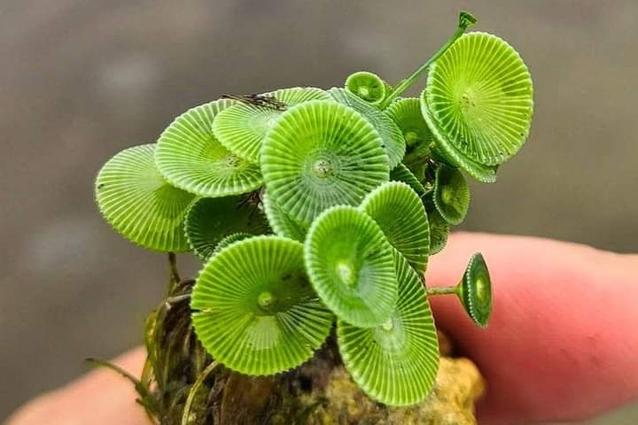

O țâră ruginită, o țâră adormită, o țâră plumbuită, mă adun și mă recompun din toate țârile astea și sper să mă fac întreagă și să mă pornesc, genial ar fi s-o fac bucuroasă, dar măcar să mă pornesc în noua zi, fără scamele pe care le-am lăsat aseară la ușa nopții. Am avut un somn greu și neodihnitor, semn clar că iritarea nu mi-e benefică sub nicio formă. De data asta, Spiky nu m-a slăbit nicio clipă peste noapte, de câte ori m-am mișcat am simțit trupușorul ei cald lipit de mine. Gâgâlicea asta drăcoasă o fi simțit că nu mi-e bine și a intrat rapid în rolul de înger al meu păzitor. Recunosc că mi-au făcut bine trezirile din visele dense, de câte ori am simțit-o și, cu ochii încă închiși, am început s-o mângâi încetișor. Are corpul meu o tandrețe blândă de câte ori întâlnește blănoasa iar ea-mi întoarce, tandru în felul ei, un tors mic și armonios. Așa fac și acum, când mi-e clar că întoarcerea pe tărâmul viselor nu mai este posibilă și-mi iau din mângâierile astea ce am nevoie să-mi domolesc mica țâfnă care mă strânge din ruginirea asta a corpului.

Partenera care-și leagă strâns prietenia cu mine și mă suge de seva asta de viață faină, oboseala, mă însoțește și azi, doar că parcă nu mă mai sugrumă atât de rău parteneriatul ăsta forțat. În căușul ăsta în care mă lasă să respir, mă așez și eu, cu ochii feriți de lumina care se insinuează puternic în cameră, și-mi spun hotărâtă mulțumirile. Le împart cu generozitate Universului iar actul în sine îmi dă și el, tot cu generozitate, liniște. Ce minune pot face câteva minute de mine cu mine, fără zumzet de gânduri-țânțar sau stări vraiște!

Îmi întind puțin mușchii și-mi zboară gândul la cei care sar din pat direct pe salteluța de yoga: cum or putea, frate? Că eu de-abia-mi bag picioarele-n papuci și mă scobor cătinel, de unde atâta spor să trec direct în mișcare? Gândul ăsta mi-l aduce pe următorul și-mi aduc aminte cum visam eu că-n vară, îmi scot salteluța afară, pe terasă și mă destrăbălez la prima oră acolo. Aiurea! La prima oră de-abia-mi târăsc respirațiile după mine, iar seara, nici p-alea, de oboseală. Dar, că întotdeauna mintea mea produce "dar-uri", astea-s toate scuze, de fapt în spate nu e dorința și voința, atât.

Gata, sunt cu Spiky pe traseul spre bucătărie și sper să mă deștept pe clipă ce trece, din ce în ce mai mult. Azi am multe pe listă și vreau să-mi drămuiesc într-un fel și energia și trăirile, să nu-mi mai dau singură la glezne din nou.

Apa alunecă lămâioasă și-mi duce reflexie albastră-n corp, peste tot. Mă bucur că mi-o acceptă corpul și că ochii mei sunt capabili din nou să adune seninul în privire. Poate-mi iese de o zi bună.

***

Aceeași saună și iz mă întâmpină la mama, Sassy e din nou grămadă pe mine, s-a lipit superba asta grasă de mine într-un mod pe care nu l-aș fi crezut, iar mama mă privește cu zâmbet. Par toate bune, pe tărâmul în care e ea acum, că realitatea asta fizică mie îmi strânge nările și un strop și stomacul. În timp ce o întreb cum i-a fost noaptea, deschid să aerisesc și dau din mâini, fie să scurtez eu timpul acolo, fie să eliberez rapid mirosurile și aerul ăsta insuportabil, ca să pot respira și să leg de-o conversație, dacă e loc. Mama e molcomă, nu și vorbăreață, dar pare cu toate acasă. Le omenesc pe amândouă și plec să mă apuc de treburile zilei, pe care trebe să le strecor în toate cotloanele de timp disponibile, nu-mi mai permit azi niciun timp liber, d-apăi magic.

***

Pentru că încă e răcoare afară, mă apuc să-i fac supa de pui cu găluște, pare că-i aproape singura pe care o acceptă. Și eu sunt încă molcomă așa că nu-mi arde de niciun ascultat, de niciun zgomot de fundal.

Mai am stropi de nervi și de frustare prin vene și ei îmi flutură prin gând că din toate lucrurile minunate pe care le pot face cu timpul și cu viața mea, eu fac supă, de pui (!), cu găluște. Nu mai au putere să mă întărâte dar trebe să recunosc, și mie și realității în care mă învârt zilele astea, chiar lunile astea, că aș putea mult mai mult decât atât. Ani la rândul, am evadat constant din viața mea, care mi se părea plicticoasă, fără strălucire și-am mirosit pe la ferestrele altor vieți aromă de mai mișto, mai frumoasă, mai plină, mai aventurieră. Asta mi se pare ironic acum, că am descoperit că și viața mea poate fi la fel, dar am o opreliște majoră în experimentarea acelor aventuri care-mi furau gândurile și dorința: demența mamei. Azi nu vreau să apelez la experiența-surogat, dată de imaginație, mai ales că, fiind perioadă de concedii, aș avea de unde să mă inspir la greu. Gătesc și încerc să-mi transfer atenția afară, în natură, să nu mă mai roadă statul ăsta la cratiță, care nici măcar nu e pasional acum, când gătesc carne. Vreau să aduc verdele de afară în bucătărie, să invit coțofenele din nucul de afară să concerteze înăuntru, în privat doar pentru mine, să mă laud și eu pe ici pe colo că am experiențe. De parcă ar conta pentru cineva. Știu asta, doar zic, dar realitatea este că tânjesc puternic să plec. Atât de tare că-mi scoate instant, în muchie de pleoapă, 2 lacrimi. Lasă, că trece.

***

Domnul meu mă provoacă s-o las pe mama să coboare singură, să vedem dacă simte nevoia sau își mai aduce aminte că dimineața se și mănâncă. Stau cu el la micul lui dejun, deși "stau" e impropriu spus. Fac curat în bucătărie și aștept să coboare coana mare. Deja trece de 10 dimineața iar așteptatul meu se poate prelungi fără număr, ceea ce nu mă coafează pentru că trebe să plec la cumpărături, așa că înțeleg, azi n-a fost în cărți să-și aducă aminte și urc.

***

Clasicii dumicați, la care adaug cu forța și niște lapte bătut, îi însoțesc liniștea în care e băgată mama cu totul. Deși vorbesc cu ea, limbajul corpului ei mi-arată că nici ca zgomot de fundal nu mă percepe. Ca să validez, vorbesc prostii și baliverne care n-au niciun sens și nicio logică, nu sunt legate între ele și oricine mi-ar urmări discursul, s-ar uita cel puțin într-o dungă la mine. Nu, mama nu ridică ochii de la dumicații ei, deci trec cuvintele pe lângă ea la mare artă. Mă opresc și doar aștept să termine. Nu mă pot conecta cu ea în realitatea din bucătărie și, niciuna dintre noi, nu suntem deschise să ne conectăm într-o altă realitate, în care am putea să vorbim cu sufletele. Ea s-a pierdut și nu mai știe cum, iar eu nu-s disponibilă azi.

***

Am plecat la cumpărături dar sunt într-un absenteism din clipă de zile mari. Am atâtea gânduri, mă încearcă ba o tristețe, ba un avânt, ba o compasiune, ba o frustrare, e un amalgam ciudat că nu reușesc să înțeleg nimic din timpul meu. Sunt pe viteză să le adun pe toate în căruciorul ăsta de cumpărături dar simt, aproape carnal, cum îmi sunt împrăștiate gândurile în șapte zări. Azi sunt într-o stare ciudată, nu sunt nici cu antenele întoarse spre interior, nici cu ele spre afară, sunt într-o semi-ceva, parcă nu vreau să mă conectez la nicio lume. M-au impactat puternic zilele trecute, grele, dense și, la un nivel subtil, sunt într-o expectativă, ca melcul, să nu vină ceva, fie dinăuntru, fie dinafară, să mă strepezească sau zdrelească. Pur și simplu, nu vreau să sug din clipă ce-mi aduce ea, decât dacă mi-aduce ceva bun. Resping, dar sunt conștientă că resping prezentul. Asta e, atât e în traista mea azi.

***

Pentru că deja sunt în priză, așez cumpărăturile la locul lor, și cu aceeași platoșă pe mine-suflet, mă duc să fac curățenie la mama. Cred că mintea ei asociază curățenia făcută de mine cu efortul ei, culmea, nu al meu, că iar începe să pufăie de zici că a arat juma' de curte, nu că stă fără să miște un deget. Mă fac că n-o văd și n-o aud, ca să nu iau foc pe la margini și cu cât încerc să fiu mai absentă, fie cu atât pufăie ea mai tare, fie de fapt atenția mea, involuntar, se întoarce pe gesturile ei. Când se mai și apucă să geamă, sunt deja umflată ca balonul. Știu că dacă aș spune ceva pe care egoul ei l-ar molfăi satisfăcut, ar înceta cu șuieratul și cu oftatul dar, dintr-o încăpățânare la care n-am explicație, nu vreau să spun acel ceva. Sunt curioasă care este apogeul egotic al ei, când nu primește ce aproape că mă silește fizic s-o fac. Îmi cârmesc, cu mare greutate, focusul pe baie, deși e ultimul loc pe care m-aș concentra, dar scopul scuză mijloacele acum. Frec mai abitir peste tot, strâng, scutur, gândurile pleacă departe, la apă, la călătorii, la liniște. Reîntoarsă în cameră, constat cu mică plăcere că prietenul ego al mamei n-a putut chema mintea mamei să-i fie parteneră, că mama a uitat că trebe să fie o victimă și e relaxată, cuprinsă cu totul în tabletă. De data asta, a cedat el.

Ca să strălucească totul în cameră, am băgat-o și pe ea la baie, nu înainte de a se împotrivi, în felul ei caracteristic: da' n-am făcut ieri?! Și, la fel de caracteristic, când îi pun dușul pe spate și apa caldă se împrăștie pe toată pielea ei, scoate din toată inima un "ah, ce bine e!". Pentru ăsta din urmă, aproape întotdeauna ignor prima parte. O frec ca pe-un copiluț, o șterg, o usuc și îmbrăcată în haine curate, cu miros de levănțică, e gata pentru prânz. Și e liniștită.

***

Îi aranjez masa unde o las singură, că trebe să bag rufe la spălat, să apuce să se și usuce azi. Nici nu cred că a simțit vreo diferență că e singură, a mâncat regulamentar, s-a ridicat și a plecat.

Numa' bine așa că poate mai apuc și eu să mai scriu câte ceva, că-s în urmă. Chiar de n-am postat, mi-am observat viața, am notat trăiri și gânduri, dar nu e la fel. Îmi lipsește ritualul meu zilnic de a scrie dar nu mai știu cum să le acomodez pe toate în timpul ăsta care mi se scurge printre treburi. Nu știu când am deschis ochii, că în secunda următoare s-a făcut șase seara. Nu e problemă de eficiență, am dobândit în timp o eficiență care mi-a intrat în oase, eu și când fac o deplasare prin casă, gândesc toate acțiunile care s-ar lega de acea deplasare, în ordine cronologică sau a întâlnirii lor pe traseu, și le fac pe toate. Sunt însă din ce în ce mai multe de făcut iar eu stau prost la a pune stop. Zici că fac pe invers, tot îmi aduc pe farfurie, deși simt că nu mai intră. Așteptarea aia din mintea mea, care-mi șoptește continuu de 9 luni, "o să treacă, totul o să revină la "normal"!" mă ține în brațe și mă liniștește. Din când în când, mai trece gândul-bardă care retează onest și brutal această așteptare, dar nu pune nimic în loc, iar nimicul ăsta e dătător de frisoane mentale. Cândva, va fi altfel. Can I skip to that "cândva"?

***

Scrisul ăsta pe frânturi, cu întreruperi, naște în mine un strop de supărare. Tot pe mine, evident deși m-aș dedulci cu mare plăcere să găsesc vinovați acolo, în afara mea. Nu mă setez să stau la scris și atât, eu tot mai dau o fugă să scot și să întind rufe, să pilesc copite, să dau la pisici să mănânce, să mai stau la o vorbă cu domnul meu, să mai strâng ceva, să mai așez ceva la locul lui. Toate, cu Spiky lipită de mine, de zici că mi-a crescut un membru în plus. O simți ea ceva.

***

Azi am vrut să grăbesc ziua. Deși simt că nu reușesc să întind timpul, să-l fac elastic peste cât vreau să fac, azi am vrut să treacă repede. Pe aceeași senzație de repede, destul de obosită, m-am și pus în pat, ca un copiluț grăbit să treacă timpul să primească jucăria promisă. Aproape că-mi ordonam să adorm, dar tot mi-am derulat ziua înapoi, cât s-o simt destul de anostă, ternă, ștearsă. Găsesc, căutate cu lupa prin nemulțumirea mea, recunoștință pentru:

1. Plăcerea mamei la îmbăiere și senzația de bine pe care mi-o dă mie plăcerea ei!
2. Scris, mi-e dor de articularea asta care mi-a devenit prietenă și lupă!
3. Spiky, sufletul ăsta mic care mi-a fost umbră azi toată ziulica!

Frumosul zilei mele:

