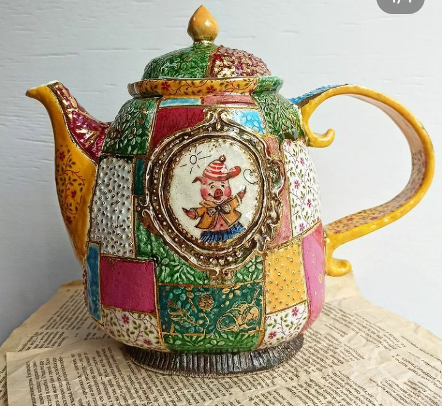

Să nu cumva să mă plictisesc sau, doamne ferește! să mă rutinez, zilele mele au o spoială de culoare pe deasupra mereu diferită. Doar miezul, doar poziționarea și acțiunile mele de robot sunt constante, trăirile mele îmi colorează, luminos sau întunecat, zilele, după cum și eu capabilă.

Dacă ieri eram sictirită, azi am căzut în cazanul cu nepăsare. Oare toată lumea are stări d-astea de la cer la pământ sau doar la mine-n ogradă se întâmplă? Sau, pentru că sunt mai întoarsă cu ochiul vigilent pe mine și pe viața mea, le și surprind, în primul rând, și mai bine, în al doilea rând? Că parcă, atunci când îmi dormeam viața-n papuci de prințesă închipuită, nu alternam atât de brusc și dramatic. Oricare ar fi răspunsul, cu toate fracturile de creier și concepte și percepții și știuturi în care mă-mpiedic acum, parcă tot mai faină mi-e viața acum decât atunci.

***

M-am trezit greu, mai mergeau câteva ore de somn, dar în prea dimineața asta nu mai bat cu toată puterea inimii la poarta viselor să mă primească înapoi, accept că trebe să mă pornesc la noua zi și atât. Punctul ăsta, care-mi închide până și mugurele de vociferare potențial să se deschidă în mine, e și tonalitatea care-mi indică clar starea mea de spirit: nepăsătoare. E ca și cum mintea mea a decis ea, atotputernică, că lasă corpul în vâltoarea vieții de unul singur. Mi l-am azvârlit la groapa cu leii to do-urilor ce așteaptă să mă acapareze iar mintea se uită indiferentă în altă parte. Iar am de-a face cu disocierea mea în mine și al treilea pion din jocul ăsta, sufletul, își trage scaun mai aproape să urmărească interesat episodul de azi.

Chiar de-s apatică azi, n-am atins treapta de sus a nesimțirii, și îmi iau câteva secunde să mulțumesc, cât pot eu, pentru ce am. Și-n timp ce le înșir, aud în mine cum, în paralel, înșir și "dar-urile", cum coțofana asta de minte scormonește după rahat și mi-l aruncă-n gânduri, să mă încurce. Mulțam pentru o nouă zi de posibilități DAR poate mă lași și pe mine să mai respir aer proaspăt, de viață liberă azi. Mulțam pentru sănătate DAR tare bine mi-ar prinde mai multă odihnă. Mulțam pentru oamenii de aproape DAR tare îmi doresc să mai ies să mă întâlnesc și cu alții. Și tot așa. Ok, pe lângă că mă trece o nepăsare, mă traversează, de fapt mă calcă în picioare de-a dreptul, și o nemulțumire. După ce am reușit să decelez stările, am avut o extraordinară claritate mentală și am putut să țin deoparte nemulțumirea până mi-am terminat ritualul de recunoștințe. Apoi am dat drumul puhoiului de dar-uri să se verse cu spume în timp ce îmi întind un strop corpul, să-i dau un preaviz că urmează să mă arunc în acțiune, fie că vrea, fie că nu vrea.

O amețeală bruscă m-a așezat înapoi pe marginea patului, că nu vedeam decât negru și mii de steluțe albe. Știa Spiky ce știa de nu s-a sinchisit să se arunce obuzieră pe parchet când m-am ridicat inițial. Acum stă lângă mine iar eu aștept să mă limpezesc să mai bag o fisă la ridicarea pe verticală. A doua e cu noroc, îmi validează asta și Spiky care deja e la scări, mă așteaptă să coborâm împreună. Trebe să recunosc că e plăcut să fii iubită.

***

Contrar așteptărilor ei, mă hotărăsc brusc să cotesc și nu mai cobor, ci vreau să intru la mama. E trează și vreau să "scap" de vizita asta cât mai repede, ca să pot să am ora mea liberă plină doar de mine și de chestii care-mi fac mie plăcere, fără stresul și ochii pe camera de supraveghere.

Sassy m-a simțit și cum am deschis ușa, cum s-a strecurat printre picioarele mele, fix cât să dea nas în nas cu Spiky. S-au mai întâlnit, primele dăți s-au strofocat una la alta, de ceva timp se miros pe botic și Sassy se întoarce și pleacă, nu vor să se împrietenească deloc. Și azi face la fel, așa că intrăm relativ repede amândouă în camera lor. Mama stă în pat, cu ochii fixați pe tv, și-mi răspunde absentă la întrebarea "Cum ai dormit, domniță?". Binele sec mă convinge că nu e loc de-o conversație și e cum nu se poate mai bine. Nu aveam nici eu mare chef de bârfă la prima oră, doar venisem să bifez, asta și fac și în puțin timp ies de la ele să-mi culeg pisica proprie care mă așteaptă loială la ușă, să coborâm în treaba și legea noastră. Am o oră doar pentru mine!

***

Apa parcă mi-a simțit dornicia de a sta cu mine pentru mine și mi-a alunecat repede și lin, cred că mi-a fost și tare sete, că iar m-am grăbit s-o zvârl prin cotloanele corpului, să mă expandeze și răcorească o țâră prin înăuntru. Am salutat în viteză un albastru și țuști în living, postată în colțar, într-o lăfăială.

Nepăsarea mea e dată la o parte de pofta cu care vreau să mă înfrupt plin din ora asta, ca înecatul de aer.

Nu-mi arde de călătorii false și virtuale, scrollez un strop pe olx pe la salvările cu lemn masiv, nu dau de nimic interesant, mă mai uit puțin și pe instagram, dar și azi servesc la micul dejun de frumusețe tot design interior. Sunt o avidă consumatoare și observ cum aprofundez și încep să văd nuanțele fine și tușele de accent. Acum o mie de ani, cred că mi s-a lipit mie, de fapt cred c-am cimentat credința că dacă e frumos și-ți place ce e în jurul tău, la nivel de materie, lucruri frumoase se vor întâmpla în viața ta, și la nivel imaterial. Până la un moment dat, mi-a ieșit asta cu brio, de vreo 9 luni e cu sincope dar credința nu s-a dezcimentat, e tot acolo și tot mă îndeamnă să fac frumos în jurul meu. Iar dacă asta-mi crește suflet fain, what the heck, de ce nu?

Îmi dau seama că simt nevoia să-mi justific fascinația către design și decorare și asta e o prostie. La fel de mare ca și sentimentul care mă trece că "țata arde și baba se piaptănă", că-s multe alte lucruri importante în viața asta, mult mai importante decât un design sau un decor, iar eu vai ce dată pe spate sunt de-un lemn masiv sau un bronz dore reușit. Îmi promit mie că o să corectez tendința asta, de câte ori o s-o mai prind că-mi strică bucuria. Dacă unul e fericit să orneze rahați cu zmeură și asta-l face fericit, îl duce-n nirvana, de ce trebe să aibă sens pentru altul?! Nu trebe!

***

Ou fiert, puțină brânză degresată, ardei roșu și măsline, plus pâine cu semințe plus lapte bătut, dacă vrea, o așteaptă pe mama la micul dejun. Deși am tot tentat-o cu fructe la prima oră, nu reușesc s-o conving, ea știe că la mic dejun se mănâncă ceva cu pâine. Smoothie? Nu! E vehementă de zici că-i dau otravă așa că îi pun pe masă "mâncare", în fiecare zi altceva, numa' să mănânce.

Intră cu mersul ăla de gheișă, mic și scurt și sacadat și pune întrebarea clasică a micului ei dejun: unde e pisica? Câteodată îi știe numele, de multe ori nu, câteodată îi știe sexul, de multe ori nu. Azi a fost din ciclul "de multe ori nu" dar o ajut și îi spun la fel, cam în fiecare zi când întreabă: e pe-afară, zănatica umblă! Pot să repet, cuvânt cu cuvânt, toată conversația pe care urmează să o avem pentru că este aproape identică de fiecare dată. Dar dacă asta o face să deschidă gura și să fie prezentă în bucătărie, închid și eu senzorii aia care își doresc o excitație mentală, o convorbire cu nuanțe, sau una spumoasă, sau una care să-mi dea de gândit teme pentru mai târziu, și play dumb. Asta avem, cu asta defilăm.

A mâncat tot și a plecat mestecând în continuare. Eu rămân să strâng și strig în urma ei că urc în câteva minute. Trebe să-i dau, ca în fiecare dimineață, medicamentele și s-o ung cu crema de zi pe unghii. Răsuflu ușurată că am bifat și interacțiunea asta.

***

Cu ochii încă de pugilist, domnul meu își ia micul dejun, asistat de mine care vreau să-i aflu calendarul zilei. Am de făcut curățenie în toată casa, din nou și datul cu aspiratorul e total dependent de call-urile pe care le are el. M-am updatat cu agenda zilei, se mulează pe planul meu, mai facem două glume și gata și cu timpul petrecut alături de el.

Nu știu ce am făcut, cum m-am învârtit de am ciupit din timpul meu magic sau liber și l-am îngrășat p-ăla alocat treburilor, dar azi am simțit fizic că eu nu m-am săturat cu timpul ăsta mic petrecut alături de omul drag inimii. Nu mai apuc să-i spun cum mi-e inima, aflu schițat cum e a lui, iar seara când se reîntâlnim, suntem frânți amândoi. Poate acum, că vine toamna, iarna și se termină treburile pe afară, o să avem mai mult timp al nostru, pentru noi.

Cu o senzație de tristețe cauzată de ne-ajunsul timpului trăit cu Mr. H, am luat în piept praful și băile și spălatul pe jos și camera mamei.

***

Dacă în restul casei mă mișc relativ repede, la mama parcă nu am spor, deși e doar o singură cameră. Lasă Sassy păr peste tot iar eu sunt atentă să-l curăț cu peria de pe covoare și scaune, să scutur tot, să schimb întruna lenjerii, să spăl, să dezinfectez în baie și când ies de la ele, sunt deja epuizată. Sau "epulizată" cum zicea copila mea scumpă când era mică. Avea draga de ea două vorbe care mi-au rămas și-o să-mi rămână până la final în minte: epulizată și golușă. Atât de candidă le zicea, că mă topeam de dragul ei. Cred că și acum dacă le-ar zice, tot m-aș topi de dragul ei.

***

Nu știu de la ce mi-a venit, dar m-am trezit, în timp ce dădeam din mâini, neprididind să termin o dată, că îmi listez, pe căprării, ce-mi place și ce nu-mi place. Brutal și onest, fără niciun filtru și fără nicio judecată, cum mi-au venit, în ordine aleatorie, fără preferințe și topuri.

Îmi place frumosul în tot și în concret, în oameni, în interioare de case, în porțelanuri, în candelabre, în lemn masiv, în țesături, în artă, în plante, îmi place culoarea verde, în toate nuanțele ei, auriul și albul, îmi plac razele de soare care se strecoară prin crăpături, îmi plac castelele și limba franceză, îmi place pădurea și muntele, îmi place pâinea proaspătă și crocantă, îmi plac fructele și salatele, îmi plac oamenii autentici, curați, deschiși să-și împărtășească sufletul și deschiși să primească perspective noi, îmi place să citesc, cu o cană mare de ceai de la TeaHug în după amiezile ploioase, îmi place să fiu invitată în oraș la o discuție incintantă, îmi plac mic dejunurile bogate în opțiuni vegane de câte ori plecăm în concediu, îmi place să fiu servită, ador masajul, îmi plac mirosurile tari și misterioase, îmi plac combinațiile sucite, neașteptate în orice, îmi place să experimentez lucruri noi dar îmi place și familiarul, îmi plac focul în șemineu și vinul fiert iarna, îmi place marea, îmi place zacusca de vinete, îmi place să creez cu mâinile mele, iubesc toate ființele, mai puțin țânțarii, ador smoothieul, dușul călâi, sunetele naturii, împământarea.

Nu-mi place privarea de libertate, de orice fel, de la cea fizică la cea de exprimare și acțiune, nu-mi plac intruziunile în viața mea atunci când dau semne că nu sunt dispusă să mă deschid, nu-mi place abureala și manipularea, nu-mi place nimic care "trebe", nu-mi place frigul, nu-mi place răutatea, mă doare lipsa de empatie, aș vrea ca nimeni să nu se simtă singur, nu-mi place cum zboară timpul, nu-mi place când nu înțeleg ceva, cearta, jignirea, nu pot să suport să văd pe cineva plângând, nu-mi place când mi-e frică de ceva, falsitatea și prefăcătoria, lipsa de feedback, drama.

M-am oprit din enumerări s-o bag pe coana mare la duș, care mă privește contrariată, că doar "aseară" a făcut duș. Trec peste asta cu nepăsarea ce mi s-a așezat pe zi și pregătesc apa, în câteva minute o să aud binecunoscutul "ah, ce bine e!" și apa o să înmoaie toată încăpățânarea ei. Am observat că reacționează la fermitate, dacă o întreb și îi las o paletă de opțiuni, se fofilează, dacă spun direct și scurt și acționez la fel, n-are încotro și se mulează. Am lăsat-o cu comentariile și am dat drumul la apă iar ăsta a fost semnul că nu e cu vrut, e cu făcut.

***

Curățenia e pe jumătate făcută dar trebe să intercalez pregătirea prânzului.

Mi-aduc aminte de căprăriile mele cu ce-mi place și ce nu și nu știu în care să încadrez gătitul. Trec peste asta și mă surprind că iar dau în fiert, iar mi-am imprimat o grabă, iar vreau să le fac cât mai repede ca să bifez cât mai multe de pe lista pe care mi-am încărcat-o, cu dedicație. Nu știu dacă e o scuză sau e realitatea pură, de care mă lovesc tot eu în această perioadă, dar știu că dacă amân să fac un lucru, el se adaugă la lista de mâine și tot așa, rostogolirea asta ajunge să mă strivească în anumite zile. Așa s-a întâmplat cu postările, am pierdut șirul câtorva și trag ca disperata să revin la postarea zilnică, pentru că așa mi-am promis și pentru că așa mă îmbogățește pe mine. Poate, într-o zi, o să am un moment de revelație uluitoare care mă va învăța cum să jonglez cu toate câte sunt de făcut astfel încât să-mi iasă dublu cu juma' de efort. Universule, luminează-mă! Pronto, dacă se poate.

***

Fără incidente și fără mari trăiri, cele două prânzuri s-au succedat separat, că azi nu mă țin baierile să fac în paralel două conversații, câte una pentru fiecare interlocutor, să aud și ce zice Mr. H dar și ce zice mama, care vorbește peste domnul meu și să le răspund coerent amândurora. N-am chef, prefer să pun de două ori masa și să strâng de două ori după, decât să avem un prânz în trei. Altădată, când oi fi mai "proaspătă" și mai tolerantă.

***

La parter curățenia merge mult mai repede, poate și pentru că suntem doar noi doi și-o pisică, ce nu-și face nevoile în casă deloc. Plus că la parter, în timp ce trebăluiesc, îmi mai vin idei, mai schimb ceva, mai mut ceva, e un work in progress care chiar îmi face plăcere.

La bucătărie mă opresc o țâră mai mult să-mi scot la clătit semințele de roșii și să le pun la uscat.

Asta e ultima etapă și pot să spun că am închis întreg ciclu: am pornit de la câteva semincioare cumpărate de pe internet sau primite de la EcoRuralis, le-am făcut răsad, le-am bibilit luni întregi până le-am pus afară, unde le-am bibilit alte luni până au rodit, acum mă bucur de fructe zemoase și bune-bune din care am luat, spre păstrare pentru recolte viitoare, semințe. A fost un experiment mișto, din care am învățat multe și care mi-a validat două credințe: se poate bio și orice e greu și de speriat până te apuci efectiv de făcut acel lucru greu și de speriat.

Gradația la rezervorul meu de energie scade direct proporțional cu plecatul mărețului galben la culcare dar eu mă încăpățânez să termin curățenia și în garaj. Aici e atelierul meu, aici am petrecut atât de multe ore de miraj, în care am uitat de mine și de toate și mi-au ieșit din mâini lucrurile fie cum le-am dorit, fie mai bine. Am avut și eșecuri din care am învățat dar și eșecuri care au devenit lucrări preferate tocmai pentru că-s o țâră mai altfel. Mâna a fost condusă, în procesul facerii acestor "eșecuri" de ceva mai subtil decât mintea, de ceva ce nu ține cont de simetrie, de "așa trebe că așa se poartă", de asocieri banale sau deja bătătorite. Am îmbibat pereții garajului cu multă stare de bine plus videourile lui Sadhguru și el mi le întoarce de fiecare dată când intru și stau nițel mai mult. Anul ăsta mai deloc și nici nu cred că mai apuc vremea frumoasă să mai fac. Nu știu de ce dar nu mi-am zis "Lasă, faci tu cândva!" ci mi-a venit în carne întrebarea "Ce garanție am că o să mai am timp?" M-am înfiorat.

***

Ultimul popas înaintea dușului este la picioarele mamei, să mai râcâi un strop. Am o tenacitate și o perseverență în ceea ce-i privește pe alții extraordinară și de-a dreptul ordinară în ceea ce mă privește pe mine. Nu aș depune același efort pentru mine, decât dacă mă rog eu mult. Mi-e mult mai ușor s-o fac pentru alții și mai greu, spre deloc, pentru mine. O explicație ar fi că mă mângâie pe glandă și pe ego să fac pentru alții și să fiu recompensată prin feedback, infinit mai mult decât mi-aș mulțumi eu mie. Iar asta mi-arată, dacă mai era cazul, cât de puțin mă iubesc pe mine și cât de mult mă împrăștii pentru alții.

***

Gata, s-a terminat ziua! Sau, mai bine zis, am terminat-o eu! Atâta am înțesat-o cu de toate, toate de făcut, că nu mai pot să mă bucur de-un timp liber că-s lată de obosită. Fac 2 în 1, bag la duș și recunoștința mea pentru:

1. Claritate mentală și decelare la rece!
2. Experimentul reușit "roșia"!
3. Vibe-ul fain din garajul meu atelier!

Frumosul zilei mele:

