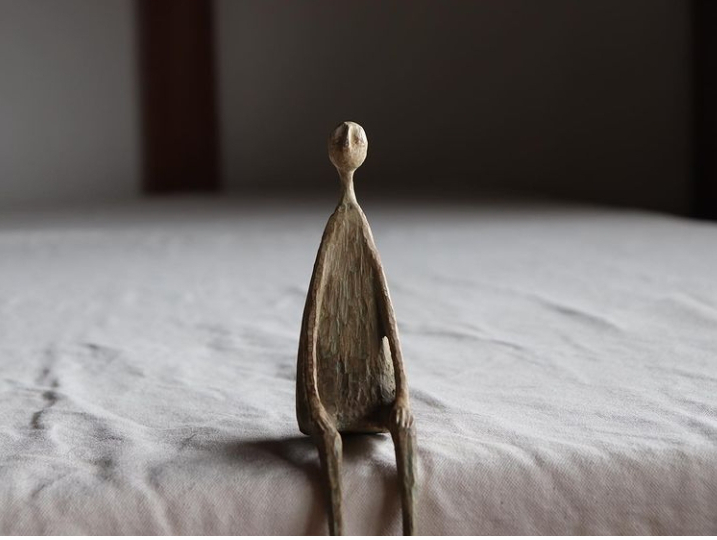

Dacă există un cuvânt care să cuprindă și brusc și lin în el, atunci el definește cel mai bine trezirea mea în astă dimineață limpede de duminică. M-am trezit dintr-odată, cu ochii în tavan pe ceasul care arată necruțător trecerea inefabilă a timpului și, totuși, nimic nu mi-a zdruncinat prea dimineața. Poate pentru că e duminică, zi în care alții dorm și lenevesc la ore la care eu dau deja din mâini și râșnesc cu spor la mansarda creierului. Poate pentru că de fapt e liniște acolo, în afara mea, peste tot, doar eu mă acidulez în spumele minții, în analizele astea de despicat firul în patru, timp în care-mi fuge timpul și viața pe lângă firele despicate. Oricum ar fi, din brusco-linul ăsta fain iau doar partea domoală, pe care mi-o pun salbă la altarul din mine unde mă aștern la depănat mulțumiri. Nu-s cu focusul 100% în moment, îmi mai zboară mintea în mici vise, croșetate ad-hoc, dar mă leg de ultimul ecou de mulțumire și mă aduc înapoi, să termin curat ritualul pe care mi-l propun în fiecare prea dimineață, iar azi mi-a ieșit. Căptușită cu căldura asta mișto a interiorului meu, cu știutul ăsta că, no matter what, eu sunt mai mult decât carcasa asta de carne și că I got my back anyway, mă orânduiesc către o nouă zi în viața mea, cu multă indiferență că e sau nu e duminică. E o nouă zi și atât.

***

Apa mă ajută, și fizic dar și mental, să dau drumul la computerul ăsta minunat ce mi-e corp și partener de experiențe, probabil că cele 4 intenții, pe care i le pun în cârcă și cu care ea defilează prin interiorul meu, încep să producă ceva vindecări, cert este că am din ce în ce mai rar dureri, față de cum eram în anii trecuți. Deși sunt la piciorul broaștei atât cu atenția cât și cu intenția de a-mi hrăni corpul numai cu hrană vie dar și de a nu-mi mai bombarda sufletul cu tânguieli și plângeri și suferințe inutile, cred că micul pas de a fi vegană, mă ajută pe ici pe colo. Iar practica asta a mea cu mine, ochelarii ăștia cu o mie de dioptrii pe care mi i-am pus pe acțiuni și pe gânduri și pe emoții și pe cuvintele cu care-mi împrăștii interiorul spre exterior, devine din ce în ce mai acaparatoare. Acu' sunt pe val, acum sunt sub val, privitul ăsta al meu de la o oareșce distanță chiar e demențial, mai ales atunci când sunt pe val. Când mă dă viața cu capul pe la fundul mării, când e totul tulbure de la nisipurile gândurilor de victimizare, nu-mi iese privitul dar reușesc, în majoritatea dăților, să privesc retrospectiv la modul aiurea în care am reacționat și să-mi trag lecția de acolo. Că o aplic mai târziu sau iar iau guri de apă tulbure la greu, e partea a doua, nu pot nici eu să le integrez pe toate așa repede, le fac pe rând, dar măcar m-am prins că primul pas este să iau notă pe bune, cu ochii larg și onest deschiși. Șansa mea de vindecare este prin a începe să nu mă mai mint singură.

***

Cu cerul albastru aproape alb deasupra și cu verdele genial la picioare, ies în curte. Nu vreau smoothie fix acum, nu vreau mama, nu vreau Sassy, nu vreau Spiky. Vreau un strop de solitudine, mărginită la capetele susului și josului de un albastru calm și-un verde vibrant, vreau să mă poziționez în mixul lor și să-mi încarc venele și mușchii decizionali cu un amestec la fel de neașteptat ca brusco-linul trezirii. Vreau să-mi fiu în zi alertă și atentă dar și cumpănitoare, blândă, tolerantă. Vreau să fac dar și să fiu, în același timp dacă se poate, ca să nu mai am senzația asta de fugă a timpului. Vreau cât mai mult timp pentru mine și sufletul meu. S-o numi egoism, s-o numi grijă, s-o numi viață a mea, nu știu și nici nu mă interesează, știu că vreau mai mult doar pentru mine, ca să mă pot umple și da p-afară pentru alții.

***

Mama devine pe zi ce trece mai placidă, mai palidă, mai plecată, mai tăcută. Chiar dacă diminețile, în genere, nu simt o mare bucurie să stau la conversații cu ea, încerc măcar minimal s-o fac să socializeze, măcar cu mine. Sunt dimineți când se prinde-n horă, sunt dimineți, multe, când nici nu-mi aude invitația la vorbă. Sau dacă o aude, mă ignoră, că probabil acolo în ea nu-s cuvinte, ea nu știe să le mai fabrice și n-are ce să dea în afară. Mă conversez cu Sassy, care e din ce în ce mai vocală, cum mă vede începe să-mi povestească în pisiceasca ei, eu o aprob și avem un dialog întreg în timpul în care fac curat la ele. Iar dialogul ăsta și drăgălășenia lui, sper eu să umple spațiul camerei și să-i imprime mamei, după plecarea mea, o mai mare prezență și, de ce nu, să-i mărească vocabularul. Din nou a renunțat la rebus și se joacă obsesiv pe tabletă iar asta se resimte în sărăcia care-i spulberă cuvintele.

***

Timpul meu liber, oleacă strâmtorat de puținătatea mamei, se scurge în doi timpi și trei mișcări, prin scrollări pe social media, olx sau leboncoin.

De fiecare dată când intru pe leboncoin, variantă franțuză a olx-ului, observ ce diferență este între cele două popoare, cum prețăluiesc unii vechiturile și cum dau tunuri alții. Nu încetez să mă minunez de obrăznicia românului, care aduce produse "de afară" și le vinde în țara asta a tuturor posibilităților la prețuri enorme. Știu că fiecare e liber să facă ce vrea, dar de câte ori văd discrepanța frapantă de bun simț, am impresia că samsarii de mobilă veche de la noi sunt ca țânțarii disperați de foame și caniculă: când prind o bucățică de carne, se înfig și sug ca disperații, că nu se știe când mai apucă o alta. Dar, vorba aia, prost nu-i ăla care cere, ci ăla care dă. Eu zic că-i loc de mult bun simț dar fiecare își știe dedesubturile.

***

Pentru că domnul meu e încă adormit, nu vreau să-l bruschez cu cuvintele năvală, așa că-l las să se desfacă singur și încetișor din brațele somnului, în ritmul lui și-n al cerealelor pe care le are la micul dejun. Eu profit de asta și-mi fac mica listuță de cumpărături, de la Lidl și Mega din zonă și-mi creionez ziua. Nu știu cum se face că, deși îmi iau timp și liniște să-mi desenez în linii mari, directoare, traseul zilei, se întâmplă câte ceva sau mai multe ceva-uri și deraiază grosolan de la ce i-am pregătit eu. Cu toate astea, eu fac cu conștiinciozitate aceeași schițare a zilei în fiecare dimineață, poate rigurozitatea mea va da roade într-o zi. Nu zic să nu există schimbări și surprize în zi că ar fi chiar boring să nu, ci doar să nu mai fie așa un roller coaster.

***

Îi spun mamei că mă duc o fugă la Lidl și vrea și ea "ceva bun". O întreb ce înseamnă pentru ea ceva bun deși credeam că știu deja răspunsul. Nope, nu e ceva dulce, și-a notat ea sus pe ceva dar nu mai știe acum ce, când o duc sus la cremuială și la pastile, o să caute ce a scris și-mi spune. Ăsta a fost tot dialogul nostru, după ce probabil s-a simțit stânjenită că nu-și aduce aminte, mama a închis orice legătură și comunicare cu mine, ochii ei țintind insistent dumicații aliniați.

La un nivel subtil, începe să mă inunde o tristețe. Poate e a mamei, aia pe care ea nu mai e capabilă s-o articuleze și, și dacă ar fi, sigur n-ar spune-o cu voce tare, de rușine și de teama de a fi judecată. De multe ori mă gândesc că dacă aș forța-o, dacă aș sparge bășicile alea pline de puroiul rușinii, fricii, neiertării, neputinței, poate aș curăța toate tâmpeniile care-i tranzitează câmpul mamei și care-i acoperă discernământul. Dacă aș putea s-o fac să vadă că nu mai contează acum și că n-a contat niciodată de fapt, modul cum te privesc alții și dacă aș putea-o face să se iubească așa speriată, rușinată, poate aș reuși să ajung la seva ei și să fac o diferență. Dar mama refuză și m-a închis pe dinafară…

***

Reușesc să îngrămădesc toate cumpărăturile doar la Lidl și asta mă bucură pentru că am intrat iarăși în vrie, vreau să termin cu toate ca să mă pot întoarce la scris.

În fuga asta a mea, totuși cu o geană și pe viața mea, nu știu cum mi-au căzut ochii pe o reclamă cu o terasă. Și brusc, mi s-a pus un nod în gât și o rouă pe ochi instant: giiiz, ce-mi lipsește o socializare! Uite că corpul meu recunoaște mult mai rapid decât o face mintea, că doar suntem animale sociale. Da, mi-ar plăcea mult să ies la o cafea sau un cico sau la o vorbă la o terasă. Dar, că nu putea să lipsească dar-ul scuză din peisaj, nu am timp sau nu am cu cine. Și acuș trece și vara și trece și vremea teraselor iar eu rămân cu pofta-n cui. Cică mintea e un mușchi, ca și percepția, pe care pot să-l antrenez să perceapă altceva. Cum ar fi să-mi îndoi mintea și s-o fac să creadă că sunt liberă, că pot face orice vreau dar că am alte alegeri acum? Forțând percepția, nu cumva mă înnebunesc singură, nemaivăzând realitatea care e în fața mea, nedistorsionată? Ce diferență ar fi între mine și mama, obsesia mea din zilele astea, frica mea ca nu cumva, cândva, mintea mea s-o ia dramatic pe arătură? Doar voința? Și dacă la un moment dat intru pe făgașul obișnuinței și nu mai văd deloc realitatea mea concretă ci doar aia forțată, că-mi intră-n carne noul joc? Fir-ar să fie, iar mi s-a dus mintea în analize tâmpite, iar m-am trezit că nu mai văd nimic în jur, iar nu știu cum sunt deja pe drum spre casă și nu-mi aduc aminte când am încărcat mașina și am plecat de la Lidl. Numa' bine că mă readuc în prezent că-mi dau seama ce-am uitat: mama își notase pe un colț de hârtie igienică că vrea Lays Chocapic, ceea ce evident nu există. Cred că reclama la Lays a fost imediat urmată de cea la cerealele Chocapic și ea nu a mai făcut separarea. De fapt vrea chipsuri, că așa mânca ea la ea acasă și îi e dor. Nu pot s-o refuz, că e rar când îmi spune ea ce vrea dar uite că, cu gândul la tâmpenii, cât p-aci să nu-i iau. Fac stânga-mprejur și mă întorc din drum, încercând să nu mă muștruluiesc prea mult nici pe mine. Până la urmă fac și eu tot ce pot, mintea mea încearcă să facă sens din ceva ce nu face sens, cum e demența, și-mi dă la ronțăit tot felul de scenarii, care mai de care mai abracadabriste. Am ajuns la mega cu un mic zâmbet, m-am iertat și pe mine, m-am împăcat și cu faptul că nu ies la terasă și am ales să mă bucur că-i fac mamei o bucurie cu un Lays în loc s-o judec și să mă judec.

***

Că m-oi fi sensibilizat eu la ficat sau chiar e din cale afară de evident, am senzația că la mama în cameră mereu miroase urât. Și din ce frec mai cu râvnă, din ce miroase mai tare. E drept că să stai și cu pisica într-o cameră și-o baie, nu e chiar normal să miroasă a trandafiri, dar la ele e un amestec destul de greu de dus. Mama îmi dă înapoi pilota de o persoană pe care i-am dat-o când a refuzat-o pe cea de două persoane pe care o avea și vreau s-o bag la spălat, că am și eu obsesiile mele. La programul cel mai lung, la gradele cele mai multe, să fie. Off, cred eu că pe undeva jena asta pe care o am când iau lucruri de la ea și simt nevoia să le dezinfectez, mi s-a infiltrat parșiv și în minte că-mi vine și acolo să mă dezinfectez după contactele cu ea, de parcă demența s-ar lua la un mic dejun sau prânz. Oricât de mult încerc să nu mă oripilez, adevărul este că nu mă pot acomoda cu mizeriile, cu izurile și nu le pot accepta sub nicio formă, fără să simt nevoia să mă spăl de o mie de ori după. Deși au trecut 9 luni, nu m-am imunizat la asta, cel mult mi s-a ascuțit mirosul, cu tentă de sabot dat la ficat.

***

Cu prânzurile succedate, al mamei mai întâi și apoi al nostru, și șmotrul aferent după fiecare din ele, mă întorc la schița zilei și mă aliniez cu drag sarcinii după-amiezii: scrisul.

Deși amân scrisul și dau prioritate oricărui alt task, considerat mai important, de câte ori mă așez să aștern pe laptop zilele mele, simt cum îmi cresc aripi în interior, și cum nu m-aș mai opri, și cum mă mufez la conducta aia prin care-mi sunt servite cuvintele, frazele, construcțiile. Câteodată vin cu așa abundență că nu prididesc să le scriu pe toate, alteori rămân minute bune pierdută în retrăirea momentului care m-a impactat în ziua ce-a trecut atât de tare că mi-am notat doar un cuvânt descriptiv, ca să știu de unde încep să-l deșir. Dar ce mi se pare mereu și mereu tare mișto este că la fiecare retrăire și scriere de stare parcă îmi iau valențe noi din moment, parcă mă așez pe alt scaun și privesc din alt punct situația. Iar asta mă îmbogățește fantastic, pentru că nu e înțelegere mentală, e o desfășurare care se așează în inimă ca strat din care să-mi iau, la un moment potrivit din viitor, o lecție sau o aducere aminte.

***

Pauza de rașchetat de final de unghii se continuă cu pauza de privit lung un apus.

De obicei, că așa-i mintea asta obișnuită, la un apus te apuci să elogiezi culorile, să croșetezi momentul și să-l împănezi cu visări. Eu, în seara asta, nu din ridigitate și nici din fuștereală, pur și simplu doar am trăit un apus, din priviri. Nu mi-am zis nici că-i superb de portocaliu, nici că se coboară în tușe grena-movalii, ci doar am privit clipe întregi cu o netezime de copil în creier iar asta mi s-a părut de-a dreptul reconfortant. O, de-aș putea să-mi privesc toate clipele așa, as they are, fără analize și permutări și combinații, cred că ar fi o feerie. Dar oare ar mai fi la fel de fabulos, oare trecerea asta mediană prin viață, fără susuri briliante sau josuri apocaliptice, n-ar fi o țâră cam boring? Nu știu dacă asta-i o observația sau vine din mentalitatea mea de vulpe la struguri "acri".

***

Închid o zi ok-ish, care nici nu m-a istovit, dar nici nu m-a exaltat, cu ceva mulțumire pentru:

1. Început lin de zi!

2. Bucuria de a bucura!

3. Liniștea și odihna dintr-un privit de apus fără gânduri!

Clipa mea de fain sculptat este:

