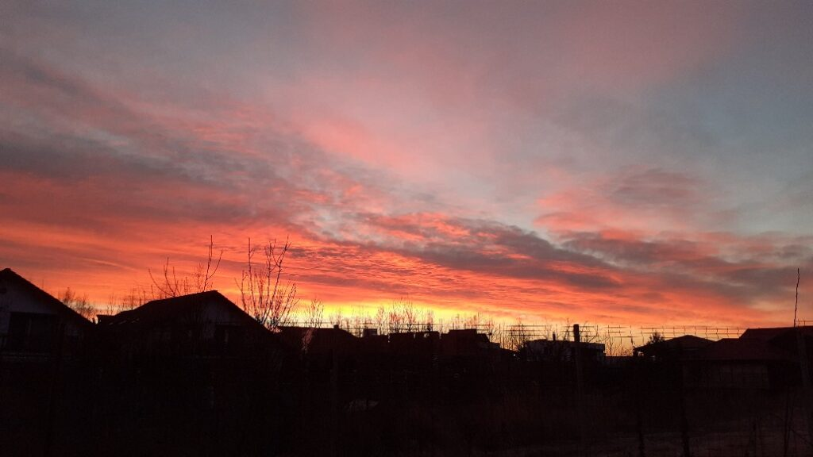

5 și un pic. Pleoape de plumb dar, neașteptat, inima mai ușoară. Am închis din nou ochii să-mi permit o ușoară alunecare în zi, să-mi cuprind corpul pe de-antregul, în toate colțurile lui, să-mi trimit întrebările în eterul magic capabil să transforme gând în materie. Am insistat asupra întrebării: "ce spațiu, energie, conștiință pot fi eu și corpul meu azi ca să accept ce vine în calea mea azi și să o transform în bucurie de viață?" Simt că asta e ce-mi lipsește: bucuria de viață.

***

Până atunci însă, luatul în piept și nări al mirosului de la mama din cameră numa' bucurie nu e, dar mă mișc rapid să curăț, să spăl și să aerisesc. Nu e nici azi în apele ei… Pentru infecția urinară îi dau seara Monural și, din cauza lui, urinează foarte des motiv pentru care nu se odihnește. Mai e doar o seară și gata. Vedem după cum va fi.

Las aer proaspăt și curat în urma mea și probabil și o strângere mică de inimă când o văd așa căzută. Mama a fost, toată viața ei știută de mine, o ființă veselă, plină de poante și bancuri. Acum parcă s-a frânt ceva în ea…

***

Pe cât de mai puțin bună e ziua ei, pe atât de bine mă simt eu. Observ la mine o împăcare. E plăpândă, ca un licăr de lumânare abia pornită și sper să nu se stingă. Dacă pot s-o cresc, să-mi acapareze prezentul, aș putea fi salvată.

Îmi beau smoothieul cu ochii pe cer: răsăritul de azi e o simfonie! Nu am cuvinte potrivite așa că las o poză.

Cu miracolul ăsta în suflet, simt nevoia să încep. Să mă scutur puțin de starea asta de suspendare și să fac. Planuri. Vise. Orice, dar să fac. Vreau să încep oil pulling dimineața, pentru sănătatea cavității bucale. Vreau yoga. Să reîncep bricolatul și vopsitul și creatul. Meditația zilnică. Azi îmi pun pe hârtie și apoi văd când și cum le strecor.

Până acum am implementat cu succes (adică am depășit pragul celor 66 de zile de a forma un obicei) 500 ml apă caldă pe stomacul gol și smoothieul de fructe. Afinele, pe lângă altele, sunt nelipsite zilnic. Alea de pădure sunt cele mai bune pentru creieraș.

De 4 zile las între smoothie și următoarea masă cel puțin 5 ore. Iar următoarea masă e o salată mare cu legume crude, o minunăție, curcubeu pe cerul gurii. Aș vrea să merg mai departe așa și cu timpul să cuceresc și restul zilei cu hrană bună. Acum încă mănânc mâncare gătită iar seara, când sunt obosită sau tristă sau înfrântă simt nevoia și nu mă stăpânesc să ronțăi floricele, cronțonele sau un sendviș. Plus că încă mănânc dulce în fiecare zi. O iau treptat pentru că dacă mă avânt să le fac pe toate o dată, mă înec ca țiganul la mal.

***

E clar, dimineața e timpul meu cel mai mișto și care-mi folosește cel mai mult. E timpul în care accesez cel mai ușor claritatea mentală, în care procesez cel mai ușor informația și îmi culeg cel mai rapid conștientizările.

***

De ceva timp, mă bâzâia o întrebare iar azi mi-a venit și răspunsul.

Una din prietenele mele a dispărut din peisaj. În afară de un "ce faci, totul bine?", nimic, liniște totală. Iar eu nu puteam pricepe de ce. Până azi. Când mi-am adus aminte cum eu am făcut fix la fel cu cineva. M-am oprit din a interacționa cu femeia care-mi împărtășea viața ei pentru că exprima și articula doar dramele din viața ei iar eu nu mai puteam să duc atâta negativitate la acel moment. Ha! Uite că trăiesc și eu reversul monedei, să înțeleg și să simt și eu nedumerirea și durerea și frustrare și supărarea și însingurarea pe care le-o fi simțit prietena mea când brusc am încetat să fiu acolo. Tare, nu? Sunt mici diferențe de situație și de nuanță însă grosier așa a fost.

***

Parcă s-a mai crăpat din coaja asta ce mi-am pus-o așteptând ca cei din jurul meu să facă scut între mine și drama mea. Azi simt că m-aș înveli cu grija oamenilor ce știu să fie lângă mine, care nu au fugit speriați de uraganul demenței.

Simt o briză de primăvară în suflet, ce-mi mângâie visările. Mi-am adus aminte de zâmbet și l-am folosit. Ce bine se simte!

***

Mamei nu îi e foame. La micul dejun a mâncat binișor. Atunci m-am prins că azi mintea ei în alte părți. Am întrebat-o cât ștrudel să îi dau și mi-a zis că 4 bucăți. Ceea ce e tare mult. Nici domnul meu, mare amator de dulce, nu mănâncă 4 bucăți deodată! Iar la prânzul întârziat, după 2 guri de grătar, s-a apucat de depănat amintirile zilnice și-mi povestea de tata. Cum avea el patima jocurilor de noroc, cum juca weekend de weekend rummy și poker și barbut. Nu le avea el cu femeile însă cu jocurile de noroc da! Asta chiar m-a lăsat mască. Dacă știu ceva despre cel care mi-a dat viață și nume (și atât!) este că a fost un mare crai!! Chiar ea zicea zilele trecute asta. Azi însă a ales alt scenariu din filmele pe care le vede doar ea… la final, ca să mă cutremure de tot, mă întreabă nonșalant "Tu ți-aduci aminte de Locatelli?" Ca și cum mă întreba de vreun vecin sau cunoscut, nu de tatăl meu…

Probabil ăsta este preambulul nebuniei. Va trebui să mă obișnuiesc cu lipsa noimei. Dacă vreau să nu îi trimit greutate în câmpul ei de conștiință pură, va trebui să fiu calmă, blândă și înțelegătoare. E corpul ei fizic cel care s-a stricat, nu spiritul ei. Doare al dracu' de tare dar trebe să învăț să decelez păpușa stricată de care am grijă acum și spiritul ei fain și frumos și luminos care a ales să-mi fie mamă în această viață.

***

Nici cuvintele nu și le mai găsește sau amintește. Exact așa cum făceam cu copila mea când era mică și încă nu vorbea dar eu știam clar ce-mi cere pentru că simțeam, așa și cu mama știu exact ce vrea să spună fără să o facă, pentru că simt. Deși e trist, nu pot să nu observ superba ciclitate a acestei vieți!

***

A băut sucul de sfeclă în timpul tablelor și de data asta, i-a plăcut mult. Singura diferentă a fost că era rece, îl făcusem de dimineață și l-am păstrat la frigider. A zis că ăsta e sucul care-i place, d-ăsta să-i dau!

Nu mai vrea nimic decât să se așeze în pat și să se joace pe tabletă. O las pentru că oricât de mult aș vrea să împiedic alunecarea ei azi într-o stare de apatie, oricât glume fac sau cânt sau râd, ea nu e cu mine și eu nu am lanterna să găsesc cărarea către timpul ei. Plec de la ea mică și neputiincioasă.

Doare. Dar dacă sunt brutal de sinceră cu mine și separ planurile, observ cu ușurință că ziua mea a fost bunicică.

Aproape de încheierea ei, am primit un telefon neașteptat, de la "profa" mea dragă ce mi-a devenit locatar al unei cămăruțe în inimă și cu care am vorbit vreo 20 de minute fără să respir. S-au simțit ca 2 secunde și câte mai aveam să ne spunem! Mulțumesc în sinea mea că există și că a venit alături de mine, cu gândul ei bun și cu energia ei permisivă. Uitasem să-mi dau voie iar ea mi-a adus aminte.

***

Cu un nod în gât, sunt recunoscătoare:

1. Vieții care s-a născut azi printr-un răsărit superb!
2. Hranei vii, care, la nivel subtil, lucrează în corpul meu să-mi fie bine!
3. Prieteniei!
