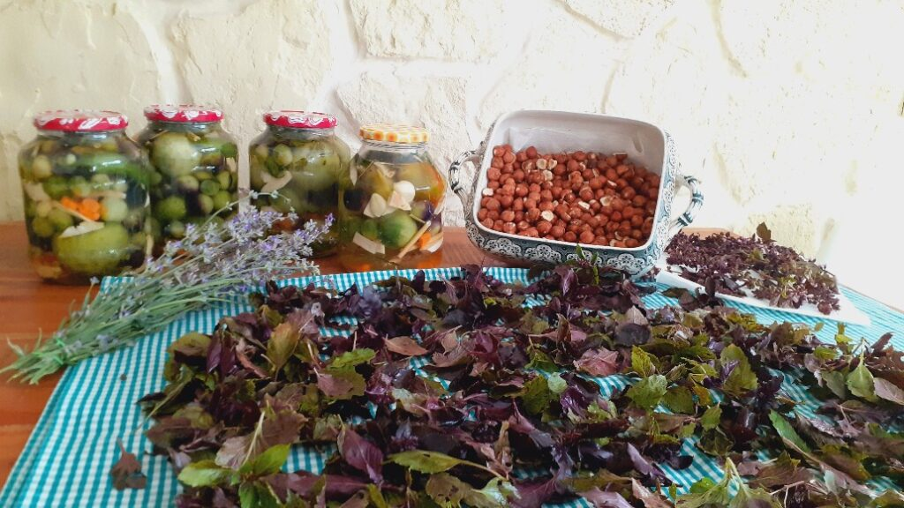

A fost o noapte goală, așa-mi sunt nopțile mereu când domnul meu nu e lângă mine. O fi și obișnuința, cum probabil că e natural, dar e și dragul, mie chiar îmi face plăcerea priveliștea lui la prima oră. Chiar dacă a fost goală de-o prezență, a fost goală și de coșmaruri sau dacă or fi fost, nu le-am reținut nici în carne, nici în memorie. Și mă mai străbate un gând de "goală", sunt fie eu o cană goală în care să fiu cu băgare de seamă ce bag, fie mi-e ziua un vas gol în care-mi toarnă Universul, iar eu să am grijă să nu-mi frig limba asta cu care repede cuvântez și împart în bune și ne-bune.

Atmosfera e dezmorțită, e un călduț dulceag în aer și îmi doresc cu disperare, poate cu prea mare disperare, să uit câtva de mama, să stau aici, sâmbătă dimineața și să mă trezesc încet, în ritmul meu. Sau să nu mă trezesc încă. Sau să mă lenevesc în pat până la prânz dacă vreau, că-mi simt corpul obosit. De fapt, mă simt cu totul în drum spre epuizare, nu doar fizică, m-a stors de vlagă întunericul ăsta în care mă tot învârt de ceva timp, sunt ca fluturele care se lovește cu putere, cu și mai multă putere, cu și mai multă, de geamul ăla transparent care-i arată, pe partea cealaltă, libertatea. Am aripile obosite.

Spiky mi-a simțit trezirea și a venit și ea lângă mine. Deși practic, nu mă aleargă nimeni spre nimic, dacă nu mă debarc din pat acum, că deja e 7.30, nu voi reuși să-mi beau apa și smoothie și-mi ratez singura constantă a zilei. Am observat că trebe să-mi beau smootheiul înainte să urc la ea, să fac ordine, altfel, după aia intră cu greu și se așează într-un stomac revoltat.

În afara ostenelii și a refuzului, care mi s-a impregnat și-n carne, de a nu mai face ce nu vreau să fac, îi dau voie minții să dea ordine și să preia frâiele, ca să pot să mă organizez. Ce atâta boierie cu leneveala asta, ce atâta disperare după stat eu cu mine și cu mine?! Nu e timp. De fapt, timp e, nu mi-l dau sau nu mi-l iau. Dar sunt atât de generoasă să îl dau altora, big time.

\*\*\*

Am fost atentă la băut apa cât să văd că beau apa, atât, n-am mai avut niciun vizual cu ea, deși îi dau, mecanic, intențiile, nu mă mai duc pe firul apei să văd pe unde le împarte și cum le lasă pe parcurs. Deja m-am iritat, simt cum din nou clocotește sub starea mea, aparent calmă, un vulcan. Și cu cât aud camera de supraveghere, cu atât mă portocalesc mai rău în lavă.

Cât îmi las jumătatea de oră necesară apei să facă apelul de trezire a organelor, mă apuc să strâng rufele care s-au uscat și să le pun pe căprării. Sper eu că făcutul de ceva să mă mai detensioneze, să mai scap din presiunea asta care mi se adună sub cască. Oare așa o să-mi croiesc zilele de acum încolo? Ființa din mine-mi răspunde repede cu un cuvânt "alegere", dar umana din mine pare că are de consumat niște trăiri, are de scos niște fumegării, nu a aruncat în afară ce o macină înăuntru. Teribil este că nu am reușit să descopăr cauza-rădăcină care mă alimentează și mă enervează în fiecare zi, lately. Că p-aia trebe s-o reperez și, mai apoi, s-o spăl, dar deocamdată sunt la mâna efectului.

\*\*\*

Colica biliară e și ea un efect și-și face simțită prezența odată cu prezența mea în baia lor. Credeam că m-am obișnuit, credeam că m-am bătucit, dar de fapt pe mine mă scârbește every fucking time. Mirosul și mizeria mă fac de comandă, de fiecare dată. Și când o văd pe mama în vârf de pat, senină, cu ochii la televizor de cred că nici nu mă vede, mă apucă dracii și mai rău. Și mă ia cu vomă și mai greu. 

Pesemne că s-a rupt în ea obișnuința aia de a mă saluta, intratul meu în cameră pare că se întâmplă în alt film, nu în ăsta în care e și ea. Deși își trece ochii peste mine, nu scoate niciun sunet iar eu mă întreb dacă voința mea, trimisă sol înainte, i-a anihilat dorința de a vorbi sau demența a mai închis o ușă. Aproape că-mi răspund singură, ce sens are să-mi pun atâtea întrebări, ce sens are să vreau să aflu chestii pe care nu le mai pot afla vreodată? În afară că mă obosesc și mai tare, întrebările astea sunt retorice și tâmpite, vin din people pleaserul care am fost și mai sunt câteodată, mai ales în ceea ce o privește pe ea. În ziua în care eu o să înțeleg că are demență, o să se stingă și astea. Doamne ajută-mă să ajung sănătoasă în ziua aia.

\*\*\*

Am scrollat un strop de pinterest și deja s-a făcut de micul ei dejun. Urc s-o iau, e la baie, îmi zice că vine imediat.

Nu știu ce să-i pregătesc așa că stau în bucătărie, în așteptare. După vreo 10 minute, mă uit pe cameră, ea s-a așezat din nou în pat, a uitat că eu o aștept la masă. Urc din nou, îi aduc aminte, se uită mirată la mine, eu seacă la ea și coborâm împreună.

Nu mai vrea iaurt, din nou, vrea omletă, lapte bătut și cafea, toate spune dintr-o bucată, fără nicio șovăială, poruncitor. Mi-a ieșit un "să trăiți!" zeflemitor, n-a prins nuanța pe care am regretat imediat că am aruncat-o și m-am apucat de treabă. Bine că acoperă liniștea radioul ăsta, că dacă ea nu vorbește, zău dacă știu despre ce să vorbesc eu. 

\*\*\*

M-am întristat. M-a întristat corpul ăsta care vrea doar o alimentare și se dezumanizează pe zi ce trece. M-a întristat neputința mea și blocajul ăsta al meu de a înțelege, cu subiect și predicat, că e bolnavă iremediabil și irecuperabil. Probabil că cea care se opune puternic acestei înțelegeri, acestei integrări, este speranța mea, la fel de iremediabilă, că poate nu e așa, dacă am reușit să trecem prin două cancere, o să treacă și asta. Realitatea mă lovește peste ochelari în fiecare zi, dar eu cred că am stocat în mine, odată cu trauma cancerelor, și speranța și voința mamei de a trăi, iar ele acum dictează legea. Nu am nicio explicație pentru care, deși e al dracu' de simplu, eu nu înțeleg că mama are Alzheimer. Că nu mai e funcțională. Că uită în câteva secunde. Deși o spun, nu știu cum s-o trăiesc. 

\*\*\*

Am strâns și am spălat în urma ei, aș vrea să fac copy-paste la spălat și peste starea asta a mea și iau nucile și alunele rămase la spart, afară pe terasă.

Soarele ăsta mișto de toamnă-mi încălzește plăcut cocoașa și-l invit să mă dezghețe și-n inimă. Aș vrea să re-culeg starea aia de grație pe care am trăit-o ieri când spărgeam alune dar s-a făcut praf de stele și a luat-o vântul. Deși am alegerea și soarele în mâini, tristețea a ieșit câștigătoare. Tristețea și un strop de singurătate.

\*\*\*

Mi-am pregătit legume la aburi, deși nu mi-e foame. Prevăzătoarea din mine le pune la fiert ca nu cumva să mă apuce vreo poftă și să uit de colica biliară, să mă adâncesc și mai mult în dureri de cap. Nu știu când am împletit eu cu andreaua gândului tristețea cu gândul ăsta amărui al trecerii noastre rapide prin viață, că iar mă împunge. De fapt, eu cred că e de ajuns să accesez din sculul ăla în care am pus, cu inconștiență, tristețe, inutilitate, nervi, neacceptare, una singură că apoi le deșir pe toate și le ronțăi over and over, am creat deja cale neuronală cu tristețe care duce invariabil la apocaliptica trecerii mele ca ființă umană. Cred că, în toată bezna asta în care mă zbat, faptul că totuși văd ce fac, deși nu mă pot abține să nu fac, e un mic licăr. After all, nu sunt total inconștientă, total pierdută, îs doar rătăcită și nu mai văd drumul, sensul sau soluția.

\*\*\*

I-am încălzit varza și am ieșit rapid din bucătărie, putoarea asta a dat o mare mână de ajutor colicii biliare, că e absolut înspăimântătoare. O las să mănânce, cu geamul larg deschis la bucătărie și cu ușa la fel, iar eu sunt în apropiere, dacă are nevoie de ceva, aud. A mâncat tot și mi-a cerut bomboane, din alea de a primit ea la ziua ei (!). M-a dat pe spate, pare că demența nu înseamnă cu uită pentru totdeauna, e cam ca la firele de curent care se mai ating din când în când și fac scurt, așa e și cu mama, azi știe de bomboane. Nu pot să nu-i dau, chiar sunt ale ei, nimeni altcineva nu le mănâncă, dar ea nu se mulțumește cu câteva, vrea toată cutia. Exclus, că o dă gata în câteva minute. Se enervează, și eu la fel, aproape că trebe să smulg cutia de la ea, pleacă supărată, iar eu rămân în urma ei stupefiată. Ce a fost asta?!

Un sentiment de groază, încă mică, a pus stăpânire pe mine. E prima interacțiune cu forța pe care o avem și, dacă speram din tot sufletul ca partea aia cu violența să nu fie în boala mamei, ăsta tocmai a fost un prim semn.

Nici nu pot să duc sentimentul ăsta azi, nici nu vreau să-l gogoșesc așa că ies în curte, să mă scutur și să-mi culeg busuiocul și a doua tură de lavandă. Aiurea! Nu mi-a stat mintea decât la episodul de mai devreme, pe care l-am rumegat și re-rumegat până mi s-a strâns stomacul. Lua-le-ar naiba pe toate, dar mai ales pe demența asta, pentru care nu s-au inventat cuvinte în care să pun ce simt nevoia să pun despre ea.

\*\*\*

Mi-am terminat gogonelele, un mic sentiment de izbândă își scoate capul timid de sub ăla de groază care mi-a acaparat prezentul și pregătesc casa ușor-ușor de seară.

În liniștea casei aud râsul ei și văd pe cameră că vorbește la telefon. Le sunt profund recunoscătoare doamnelor care încă o mai sună, deși ea vorbește aproape numai în dodii și eu știu că ele știu, dar o ascultă și o sună din nou și din nou. Mama e bogată și nici nu bănuiește cât.

Îi dau de mâncare și lui Spiky, îmi scot fructele din congelator pentru smoothie și când să urc, o aud pe mama "Biannca e sufletul meu!"

Mi s-a oprit respirația, pașii, cred că un strop și inima, corpul meu e șocat de vorbele pe care le-a procesat instant și le-a trimis la inimă. În vizualul meu, un val imens de căldură mi-a inundat cămăruțele inimii, a dat cu ușile de pereți și a cotlonit căldura asta tot frigul ce mi s-a adunat acolo, în ultima perioadă. Nu contează că nu mi-a zis mie asta niciodată, uite că-n demență, când cică spui tot ce-ai ascuns în tine, o spune altora. Probabil că nu întâmplător a spus-o, probabil nu întâmplător am auzit-o, acum.

"Păi ce mă făceam eu fără ea? Cine mă ajuta pe mine?!"

S-a făcut Polul Nord…

Yep, spui ce stă ascuns în tine, eu pentru ea am fost omul bun la toate, nu omul de la inimă.

Q.E.D

Cu sufletul tremurând a frig, mi-am luat coconetul, mi-am scufundat fața în blănița ei și mi-am plâns durerea și neputința.
