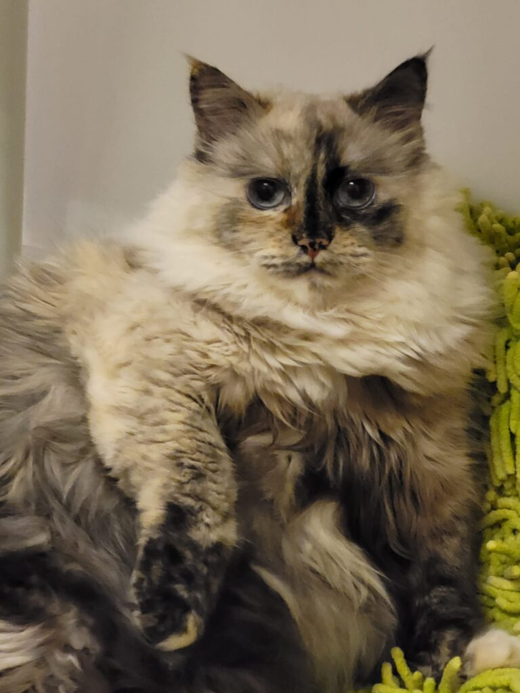

Sunt obosită. Așa mi-aș dori să dorm și eu măcar o oră mai mult. Să mă întind sub plapuma călduroasă, să stau fără nicio grijă acolo, să plutesc în visare sau într-o meditație. Mi-e așa dor de o meditație… în timpul pandemiei a apărut o frază care mi-e tare caracteristică these days: eram fericită și nu știam…

Dar trebe să mă dau jos din pat, vreau-nu vreau, să mă duc să prepar foarte micul dejun de fructe, să dau de mâncare la animăluțele de jos și să mă pregătesc psihic pentru curățenia de la mama din cameră.

Uitându-mă pe camera de supraveghere, ca o verificare, am văzut-o cum se schimba și își împăturea ea cu grijă hainele și cum își cremuia mâinile. M-a cuprins așa o duioșie pentru femeiușca asta, care s-a micit în dimensiuni, dar care majoritatea vieții ei a fost frumoasă și cochetă. Și doamne, cât îmi doresc să nu se aștearnă ceața peste mintea ei în zonele astea care sunt responsabile cu descurcatul personal minimal. Nu vreau să se simtă niciodată umilită … ea, care a fost o femeie tare mândră.

\*\*\*

Diminețile, cât îmi beau smoothie și cafeaua, stau cu Maya, cățelușa noastră. Sunt momentele noastre de drăgăleală, de jughineală, când îi spun cât o iubesc, că mi-e bine sau că mi-e rău. De multe ori am simțit că acest animăluț este ca un absorbant de stări. Și îmi aduc aminte că Sassy, pisica mamei, a fost fix așa pentru mama. După ce mama a reușit să scape de cele 2 cancere și s-a reîntors acasă, a descoperit că și pisicuța ei avea cancer. Eu suspectez că Sassy a avut cancerul dinaintea mamei doar că nu l-am descoperit noi… a fost operată și acum își trăiește bătrânețile alături de mama, răsfățată la maxim de noi două. Eu o văd ca pe o soră mai mare și recunosc că, în adâncul sufletului meu, îi sunt extrem de recunoscătoare că a fost punctul de sprijin al mamei în toată singurătatea ei.

\*\*\*

Azi a ieșit soarele iar eu am din nou lacrimi în ochi. Și câteodată m-apucă așa o furie pe mine că nu mă pot aduna o dată să nu mai plâng, să mă bucur de viață, de câte am. Că am o grămadă! Însă nu am valoarea mea primordială, libertatea, și asta mă aruncă în aceste stări depresive. E un amalgam ciudat în mine, o dualitate extraordinară care în aceste vremuri se întrece pe sine. Când sus, când jos, sigur din afară pare labilitate psihică. Și poate chiar este, but who cares?!

\*\*\*

Micul dejun a fost bun. A mâncat bine și a condimentat mâncarea cu uimirea ei că își aduce aminte lucruri din trecut, parcă din neguri. E prima oară când a recunoscut că ea nu se mai descurca singură... că aici e răsfățată. Și că ea nu a fost niciodată răsfățată în viața ei de către o altă ființă umană.

Cred că are dreptate: copiluță fiind, a fost violată în mod repetat, apoi a trebuit să aibă grijă de gospodărie și de fratele și sora ei, pentru că ai ei plecau cu lunile în funcție de șantierul unde era alocat bunicul meu geodezist, apoi s-a angajat foarte tânără ca să facă bani, l-a întâlnit pe tata care a tratat-o groaznic, a rămas singură după divorț și singură de tot după plecarea mea de acasă, la 18 ani. Nimeni din viața ei nu s-a aplecat o țâră mai mult asupra ei să o întrebe dacă îi e bine... lasă că fac eu asta acum! Și deși îmi sună în urechi și suflet că e cam târziu, mai bine acum decât niciodată! Nu vreau nici să îmi fac procese de conștiință, de unde sigur ies șifonată, pentru că și eu am plecat devreme să îmi fac un rost în viață. Și am uitat în tumultul ăsta al vieții că am o mamă, undeva, singură…

\*\*\*

Azi am îndrăznit să privesc mai departe decât acum. Să văd ce aș putea face să-mi construiesc puțin suflet, cum spune Argeșanu. Să încep să croșetez o bucată de viață neîntinată de suferința uitării sau a grijilor sau a mizeriei pe care o spăl zilnic... o bucată de viață unde să creez, să-mi dau iar frâu liber imaginației. Sadhguru zicea cândva că **imaginația folosită cum trebe duce la creativitate și imaginația folosită aiurea duce la anxietate**. Iaca că eu le experimentez pe amândouă!

\*\*\*

M-am surprins comparându-mi drama cu a altora. Evident că a mea e cel mai greu de dus.

Citesc prin social media diverse postări despre dezvoltare personală, sau motivaționale, sau de spiritualitate și linia generală care se desprinde este că mereu există o cale, că nimic nu te poate doborî, etc și inconștient mă gândesc dacă persoana care zice sau scrie asta ar zice sau scrie la fel dacă ar fi în locul meu. Știu, victimizare maximă! Dar trebe să recunosc că e și oleacă de adevăr în asta. Când strângi și speli rahați zilnic parcă nu mai vezi curcubee și unicorni… dar și asta e o perfidie a egoului, nevoia noastră, umană, de a fi compătimiți, de a fi altfel decât ceilalți, de a fi mai presus. Comparația și competitivitatea sunt 2 componente pe care eu le consider “vinovate” de eșecul nostru de a fi toleranți, cu noi și cu cei din jur. Din nou, văd că analizez totul, că înțeleg cum se petrec lucrurile, dar emoțional tot drama mea e mai mare!

\*\*\*

Vreau să fac yoga. Zilnic. De 2 ani îmi propun asta, dar nu reușesc să trec de la propunerea indecentă la realitatea de pe salteluță. Anul ăsta chiar vreau să intre rutina yoga în fiecare zi în viața mea.

\*\*\*

Prânzul a fost presărat de povestirile Dariei, care s-a întors de la Paris încântată și exaltată. Mă uitam la mama că nu înțelegea tot sau multe din câte povestea copila mea și am simțit-o cum vrea să fugă la ea în “apartament”. Încep să simt, așa cum făceam cu puiuca mea acum 22 de ani, să simt la un nivel non-verbal, ce simte și ce vrea mama, fără să-mi spună ea. Văd cum se pierde și se agită când ceva nu înțelege sau nu îi este familiar. Și vrea să se ducă în locul cunoscut cât mai repede iar o dată ajunsă acolo simt efectiv cum i se relaxează toți porii. 

\*\*\*

Tot timpul cât am jucat table azi cu ea, am fost observatorul stărilor mele: când mă apucă revolta că sunt încă tânără, că vreau libertate să plec când și unde vreau, când mă apucă tristețea văzându-le pe amândouă (mama și pisica), așa de bătrâne, și știind că se vor duce una după alta și vor rămâne goluri dureroase, când mă apucă bucuria văzând-o pe mama cum cântă și se mișcă din umeri în ritmul muzicii de la TV.

Sunt tare obosită. Mă storc de energie aceste  tăvăluguri de gânduri, emoții, sentimente. Dar sunt doar alegerile mele. Că aș putea să joc table și atât…

Azi am simțit recunoștință:

1. Că a existat și există Sassy în viața noastră!

3. Că a ieșit soarele!

5. Că s-a reîntors Daria acasă!
