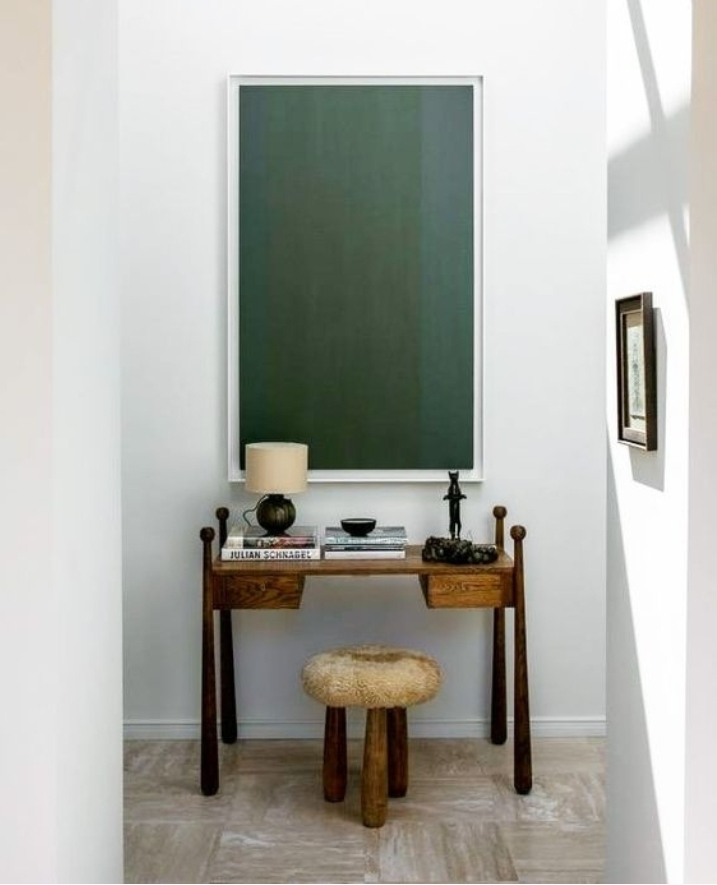

La un nivel grosier, carnal, corpul meu de-abia aștepta trezirea ca să poată să se scoată de sub apăsarea asta pietroasă, greoaie, adâncă în care s-a simțit toată noaptea. Deși n-am chemat niciun gând negru sau gri înainte să adorm aseară, ba din contră, încerc să mă țin de practica suflată de Wayne Dyer, să-mi număr visele și reușitele, dintr-o laterală nebăgată de seamă pare-se că s-au infiltrat nori grei în vise dar și o senzație de împovărare. Nu pot să numesc vreo cauză sau vreun vis responsabil cu artileria asta grea, doar știu că deschiderea ochilor în întunericul blajin al dimineții s-a simțit ca o briză călduță și vindecătoare. Nu sunt sigură dacă eu, care mă știu hulpavă câteodată, din teama asta care mă cuprinde cu fiecare zi ce trece că nu mai am timp, m-oi fi apucat să procesez traume și pe timp de noapte, dar știu că s-a simțit ca o curățare de metale grele, ca o răscolire prin furnal, ca o imensă energie proaspăt eliberată. Indiferent ce-a fost, primesc rezultatul, dar ducă-se procesul, că mă simt un strop epuizată și doar ce m-am trezit.

Azi, mai mult decât în alte dimineți, mă bucur cu toată ființa că-l am pe domnul meu lângă mine, în viața mea și, dacă mai aveam nevoie de vreun brânci ca să-mi pornesc pomelnicul de mulțumiri, privindu-i chipul frumos și liniștit, s-au legat și pornit din mine toate. Deși pare banal, mie și acum mi se pare uluitor cum viețile noastre s-au împletit fără să știe, fără să știm: ne-am născut în orașe apropiate, am copilărit în sate vecine, mergeam la același bâlci, dar ne-am întâlnit 30 de ani mai târziu, în orașul marilor posibilități. Ca-n filme.

Scapată de jugul greu ce l-am purtat azi-noapte, termin de marcat lucrurile pentru care nu doar mulțumesc sec, ci chiar sunt recunoscătoare, chiar nasc în mine căldura aia inconfundabilă, chiar simt total o beatitudine. Poate că o trăiesc atât de puternic în dimineața asta tocmai prin comparație cu noaptea apăsătoare ce mi-a trecut prin ființă. M-am trezit, sunt în viață, am omul iubit lângă mine, sunt sub pilotă unde-i cald și bine, am o blănoasă de-a dreapta mea, I'm happy în acest moment. Și asta e tot ce contează.

***

Pare că atmosfera de piatră de moară a tranzitat și camera mamei și-a impactat-o mai mult decât a reușit la mine, că este destul de evazivă și parțial comunicativă. Mă fac că nu observ, mai mult pentru mine, să nu mă aricesc eu cum mi-e prostul obicei bătătorit, decât pentru ea, care oricum nu pare să sesizeze prea multe din jur. Sau să-i pese.

Deretic, aerisesc, fac curat și îmi mut atenția și conversația către Sassy, care chiar dacă nici ea nu-mi vorbește, știu sigur că mă înțelege mai bine decât o poate face mama acum. Grasa flocoasă mi se freacă de picioare și aproape că mă încurcă, mai ales în baie, unde e cel mai mult de făcut treabă, și la propriu și la figurat. Dar, întotdeauna, mă opresc câteva clipe să-i acord atenție, fie ei, fie lui Spiky și așa am făcut și cu Maya, pentru că timpul lor cu noi e mult mai scurt decât timpul nostru. Plus că o iubesc pe băbuța asta cu ochi albaștri translucizi, sor'mea patrupedă cum o alint, iar în dimineața asta, îi și mulțumesc așa, încet, între noi două, că îmi alungă sentimentul de creepy pe care-l imprima mama camerei și clipei.

***

Micul dejun al mamei este de fapt un foarte mic dejun al mamei, care nici de mâncare nu are poftă în astă dimineață. Insist măcar să-și bea laptele bătut că eu sunt îngrozită de câte pastile ia și ce puțini nutrienți din mâncare contrabalansează chimicalele astea. Dacă le balansează în vreun fel.

N-apuc să strâng masa că mă sună asistenta, trebe să sar în mașină și s-o aduc.

Deși m-am obișnuit cu fuga asta, cu faptul că trebe să strecor injecțiile mamei printr-un program și-așa încărcat al asistentei, recunosc că mi s-a luat să stau așa, cu pușca la picior, tot timpul, poate sună telefonul și trebe să plec. Mă reconfortează gândul că sunt doar 10 zile și apoi vedem.

***

Profit de prezența femeii în camera mamei și o întreb ce ar vrea să-i dau să mănânce la prânz. Ca niciodată, mi-a răspuns după câteva minute bune de gândit, când oricum nici nu mai speram la un răspuns: vrea grătar de porc. Ok, grătar the porc să fie.

Duc asistenta înapoi și merg mai departe, să cumpăr grătarul de porc.

Cred că, pe nesimțitelea, mi s-a strecurat în esență și-n mine, asta carnală, că orice bucată de carne a fost cândva însuflețită, că orice caserola d-asta anostă de plastic a fost cândva viață. Și mă trece de fiecare dată un fior și mi se pare, mereu și mereu, incredibil cum am putut să fac asta atâția ani, cum poate lumea să nu vadă adevărul ăsta care e imens și limpede. Mă uit doar cu uimire ce coadă e la "împinge tava" din mall și cum absolut fiecare tavă are în principal carne în farfurii. Inclusiv eu…

***

Cu răspunsul în minte că fiecare are nevoie de timpul lui și de spălările de ochi potrivite, mă întorc acasă și încerc să mă feresc de atracția asta irezistibilă care mă trage către tristețe.

Eu mă știu, când ceva îmi activează o stare de părere de rău, de strângere de inimă, fac ce fac și scot de prin toate sertarele mele și alte păreri de rău sau strângeri de inimă și, după ce le termin p-ale mele, mai culeg și de prin jur altele pe care le iau la pritocit. E un obicei pe care am început să-l văd și pe care sper eu că, dacă o să pun ochelarii cât mai des și cât mai din pripă, înainte s-o ia la vale, să rostogolească rahatul și să se facă ditamai gogoașa, o să se risipească și n-o să mai intre pe pilot automat, o să mă ciocăne, din când în când, dar cu permisiune de intrare în scenă, nu o să mă mai defileze cu tot cu gânduri și stări fără să am vreun cuvânt de spus. Yep, speranța moare ultima dar sunt din ce în ce mai hotărâtă să mă lucrez. Chiar dacă mi se pare câteodată extrem de consumator de mine, efortul ăsta de a-mi observa tiparele, gândurile, acțiunile, rușinile, fricile, bucuriile, exaltările, beatitudinile, viața, începe să devină un job care-mi place, de care sunt pasionată, mai mult un joc care-mi forțează limite lipite aiurea, limite care nici nu există în realitatea aia din care m-am aruncat în această viață. Jocul ăsta mi-e și iad dar mi-e și rai.

***

Pare-se că mă învârt prin aceeași zonă de vibrație, chiar dacă mă fac că plouă. Mama, clar cuplată și ea la același palier, refuză grătarul de porc sub pretextul că ea nu mai vrea carne. Habar n-am dacă au ajuns în miezul ei răspunsurile mele la întrebarea repetată obsesiv: dar tu nu mănânci carne?! sau strângerea mea de inimă când am cumpărat grătarul a avut atâta putere că a străbătut timp și spațiu și-a poposit pe-o cracă a minții ei, cert este că am cumpărat carnea degeaba. Nu asta mă amărăște, încep și eu să mă prind că tot ce face mama nu face ca să mă enerveze pe mine, ci pentru că Universul a decis s-o pună să joace rolul unei păpuși stricate, acum, la sfârșit de viață, dar mă irită că prin cumpărarea unei bucăți de carne, contribui și alimentez o industrie de ucidere.

Îi încropesc ei un prânz, iar mie o stare de toleranță.

***

Din nou, ca să nu mă duc la vale, îmi mut atenția și implicit energia pe ceva ce-mi face inima să cânte și mă arunc cu voluptate maximă în tururi de castele private. Ce frumuseți! Ce povești! Ce vieți!

Cred că cel mai mare cadou pe care a putut să mi-l facă mama prin demența ei este că mi-a ascuțit atenția pe clipe, iar asta m-a făcut să-mi descopăr tare și hibe adânc ascunse, m-a făcut să mă descopăr. Ce ironic! Mama a trebuit să se uite pe ea ca eu să mă văd pe mine.

În timp ce sorb cu aviditate imagini și cuvinte, realizez brusc, în toiul acestei delectări, că eu nu pot să-mi creez premizele unui viitor cum mi-l doresc, nu-mi pot crea prosperitate, în orice formă ar veni ea, succes, al meu, intern, nu d-ăla de exterior și de făleală, atâta timp cât eu nu mă creez pe mine întâi, nu-mi spăl credințele limitative, fabricate de alții și preluate cu totală încredere de mine, care zac parșive în mine și acționează ca niște frâne. Cum pot eu să cred cu tărie că, dacă vreau, într-o zi voi avea castelul, când mă-ncurc în mundanul "da' cum fac eu atâția bani?!"

Totul se crează. Fix cum un copil ajunge prin bastonașe să treacă la tabla înmulțirii, la momentul potrivit, așa trebe să mă cresc și eu ca să pot să cuprind și onorez, cum trebe, tot ce doresc pentru mine.

***

A mai crescut o țâră nivelul contului pentru binele lui Sett, atât cu bani, dar și cu gând bun.

De multe ori în viața mea, am tins să desconsider darurile nepalpabile, probabil dintr-o materialitate înfierată în carnea mea și-ntr-un mental limitat doar la simțuri. Acum însă tind să cred că, în primul rând, lucrurile se desenează, conturează, înfiripează și cresc într-un "spațiu" de joacă atotcuprinzător, mai mare decât orice ar putea cuprinde vreodată toate simțurile noastre, activate la cele mai înalte cote. Acum simt că un gând de drag străbate timpuri și locuri și se așează cu greutate într-un pușculiță ce strânge clipe albe pentru trăiri negre.

***

O zi în care mi-a fost încercată la greu hotărârea de a mă vedea pe mine și a-mi prinde în act pornirile inconștiente care-mi atârnă atâta în trăirea conștientă la care m-am înhămat. O zi cu recunoștință pentru:

1. Domnul meu, omul ăsta frumos care-mi încălzește și cele mai friguroase trăiri!

2. Mama, femeia asta plină de surprize, care-mi predă consistent tutorialul "Cine sunt eu?"

3. Mine, omulețul ăsta curajos și curios!

Frumosul de-o zi:

