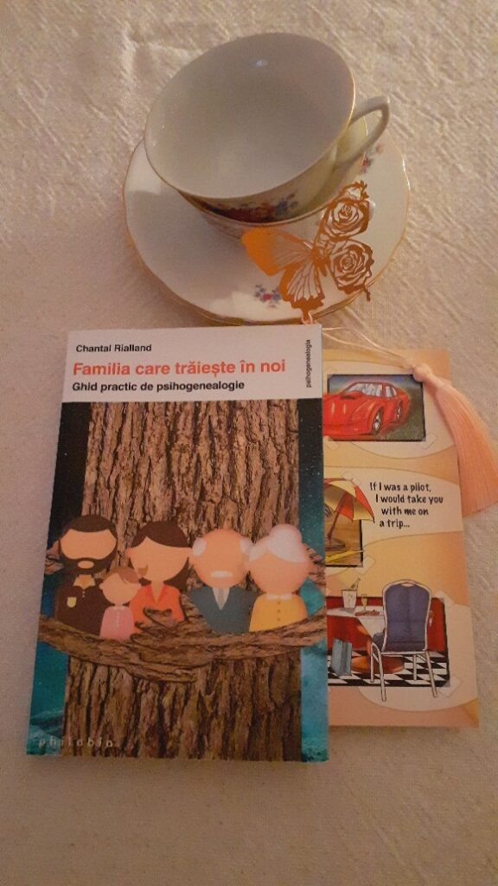

În doi timpi și trei mișcări, am zburdat în lumea viselor, după o noapte precedentă diafană și o zi mai mult sau mai puțin pe aceeași lungime de undă, care și-au luat totuși vămuiala din resursele mele de energie. Numa' că la plecarea-n locul ăla misterios nocturn, nu știu cum am făcut de-am lipit și o grijă, care m-a-nțepat ca andreaua prin gard și-n puținele ore pe care le am de dormit: trebe să mă trezesc în creieri de noapte buimacă, să recoltez urina mamei, pentru reverificarea stării infecției urinare. Dacă mi-e urât de ceva cel mai mult, mi-e de această recoltare. Nu de acțiunea în sine, ci de pânda momentului prielnic, care niciodată nu e același sau care e al naibii de imprevizibil. Am pus alarma să sune la 4 dar m-am trezit din oră-n oră, până la 4. Franjurarea asta de trezire-adormire nu mi-a făcut taman bine, că n-am reușit să mai scurg niște combustibil în generatorul propriu, să mă țină măcar pe cote de avarii în ziua ce vine. Ei lasă, ia nu te mai aoli atâta, e doar o noapte. Da, da' una acum, una peste-o săptămână, alta din motive desigur întemeiate, încă una că mai știu eu ce și uite așa mă vlăguiesc și apoi mă întreb de ce. De pe la 3 și un pic, am avut un ping-pong de replici în interior, între mine aia apocaliptica și mine, aia care nu se mai ia prea în serios și mai mult decât atât, nu mai pune botul la toate oboselile. Matracuca de minte îmi tot servește contra-argumente la toate replicile pansament pe care le găsesc eu ca să nu-mi inflamez un înăuntru, ce-i drept, obosit. Știu eu că noaptea toate par mai accentuate, mai greu de dus și mai înfricoșătoare.

\*\*\*

La 4 deja eram cu mama în cabina de duș și totul a decurs minunat de ușor. Ha! Atâta strofocare și nesomn și îngrijorare și-am terminat totul în vreo 12 minute, cu tot cu spălatul ei, ștersul, îmbrăcatul și băgatul la somn.

Bucuroasă nevoie mare, unsă maxim de reușita măreață ce tocmai s-a petrecut, m-am trezit de-a binelea, am uitat și grija care mi-a pisat puțina noapte și dialogul care mi-a măcinat ora de dinainte, așa că mă cobor la parter, fără o bucată Spiky, care sforăie, corespunzător micuțului ei gabarit, lângă Mr. H. E prea devreme, până și pentru curiozitatea din ea.

\*\*\*

Doar îmi beau apa, nu mă apuc de smoothie că e totuși prea devreme, mi se pare că organele mele încă dorm duse, nici nu pot să mă gândesc să mănânc ceva, d-apăi s-o și fac. Lasă, numai bine, dau trezirea în interior cu apa simplă și le las să se dezmeticească bine-bine până să le iau prin învăluire cu fructele pasate. Mă așez pe colțarul desfăcut, mă înfofolesc într-o păturică pufoasă și dau drumul la un podcast. Dacă răstorn perspectiva din care etichetez situația, am atâta timp liber pe care să-l fac magic încât e păcat să nu mi-l savurez. Intenția care se așează peste păturică și mă învelește este că aleg să-mi fie bine. Cel puțin, la ceasul ăsta mic de noapte spre zi, vreau să fac să-mi fie bine.

Legănată de-o engleză faină și o voce plăcută, am fugit o oră într-un somn portocaliu și fain din care m-am trezit direct în papucii recunoștințelor. Cu ochii parcă însetați de lumina zorilor și albastrul cerului, mi-am îngăduit timp și pace să mă cercetez și să văd ce s-a mai copt în cuptorul mulțumirilor, ce-am mai lăsat la dospit și ce a mai apărut nou pe firmamentul lor. Nu știu de ce am simțit cu tărie nevoia de a-i mulțumi corpului meu azi mai mult ca niciodată, dar mi l-am simțit ca un aliat de nădejde, cu toate durerile de cap pe mi le afișează pe ecran din când în când. 

\*\*\*

Mama-mi pare supărată. Deși nu articulează ceva anume care să-mi confirme suspiciunea, e o senzație care-mi cutreieră corpul și-mi trimite semnale de natura asta creierului. E și limbajul ei corporal sau poate e doar mimica feței, dar clar are o supărare. Sunt venită strict pentru pastila pentru tiroidă și pentru curățenia zilnică, așa că, din delicatețe, las întrebările pentru mai târziu, la micul ei dejun. Dacă e să fie cu adevărat corectă intuiția mea, se va menține supărarea încă puțin. Sau mă va surprinde, din nou.

\*\*\*

E supărată, de fapt mai mult mâhnită, că fratele ei nu-i dă niciun semn de viață. În negura care-i acaparează câte puțin sau mai mult amintirile, a uitat că a vorbit cu el anul ăsta și-mi spune că nu mai știe nimic de zeci de ani de el, nici nu știe dacă mai trăiește. Mă uit la ea ca și cum aș găsi scris pe chipul ei răspunsul la întrebarea mea nerostită: să-i spun adevărul și s-o doară că l-a uitat sau să nu i-l spun și s-o doară că a uitat-o fratele ei? Care e răul cel mai mic, adevărul negurii din mintea ei sau adevărul uitării din mintea lui? La drept vorbind, deși sunt frați, neamul ăsta al nostru pare că n-a cunoscut dragostea și grija care se nasc firesc între rudele de sânge. Suntem, cum se numește în termeni moderni, o familie disfuncțională. 

\*\*\*

Mâine e ziua mea și vreau să mă răsfăț cu o prăjitură cu foi și cremă de lămâie, așa cum făcea mama, acum milioane de ani, în zilele de sărbătoare. Mie îmi făcea cu lămâie, soră-mii cu cremă de zahăr ars. Uite c-am rămas cu nostalgia asta-n sânge și simt nevoia s-o activez la zile "speciale". Mama m-a impactat mult mai mult, nu doar prin lipsa ei din viața mea, ca dovadă că eu vreau să reeditez, într-un fel inconștient, momentele când a fost prezentă totuși. Acum mi-am răspuns și la înverșunarea cu care am experimentat această prăjitură în varianta vegană până mi-a ieșit, de fapt e un dulce care conține în el un gest de atenție pe care-l făcea mama pentru mine. Așa cum s-a priceput și ea. Mi s-a făcut așa un dor de zilele alea…așa mici și goale de ce-mi era nevoie să cresc mai netraumatizată, erau universul meu, erau lumea mea.

\*\*\*

Îi fac și mamei o supă, o tocăniță și-un "pui" de mămăligă. Asta cu puiul de mămăligă e tot de la ea și, cu o lacrimă caldă-n suflet și una pe obraz, înțeleg că un om e clar îmbogățit de fiecare om pe care-l întâlnește în viața lui. Pentru că un altul îți dă date despre cum vede el aceeași lume, te invită în filmul pe care-l vede el, prin ochii lui, prin percepția lui, îți dă șansa să-i citești cartea, să te inspire, să te bucure, sau să înveți. Dacă ești deschis și vrei. Până acum, eu m-am închis ermetic de la a învăța de la mama ceva, unu, că nu am văzut ce aș putea învăța și doi, că am vrut să fug cât mai departe. Dar viața are alte cărți în mâini și de ce am fugit, d-aia n-am scăpat. Fără să vrea sau să știe, mama mă învață acum, condensat, cât ar fi trebuit să învăț în anii ăștia de până acum, cât m-am avântat în zări străine să uit de-o maternitate care nu m-a îmbrățișat.

\*\*\*

În timp ce-și soarbe încet supa, acompaniată de pâine, multă pâine, o privesc. Lunile astea din urmă, i-am pus în cârcă toate angoasele mele, toată revolta mea, toată stările mele de dramă erau rezultante ale prezenței ei la mine și ale răscolirii unui interior ce doar mi se ferise de ochi, dar nu se vindecase niciodată. Femeia asta, care s-a micit îngrozitor în anul ăsta ce aproape că s-a scurs integral, a stârnit în mine atâtea furtuni și atâta praf mi s-a pus pe ochi, că am căzut în capcana faptului care-mi valida că am dreptate să fiu supărată pe ea, să mă simt neîndreptățită de soartă. Mă uit la ea și nu văd decât o umbră din femeia care era. Pe umbra asta sunt eu înverșunată? Pe ea o săgetez întruna și-o fac responsabilă pentru toate? Giiiz, cât de oarbă pot să fiu!

Pe de altă parte, îmi dau seama cu ce mare judecată m-am încălțat și pe mine, mi-am pus pe umeri și pe viață: asta cu aoleala. Fie am făcut eu o trecere d-aia de nici n-o bănui, dar se întâmplă, și am trecut de la apocalipsă la a relata simplu prin ce trec, fie am înțeles, nu doar mental, că nu pot fenta durerea, ci doar pot să trec prin ea, dar că o să ajung și la un capăt cândva. Așa că pot să zic că-s reporter al suferințelor și lecțiilor din tutorialul "Demența", am făcut undeva un switch și m-am scos din rolul de actor-victimă. 

\*\*\*

Simt nevoia de afară, mi-e dor de natură, unde întotdeauna ai senzația de libertate, de conexiune cu ceva mai mare, mai mult, mai profund. Natura are în viscerele ei trăire pură, neîntinată de gânduri, de fabricații, de percepții, de tarele umane. Ploaia asta ce mi se scutură pe umeri, pe lângă că-mi dă fiori reci pe piele, îmi bagă pe sub piele o încredere fermă că totul este cum trebe să fie. As simple as that.

\*\*\*

Doar ce apuc să mai fac un strop de ordine, că mâine clar am musafiri, și-mi sună telefonul: e un curier ce are ceva de livrat. Știu că am ceva de primit, știu că mi-e cadou și ies, cu spor în suflet, să-l primesc. Am decis, când am aflat despre el, că o să-i dau peste nas rezistenței mele la primire, iar acum vreau să mă țin de cuvânt. Și, recunosc curat, sunt și tare curioasă și pâlpâie în mine și o bucurie. Când eram mici, noi nu prea primeam cadouri, așa că nu-s învățată cu gesturile astea. Dar omul cât trăiește, se adaptează.

În colet mă așteptau cumincioare două ceșcuțe de porțelan cu suratele farfurioare, un fluturaș metalic cu șnur diafan și roz, ca zorii dimineților mele, o carte care să-mi lămurească niște semne de întrebare și o felicitare care mi-a adus valuri de căldură în inimă. Dar mai mult decât atât, am primit gând și gest iar astea nu se pot cuantifica. M-au crescut astea pe mine în mine, m-au făcut să mă privesc prin ochii femeii care m-a cadorisit, să simt că merit, să simt că contez suficient de îndeajuns, să înțeleg că i-am atins viața într-un fel bun de-a făcut-o să mă recompenseze atât de mult. Ce am primit de fapt este încă o treaptă pe care am urcat-o pe scara aia de a mă plăcea eu pe mine, înainte de fi pe placul oricărei alte persoane. 

\*\*\*

Îmi filează becul a oboseală, cum era și normal, dar sunt atât de plină. De mine, de mama, de amintiri negre devenite suportabile prin spălat de păreri, de cadouri, de drag. Recapitulez recunoștința pentru:

1. Recoltarea lină în pântec de noapte!

3. Claritatea mentală!

5. Cadoul din spatele cadoului primit!

Clipa mea de plin este:

