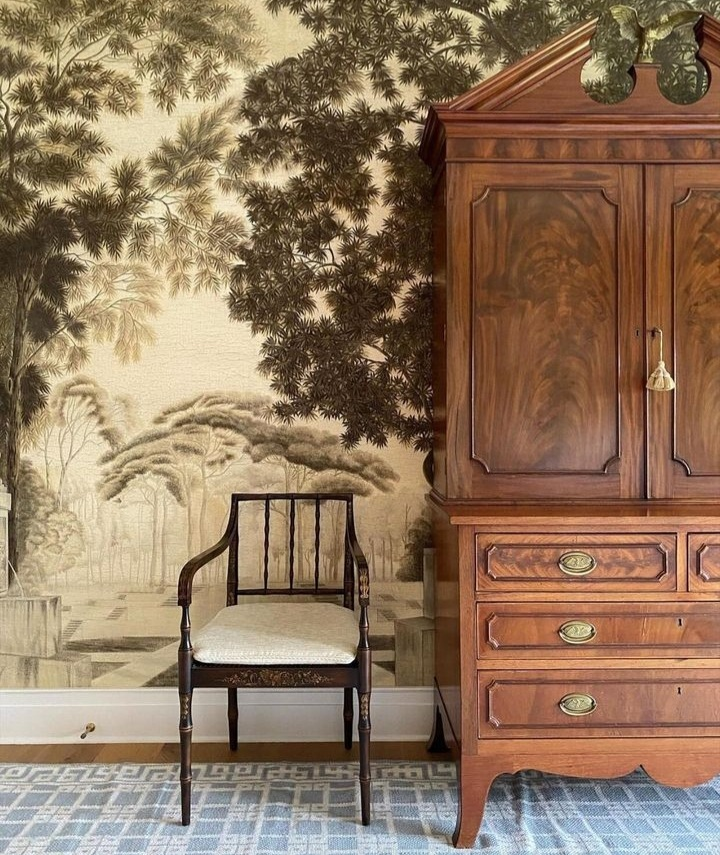

Nu cred să fi ratat vreo parte pe care să nu-l fi întors pe domnul meu, răcit bocnă, care mă mitraliază cu sforăituri. Pentru că-s obosită, în pauzele mici dintre o sforăitură zdravănă și următoarea, adorm, insuficient de adânc cât să nu sar ca arsă, când îmi pălește urechile sensibile zgomotul de tractor. Deși inițial mă scămoșez, destul de repede îmi dau seama că n-are nicio vină, că nici la el starea asta nu se poate numi somn și la 3 și 22 de minute îmi iau cumințică pilota și cobor în living, poate lipesc acolo somnul spart.

Cred că, ce resturi de ațipeală mai aveam, le-am risipit pe drumul înspre parter că, odată ajunsă aici, nu mai e nicio picătură pe la gene. Îmi fac culcușul, mă "încălduresc", încerc să fiu atentă la liniște, să număr oi, să respir, să-mi pun perna pe cap, ghinion de neșansă, s-a-nchis țeava, nu mai curge niciun pic de soileală.

***

Resemnată, dau drumul la tv și plec puțin pe la castelani în vizite, să le văd evoluția în restaurări și mă trezesc de-a binelea. Dacă tot sunt cu toate simțurile alerte, bag și un documentar și plec o țâră prin Iran. Apoi prin Nepal și sfârșesc frumos cu o prezentare de grădină rustică.

Am avut în programul artistic al mult prea dimineții un amalgam de informații, de imagini, dar recunosc că am reușit să virez admirabil de la o stare potențială de ciufuțenie la o stare îmbibată de frumos. Chiar dacă nu am plecat fizic acolo, mi-am luat euforia și din documentare sau video-uri, frumosul e frumos și dacă-l vezi doar pe-un ecran, dintr-un colț de canapea, înfășurată în pilotă călduroasă la ceas nedorit de mic de nouă zi.

Corpul obosit soarbe ca o sugativă apa cu multă lămâie și așteaptă, încă însetat, smoothieul. E gata și ceaiul, zorii încep să se destrăbăleze pe-un cer senin, iar eu mă adun cu firimituri de energie pentru o nouă zi. Diseară bag o fisă nouă la vendomatul de somn, poate nu mi-o scuipă afară și mă lasă să-mi umplu puțin rezervorul, ca să nu "dau în gol".

***

Radarul meu emoțional m-a notificat, din primul moment de la intrarea la mama în cameră, că lucrurile nu-s limpezi azi, dar am ales deliberat să nu mă concentrez pe asta, să bifez curățenia fizică și s-o las p-aia din emoții pe mai încolo, când oi găsi ceva putirință și voință. Mirosurile grele de la ele mă strepezesc maxim că zău dacă-mi mai stă mintea și la altceva decât cum să curăț, spăl, aerisesc și să plec de acolo.

Micul dejun al mamei îmi confirmă ceea ce captasem mai devreme, din senin începe să vorbească, prin îmbucături, cu jumătate de gură, că ailaltă e plină de mâncare, cum și-a adus ea aminte de dimineață de băiatul doctorului ei de familie.

_\- Îl mai știi?_ (de parcă m-am tras de șireturi vreodată cu omul ăsta!) _El m-a operat la sân. Am avut cancer, știi? M-am dus într-o zi la el și mi-a zis că am cancer, să nu plec acasă, că mă operează pe loc. Și m-a operat. Doar că eu n-am vrut să rămân acolo și m-am dus acasă în ziua când m-a operat. Dar veneam zilnic la pansat._

Pauză. La mine, de uimire, la ea, de tras suflul.

_\- Știi, tatăl lui mi-a fost doctor, dar a murit de mult._

Din nou observ distorsionarea în mintea ei, timpul la ea are alte halte decât cele pe care le știam eu, și, nu știu de ce, îi spun că n-a murit, că trăiește bine mersi. Nu crede, că el era mult mai bătrân decât ea.

_\- Tu câți ani ai?_ Nu știe să-mi răspundă. _74._

_\- Doar 74?! Nu cred că am DOAR atât!_

Mă opresc și schimb macazul discuției, nu are sens s-o contrazic și nici să insist să vadă ce nu vede. Dacă ea se simte câteodată copil comparativ cu alții din viața ei sau alteori matusalemică, față de fix aceiași oameni, cine sunt eu să-i spulber credințele? Și de ce aș face-o, la ce ar ajuta?

***

Cu un gust trist în mine, mă apuc să citesc un pic, doar cât să alung umbrele astea care insistă să mi se așeze pe inimă. Chiar dacă mental știu cum stă treaba, emoțional nu-mi iese. Pentru că o idee, un gând, e un lucru static, pe când o emoție e pulsatilă, are viață în ea, are fiori, e vie. Și, dacă nu sunt atentă, mă înghite câteodată sau mă morfolește până mă mototolește și-mi strică starea de bine. Încă nu am material consistent de analiză să mă prind dacă o emoție d-asta trebe trăită până la ultima picătură, supt integral toată fierea din ea, până la epuizarea și uscarea ei, sau e suficient să cotești, făcând altceva, punându-ți toată atenția și energia în altă zonă, mai hrănitoare pentru starea de spirit. Ca de obicei, o să mă învețe viața, știu asta.

***

Pregătesc prânzul pentru Mr. H, pentru mama e deja făcut, iar pentru mine îmi fierb la aburi păstârnac și cartofi, să înăbuș, dacă e, micul debut de colică biliară, mai ales în contextul ăsta de neodihnă. Mă mișc un strop în reluare, nu am agerime nici în gesturi și parcă am și o ceață pe creier. Dar nu mă mai îngrijorez de niciuna, îmi permit să fiu cum pot, nu mă mai biciuiesc să fac mai mult, nici nu mă mai judec că nu fac mai mult. Atât se poate acum și asta e.

***

Dacă de dimineață era o guralivă, prânzul s-a petrecut într-o liniște apăsătoare. Nici eu nu-mi găsesc nici chef și nici cuvinte prin ceața asta din mine, ea nu le-o mai avea, bifăm amândouă doar act de prezență, dar decât deloc, e bine și așa. Eu o privesc și privirile mele se transformă-n cuvinte doar în interiorul meu, nu încetez să mă minunez cât de mult se schimbă fizic mama, de la o zi la alta, cât de repede se degradează corpul uman atunci când nu mai e susținut și de un creier funcțional în parametri normali. Mă uit la ea și o voce mică din mine încearcă să se cațere peste groaza naturală, de primă mână, care mă cuprinde gândindu-mă că asta ne așteaptă pe toți, și-mi spune blând: suntem mai mult decât un corp. Și în "spatele" corpului ăsta mic din fața mea e un spirit și-un suflet care-și încheie treptat călătoria de aici. Nu e nevoie de groază, nu are niciun sens și clar nicio valoare.

***

Trag linie finală la strângerea de bani pentru Sett și-mi trag și lecțiile de aici. Mulți văd, puțini pricep și și mai puțini fac ceva. Aveam atâta vânt în suflet, care-mi sufla-n pânzele speranței, visam eu să strâng toți banii pentru operația mititelului dar iaca n-am reușit decât de-un RMN. Bun și ăla. Am înțeles cât e de greu să strângi bani din donații, că oricât de frumos, de cu suflet, de cu durere scrii, puțini reacționează, majoritatea se fac că nu văd sau se gândesc "lasă că eu n-am acum, sigur dau alții". Doar că și alții, de fapt marea majoritatea a lor, gândesc la fel și la final, se alege o mână mică de suflete care se adună să țină spatele unei alte ființe. Iar câteodată, nu-s suficienți și rămân spații goale pe unde se strecoară perfid boala sau moartea.

De acum înainte o să fiu cu ochii mai deschiși la nevoile altora. Și cu portofelul la fel. Nu trebe să donezi milioane, orice și oricât dai, se adună. Și-am mai înțeles că e multă durere în lume, multă nevoie, că ăsta e modul prin care Universul testează umanitatea din umani, mai ia din când în când pulsul colectivului să vadă dacă individul s-a prins, într-un final, că-i fibră dintr-o țesătură universală, că dacă tragi de-un capăt, se simte și la capătul celălalt.

***

Cred că neodihna asta care mi s-a așezat gri în corp trimite săgeți cu nițică otravă în minte, că-mi aud zbătându-se niște griji și un regret, suprimat probabil ieri, se lovește cu zgomot în mine: mama nu a știut că ieri a fost ziua și nu-i bai, însă soră-mea nu mai vrea să-mi știe ziua și chiar dacă-mi zic că nu-i bai nici asta, în cămăruța din inimă unde-mi stă ea, regretul ăsta dă cu durere. O să vină, cândva, și rândul cămăruței ăsteia s-o iau la puricat și dereticat. One step at a time.

***

Nu vreau să mânjesc ziua asta cu nicio titulatură, pentru că îi sunt recunoscătoarea că mi-a fost, și ei și:

1. Documentarelor cu aromă de călătorie!

2. Cărților ce-mi sunt porți de evadare!

3. Strângerii de fonduri!

Iar frumosul zilei este:

Iksel wallpaper
