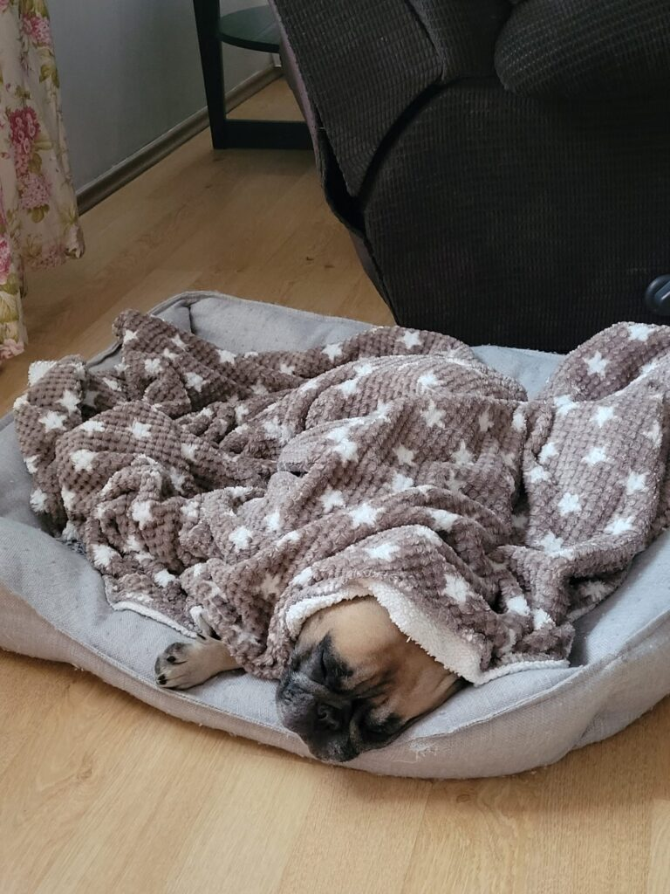

La 5.30 durerea asta încă se agață cu disperare de spatele meu. Am visat întortocheat, tot felul de situații ciudate, m-am trezit de multe ori, am numărat oile pe tavan de aceleași multe ori, tot pe spate am dormit, dacă pot să numesc ăsta somn. Azi m-am pornit din pat fără nicio întrebare de putere lansată în eter. Am uitat!

\*\*\*

Mama încă doarme. Văd pe cameră că se mișcă deci e totul ok.

Mă drăgălesc un strop cu Spiky care are ochii mici, deranjați de lumina pe care i-am aprins-o brusc în somn. Dar ea nu mă ceartă, se bucură că mă vede și îi întorc și eu emoția asta. O iubesc pe micuța asta însă mi-e un dor cât Universul de Maya mea. De mirosul ei, de ciotulețul ăla de codiță, de mutrița ei de om supărat pe viață, de toată personalitatea ei efervescentă. Na, că m-am pornit pe plâns. Care o fi rostul lacrimilor când ți-e dor? Mă uit din nou pe pozele pe care mi le trimite puiuca mea și amplific dorul. 

\*\*\*

Hai să m-apuc de treabă că nu vreau să pornesc în zi gata plânsă. Numa bine că s-a trezit și coana mare, le rezolv pe toate și mă întorc la timpul meu fermecat, de început de zi, de început de viață.

La un scroll mic pe facebook, mi se împiedică ochelarii de un titlu: ieși din pătrățelul tău dacă vrei să te promovezi! Nu am citit ce vrea să spună reclama sau articolul însă mi-a zburat gândul la fuga asta mâncătoare de timp și viață, de a face bani. Ca să ieși din mulțime, ca să te vadă lumea, trebe să faci ceva extraordinar. Nu e de ajuns să fii tu. Trebe să vii cu ceva nou. De parcă tu nu ești nou deja, diferit deja. Trebe să inventezi ceva nou. Câteodată ceva fain, dacă ai creativitatea care-ți ține spatele, alteori ceva flagrant de grosier, care frizează, ca să te faci remarcat. Ca să faci bani. Ca să ajungi la oameni. Pentru că oamenii nu vor să cunoască alți oameni, alte perspective, alte puncte de vedere doar pentru îmbogățirea simplă de spirit. 

Eu visez la o comunitate în care ajutorarea să se facă pro bono. Fără bani. Te ajut pentru că vreau. Nici măcar varianta de troc nu simbolizează comunitatea asta curată la care visez. Pentru că eu vreau să ajut fără să aștept ceva în locul ajutorului. Profa mea de curs îmi spunea o dată că e firesc să existe un schimb, o tranzacție. Oamenii se simt datori, rămân suspendați și agățați într-o energie aiurea dacă tu le negi posibilitatea ca ei să se achite. Pentru că suntem cu toții stricați în acest program de îmi dai, îți dau, nu mai știm să primim și atât, am găsit varianta: eu te ajut fără să vreau ceva de la tine. Dar dacă tu vrei neapărat să-mi dai ceva, dă acel ceva altcuiva, care are nevoie sau care ar face mai bine uz de el. Așa am închis cercul și toată lumea e fericită. E o utopie, știu, dar și scaunul a fost o idee abstractă în mintea cuiva până s-a colapsat în fizic. Totul este posibil.

\*\*\*

La mic dejun mama a vrut 2 șnițele făcute de mine ieri, din 2 fâșiuțe de piept de pui dat prin ou și fulgi de porumb. Prăjit. Că așa vrea. Iar la bilă, prăjeala face minuni iar eu sunt vinovată că sunt ascultătoare. Dar învăț să nu mai fiu. Plus cafeaua.

Pentru că era și domnul meu la masă, mama a mâncat rapid și încă mestecând s-a dus la ea sus.

\*\*\*

Copiii noștri sunt unul covidat și altul nu. Așa că le fac din drag o plăcintă caldă și îl rog pe Mr. H să mai facă ceva cumpărături și să le ducă. Să îi bucurăm. Să simtă că facem zid pentru ei, să se simtă iubiți. Dacă am face asta fiecare cu fiecare, ce planetă ar fi!

\*\*\*

Îi fac și mamei o supă și un grătar. Văd pe cameră că stă în fund, cu capul în jos. Simt că ceva nu e bine și fug sus. Da, nu îi e bine, îi vine să vomite. Stau cu ea, o liniștesc, îi spun că s-a terminat cu prăjeala și cu cafeaua, acceptă, se așează cuminte în pat. 

\*\*\*

Plec să termin de făcut treaba și curățenia prin bucătărie și-mi vine, nu știu de ce, obsesiv în cap fraza: if you can't handle me at my worst then you sure as hell don't deserve me at my best. Oricât de fain sună fraza asta, la o analiză mică, observ că mângâie pe glandă egoul dar instigă la orice altceva numa' la iertare nu. Mă surprind că intru clar într-o fază de împăcare cu starea actuală. Nu e nimeni vinovat că nu știe sau nu poate să fie lângă mine acum când e greu. Trebe să tai cordonul ăsta de așteptări care se mufează direct la victimizare.

\*\*\*

Orice fac, sunt cu ochii pe cameră. Doamne, ce trece timpul ăsta! Alo, bărbosule, poți să dai mai încet timpul?! N-am înțeles nimic din ziua mea de până acum…

\*\*\*

Mă duc la ea că e timpul pentru table, deși nu cred că va juca, la cum se simțea. Greșită presupunere! Cum să nu joace?!

În timp ce jucam cred că s-a reeditat ce s-a întâmplat cu ea când am găsit-o căzută la Moreni. Dintr-odată mi-a zis că a amețit rău, noroc că stătea pe scaun, s-a lăsat pe spate și am avut aceeași imagine ca atunci! I-am aduc un prosopel udat în apă rece, i l-am pus pe frunte, i-am frecționat mâinile, am deschis geamul să intre aer. În câteva minute, și-a revenit. Atât de bine, că mă zorea să dau cu zarul! Incredibil! Eu nu știu ce accesează bolnavii de demență dar au o anduranță anume. Asta, adunată la schimbarea rapidă de stare mentală, pentru mine e bulversantă. Eu încă eram la faza că îi era rău…

Nu i-am mai dat nimic de mâncare, să aiba stomacul ei parte de un reset, să se liniștească. Știe asta, a fost de acord că nu ar fi indicat să mănânce cu senzația asta de vomă și totuși, la un moment dat, îmi zice "Măi, dar eu nu mănânc azi?! Că nu mi-ai dat nimic azi!" Mă certa! Nu mă mai supăr nici de ce spune, nici de cum o spune, nici de ce insinuează. Îi explic din nou, iar cădem de acord, o pregătesc de somn.

\*\*\*

În duș, plâng. Să-mi spăl puțin și sufletul, pe lângă trup. Azi a fost lipită de mine o tristețe greoaie așa că las apa asta bună, cu proprietățile ei mișto, să mă curețe de toate.

\*\*\*

În clipocitul apei, îi încredințez ei recunoștința mea pentru:

1. Dezțelenirea blogului! Mai am puținel și gata!
2. Faptul că Covidul nu a dat simptomele cele mai nasoale la copiii!
3. Duș!
