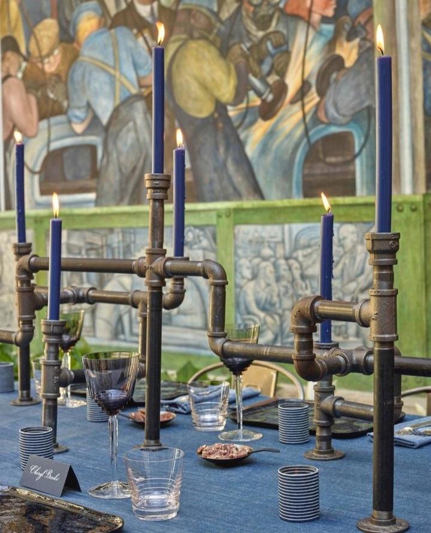

O noapte grosolană m-a năvălit cu toată forța posibilă și m-a perpelit pe toate părțile. Din ce ungher neluminat și cu adăpost hidos o fi cules mintea mea impresii, de mi-a dat așa coșmaruri, habar n-am. Că doar am încheiat ziua de ieri fain, atât pentru carne, cât și pentru suflet. 

Visam, sau mai bine zis, trăiam monstruos ce mi se derula în spatele ochilor închiși, mă agitam pe cât puteam, limitată de diverse înghesuieli care mi se întâmplă invariabil în astfel de coșmaruri, mă trezeam la momente de paroxism, suflam ușurată că realitatea e alta și adormeam, e drept cu un ochi deschis, să nu mă fure iar grozăveniile. Aiurea, carnea e mai slabă decât voința la ceas mic-mic de noapte și am tot căzut în coșmaruri până la ultimul, cel mai vivid, care m-a trezit cu o senzație ciudată: mă înecam cu o mașină căzută peste mine, într-o mlaștină.

Mintea mea apocaliptică și-n vise croșetează scenaritele alea de thriller, mai mereu am cele mai nașpa condiții și limitări în coșmaruri, niciodată nu reușesc să ajung unde vreau, nu pot merge, de alergat nici vorbă, nu pot striga, nu-mi găsesc telefonul, dacă-l găsesc, printr-un act de încordare maximă, nu știu niciun număr de telefon unde să sun, e o nenorocire de la început până la sfârșit.

La coșmarul ăsta ultim și clar cel mai impactant, am reușit să răstorn mașina și să ies, dar m-a urmărit tot timpul o senzație de dedublare. Ca și cum una bucată mine era încă în mlaștină, altă bucată mine, ieșise. Senzația asta aiurea s-a păstrat și-n minutele imediate trezirii și stau, cu ochii larg deschiși în tavan, cu respirația-mi tare sacadată, ca și cum am sprintat adineauri, și încerc să mă adun și aduc în liniștea asta cuminte din dormitor. Rememorez ziua de ieri să văd unde măcar am zărit, cu un colț de ochi, ceva care să se agațe cu atâta putere în mine, încât să se coalizeze cu coțofana mea minte și să nască așa oroare. Nope, nu-mi vine nimic. Asta și poate pentru că ieri, am tot baleiat între trecut, prezent și viitor, m-a cam trăit inconștiența, iar asta sigur a scuipat vreo mlaștină pe vreundeva.

\*\*\*

Mă scutur ușurel, sub pilotă, într-un gest carnal care-mi vine natural, ca și cum arunc cât colo impresiile ce încă mai adastă-n mine. Nu mai stau pe coșmar, nu-l mai clocesc, mă mut cu tot ce sunt spre ceremonialul meu de mulțumiri, să anulez cu plusul ăsta mare minusul inconștient din mine. Și-mi iese. Poate că fibrele mele, încă impregnate de groaza de mai devreme, sunt însetate de bun, că din agitația de sprint de mai devreme, am sărit direct în căldură de inimă. Pfiu, ducă-se!

M-am cules, mi-am luat și mănușa blănoasă, lipită torcăcios de palma mea dreaptă și ne-am scoborât amândouă spre un parter liniștit și molcom. Spiky-mi trimite, cât poate ea, liniște în vene și pe scări, mă mai scutur o dată, a despărțire finală de senzațiile ce m-au trezit.

\*\*\*

Apa caldă simplă îmi face tare bine, o beau aproape dintr-o înghițitură, a muncit fratele porc, corpul meu, toată noaptea de e așa însetat. Hai, lasă, dezmiardă-te acum, a trecut.

Cu tot dragul de mine și de clipă de care sunt tare capabilă să-l nasc în astă dimineață, îmi fac și smoothie-ul cu căpșune, banană, pară, lapte de migdale și semințe de floarea soarelui. Îmi vine apă-n gură de la miros numa', dar amân papilele gurmande încă o juma' de oră.

Cred că și Universul citește ce scriu eu aici, pe blog, că la 3 azi-noapte nu m-a mai pus să îndur mirosuri, m-am trezit și-am butat destul de repede, nici nu mi-era prea greu din coșmarurile ce mă țineau în corzi, iar mama a fost cuminte și ascultătoare. Acum e trează și ea, mă uit pe camera de supraveghere și-o văd cum își aranjează patul. Foarte bine, azi e ea, cel puțin partea aia care a ținut întotdeauna la curățenie. O s-o testez în puțin timp, deocamdată îmi savurez și eu clipele dimineții.

\*\*\*

Nu am prea mult timp, dar p-ăsta cât e, îl împrăștii cu generozitate pe antichități. Mi se pare fascinant să dau peste câte-un obiect care nu mai are corespondent în zilele noastre, moderne, și îmi dau seama cât de mult ne-am îndepărtat noi de natură și de materialele naturale. Sinteticul e peste tot, plasticul la fel și cred că astea ne vor sufoca într-o bună zi. Poate ne trezim totuși, fiecare în pătrățica lui.

\*\*\*

Da, antena mea a receptat corect starea mamei, chiar e prezentă în ea, cel puțin are bucăți mari din personalitatea pe care o recunosc atât de ușor. Chiar dacă intră pe modulul de repeat, în rest o văd, are momente spumoase, râde cu poftă, e veselă și mă aduc și eu, tot spumoasă, lângă ea, nu pot rata momentele astea pentru nimic în lume. Închid ochii la repetiții, le ignor voit și le șterg din prezentul nostru și micul ei dejun mi se pare unul normal, așa cum era acum mulți ani în urmă. Mă scald cu tot ce sunt și simt în căldura senzației ăsteia, să mă îmbib de ea, nostalgic, că nu știu cât o ține. Demența asta te face să trăiești și să locuiești efectiv în clipe.

\*\*\*

Cu aripi mari, fâlfâinde, plec spre clinica unde este Sett, să-i duc medicamentele necesare și astfel să mai reduc din costurile internării.

Am în mine ceva imbatabil și descurajator pentru exterior că nimeni și nimic nu-mi strică elanul meu de a fi ok. Francezul patruped e bine, încredibil de bine, sunt uimită de reziliența animalelor în general, dar de cea a lui Sett, în mod particular, care mi se pare un animal fenomenal. E bun, iertător, cumincior, minunat. Se bucură când îmi aude vocea, îmi recunoaște și mirosul, deși nici eu nu-i sunt tocmai familiară, ne știm doar de vreo lună și am stat doar 2 zile împreună, ambele cu plimbări pe la medici, adică prin locuri nu neapărat plăcute. Dar el iartă și iubește. Câte avem de învățat de la necuvântătoare. Poate tocmai d-aia sunt necuvântătoare, să nu ne dea toate învățămintele mură-n gură, ci să ni le trăim pe pielea noastră, pe inima noastră, pe suferința noastră. Dar să știm că ele sunt acolo și doar dau.

M-am așezat pe podea iar el, așa cum știe el să facă, a venit și mi s-a așezat pe picioare. Da, Settuț drag, e momentul de drăgăleală, sunt plină oricum de o stare balsam, îți dau din belșug și ție, să-ți aline și carcasa asta cusută proaspăt de-a lungul coloanei, dar și sufletul avid de iubire, de căldură, de familiar. S-a sudat între mine și el un canal prin care circul doar spre el și doar el spre mine, e unul al nostru, intim, și mă uimește puterea și modul cum comunic cu puiul ăsta, atât de ușor și atât de repede. El absoarbe toate cuvintele mele și energia lor caldă, iar eu îmi iau înapoi toată mulțumirea lui tăcută pe care-o simt expulzată prin ochii cu care mă privește. Ei poftim, când am devenit atât de senzitivă?!

Plec puternic impresionată și de el, dar și de mine, și mă strânge un strop plânsul lui din spatele ușii închise. Nu mai e mult, pui mic, și te duc acasă, la ai tăi. Ai puțintică răbdare.

\*\*\*

Pentru că sunt în zonă și pentru că am primit invitație, că eu doar așa funcționez, trec și pe la una din cele 3 prietene ale mele, să bem o cafea. 

E prima oară când o vizitez în apartamentul ei de când i-a devenit proprietate, așa că are cafeaua asta și aromă de sărbătorire, după atâția ani de stat în chirie, în același apartament. Ciudat cum schimbarea unei stări naște într-un om, în niște adâncuri de-ale lui, traumatizate sigur, un firicel de siguranță. Mă bucur curat pentru ea, nu atât pentru apartament în sine, cât pentru sentimentul ăsta nou apărut în ea.

Eu cred că e esențial să te simți safe. Pentru că tripletul corp-minte-inimă pentru asta trage toată viața, să te țină în viață, în siguranță. Cred că atunci când te faci safe, ești capabilă să ajungi la sămânța ta vulnerabilă și s-o lași în văzul lumii, al tuturor, fără picătură de teamă de judecată. Sau, și dacă vine judecată, să nu te mai strângi ca melcul. Dar îți trebe cohones să te lași safe. Să îți permiți siguranța. Și, evident, multă practică să rămâi acolo.

Cât de bine mi-a făcut cafeaua în livingul ei cu priveliște superbă, cu ea la o bârfă de inimă sau doar la schimbat de cuvinte. Cât de mult bine îți face o altă ființă umană, fără să facă ceva în mod special, ci doar să fie acolo, să-ți facă spațiu în viața ei, să te lase să fii. 

\*\*\*

Bag și o rundă de cumpărături, tot sunt pe drumuri. Un pic de "somon" vegan, câteva lămâi, un mango, 3 "fursecuri" și s-a dus milionul de lei vechi. Ce nebunie de vremuri trăim!

\*\*\*

Până-n prânzul mamei, distribui impresiile mele despre Sett pe toate canalele deschise: cu părinții lui, cu fiecare în parte, dar și cu femeile mișto care m-au ajutat să strâng banii necesari pentru operație. Toată lumea vrea să știe cum e Sett și mă bucură tare mult că pleacă spre el și șuvoi de gând bun. Cu toate premisele astea, cum să nu iasă?!

\*\*\*

Mama s-a retras din ea, probabil c-a plecat în vremurile în care s-a simțit ea cel mai bine, în afară de mici sclipiri, răzlețe, în ochi, nu are prea multă viață în ea, la masă. Din delicatețe, n-o forțez, deși recunosc că îmi vine s-o păruiesc pe demența asta care a furat-o atât de repede. O las în ritmul ei, să n-o sperii sau s-o jenez în vreun fel. Doar mă asigur că-i țin funcțional corpul și sper eu ca el s-o mai primească în viitorul apropiat pe mama mea, cea pe care o știu eu.

Furia asta din mine o vărs afară, în curte, înarmată cu grebla, când nivelez castelele mari și multe, ridicate deasupra pământului de clanul The Moles. Apar castelele astea la noi în grădină ca Făt Frumos, într-o zi cât altele, de prin alte bătături, într-un an. Ce castel visam eu și ce a înțeles Universul ăsta…

\*\*\*

Restul zilei mi se scurge cumincior, cu citit, cu învățat, cu mine toată răsturnată-n sacul curiozității, îmi place să aflu, să decelez informații și să le pun acolo, în folderul cu lucruri de făcut când oi avea timp. Mi se pare că am dormit nepermis de mult în viața asta și-am devenit o sugativă de tot și toate. Dar cel mai mult mă bucură faptul că curiozitatea asta e o unealtă prin care-mi practic discernământul. Naivă cum mă știu, acolo, nativ, în mine, mă urmăresc să văd cât de repede fac click la o informație, cât de puțin îmi ia să simt că-i adevărată sau nu, pentru mine, iar ăsta a devenit un joc mișto.

\*\*\*

Mi se adună totuși oboseala în oase și seara pic din ce în ce mai frântă. Alung gândul ăla negru că și la noapte, la 3, îmi dau trezirea și mă aliniez să-mi rememorez mulțumirile de peste zi:

1. Reîntoarcerea mamei în ea!

3. Cafeaua cu aromă de prietenie curată!

5. Iubire!

Clipa mea de fain:

David Stark design
