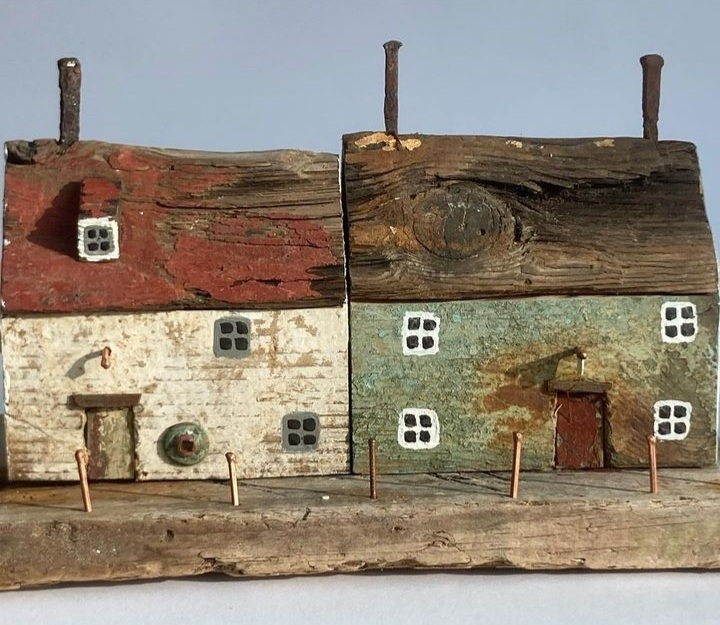

Alarma lui Mr. H s-a insinuat încetișor sub genele mele închise, în spatele cărora am adunat o noapte de somn adânc. Nici nu știu când am adormit, nici nu m-am trezit peste noapte, a fost o plecare atât de plecare, că dacă nu era alarma, probabil că mai intra o săptămână. Ooo, mă simt ca un prunc! De mult n-am mai avut eu așa o odihnă faină, un somn atât de legat și atât de gol de vise. 

Cred că ieri, fără să vreau și fără să-mi dau seama, am curățat niște bălți stătute de prin mine, am aerisit niște impresii ce nu-mi miroseau a bine, am eliberat niște stihii, ce cărau greu după ele, percepțiile mele scrijelite grăbit, sub imperiul unor emoții odată al naibii de greu de dus, că d-aia mi-am și luat privirea de la ele. Și-n spațiul ăsta primenit, mi s-a așezat blând o liniște și o acceptare, care-n material s-a tradus cu un somn buștean. Acu' nu știu cât o să-mi iasă și purjările astea, că nu e de ajuns doar să zic că vreau, trebe să mă calibrez pe unda aia de vibrație aferentă, care are aceeași culoare, și de acolo să-mi declar voința și dorința, dar mi-e clar că am avut parte de o super lecție valoroasă. Dacă tot sunt aici, hai să-i trimit Universului un mulțam și pentru asta, și pentru că sunt, și pentru că viață, și pentru că trăiri, și pentru că sunt atât de multe pentru că-uri.

Mi-am păstrat candoarea de prunc și-n ceremonialul de recunoștințe, pe care l-am depus inocent la picioarele imensei inteligențe iubitoare sau iubirii inteligente care mă conține. Bun așa.

\*\*\*

Rutina dimineții mi-e un strop distorsionată de pregătirea lui Mr. H să plece la birou dar nimic, nicio schimbare, pare că nu-mi alterează starea asta de roz, cu urme de somn portocaliu pe la margini, ce m-a alcătuit în dimineața asta. 

Rămasă singură, pentru că Spikylina l-a însoțit pe domnul meu spre mașină și apoi a cotit spre câmpul infinitelor posibilități de mirosit, de vânat, de zbenguit, îmi încep dimineața cu o inimioară trimisă copilei mele. Mi-e un dor imens de ea, de viața noastră de dinainte de tutorialul ăsta al demenței, care îmi dă lecție după lecție. Doamne, nu știu unde s-au dus 22 de ani din viața mea și a ei, dar știu că încă sunt zile când am în nas mirosul ei de bebeluș atât de intens, că mă transportă, brusc și cu totul, într-o cameră de spital de stat, în care-am adus-o în lumea asta. Multă vreme am considerat că e "a mea", de ceva timp am înțeles de fapt că ea a venit prin mine și atât, am fost portalul ei spre o lume de senzații. Chiar și cu înțelegerea asta, e ceva în sângele meu ce-o strigă mut și, de multe ori, în momente de cumpănă, gândul la existența ei m-a ținut și pe mine în existență.

Adun o zuză mică și înghețată de afară și-o fac colac în jurul mâinii care-o mângâie și-o răsfață. Îmbin torsul meu, a plăcere la văz de documentare de călătorii, cu torsul Chichiricăi, și avem amândouă o dimineață magică.

\*\*\*

Exact ca-n filmul Allie McBeal, când visează ea mai abitir la floricele pe câmpii, iar realitatea e atât de plină de ciulini pe cărare, că se aude ca un pick-up deraiat, așa-mi trage și mie mama covorul fermecat de sub tălpi și-mi refuză micul dejun. Nu am timp să mă ambalez prea mult, pentru că azi trebe să mergem la psihiatrie, bifăm referatul pe ramura asta a medicinei din minunatul dosar de ajutor de îngrijitor pe care l-am început.

Pentru că informația asta nu vrea să intre sub nicio formă în hipocampusul ei, îi scot hainele și mă apuc eu s-o îmbrac, repetându-i regulat că mergem la doctor. E docilă și în timp ce o îmbrac, mi se topește toată judecata și e înlocuită de o compasiune plină pentru ea, ca ființă, pentru ea, ca om. În ritmul ăsta de descărnare, în curând chiar o să fie și fizic un copiluț, nu doar mintea ei se micește, ci ea cu tot ce e ea.

\*\*\*

De abia când am ajuns în DN, am putut să mă întorc în prezent, până atunci mintea mi-a zburat să culeagă amintiri din trecutul mamei mele, care se lovesc uimite de un prezent al unei alte femei, greu de anticipat vreodată de oricare dintre noi două, dar greu de dus pentru mine și un refuz conștient de imaginare a oricăruii viitor, oricum total imprevizibil. Drumul e aglomerat, dar adusă înapoi în timpul ăsta al nostru, împreună, sunt capabilă să mă bucur că mama e cu mine, acum și aici, și dau drumul la radio, să curgă muzica, pe care ea o asculta și-o cânta și-o dansa la ea acasă, în fiecare zi, când era normală. Pardon, când era bine. Nu am îndrituirea să decid eu ce e normal sau nu, cu toate că societatea asta încadrează neglijent în funcție de criterii "unanim acceptate". De când m-am trezit la o realitate altfel decât asta unanim acceptată, am mereu tendința să sparg tipare, să nu mă mai supun fără să cercetez, să fac un pas în afara turmei. Nu că-s mai fucking special, ci pentru că am o altă busolă acum.

Limbajul corporal al ei îmi spune că-i e bine, o observ cu coada ochiului și mă gogoșeșc. Mă întreabă câți ani are. Știu de ce mă întreabă, dar nu știu dacă va reuși să rețină informația și s-o livreze doctoriței atunci când va fi nevoie. Din nou, mă inundă, peste margini de pleoape, duioșia, și-mi vine s-o țin de mână și s-o asigur că nu se va face de râs, că nu contează nimic din ce e afară, că n-a contat oricum niciodată și că s-a ciopârțit inutil. Dar știu că nu mi-ar înțelege nici atingerea, nici gestul, iar de pătruns gândul e prea mult să cer.

\*\*\*

Se vede că nu face mișcare, de la mașină până la clinică ne-a luat o eternitate. Ăsta este poate cel mai mare of al meu în ceea ce o privește, chiar mai mare decât mofturile ei culinare: lipsa de mișcare. Deși o oblig să se dea jos din pat cel puțin de două ori și să coboare la masă, nu reușesc, în niciun chip s-o scot din casă, la plimbare. Dățile în care profit de un mers la doctor și chipurile, lipesc de drumul ăla și niște cumpărături și astfel o forțez să vină cu mine, de multe ori nu vrea să se dea jos din mașină. Iar atunci când o face, mă ține atât de strâns de braț, că-mi înfige unghiile în carne, prin haine. Are o frică și-o oroare de afară, indiferent că e într-o zonă cu lume sau în liniștea curții noastre, care mă lasă dezarmată total. Aproape mereu, după o astfel de experiență, are nevoie de o perioadă de timp de decompensare, care mă strânge în suflet. Mi se face așa o milă de ea, că nu mai știu care e răul cel mai mare.

În timpul consultației, am parte de alte menghini pe la suflet. Da, doctorița a întrebat-o câți ani are și ea a știut răspunsul, dar la următoarea întrebare, capcană pentru o minte deranjată, când s-a născut, n-a mai reușit să-l găsească . Pe măsură ce întrebările cădeau ghilotină peste ea, se făcea mai mică și mai mică și vedeam cum se închide, chircită și rușinată. Nu, nu a fost impresia mea. Am știut, în mine, în cordonul ăla ombilical invizibil prin care noi două nu ne-am despărțit de fapt, total, niciodată, în viața asta, că o doare cumplit neputința, frângerea de mâini mi-a validat și fizic asta. Luminițele palide care se aprinseseră pe drum, de la muzică, se sting acum, una câte una, într-o tăcere în care ea nu mai știe răspunsuri. 'tu-i mama ei de boală!

Deși plâng în interior, în mașină cântă muzica iar eu, spumoasă de fațadă, spun bancuri, din ce îmi mai aduc aminte și-o ademenesc cu un desert delicios, pe care fug să-l cumpăr după ce o las acasă. Trebe să iau și noul tratament psihiatric medicamentos, așa că oricum ies. În efervescența mea, în agitația mea voită, în zgomote și cuvinte multe, în mașini venind și plecând pe lângă mașina noastră, rușinea trăită de mama nu a apucat să se transforme într-o amintire și a fugit speriată, ea știe unde. Mama zâmbește, s-a descleștat, a uitat. Yep, agonie și extaz.

A uitat și desertul decadent promis și aproape că începe să se fandosească la mâncarea de prânz, în condițiile în care nici mic dejun nu a avut, dar am căpătat dexteritate în luatul prin învăluire așa că, după puțină împiedicare, masa a decurs binișor și a mâncat îndeajuns încât să mă declar satisfăcută. Și ea, la fel.

\*\*\*

Începe să mă roadă pe la tâmple o durere de cap. Pe bune?! De la ce?!

Somn mișto am avut, apa mi-am băut-o, smoothie-ul la fel, cu emoțiile nu prea m-am înțeles eu să le țin la limite sănătoase, dar nici nu cred că am sărit calul prea tare, încât să mă faulteze atât de rapid. Mereu am băgat scuza colecistului leneș, dar câteodată chiar nu am de ce s-o scot p-asta la interval. În fine, nu-mi arde de prea multă analiză, așa că mă așez și eu la o orizontală, poate dacă-mi trag sufletul o țâră, mă iartă sora durere. 

Nu, se încăpățânează să mă facă acut atentă că-mi e prezentă-n miez de cap, dar și eu am nervi de oțel și mă fac că plouă, mai un pic de ordine, mai câteva pagini de carte, mai câteva rânduri de scris. 

\*\*\*

Ziua de azi a fost o struțo-cămilă, a început diafan și se închide grosolan. Deși durerea mă scormone prin arcade, mă scormon și eu de recunoștințe pentru:

1. Întâia noapte de somn (într-o perioadă mare de timp), ultima noapte de superficialitate!

3. Ființa asta cum nu e și nu va mai fi alta pentru mine, în viața asta, ce mi-e pui!

5. Demența care îi ia mințile mamei când nu trebe, dar și amintirile neplăcute când trebe!

Clipa de frumos mi-a fost:

Kirsty Elson driftwood
