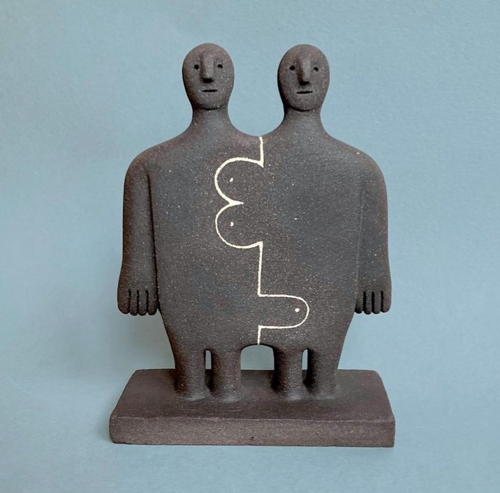

Nu am dormit deloc. A fost noaptea zero, din multe puncte de vedere.

Cu o minte angoasată și hiperactivă, am făcut scenarii, planuri, calcule, analize și iar scenarii, planuri și calcule. Făceam un set, îmi mai venea câte-un gând sau vreo părere, dărâmam totul și o luam de la capăt. Și, deși e sugrumător de energie, la mine e un puț nesecat și abisal de croșetări. Am încercat să mă aliniez, mental și emoțional, cu noua situație: boala mamei își ia vămuiala și de la relația dintre Mr. H și mine. Cum e și firesc, de altfel, că suntem oameni, nu supereroi, cum ne visam eu. 

În anul ăsta în care mi-am adus la lumină demonii latenți, în care mi-am născut alții noi, că parcă nu mi-erau de ajuns ăia vechi, deja mulți, în care am văzut și simțit orori și le-am internalizat, în care m-am luptat cu zdrelituri și apoi m-am domolit, da' nu de tot, ci cât să-mi trag sufletul o țâră, ca s-o iau de la capăt, anul ăsta care mi-a ars părți de suflet și bucăți din mine, ce oricum nu-mi mai serveau, el nu s-a mai simțit parte dintr-un noi. Nu a mai primit atenția mea toată sau măcar câta avea nevoie, la limita de supraviețuire a părții lui din relația noastră. S-a simțit insuficient pentru mine, incapabil și neputiincios. Și ce faci când te simți așa? Vrei să pleci din locul ăla, că nu-ți place slăbiciunea ta și vrei s-o bagi sub preș. Știu atât de bine cum se simte asta. Cum se simte când vrei să-l faci bine pe cel de lângă tine, dar n-ai cu ce și nici n-ai cum. Cât de necuprinzător se simte, când nu poți defini un orizont de timp pentru "problema" apărută, când totul e necunoscut și imprevizibil. Dar, mai ales, știu până la sânge, cum e să te simți "mai puțin". Așa că l-am înțeles în fibrele inimii, chiar dacă alea de carne refuzau să audă și să vadă și să simtă.

Deși mi-a tremurat corpul întreaga noapte, de-mi clănțăneau dinții-n gură de atâta trăire, deși m-a durut cumplit în capul pieptului, acolo unde somatizez eu de obicei, de abia pot respira, sunt capabilă să văd că nu-mi doresc nicio manipulare emoțională sau vreun șantaj de suflet, nu judec în niciun fel nicio fugă, că și eu am fost și mai sunt p-acolo, nu vreau să am discuții care să scormonească aiurea, cu de ce-urile în proțap. Sunt convinsă că nici nu știm să ne exprimăm acum. Și poate că e mai bine așa.

\*\*\*

Nu știu când au venit zorii zilei peste tremuratul meu. Știu însă că, pentru prima dată în viața mea, nu m-am pus în fund să plâng de-un trecut și am sărit în picioare să-mi trăiesc un prezent și să-mi gândesc un viitor. 

Tot în dimineața asta, pe care nu mi-am dorit-o în viața asta, sau cel puțin nu la momentul ăsta de viață, sunt capabilă să privesc în ochi marele balaur al zilelor mele, demența mamei, și să-i mulțumesc sincer pentru ce mi-a dat: o imensă lupă cu care să-mi cercetez, cu aplecare și aviditate, clipele. 

De câte ori am avut, de-a lungul vieții mele, suferințe emoționale, aproape mereu, fără greș, am dorit să-mi fac rău fizic: nu mai mâncam, nu mai dormeam, fumam la greu, atunci când încă fumam, beam cafele peste cafele, era o autodistrugere masivă. Well, de data asta, cu toată furtuna din mine, am prins tiparul ăsta al meu de-un crac și l-am luat la întrebări. Da, mi-a venit să fumez, pentru prima dată în 7 ani de când n-am mai pus țigară în gură, dar n-am făcut-o. Am văzut tendința, dar am fost capabilă și îndeajuns de puternică să nu mai cedez. Tot mi-am băut apa caldă, tot mi-am făcut smoothie-ul și ceaiul. Iar asta, deși poate părea mic, pentru mine e imens. 

\*\*\*

Mi-a trebuit toată puterea din lume s-o aduc pe mama la micul ei dejun și să înfrânez în mine orice judecată aș putea avea pe situația generată de boala ei, dar și orice emoție care ar putea să treacă, prin intensitatea la care simt în aceste momente, zidul ăla dintre noi două. Parcă și simt cum trosnesc emoțiile în mine, înfrânte de o voință inumană. Tot ce vreau să fac acum este să respir și atât, să fiu cât mai atentă pe asta, ca să nu intre niciun gând în spațiul din mine unde acum e durere. Vreau să-mi distilez interiorul și să las să fie durere pură, fără alte brizbrizuri, care s-o facă insuportabilă. Durerea, în starea ei curată, nu e cocârjătoare de inimă, dar dacă începi să croșetezi pe lângă ea, te duci în cap direct.

Mama n-a observat nimic, dar eu mi-am auzit respirațiile devenite oftaturi din rărunchi. Nu mi-a ieșit doar partea cu respiratul. 

\*\*\*

Mă urc în mașină și plec. Să stau aici, acum, mi se pare extrem de greu, vreau să mă duc într-un loc cu multă lume, să-mi împrăștii din preaplinul nefast dinăuntru, dar să mă și adun în părțile de unde să pot să mă nasc nouă. Mă întâlnesc la mall cu prietena mea și ajunsă acolo, realizez că a fost o prostie să cred că baia de mulțime îmi poate face bine. Nu, nu-mi face, pentru că oamenii veniți la mall, parte din ei sunt veniți la defilare, deci sunt falși, altă parte din ei sunt veniți la cumpărături, deci sunt goi, iar alții, câțiva, or fi tot ca mine, cu inimi grele, care poate vor să uite, distrași de împrejurimi.

Nicicând nu mi-a fost mai clar că vindecarea nu poate veni decât din mine, nu din afara mea. Singurul lucru care mi-a făcut bine a fost ființa asta care a venit lângă mine, cu mine, pentru mine, prietena mea.

\*\*\*

După o noapte și o juma' de zi, în care am râșnit în mine o despărțire ce mi se părea inevitabilă, în care am crezut, naivă, că voința și dorința se evaporă, așa, dintr-odată, tot comunicarea a fost cea care ne-a luminat căile: pe-a mea, că sunt într-adevăr iubită de el și că asta nu a fost niciodată sub semnul întrebării în ecuația noastră, și pe-a lui, că se autosabotează și proiectează asupra mea temerile de a nu fi îndeajuns, în loc să se privească și să se accepte fix așa cum e. Că fix așa îl iau și eu, cum îl percep, și cu bune și cu rele.

Când te apuci de făcut curat, deranjezi niște putori care stau așa de liniștite acolo, într-un hău din tine, încât atunci când se stropșesc la tine că le-ai scărmănat, se lasă cu zoaie grele. Văd eu că nu doar pe propria persoană, scoți demoni și la cei din jur. Eu nu m-am crezut în stare să le duc nici doar pe-ale mele, dar uite că Universul, inteligența asta care le mânuie abil pe toate, nu vede la fel. 

Cât despre noi doi pot să spun, atât de clișeic, dar cu o convingere fără limite, după ce am trăit prăpăstios în mine, că ce nu te smintește, te face mai umil, mai recunoscător, mai puternic, mai incluziv. Relația noastră s-o fi clătinat sub apăsarea demenței, a fricilor și autosabotajului, dar s-a cimentat un strop mai mult, când am adus la rădăcină liantul cel mai important: comunicarea de suflet, din suflet, autentic. Și am înțeles visceral că, deși câteodată, cu un om pe care-l iubești, îți vine să faci orice să-l reții, abținerea de la asta și datul de libertate, să facă orice vrea și poate să facă, îl aduce de fapt mai aproape de tine, fizic și emoțional. 

\*\*\*

Am strecurat, destul de absentă, prin tot filmul în care joc de aseară, și prânzul mamei. Din nou, mănâncă puțin, din nou vrea sus repede.

Nu pot să nu mă compar pe mine, asta de la prânz, cu mine, aia de la micul dejun și să nu mi se pară, la o privire obiectivă, că emoțiile sunt niște furtuni în pahare de apă, care ne consumă ca niște căpcăune lacome. Dar, chiar și așa, nu pot să nu le dau creditul pentru diamantele pe care le scot ele la lumină din noi, din fiecare, atunci când vrem să stăm în ochiul furtunii și s-o acceptăm și s-o lăsăm să treacă.

\*\*\*

Chiar dacă am depășit momentul, această vineri neagră mi-a mai dat la gleznele încrederii o țâră și m-a făcut atentă la zdruncinăturile ce pot apărea pe drumul, deloc ușor, al unei relații. Am învățat un lucru, cu prețul a câtorva centimi de naivitate: nicio relație nu e "mie nu mi se poate întâmpla". Ba da, se poate întâmpla orice, oricui, oricând. Așa e de când lumea și pământul și așa va fi mereu, acum pot muta munții, mâine pot să-i simt prăvăliți peste mine.

\*\*\*

Mama doarme de pe la 5, pic și eu frântă, mă simt doborâtă și de oboseală fizică și de intensitate emoțională. 

Îmi închid ziua, căreia nu vreau să-i pun nicio etichetă, pentru că zău dacă știu pe care să i-o atașez, rotund, închid cercul ritualurilor și sunt recunoscătoare pentru:

1. Puterea de a rămâne în picioare în condiții în care în vine să mă scufund total!

3. Existența prietenei mele în viața mea!

5. Iubire!

Frumosul zilei extreme:

Peter Lubach
