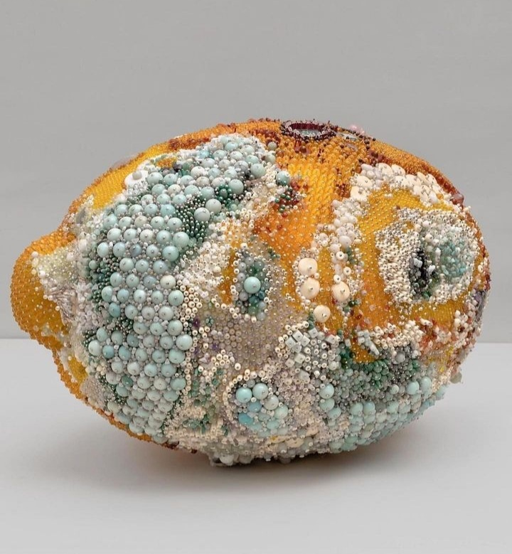

Azi noapte a fost noaptea de decartare, așa cum vine de obicei când mi se adună multă oboseală, și-n pliuri de carne, și-n cute de minte. Deși m-am trezit cu direcție clară la ora 3 noaptea, am executat cu precizie chirugicală complicata operațiune de a-i da mamei pastila, ceva miraculos a blocat aprinderea luminii la mansardă, mintea n-a pornit haotică să-mi dea soluții la probleme pe care nici nu le am, și am adormit like a baby girl până dimineața. Iar trezirea, și de carne și de minte, s-a făcut cu gentilețe, ca și cum o Bianncă, ce a fost trează și a supravegheat de la pupitrul de comandă toată noaptea, a avut grijă să mă ocrotească, să nu mă bruscheze, să nu mă arunce brusc într-o nouă zi. Mi-am luat, în palma asta caldă care îmi ține trezirea, câteva clipe să-mi rostesc, în mine, pentru mine, mulțumirile dar, deși ritualul a curs, nu m-am putut strecura cu totul în buzunarele recunoștințelor, am fost doar pe jumătate acolo, în miezul cuvintelor și senzațiilor aduse de ele în interiorul meu, parcă am așa o grabă să sorb din ziua asta, care-mi începe blând. Atât de grăbită sunt că am uitat să-mi pun și eu o intenție pentru ziua de azi. Să lansez așa, în eter, mai mult pentru mine decât pentru Univers, o provocare care să mă momească și mobilizeze într-o direcție cu vibrație o țâră mai sus. Plutește în casă o stare nașpa și vreau s-o spăl un pic, s-o aerisesc cu o gură de energie vie, proaspătă, neîntinată.

***

Afară e frig tare, iar Spiky încă nu-i lămurită unde vrea: face ture, ba vrea în casă, ba freacă tocul ușii dinăuntru să iasă spre libertate și mirosuri, ba p-ală d-afară să intre la căldurică.

Brrr, chiar e frig, l-am simțit și eu pe la picioare, în iterațiile nehotărâte ale blănoasei, dar rog apa să mă inunde cu căldurică. Doamne, cât de norocoasă sunt că am un acoperiș! Că nu mi-e frig! M-a luat gândul ăsta pe aripile lui și în câteva secunde, așa m-am scufundat cu toate ale mele în atât de multe "doamne, ce bine că"-uri, încât am înțeles de ce adineauri nu-mi ieșea ritualul. Ca mai mereu, imboldul din afara mea funcționează maxim, abia acum mă încălzesc în adâncurile mele cu adevărat. Și nu e de la apă.

Tot din categoria "ce bine că", mulțumesc plin și pentru smoothie-ul bun și pentru ceaiul de măceșe zdrobite și salcâm. Iar azi am simțit că pare un pic strâmb să mulțumesc doar pentru un rezultat final, ci firescul este să salut și recunosc tot eșafodajul care a permis rezultatului final să se manifeste în viața mea. Că în acest eșafodaj sunt și eu, cu consecvența mea, cu tenacitatea mea de a face lucrurile atunci când mă setez să le fac, și e și alinierea cu flowul Universului, care m-a luat cu el în curgere, să împlinim ce e de împlinit. Încerc să nu mă mai uit și să nu mă mai șuntez din ceremonialul de mulțumiri, pentru că merit să fiu acolo, mereu. Eu, cu instrumentele mele din viața asta: corpul, mintea și inima.

***

Cred că uriașul blând, miorlăitorul Hitlerică, are senzor la lumina din bucătărie, cum se aprinde, cum își croiește drum, de pe unde o fi, spre terasa noastră. Îi deschid ușa larg, poate simte căldura și din vocea mea și din bucătărie și vrea și el să se adăpostească cu noi sub același acoperiș, mai ales acum, când afară strânge gerul atât de tare. Mi-au înghețat gleznele, stau pe jos, să fiu mai aproape de nivelul lui, îi vorbesc calm, parcă ar vrea să intre, dar el nu știe ce e aia o casă și nu are curaj. Cu toate astea, avem un progres, ne-am privit sufletele prin ochi mai mult timp și cred că începe să-mi cunoască și deosebească vocea. E un pas. Oricât de mult aș vrea eu să-l bag în casă, să-l mângâi, să-i fie cald și bine, nu-l pot lua cu japca, va veni când va fi pregătit.

Uite așa, pe nesimțitelea, a apărut și primul to do pe firmamentul zilei de azi: să-i fai o cușcuță și să i-o pun pe terasă. Până s-o hotărî sălbaticul din el să se lase îmblânzit, măcar să nu stea în frig și ploaie.

***

Apetitul pentru pâine cred că mi l-a vârât mama într-una din genele pe care mi le dat cu ocazia vieții, așa-mi explic eu pofta mea pentru aluaturi: și mama e la fel de avidă după ele ca și mine. Doar că, în zilele astea ciudate, nimic din ce știam nu se mai aplică.

Pentru micul dejun de azi dimineață, a trebuit s-o trezesc, s-o las să se adune că e tare buimacă și amețită, și s-o cobor aproape în cârcă, se sprijină cu tot corpul pe mine, au blegit-o medicamentele astea de tot.

O juma' de feliuță de pâine și 2 pătrățele mici de cașcaval mai târziu, mă surprinde virulența cu care mă cert în mine cu medicina alopată. Păi dacă medicamentele pentru demență te fac legumă, dacă îți reduc nu numai calitatea vieții atât de dramatic, ci chiar dorința de viață în sine, de ce se mai prescriu? Pentru că nu am cohones îndeajuns eu, dar nici nu am un partener de drum cooperant în ea, nu am curajul să opresc medicația mamei și să o trec pe un regim de viață sănătos, cu multe legume, fructe, grăsimi bune, mișcare, iertare. În zile ca asta, m-aș mulțumi să mănânce orice, numa' să mănânce.

Vederea mamei în halul în care este, e nu numai o traumă, are, ca orice în viața asta de altfel, și o parte educativă: îmi trage cu atâta forță clopoțelul de alarmă din mine care-mi urlă să n-ajung așa, încât se mai așează încă o cărămidă grea, plină toată cu hotărâre, la fundația aia pe care o vreau eu în noua mea viață sănătoasă.

***

Încă sunt în clipă, nici nu aveam unde să fiu altundeva pentru că de abia ce am urcat-o și depus-o în pat ca pe o batistuță, așa-mi pare că e de ușurică, și mă așez și eu în living, să-mi adun plângerile ce mă încearcă. Și cum stau eu așa, pipăindu-mă cu atenție prin emoții, îmi surprind cu un colț de ochi manșeta de la hanorac care vibrează în ritmul inimii.

Deși așezatul ăsta era făcut pentru stăvilirea emoționalului, uite cum carnalul îmi arată, subtil, că trebe să mă întorc la mine, mereu și mereu la mine, să nu mă mai zdrelesc emoțional, să nu mă mai zburătăcească frica într-o mie de zări. M-a cuprins așa un drag și o căldură pentru inteligența asta care mă animă, fără ca măcar să fac un efort pentru asta sau să merit, un drag pentru corpul care mă susține, la propriu, cu toate grelele pe care i le pun în cârcă, și la propriu și la figurat.

Iar în revelația asta de-o clipă, o mișcare pe ecranul tabletei, unde rulează filmul vieții mamei înregistrat de o cameră de supraveghere, mi-a atras atenția: mama stă pe marginea patului. Apoi, cu mișcări extrem de mici, își aranjează patul, așa cum poate și așa cum crede ea că se aranjează un pat. Încununarea efortului făcut este transcrierea listuței cu numere de telefon și zile de naștere, ocazie cu care descoperă că e ziua soră-mii și notează pe o margine de rebus "de sunat" și numele ei.

Am mai întrezărit reziliența asta la mama în perioada de când e la mine, dar recunosc că acum m-a înduioșat până în prăsele și m-a impresionat imens. Nu am privit-o pe mama niciodată puternică și totuși femeia asta e mai tare ca Die hard 100. În lumea ei, în haina asta greu încercată în care s-a îmbrăcat în viața asta, cu cât a știut și a înțeles ea, a căzut de multe ori, dar s-a ridicat de multe ori plus 1. Oarbă am fost să nu învăț eu nimic de la ea până acum, noroc că mi-a mai strecurat prin gene chestii faine. Sper ca alea rele să fi rămas în vreun filtru sau să am puterea și determinarea să nu le creez mediul de activare.

***

Chiar dacă încerc să-mi schimb percepția, viața mea de acum are câteva jaloane mari și late în jurul cărora gravitez: curățenie, mâncare, cumpărături, iar asta mă doboară câteodată prin rutină. Chiar dacă ascult podcasturi noi când fac curat, tot curat fac, chiar dacă fac mâncăruri noi, tot fac mâncare, la fel și cu cumpărăturile. Azi e zi de gătit și, dacă aș avea minunata șansă să mă eschivez, ar fi o bucurie de copil. Dar nu o am. Mă înarmez cu un podcast și-i dau bice. De fapt, linguri de lemn, ca să fiu cât mai acurată.

Învârt în meiul ce se fierbe și-n minte frământ ideea asta a consecvenței. Asta trebe să-mi fie literă de lege, să rămân cât mai mult în dorința de a nu capitula, de a mă bucura de viața asta care e fabuloasă, chiar dacă la mine nu mai pare așa câteodată, sau de multe ori.

Îmi dau seama că toți vrem să fim de nota 10. În toate, dacă se poate. Eu n-am întâlnit și nici nu cred că o să întâlnesc pe cineva care să-mi zică "hmmm, eu sunt ok și dacă sunt pe la 6". Toți avem în noi setarea din fabrică să țintim sus, la cel mai înalt potențial al nostru. Păcatul este că nu ne și comitem să ajungem acolo, ne pierdem pe traseu, furați de fata morgană sau de mirajul cuceritor și oblojitor al lui "Dacă e prea greu, înseamnă că nu-i pentru mine!".

În anul ăsta ce mi s-a scurs cu demența-n casă, am reușit să aduc lumină în asta: dacă dorința mea este să fiu de 10 în fața altora, e doar de defilare seacă, fără substanță, n-o să-mi iasă. Dacă însă-mi păstrez consistența cu care vreau să-mi văd clipele, cu tot ce sunt ele, pentru mine, pentru bucuria mea de viață, atunci ego-ul nu e în ecuația asta și n-o să-mi faulteze rezultatul. Toți suntem de 10, doar că nu ne ungem balamalele să nu scârțâie și baierile să ducă, ne e mai simplu și mai comod să renunțăm și să ne dedulcim la autocompătimire. O, doamne, cât de bine o știu și p-asta!

***

Pastilele astea care cică-i adună mințile la un loc, azi au efect invers clar. Urc s-o aduc la masă, o rog să se ducă la toaletă înainte să coborâm, să nu avem surprize, dar mă refuză brutal și scurt. Ok, coborâm. Ajunse jos, vrea la baie. Ok, o îndrum spre baie și mă postez la ușă, ca străjer. O pun să se spele cu săpun pe mâini și pornim spre bucătărie. Aici, vrea să se spele din nou pe mâini. Între baie și bucătărie, sunt vreo 10 pași, nu e ca și cum te duci până la DN, dar în aștia 10 pași, la ea în minte s-or fi întâmplat fie mii de alte acțiuni care au șters-o, din lipsă de spațiul de stocare, pe asta a spălatului pe mâini ce tocmai s-a întâmplat, fie niciuna, adică nici spălatul pe mâini de acu' câteva secunde. Cam așa poate fi de dură demența. Cum să crăcănez eu secunda să dureze suficient? Habar n-am.

O întreb dacă vrea s-o sune pe soră-mea, să-i zică La mulți ani. Se uită la mine și-mi dau seama că a uitat ce și-a notat de dimineață. Cred că a uitat și cine e soră-mea, deși a crescut-o de când avea câțiva anișori.

Nu insist, îi trimit eu mesaj. Încă nu pot vorbi cu ea. E o parte din mine care e blocată-n uimire, care nu înțelege cum se poate trăi așa, fără emoții, fără picături de recunoștință, fără dram de iubire.

***

M-am congelat în garaj, dar nu m-am lăsat până nu i-am făcut cușcuța promisă în gând lui Hitlerică.

Am niște resturi de pal dintr-un dulap de la Ikea, zici că atunci când le-am pus deoparte, am știut eu exact la ce le voi folosi, pentru că nu trebe să tai nimic, sunt la dimensiunea perfectă.

Le prind cu holzșuruburi, izolez îmbinările pe exterior cu folie cu bule, să fie cât mai etanșă, tai și o bucată de burete gros rămas de la un proiect de retapițare scaune, îi pun și o păturică și sunt tare fericită. "Fă rai din ce ai" e fix ce mă conține acum, am încropit de-o cușcuță minunată și am pus în ea tot dragul meu pentru un miorlăit amărât. Sper să intre și să se adăpostească în ea, noi am scos-o pe terasă, în colțul dinspre casă, protejat de vânturi și ploi și ninsori.

***

Și mișcarea fizică dar și împlinirea din suflet mi-au dat sclipici prin vene și-mi închid seara cu un duș super fain și cu o descărcare în taste. Ignor gândul care m-a împuns, din când în când, peste zi și mi-a adus aminte, să nu cumva să uit, că mi-e tare rutinată viața și mulțumesc pentru:

1. O noapte de odihnă!

2. Plinătatea noii înțelegeri că recunoștința nu trebe să fie doar pe final, ci și pe parcursul până acolo!

3. Biannca the handy woman!

Clipa mea de plăcere:

Kathleen Ryan mouldy fruit sculpture
