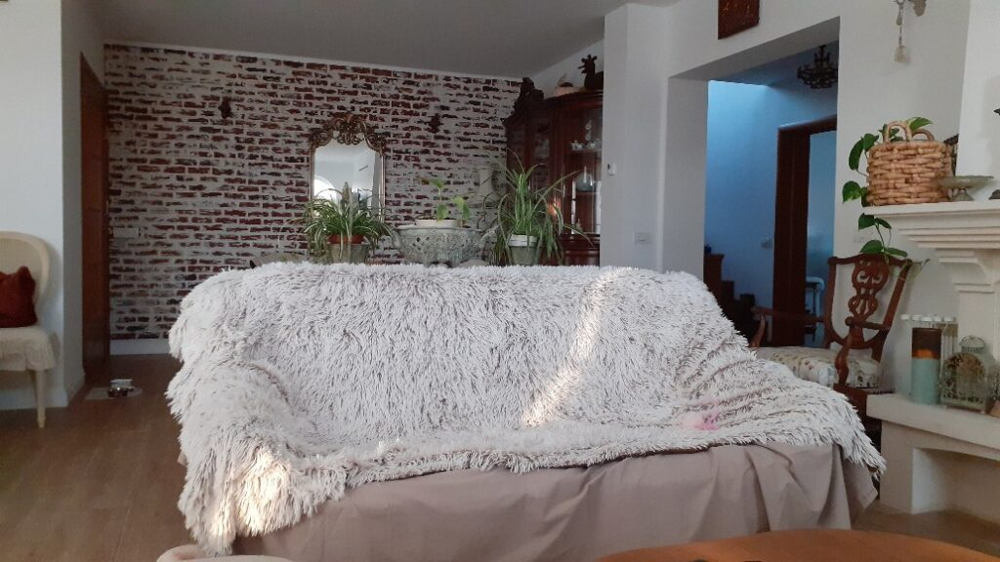
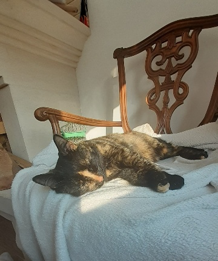

Știam de aseară că dimineața asta va fi grea. Trebuie să refac analizele de urină și de sânge ale mamei și asta înseamnă o noapte mai mult albă. La 5 m-am dat jos din pat, cu ochii pe camera de supraveghere, să văd când se trezește și mama. Am pregătit-o de ieri, i-am tot repetat ce vom face, i-am detaliat ritualul, sper că a reținut.

2 secunde cât am am pus de ceai și am ratat momentul. Până am ajuns sus la ea, deja terminase și nu mai aveam ce să colectez. Era oricum buimacă de somn și chiar nervoasă că o deranjez așa devreme. Evident că a uitat… Asta e, îi spun să se culce la loc.

\*\*\*

Eu nu mai pot să dorm. Mama ei de treabă! Trebe să fac cumva să mă odihnesc pentru că în ritmul ăsta nu o să mă țină mult!

\*\*\*

Mă apuc de ritualul dimineții, am timp și pentru Spiky azi, mă mai înmoaie puțin făptura asta mică și drăgălașă, mă uit în orizonturi cum se crapă de ziuă și se luminează de-a binelea. Mama încă doarme, deși s-a făcut aproape 7:30. 

\*\*\*

De câte ori se trezește mai târziu, am o strângere de inimă. Iar azi, strângerea asta avea un corespondent în realitatea ei: nu îi este bine. Amețește îngrozitor și vede steluțe aproape tot timpul. Îi spun că mâine dimineață trebe neapărat să mă aștepte să iau urina în recipiente și să mergem să îi ia sânge. Doar așa putem vedea ce e cu amețelile astea, dacă e sau nu vreo anemie pe acolo. Pare că înțelege dar nu știu dacă înțelegerea asta are forță până mâine să reziste în mintea ei. 

Bea smoothieul adus și pentru prima dată în două luni, îmi spune că e tare bună "chestia" asta! Ea crede că astea au pus-o pe picioare. Nu știu dacă acest știut este rezultatul repetării mele dar e important că repetiția a prins o crăpătură în memoria ei și s-a plantat.

Stau cu ea să văd cum evoluează amețeala și îi spun planurile mele pentru ziua de azi: să mă duc să îi iau buletinul că e gata, are domiciliul la mine acum, să încerc să rezolv tableta și să îi iau piept de pui pentru grătarul de la prânz. E mai ok, o să se joace pe iPadul pe care i l-a dat domnul meu de 2 zile. Din păcate, deși e simplu, nu reușeste să îl folosească! Sunt 3 mișcări pe care trebe să le facă, pe care i le-am arătat de nșpe ori dar pe care nu le reține. O văd pe cameră că o dă deoparte când apasă aiurea, mă duc la ea, îi arăt ce și cum să facă, cobor să mai fac câte ceva, iar o văd, iar mă duc sus și de abia aștept să găsesc un loc unde să repar tableta ei! Frecușul ăsta mă doboară.

\*\*\*

Micul dejun a fost pe la 10. De când cu senzația de vomă, sunt mai atentă și mai strictă cu ce mănâncă: azi a avut un iaurt degresat și o felie de toast integral prăjită. Le-a savurat! Deci se poate!

Îi aduc aminte că trebe să plec să îi iau buletinul și fug. Mai în reluare, că junghiul s-a reîntors, dar mă grăbesc pentru că nu-mi place starea ei, lipsită de vlagă.

\*\*\*

Dacă tot îi iau buletinul, mă opresc și la primărie, la Asistența socială, să aflu ce-mi trebe să pregătesc dosarul pentru pensie de handicap și ajutor de însoțitor. Doamne, e un pomelnic întreg de acte! Păi până strâng eu toate alea, mă apucă anul viitor! Plus că-s unele documente care nici măcar nu înțeleg ce sunt... Voi vedea.

Din nou, magazinul de mici reparații electronice e închis. Iau pieptul de pui și mă întorc acasă, puțin debusolată. În toată dimineața asta, am vorbit doar dacă chiar am fost nevoită. Nu am chef de vorbă. Deloc. Cu nimeni. Nu știu de ce, nu găsesc motivul. Poate-o fi doar epuizare fizică.

\*\*\*

Mă duc să-i spun că m-am întors și să văd cum e. Nu e bine, e albă ca varul și respiră greu.

Ca să-i abat atenția, îi arăt buletinul. Mare greșeală! A avut un șoc. "Asta-s eu?! Doamne, dar cât sunt de bătrână!" Am dat-o pe glumă, am luat rapid buletinul și i l-am pus în portofel dar nu am reușit să o scot din șoc. Nu-i vine să creadă că e bătrână, îi văd în ochi uluirea și mă doare. Sunt lașă și plec să mă apuc de treabă. Nu mai pot să duc și stările ei, pe lângă ale mele. Pentru că ea oricum le uită repede dar eu rămân încărcată cu ele și mă consum și mă usuc pe zi ce trece. 

\*\*\*

M-am așezat în living. Nu vreau să fac nimic. Iar Universul, plin de compasiune, îmi vorbește în lucrurile pe care le iubesc.

Dintotdeauna am fost fascinată de modurile cum se strecoară lumina într-o cameră. Îmi plac la nebunie camerele care au obloane de lemn prin fantele cărora se strecoară timid lumina, într-un joc de umbre pe pereți. Cele mai elevate trăiri le-am avut în ora de aur, ora aia în care soarele sărută de final pământul și doamne, cum îl poleiește! O rază de soare ghidușă dar hotărâtă să umple un spațiu îmi dă, mereu, o stare de sublim. Habar n-am de unde fascinația asta dar e încarnată.

Așa că azi mi-am umplut sufletul de ce mi-a dat lumina. O rază pe canapea, o alta pe năsucul dungat al iubite mele blănoase. Cele mai mișto lucruri în viață sunt free! Dar trebe să te dai cu suferința de pragul de sus ca să vezi minunea de jos.

\*\*\*

Ce să vezi, am făcut grătarul mamei ușor și ușoară și când m-am dus la ea, era mai bine. A mâncat tot, am râs, am glumit, i-am ridicat starea de spirit și nu mai e așa de prăbușită!

\*\*\*

Cu cât scriu mai mult, cu atât observ mai ușor că sunt când sus, când jos. Că acum primesc vestea venirii spre lume a unui Eric drag, acum aud de stingerea luminii în creierul altui părinte, tot drag. 

Toată viața asta poate fi când sus, când jos. Eu cred că cei care stăpânesc arta de a trăi s-au prins de alternanța asta sinusoidală și au înțeles că e mai sănătos să trăiești pe la medie. Nici să te dea pe spate tragedia, nici să te extazieze maxim bucuria. Sper să mă satur și eu de caruselul ăsta la un moment dat și să mă priponesc la mijloc.

\*\*\*

Mama a dormit mai toată după-amiaza. S-a trezit doar pentru suc, ocazie cu care am mai reiterat că mâine mergem la analize, nu am jucat nici table iar la 18.45 s-a pus din nou la somn.

\*\*\*

Când nu îi e bine, nici mie nu mi-e. Plutește așa o stare de nestare în casă. 

Pentru că Valentine's, pentru că finally launch blog, mi-am permis un vin alb, rece, de casă. 

Apropo de blog, sunt încântată că am reușit, așa minimal cum este, să îl fac singură, fără niciun ajutor, așa atehnică cum sunt. Când vrei, se poate. Mai cu hopuri, mai cu nervi, până la urmă you can bend the reality! 

Hai noroc și să fie într-un ceas bun! Pentru mama, pentru mine, pentru toți care au nevoie de o vorbă bună sau de cineva care trece prin ce trec ei, pentru umanitate!

\*\*\*

Sunt recunoscătoare:

1. Căldurii umane! Astăzi, în încercarea disperată de a găsi un loc care să repare tableta mamei, am primit un mesaj în privat de la un consătean de-al meu, cu care nu mă cunosc personal, ce-mi spunea că e electronist și că mă ajută fără bani! L-am luat în brațe virtual și îi tare mulțumesc!
2. Razelor de soare ce mi-au încălzit inima!
3. Universului care-mi arată, la tot pasul, că nu sunt singură, că-s oameni gata oricând să-ți întindă o mână de ajutor, chiar dacă nu fac parte din liga aia "aleasă pe sprânceană" pe care am selectat-o eu cândva să-mi fie aproape! (asta mi-a adus aminte de o glumiță: "Să nu faci rău, că răul se întoarce. Fă bine, că ăla nu se întoarce niciodată!" Uite că nu e chiar așa!)
