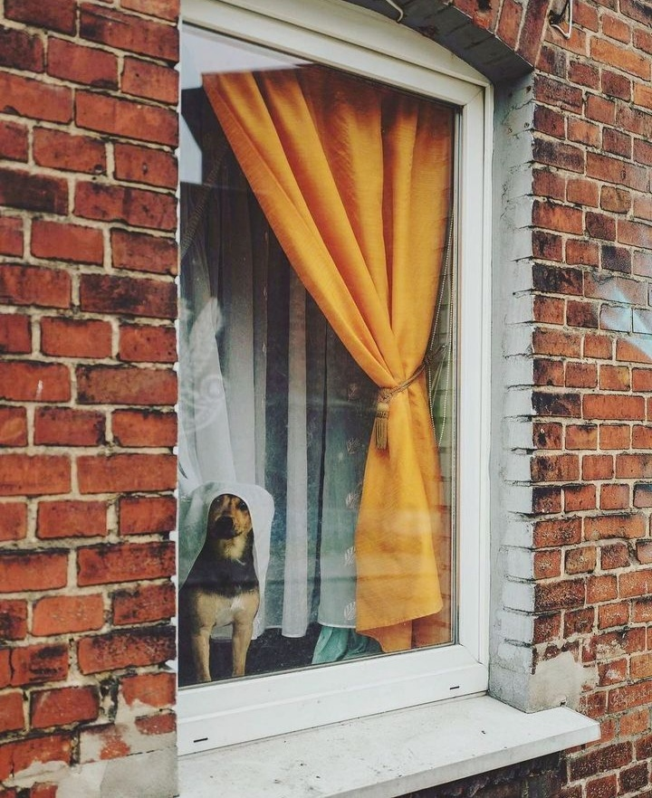

Dacă Universul mi-ar da extemporal cu întrebări tip grilă și una dintre ele ar fi "crezi că ești responsabilă de ce trăiești, gândești și prin urmare, visezi?", aș bifa cu ochii închiși răspunsul corect. Aceste coincidențe, care se nasc în gânduri ziua și se întrupează în vise noaptea, nu mai sunt de multă vreme pentru mine simple coincidențe.

După ce ieri m-a impactat emoțional tulburător speța locului de veci, evident că noaptea nu a făcut decât să încununeze apoteotic toată încărcătura aia care a clocotit în mine: eram la o pomană, nu știu a cui, dar nu cunoșteam pe nimeni în jur, era o atmosferă de-un gri apăsător, atât prin emoția specifică, dar și prin senzația ciudată care mă străbătea uitându-mă în jur și încercând cu disperare să înțeleg ce caut acolo, să găsesc o figură familiară, să mă agăț de ceva. Aceeași luptă și zbatere pe care o cunosc atât de bine din mai toate coșmarurile mele, în care trebe să fac ceva și nu reușesc, sau să ajung undeva și nu ajung sau să strig și nu am voce, aceeași nepuțiință libidinoasă m-a împietrit pe-un scaun într-un restaurant cu o atmosferă grea, cu oameni triști și seci și lipsiți de căldură. În timpul și locul ăsta în care parcă m-a aruncat brusc cineva, mintea mea este frământată intens: _De ce nu pleci? Ce cauți aici? Ce aștepți? Hai ridică-te și pleacă! N-ai timp să stai așa, mai ales că nici măcar nu cred că te afli unde trebe. Nu cunoști pe nimeni. Ai nimerit din greșeală aici. Hai, du-te. Ridică-te și fugi din zona asta crepusculară._ Cu toate astea, sunt împietrită pe-un scaun, corpul e rigid și fix și nu ascultă niciun îndemn, iar mintea azvârle mârșavă vini: _Mi-e rușine să mă ridic să plec. Ce ar zice lumea? Nu pot să plec așa, pur și simplu. Mai rezist. Când or începe să plece primii, mă strecor și eu._

Prima care a plecat însă a fost Spiky, pe care a apucat-o defilatul pe parchetul din dormitorul nostru și lăbuțele ei au fost "mâinile" care m-au smuls din coșmar și m-au adus acasă la mine, în liniștea unei prea dimineți. Yep, începe să-mi valideze impresia că puiuca asta mică și blănoasă-mi cotrobăie prin vise și când se împute treaba, face ea ce face și mă scoate din jocul sau locul ce începe să mă strângă. 

E prea devreme, nu-mi vine să mă dau jos din pat, dar simt cum griul din vis mi se infiltrează în rozul de zi nou-născută și nu-mi place. Grăbită să prind de poale gânduri și stări mai faine, îmi surprind accelerarea respirației, deși eu nu mi-am mișcat corpul nici măcar un milimetru. Ah, ce tare! M-am agitat numa' la impresia că urmează să mă locuiască starea aia pâcloasă de-am avut-o în somn, așa că m-am întors din fuga în care mă angajasem, trup și suflet, și-am stat prezentă la mine, să văd dacă mă mănâncă griul. Nope, nu-mi face nimic, îi simt răceala în mine, gust din nou senzația din pomana coșmarului, dar prezența mea în dormitorul liniștit e mai puternică decât amintirea unui vis. A venit, a trecut prin mine și a plecat, fix așa cum a venit. 

Acum, că m-am scuturat de resturile nopții, pot să mă pipăi și să văd de vreau sau nu să-mi recit recunoștințele. Da, vreau, dar le-am făcut pe toate mănunchi sub una singură: mulțam adânc pentru viața și prezența din clipa asta. Atât.

\*\*\*

Nu mă trage ața la fel de tare să mănânc fructele întregi cum aluneca smoothie dar știu din experiență, cheia succesului este consecvența. 

Afară pictorul Universului aruncă tușe demențiale de roz, roșu, vinețiu, galben, portocaliu, pe cer, cu mărinimie, și-mi spală și ultima picătură de gri ce-ar mai fi rămas prin fascia gândurilor și trăirilor dintr-un coșmar al nopții trecute ce pare departe acum. Bună conștientizarea asta, pare că statul pe loc și răbdatul cu stoicism al trăirilor care vor să mă locuiască, de orice fel și de orice culoare, se soldează cu spălatul și arhivatul lor în marea bibliotecă universală, nu mai stau p-aci prin zonă, să mă bântuie când vor ele. Poate data viitoare, când mi s-o precipita respirația de la vreun gând sau emoție, nu uit asta și stau, în loc să fug.

\*\*\*

Eh, n-a început ziua asta cu unicorni și zâne, dar starea mamei și micul ei dejun pot ține loc cu succes și la unii și la altele. Mama începe să-și revină, aproape că respir în aer vioiciunea ei nouă, se mișcă cu mai multă ușurință, are o lejeritate și în respirație, iar micul dejun a fost devorat integral. 

Fiecare îmbucătură pe care o ia este echivalentă cu o tonă de greu care mi se ridică de pe inimă. Ce construcție ciudată e și omul ăsta, nedomesticit să înțeleagă că dacă-și agață stările interioare de rămurele exterioare, o să fie tot timpul la cheremul vântului. Mi se pare incredibil cum parcă în sfârșit și eu încep a respira mai cu plinătate și mai cu lin, cum totul aluneca într-o matcă familiară, cum revine la un normal. Cât de normal se poate numi prezentul ăsta care ne conține pe noi două laolaltă, cum n-am fost niciodată. 

\*\*\*

E ceva magic și legător de suflete în "prima iubire". Așa am simțit și cu Băiatul, prietenul lui Spiky, așa-mi demonstrează și micuța blănoasă în fiecare zi și cred că sunt pe cale să mai păcătuiesc cu înc-un suflet în care mă infiltrez în inimioară: cu Hitlerică. Azi, cred că pentru prima oară în istoria vieții lui, a simțit mângâiere. Cu câtă putere au țâșnit din pieptișorul lui vocalize, ce sună a tânguială amestecată cu uimire, cu șoc dar și cu plăcere imensă, ce fericire și pe mine, că am reușit să câștig încrederea acestui uriaș blând, ce ușor alunecă mâna, lipsită de temere, pe o carne, la fel de lipsită de temere, dar arzândă de dorința unei călduri. Azi cred că am pecetluit încă o iubire de-o viață. Cine zicea că inima e mică, nu poate duce multe iubiri?! Și când mă gândesc că mie de fapt îmi plac la nebunie câinii…

\*\*\*

Din paleta "largă" de opțiuni de petrecere a zilei, aleg la nevoie și la repezeală curățenia. Nu că ar trebui neapărat, dar dacă încep cu camera mamei, unde chiar e neapărat, după aia îmi vine natural să continui, plus că am impresia că oricât aș curăța, nu scap de mizerie sau de mirosuri. Va trebui, la un moment dat, să stau de vorbă cu mine și cu această obsesia a mea care s-a născut din pântec de dramă și care sapă, nebăgată în seamă, adânc în mine, fără să mă prind. Mă spăl de nșpe ori pe mâini în fiecare zi, am tendința să dezinfectez totul, niciodată nu mi se pare îndeajuns de curat. Sper să nu mă transform într-o zănatecă cu aspiratorul lipit de mâini. 

Cred că am bătătorit deja rețeaua neuronală care se aprinde când mă apuc de dereticat prin casă: intru, de fapt alunec, atât de tiptilește că nici nu mă prind, într-o stare de rumegare care se lasă, de multe ori, cu dereticare și prin gânduri prăfuite sau tocite de atâta rumegat. 

Îmi dau seama că de multe ori, mă țin pe mine în mine nespusă, pentru că nu știu ce cuvinte m-ar scoate afară, pentru urechile și inimile celorlalți, cât mai egal cu ce e înăuntru. Din aste multe ori, în marea lor parte, nu simt că nescosul ăsta ar fi vreo pierdere, nici pentru mine și cu siguranță nici pentru ei. After all, trăim pentru noi. Dar atunci când mă înghiontește nesimțita însingurare, mă cert că nu mă spun lumii cum ar trebui. Și apoi mă iau în brațe, așa certată, și mă întreb dacă nu cumva lumea nu are de fapt urechi și inimi croite să-mi audă scosul.

\*\*\*

Încropesc de-un prânz pentru mama care-mi confirmă că într-adevăr e pe drumul cel bun, nu pe ăla fără întoarcere. Mănâncă binișor, se cuplează la sporovăiala mea, nu participă activ dar e aici, la masă, în bucătărie, cu mine. Că o fi fost reducerea la jumate a dozei tratamentului medicamentos pentru demență, că au trecut ceva zile de la terminarea tratamentului cu nitrofurantoină, că i-o fi murit moartea, cum se zice, că Universul o fi fost sensibilizat de îndârjirea mea, și-or mai fi altele pe care mintea mea limitată nu le cuprinde, cert este că azi am simțit că am trecut hopul. Nu e ca și cum mama e la fel cum era înainte de declinul ăsta brusc, dar parcă s-a așezat viața, și a ei dar și a mea, pe un lin, care pentru mine e mângâietor. 

E viața asta o împletire fantastică de susuri și josuri și zilele ce o creează sunt la fel. Nicicând nu mi-a fost mai limpede, ca în după amiaza asta, că de fapt viața care mi se desfășoară este o întoarcere de pe dos pe față a ceea ce se află deja în interiorul meu, eu am în mine întreg Universul, dar până nu mă fac stăpână pe el de-a-ntregul, o să tot reacționez la stimulii exteriori care, culmea, parcă sunt niște săgeți luminoase ce arată insistent către interior. Sunt atât de plecată în afara mea și de atât de demult timp am făcut-o consistent, că acum bâjbâi și nu nimeresc decât frânturi din drumul ăla care mă duce acasă. Că doar se știe, acasă e acolo unde ți-e bine. Doar că noi am limitat sensul ăsta strict la locuri fizice.

\*\*\*

Seara mi se scurge liniștită printre dialoguri interioare, printre întrebări calde și câteodată răspunsuri reci. Degeaba tot spun eu că nu vreau sfaturi, că nu mai suport sugestiile și că îmi doresc imens doar spațiu, unde să pot arunca toate cele care nu-mi folosesc în zilele mele care se scurg sub umbrela demenței, unde să mă scutur de scamele de pe suflet pe care le culeg zilnic în călătoria asta care e grea, unde să-mi spun trăirile, dar să nu primesc soluții prefabricate, luate de pe rafturi de la magazinul de intenții bune, pentru că, deși poate-or fi pe măsură, pe unele nu le pot aplica, sunt impotentă și văd asta, iar pe altele nici nu le pot concepe eu cu mine și cu mintea mea. Și dacă eu nu trec de mine cu soluția, degeaba vine, oricât de roz ar suna ea.

Am observat, și e din ce în ce mai peste tot asta, că între ce spun eu și ce ajunge la urechile altui om, e o bulă magică care parcă nu depinde de ce pleacă de la mine, ci de cum e dispus să înțeleagă acel om. Cred că este o bătălie între două intensități, între două percepții și câștigă aia care e mai încăpățânată. Eu am obosit să-mi mai susțin toate plecările de vorbe spuse din suflet, că cel care le primește le trece oricum numa' prin filtrul propriu, le mermelește în funcție de contextul lui, de momentul în timp, de trăirile lui din clipă, iar rezultatul e unul în care ajunge să creadă cu tărie ca fiind valid. Doar că de multe ori nu are nicio legătură cu ce a plecat de la mine. De oboseală sau de acceptare, le las să curgă așa. Poate că, la un nivel granulat și subtil, între oameni vorbitori de aceeași limbă, ăsta e Babilonul. 

\*\*\*

Declar ziua asta una albă, în care încep să văd lumina unui bine pentru mama, în starea ei fizică și-mi număr mulțumirea pentru:

1. Tot frumosul care există în viața mea!

3. Revenirea treptată a mamei!

5. Melanjul ăsta interesant care sunt, care câteodată mă faultează, iar alteori mă ține-n căuș blând!

Un frumos de-o clipă:

