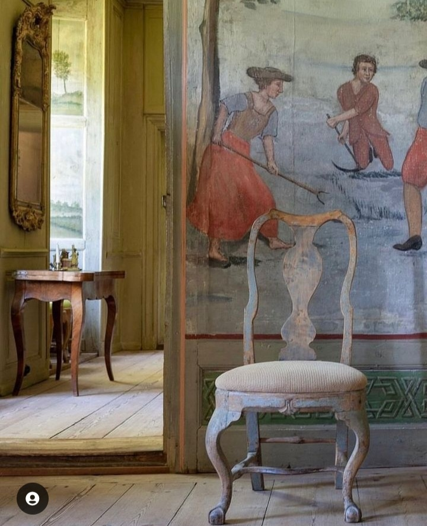

M-a cutreierat prin toate filoanele și scorburile ființei mele o noapte densă, greoaie, lipicioasă neplăcut, fără să aibă însă partenere de întuneric coșmaruri. Pur și simplu am avut o senzație de lanțuri atârnătoare și de carne și de suflet, o presiune invizibilă, care-mi apasă aripile cu care mă desprind în fiecare noapte din bucata asta de viață croită aici pe pământ.

Deși m-am trezit peste noapte de mai multe ori și am simțit greutatea care mi se infiltra sinuos în trăiri, am încercat să mă scutur, prima dată fizic, cum fac de obicei, fără ca nici măcar să-mi dau seama, apoi am scos mintea la înaintare, să-mi convingă ea ființa că chiar nu am de ce să fiu grea, am alunecat invariabil de fiecare dată în aceeași ciorbă pâcloasă, fără să am vreun drept de veto. Spre dimineață nici n-am mai încercat, m-am supus evidenței care nu se vrea dusă din mine și am mai ațipit puținel, cât să mi se lipească ochii cârpiți de somn la trezirea finală. Acu' e somnul cel mai dulce. Acu' aș da orice, numa' să fiu lăsată să mușc cu poftă portocalie și plină din somnul care mă îmbie nesimțit de puternic, acu' sunt în stare să promit vieții orice-mi cere, numa' să mă afund blând și cald în pat încă un strop. Din păcate pentru corpul meu, today is not that day. Mă pornesc din pat cu gândul-acadea promițătoare că o să mă pun în pat la un somn mișto mai târziu. În spatele acestei promisiuni se află și deșartul realității: și eu și gândul și clar și somnul știm că ne vom întâlni abia diseară, după cine știe ce-mi rezervă ziua de azi.

În partea mea stângă de pat se simte foială, Mr. H pleacă iar la birou, iar asta îmi ajută o țâră ridicarea și plecarea din brațele protectoare ale dormitorului.

***

Spiky e deja efervescentă, se freacă insistent și molicică de gleznele mele, lingușitoare pentru un bol de mâncărică. Plecarea domnului meu se petrece rapid, în puține acțiuni, recunosc că nici n-am reușit să butez corespunzător că m-am și trezit singură, în liniștea dimineții și a bucătăriei. Coconica s-a strecurat afară printre picioarele lui, la ieșire, și a zbughit-o spre noi descoperiri. Du-te, fato, ia cu tine și nevoia mea de cutreierat și împac-o puținel.

În timp ce închid ușa după ei, îmi pică ochii pe cușca de pe terasă și prind cu un colț de privire și o fărâmă de atenție, o imagine care-mi dă sclipici la inimă: din cușcuță se vede un vârf de coadă neagră, de Hitlerică. Deci folosește peste noapte cușca și doarme în ea. Mă bucură imens această descoperire și-mi dă niște zvâc pornirii într-o nouă zi. Plus că-i dă una peste ochii părerii mele de victimă căreia viața îi este monotonă zi după zi după zi. Da, nu mi le umplu cu ce aș vrea eu, dar uite că Universul mi le colorează totuși cu călduri de inimă.

***

Mi-am sorbit apa caldă și simplă, cu ochii rămași pe un vârf de codiță. Prin câte o fi trecut și băietul ăsta în viața lui de motan sălbatic… imensul semn de întrebare, care mi s-a pus pe cocoașa minții, se arcuiește din nou în astă dimineață: ce l-o fi făcut să se adăpostească la noi pe terasă? Ce-l împinge să vină noapte de noapte, neștiut, în cușca făcută pentru el? Nu am răspunsul, dar un lucru știu sigur: în viața asta, nimic nu e întâmplător sau fără rost. M-o lumina, poate, vreun episod viitor.

Îmi pregătesc fructele micului dejun și mă duc în living la fix cât să văd mișcare în dreptul unui geam. Spiky s-a prins și ea că Hitlerică e în cușca și nu mai are curaj să vină în casă pe unde a ieșit, ci așteaptă cumincioară s-o văd la geam și să-i dau drumul. O să fie o nebunie cu ăștia doi.

***

Nu am chef să mă umplu de niciun zgomot altul decât liniștea casei mele și de nicio imagine, alta decât generată de ce e în jurul meu acum. Cu platoul de fructe în brațe, am împrumutat din cumințenia Chichiricăi care s-a pus la un nou somn și mă las pradă senzațiilor: de dulce, resimțite cu explozii mici de papilele gustative, de drag, pipăite de sufletul meu hrănit de calmul casei, de-un fâlfâit de grijă, că asta mi-e firea construită cu inconștiență atâția ani, de leneveală, că nu mi-am umplut butelia de energie azi-noapte, de cuprindere a tot și toate, de excludere a ce nu-mi convine, de visare. În aceste clipe simt că sunt din de toate, pentru toți. Și, deși-mi vine natural să mă judec pentru alea care-mi par minusuri, uite că mă cuprind cu toate și mă permit. Au alunecat tare ușor fructele în starea asta de blajin.

***

Nu pare o zi la fel de verde pentru mama cum au fost zilele precedente. De abia mănâncă oul fiert, cu chiu, cu vai a mâncat și un pic de ardei roșu, nu prea are poftă de mâncare, iar fâlfâitul ăla de grijă de mai devreme aproape că-mi suflă puternic în inimă o stare de neliniște. Nu vreau să o luăm de la capăt. E prea repede, și pentru ea, și pentru mine. Niciuna nu ne-am refăcut îndeajuns după episodul ce abia a trecut, n-avem încă putere să ducem un alt val. N-are chef nici de vorbă, nici de mine și eu nu insist. O anunț doar că o să vin la curățenie, dar zău dacă știu de ce o fac. E foarte posibil ca până ajunge la etaj, informația să se strecoare prin crăpături de minte și să ajungă într-un hău, unde sunt căzute mai toate informațiile din viața ei curentă. Singurele care băltesc la suprafață sunt cele din vremuri vechi ale vieții ei cu (prea) puține evenimente care se întâmplă în prezent și pe care, din rațiuni care mie îmi scapă constant, mintea ei le înregistrează și le păstrează în hipocampus.

***

M-a lăsat în bucătărie o țâră deznădăjduită, eram atât de încântată și de liberă în suflet că-și revine, că nici nu mi-a trecut prin minte că poate să se schimbe totul atât de repede. Doamne, cât de ușor mi-e zdruncinată starea interioară de stările exterioare mie! M-a lovit această conștientizarea atât de visceral în față azi încât am început să vorbesc singură. Toată viața mea căușul meu sufletesc a fost zburătăcit de lumea din afara mea, a fost ca o păpădie la mila suflului unui vânt, când mai puternic, când mai lin, dar întotdeauna de afară, nu m-am învrednicit, deși am văzut asta, să-mi construiesc un mecanism interior sănătos care să mă protejeze de diverse crivățuri. Azi, clătinatul ăsta emoțional al meu în fața clătinatului fizic al mamei mi-a apărut mare în față, scris cu litere mari, bolduite, imense, să nu-mi mai pot feri nici privirea, nici voința de a face ceva. Dacă nu încep să înțeleg ce să fac și cum să fac să nu mă mai tăvălească toate, mi-e clar că nu-mi va fi bine. Nu doar emoțional. De fiecare dată când un eveniment din afara mea îmi dă la gleznele stării din mine, fiorii interiori se traduc în reacții chimice, la propriu, în corpul meu care eliberează constant cortisol, hormonul de stres care îmbolnăvește atunci când e eliberat la orice colț de fapt care mi se petrece în viață. Diferența dintre mine, asta de acum și mine, aia de până acum, este că înainte nu eram conștientă de stresul imens pe care-l trimiteam și în fibrele de carne. Acum știu. Acum îl simt. Și se simte dureros, la toate nivelele.

***

Ca să mă scutur de toate, mă apuc de îndeletnicirea specifică acestor zile, curățenia. Cu cât mai mult efort fizic depun, cu atât mai bine, pun în mișcare niște energii, mai scutur niște păreri, nu stau locului înfășurată într-o fascie de gânduri negre. Fiecare geam spălat e echivalent și cu claritate mai mare în mine. Fiecare centimetru frecat curăță și în mine jeguri adunate, strânse, ascunse sub o pătură prefăcută care le-a acoperit cândva din dorința mea de a-mi fi bine. Pe măsură ce fac curat în casă, devin din ce în ce mai conștientă că este doar impresia mea că fac curat și în mine. Mă duc pe firul acestui gând și-mi răspund singură: normal că e impresia mea, mișto e că e susținută de o intenție puternică de-a mea și cum știu că suntem creatori, și de susuri și de josuri, azi, mai mult ca oricând, sunt hotărâtă să-mi croșetez simplist viața. Dacă scot din peisaj brizbrizurile generate de gândurile de frică, de grijă, de stres, realitatea pur fizică a clipei este că eu fac curat în casa mea frumoasă iar mama e în viață, în camera ei. Ăsta e adevărul momentului prezent. Că se pot întâmpla multe, și rele dar și bune, e la fel de adevărat. Dar acum nicio grijă din astea care-mi bâzâie enervant spațiul mental nu e fizică și reală, palpabilă. Am pus o respirație adâncă în acest mare adevăr și m-am simțit extrem de ușurată. Iar balsamul pus peste această ușurință în a fi a mea, nou câștigată, a fost validat final de binele simțit de mama după dușul vârtos la care am băgat-o. Are în ea o bucurie și o plăcere la momentul dușului, ca un copil care acum descoperă apa. Poate că, de fapt, chiar așa și e.

Sassy mă apostrofează consistent în timp ce-i spăl dosul pe care nu mai e capabilă să și-l îngrijească singură, dar un pliculeț de mâncare plină de sos îi alină supărarea.

Am plecat de la etaj lăsând sclipire a curat după mine și am ajuns la parter cu sclipire de curat și-n mine. Viața e atât de simplă…

***

Pesemne că mi-am întărit ceva mușchi pe vreundeva în dimineața asta, că grimasa mamei a silă nu mi-a clintit niciun fir de păr. Mă fac că plouă și că nu văd că n-are chef sau poftă de mâncare și o invit la parter, unde o așteaptă prânzul. Chiar de n-o mânca mult sau tot, faptul că se mișcă un pic e un câștig pentru ea.

Deși în linii mari, eu zic că am ajuns să cunosc reacțiile mamei, azi m-a ghilotinat cu o privire pe care, oricât de mult aș vrea s-o cuprind, nu știu cum s-o cataloghez și-n ce sertar s-o pun. Nu a mâncat mult, nici nu am forțat, dar când m-am apucat să strâng ce era pe masă, am simțit privirea mamei către mine. M-am uitat și eu la ea scurt și am avut o senzație extrem de inconfortabilă. Privirea aia nu avea nimic uman în ea, era de-o goliciune care m-a sfredelit scurt și rece și care mi-a dat, la fel de scurt și chiar mai rece, fiori pe șira spinării. Ce nașpa se simte o privire de om care n-are nimic de om în ea.

***

Ziua e abia la adulția ei tânără dar eu am avut o încărcătură mare până acum. Deși e frig, deși e iarnă, m-am aruncat cu voluptate în afara casei, să descarc, așa cum am făcut mereu, stările astea în pântec de natură, să le distileze ea și să mă albească, cât mai mult posibil. Am nivelat castelele noi de cârtiță, am aruncat tocătura uscată de coajă de banană strânsă de-a lungul lunilor și am pus cartoanele peste buruieni, să le înăbușe până-n primăvară. Aerul ăsta rece mi-a făcut tare bine, chiar dacă mi-a biciuit și fața și mâinile, m-am simțit vie, m-am simțit aparținând vieții, mi-am lăsat inima să șușotească cu mama pământ.

Cu sau fără modestie, de altfel oricum irelevant, mă surprind cât de multe știu de fapt.

Când în tine e mereu un gol pe care nu reușești să-l umpli cu nimic, absorbi cu aviditate tot ce picură dinspre exterior, iei de bun și de bune toate părerile celorlalți și căptușești zona aia pe care altfel nu știi cum s-o descurci. Când te locuiește credința că alții oricum știu mai bine decât tine, chiar dacă acumulezi constant și mereu cât mai multe să ajungi cel puțin la nivelul lor și niciodată nu ești de ajuns în ochii tăi, niciodată nu-ți dai voie să afli cât știi de fapt. Ești într-o cursă stupidă, culmea inițiată și condusă nebunește doar de tine, și mereu îți muți linia de finiș mai încolo, să știi și mai multe, niciodată nu ajungi la nivelul lor, al celor cu care-ți intersectezi viața, uneori doar preț de-o conversație. Stima scăzută de sine e o flămândă nebună care, dacă te-ai apucat s-o hrănești, te duce într-un carusel amețitor și-un labirint din care-i greu să ieși. Chiar dacă acum am înțeles mecanismul care m-a condus atâta vreme, nu cred că am reușit să-l despletesc pe de-a-ntregul nici acum. D-aia încă mă surprind eu pe mine cu cunoștințele mele, când ar trebui să mă bucur că le am și atât, nici cu fălire, nici cu decădere. Printre coji de banane și cartoane, înghețată și-un strop îngrijorată, înțeleg, cu subiect și predicat, cât de mare e caracatița autoacceptării și câte tentacule, împrăștiate-n zări în care nici nu le bănuiam, are. D-aia viața se practică în fiecare zi, că-s multe de aflat și toate-s despre tine. Dacă lângă înțelegerea asta vine și realizarea că viața-mi trăită până acum am fost plecată din mine și nu m-a interesat câtuși de puțin să mă aflu, parcă mă ia cu atacuri de panică că nu mai e timp. Dar, vorba unei femei dragi inimii mele, "nu trebe să le bifăm pe toate în viața asta". Îs eu haplea, măcar atâta știu despre mine.

***

Mama a plecat devreme în lumea viselor, sigur acolo îi e bine, eu, cu blănoasa torcând pe piept, m-am dedulcit la filme siropoase de Crăciun, așteptându-mi domnul să închidem împreuna o zi, cu depănare de la mine către el și invers.

Posibil ca noaptea să-și fi întins o gheară greoaie și prin ziua asta ce ne-a petrecut azi, dar, chiar și așa, am o senzație de câștig și un gust mic de victorie pe buza sufletului. Am trăit ziua de azi la propriu, cu tot ce mi-a servit ea și îi sunt recunoscătoare pentru:

1. Curajul meu de a fi deschisă, deși e înspăimântător câteodată (de multe ori) să fii dispusă să vezi tot rahatul!

2. Toate ființele care mi s-au așezat în viață în această bucată de timp!

3. Toată frumusețea din împrejurul meu și din mine!

Clipa faină a zilei:

