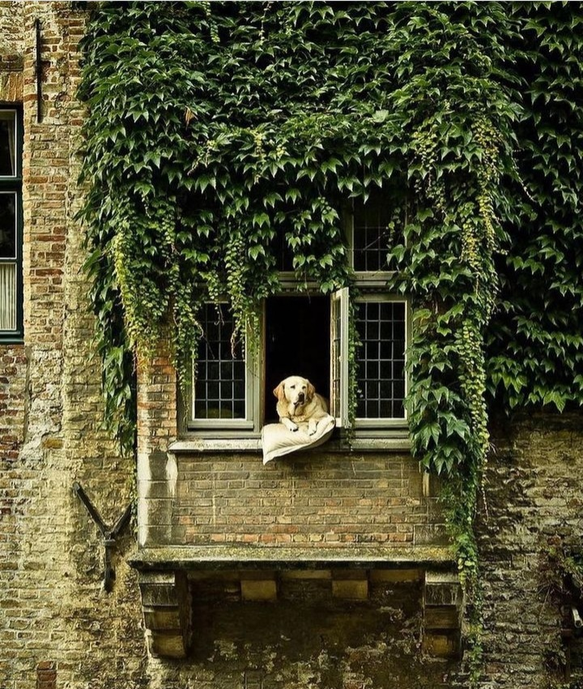

Starea mea molcomă, în care am făcut pace cu ziua de ieri, m-a legănat și-n noaptea ce s-a înnodat de ziua trecută și mi-a fost parcă mai lin. Fără apăsarea aia ciudată, de câte ori am devenit conștientă, chiar și puțin, în noaptea trecută, am putut să simt o stare de claritate, de limpezime, de veghe, de prezență, care a mers paralel cu somnul pe tot parcursul nopții. Nu-mi aduc aminte de niciun vis și nicio grijă nu m-a ținut trează peste noapte. M-am trezit însă tare devreme, mă așteaptă un munte de treburi de făcut, pregătiri pentru Crăciunul alor mei.

Tocmai pentru că lista de to do-uri a zilei, ce mi se prefigurează cu viață în față, e cu vârf și îndesat de plină, îmi iau un răgaz echivalent cu ființarea mea în micul meu ritual matinal, să iau pulsul trăirilor mele interioare, sa mă percep dinspre acolo spre în afară, să simt și visceral ce mă inspiră în astă nouă zi, ce mulțumiri mi se împletesc prin minte și prin inimă, cam cum se prezintă barometrul ființei mele.

Sunt bine. Poate doar bucata aia a mea, care parcă se ferește să zică "foarte bine" ca să nu cobească, mă împiedică să mă bucur din plin de șansa la viață care mi-a fost dată și azi, fără să muncesc în vreun fel pentru ea. În plin ritual, m-am simțit buchet. Cred că și mintea a pus umărul la această simțire, dar clar inima mi-a șoptit esențialul, doar ea are curajul și onestitatea și puritatea asta. În buchetul ăsta care sunt, am și-o floare de empatie dar și una de răutate, și-una de egalitate dar și alta de narcisism, am flori pentru toate epitetele din lumea asta, am de toate în mine, tot ce e în afara mea, în alții, și eu am susținut ipocrit în viața mea că nu sunt, sunt. În tot itinerariul ăsta numit "viața mea" au fost și sunt clipe în care, cu un grad maxim de certitudine, am fost sau sunt din toate câte puțin. Sau mai mult, depinde de "floare".

Îmi place gândul ăsta, în mod neașteptat nu mă înțeapă în nicio părere de-a mea despre mine, mă gâdilă cald ideea că mă pot îmbrățișa toată, fără să vreau să rup, ascund, smulg părți din mine, de ochii lumii. Că, în realitate, asta cu ochii lumii e adevărata părere, asta e impresia greșită, nu contează absolut deloc pentru mine și pentru spălarea mea de ochi și minte.

\*\*\*

Mă scurg tiptilește spre bucătărie, să mă înfrupt din timpul scurt pe care-l am doar pentru mine și-mi încălzesc apa pentru trezirea mea cu totul. Cu un spirit de aventură jucăuș, azi fac o schimbare în tabietul dimineții: înainte de a bea apa fierbinte, fac qigong 10 minute, ghidată de un filmuleț trimis de una din prietenele mele dragi. Sunt mișcări ample și simple, pe care le simt blânde cu corpul meu încă amorțit și care chiar îmi fac plăcere. Ce bine ar fi dacă m-aș seta să le fac zilnic!

Cu energia circulând mai cu poftă prin costumul de carne ce-l am, alunecă fain și apa fierbinte și simt că mi-am setat zvâcul pentru azi. Îmi pregătesc și fructele, fac un ceai verde și-mi iau 15 minute doar pentru mine și neînțeleasa mea imensă plăcere de a trăi o viață de castelan, chiar dacă este doar prin intermediul unor filmulețe pe youtube. Mă cuplez cu totul acolo iar livingul meu se estompează în fața încăperilor înalte cu parfum de epoci trecute.

\*\*\*

Pusul legumelor la fiert pentru salata "be off", adică vegană, m-a adus înapoi în viața și pielea mea, și e totodată și semnul că am început să bifez din trebușoarele pe care mi le-am propus pentru azi.

Excitată de făcutul sarmalelor, sarcină pe care i-o plasez cu bucurie ei, mama mănâncă doar puțin din ce i-am pregătit pentru micul dejun. Nu are poftă de mâncare, însă pare o țâră mai sus cu starea decât era ieri. Poate suflul Crăciunului s-a extins și asupra ei, iar împletitul sarmalelor contribuie și el. Îi fac umplutura, deși mi-e greu, dar nu pot s-o las singură pentru că nu mai știe din ce sunt făcute sarmalele: uită de orez, de ceapă, de mirodenii, la ea singurele ingrediente sunt carnea și varza.

Cât face ea sarmalele, eu mă apuc de tocat legumele pentru salata de be off, pentru salata orientală și pun la copt vinetele pentru cea de vinete. Fac și maioneza vegană și nu-mi tace gura nicio clipă, să nu-i permit mamei să se aolească sau să renunțe din oboseală. E o ocazie rară de a sta pe scaun, în fund, nu doar culcată în pat. 

Nu pot să nu ma minunez cât de fantastic și abil s-a perfidit egoul uman: mama, deși stă pe scaun și singurul lucru pe care-l face e să ruleze sarmale, suflă din greu, ca și cum tocmai a fost la maraton. Știu, din experiențele trecute, că atunci când mă vede că robotesc, la un nivel subtil, care o face să reacționeze nici măcar fiind conștientă de ce face, se simte prost că nu mă ajută și ca să șteargă această simțire, se preface în victimă ca să-mi smulgă compasiune și să-i validez ei trăirile. Deși inițial mă enervează de fiecare dată șmecheria asta grotescă, pentru că mi se pare că-mi refuză, și-n al doișpelea ceas validarea, refuză să mă vadă și pe mine într-un final de viață, azi mă inundă mila față de ea. Față de egoul ei. Nu e compasiune, e o milă profundă și o părere de rău că din ființa ei a câștigat bătălia din viața asta doar egoul ei, ăsta îi conduce toate sau aproape toate acțiunile, el se lăcomește la toate trăirile ei, îi pângărește probabil, orice urmă de trăire maternă care ar putea exista în ea. Mama mea nu mi-a zis niciodată că mă iubește. Traumele stocate în ea au închis pentru totdeauna un robinet prin care ar fi putut să curgă stropi ce m-ar fi hrănit imens.

Bag sarmalele la cuptor și o urc pe mama la ea în cameră. Urcă destul de ușor, a uitat să șuiere ca locomotiva iar eu vreau să uit momentele în care am așteptat, cu suflet crud la gură, emoție din partea ei.

\*\*\*

De acum intru în linie dreaptă cu treaba: am copt blaturile pentru tortul vegan Napoleon, hai și cu crema de vanilie a lui, că trebe să se răcorească bine înainte de asamblarea lui, gata și cu salatele, mă apuc în paralel de cele 2 tiramisu-uri de portocale, în temă cu Crăciunul și mă opresc, șocată, că trebe să-i pun prânzul mamei. De-aș avea o pilă la nenea timp, ce mișto ar fi!

Furată de mirosul super fain din bucătărie și de iureșul care se năvălește din gura mea, ca s-o fac atentă la mine și nu la cât mănâncă, mama a mâncat ceva mai binișor la prânz, comparativ cu dimineață, iar starea ei de spirit e clar prinsă în magia Crăciunului. Mă întreabă, cu o luminiță pâlpâindă în ochi, când e Crăciunul, îi aduc aminte că azi am făcut, împreună, sarmalele, că miroase așa de bine în bucătărie de la pregătirile pentru Crăciun, îi spun că mâine vor veni copiii la noi și că vom fi doar noi trei de Crăciun. Se bucură, atât cât poate. Nu e ceva ce se vede cu ochiul liber, e ceva ce mai degrabă simt în aer. Am din ce în ce mai pregnant senzația că ne întoarcem la momentele noastre primordiale, când eram prunc nevorbitor și, probabil, ea mă înțelegea, numa' că acum s-au inversat rolurile. Din păcate, după 40 și de ani de neiubire simțită din partea ei, cred că inclusiv trăirile ei de atunci, când n-a putut să-mi dea ce aveam nevoie, le am și eu acum. Știu că vindecarea noastră nu e posibilă decât dacă găsesc eu o cale să fac undo la toți acești 40 și de ani de așteptare inutilă.

\*\*\*

Se întoarce în camera ei, Universul ei, iar eu mă apuc de foietajul franțuzesc pentru ștrudelul de mere, singurul dulce pe care-l mănâncă iubitul copilei mele, mă înarmez cu nesimțire ca să pregătesc carnea pentru șnițelele pe care le vrea copila mea, fac curat și spăl și șterg și așez toate la locul lor.

În tot timpul în care mâinile mele robotesc, mintea mea ronțăie necontenit.

Am pornit în dimineața asta cu frânturi din timpul petrecut lângă mama și pare că ele sunt lait-motivul zilei. Orice aș face, mintea mi se întoarce over and over la vremurile alea, scotocind avidă după clipe, pe care poate le-am uitat, în care mama mi-a fost mamă. Poate că momentele calde și bune nu m-au impactat așa cum mi-au ștampilat amintirile alea dureroase, de respingere sau de abandon. Deși sunt sigură că am fost prea flămândă după căldura umană, fapt care m-a faultat mai târziu în viață și-am făcut alegeri nepotrivite adevăratei mele firi, las loc speranței și ideii că poate nu le-am văzut eu sau le-am uitat. Fatalismul și durerea și disperarea care vin la pachet cu "niciodată" sau "atât de rar că parcă nici nu cred că a fost real" sunt greu de dus acum, mă fac să respir precipitat și din mirosul de portocală care plutește în aer, mă transport, aiurea, într-un trecut necolorat. 

Noroc că am prietene pe aceeași falie cu mine, care-mi simt cutremurele interne și mă sună fix când le am. Convorbirea mea simplă, curată și de suflet cu una din ele, m-a deturnat rapid și total de la o victimizare fără niciun miez, m-a adus aici și acum, în acest moment al vieții mele unde, umbrită de demența mamei, îmi trăiesc totuși o viață frumoasă. Nu faină, nu mișto. Frumoasă, în toate bucățile ei pe care reușeșc să nu le impregnez de urâțenia acestei boli. 

Și mă bucur tare că, în toată aglomerația asta de suflete pe care o țin în sufletul meu, o dată cu spălatul de ochi, am descoperit oameni noi superbi, am descoperit oameni vechi într-o lumină nouă, mai colorată, mai cuprinzătoare, mai de suflet deschis sau doar părți din oameni care încălzesc părți din mine, fără să le iau la pachet și p-alea care-mi dau răceli prin părțile esențiale. Încep să fac curat în mine și, pentru prima oară în viața mea, nu mai țin în mine oameni cu care nu-mi mai împletesc viața, doar așa, să fie acolo, că nu se știe. Sunt într-o fază gen Marie Kondo a sufletului și e interesant.

\*\*\*

Cu mici pauze, am stat 12 ore în picioare. Sunt epulizată, așa cum zicea copila mea când era un chiștoc, vorbă ce a devenit bornă a acelei vremi a ei în mine și a rămas în vocabularul meu de atunci, alături de "golușă". Parcă și simt în aer mirosul momentului când puiul meu le-a rostit. Ce scurtă e viața, ce repede trece timpul… Oboseala fizică mi-e dublată de o bucurie interioară, că îmi alint oamenii iubiți cu ce le place lor și am eu un știut în mine că asta din urmă va rămâne peste timp în amintire, nu că-s frântă. 

Cu un plin sentiment de satisfacție, închei ziua asta mulțumindu-i pentru:

1. Puterea de muncă ce s-a făcut elastic cât să mă țină să le fac pe toate!

3. Oamenii care mi s-au așezat în viață ca să stea!

5. Imprevizibilul care mă ține conectată la o viață pe care nu o prețuiesc la justa ei valoare întotdeauna!

Frumosul din clipă:

