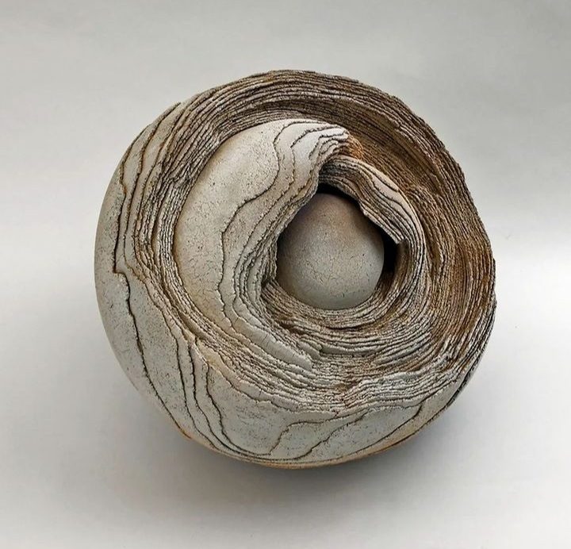

Blană, lemn-Tănase, beton, sunt doar trei din cuvintele care mi se bulucesc dintr-odată într-o minte trezită înaintea unui corp istovit. Am dormit dusă, cred că mi-au plecat simțurile în alte lumi chiar dinainte de a-mi lăsa capul pe pernă, atât de obosită am fost aseară. Dar, bag seama, că am fost pe măsură, dacă nu chiar mai mult, de mulțumită de rezultatele muncii care m-a obosit, de nu mi s-a strecurat nicio gând hain capabil să dea în pârg și-n rod un vis aiurea sau, și mai rău, un coșmar.

Aseară a plecat în lumea viselor o obosită liniștită înăuntru și, în prea dimineața asta, se întoarce doar o liniștită în lumea asta, cică reală. Îmi scanez și corpul și-mi pipăi și trăirile și-mi dă cu plus la calcule.

M-așteaptă și azi cel puțin în prima jumătate de zi, treburi una după alta, așa că-mi iau, din nou, hotărâtă, câteva clipe doar pentru mine, pentru inima mea, pentru gândurile mele, fără griji, alergătură, bife.

Anul ăsta avem 2 Crăciunuri: ajunul clasic care a devenit Crăciunul cu copiii și Crăciunul clasic, doar Mr. H, eu și mama. Copila mea trebe să se împartă elastic să acopere patru case: a noastră, a tatălui ei, a mamei și a tatălui iubitului ei, tot separat, iar eu vreau să-i fac cât mai moale acoperirea asta. N-am pretenții gen "Masa de Crăciun să fie la noi!", așa că-mi mulez treaba după cum pot ei. Fără să fiu atentă, mintea-mi zboară la extrem de multa muncă pe care o duc în spate femeile, în pragul sărbătorilor îndeobște, și pentru că mi-am tras aproape câteva clipe de răgaz, îmi pun și lupa minții și lupa inimii pe ideea asta, s-o despic și să-i văd seva.

Dacă până acum, an de an am dus mai departe tradiția pe care am văzut-o în jurul meu, de a face curat și bucate și cât mai multe, fără să mă întreb "de ce?", azi am văzut extrem de limpede răspunsul. Al meu, pentru că eu nu pot să vorbesc decât în numele meu.

Am văzut cum în fiecare bucată de pus pe masă, în fiecare curățire de locșor al casei, în fiecare aranjament, e parte din sufletul meu, sunt stropi din bucuria mea de a le face (și) lor bucurie, e poate și grija, dar sigur e atenția, care în genere e atribut specific femeii. Numa' o femeie poate să plonjeze atât de nonșalant în multitudinea de sarcini de făcut și să le ducă la final, chiar și atunci când crede că nu mai poate, doar susținută de bucuria unor alte bucurii. Știu declarațiile și, cândva, le-am simțit corecte, că nu trebe să dai în fiert de sărbători. Acum, probabil de la vârstă, probabil pentru că demența mamei m-a făcut să mă uit mai cu atenție și delicatețe la oameni și la ce vor ei, nu mă mai deranjează să dau în fiert pentru ai mei dragi. Acum, dacă pot, și pot, să fac pentru ei doar să-i bucur, nu ca ei să mă vadă și valideze, o fac cu cea mai mare larghețe sufletească. Știu, tot cu ocazia demenței mamei, cât de mult te pot impacte clipele, fie ele catalogate bune sau rele. Și cum pare că-n a mea viață talerul cu cele nașpa atârnă mai greu, am decis să-mi creez cât mai multe d-astea bune, să contrabalanseze și să câștige detașat până la următoarea analiză de viață. Sau la aia finală. În plus, vrea să fiu darnică cu momente bune și-n desaga vieților celor din jur.

***

Corpul mi-e o țâră înțepenit, îl simt din mișcările stângace, nu am cursivitate în ele, dar știu că e doar până "mă încălzesc". Îmi ung interiorul cu apă caldă cu multă lămâie, nu mă țin baierile să fac minutele de qigong, aproape că am o senzație de ușurare că am prins scuza asta de sultană și defilez cu ea, culmea, în fața mea, cea care își propusese să facă dimineața puțină mișcare blândă. În colț de buză se ivește un mic zâmbet la conștientizarea că cea mai mare pretendentă a mea sunt tot eu.

Am citit undeva și mi-a rămas lipit de-un perete al minții că atunci când copii nu se simt iubiți de îngrijitorii lor, ei nu renunță la iubirea față de aceștia, ci aruncă cât colo, cu o lejeritate dezarmantă cum numa' la un copil poate fi, iubirea față de sine. Așa cred că am devenit și eu cea mai mare asupritoare a mea. Deși ideea de a face 10 minute qigong dimineața a fost una fără mare greutate, nu i-am pus în spate suficientă atenție încât să-mi fac obicei din asta, uite că mintea-mi coțofană stă cu ochii cât cepele să vadă dacă mă țin de idee și, la abatere, îmi dă cu păreri de insuficiență pe la inimă. Modul ăsta în care ne-am autoeducat să ne mințin noi pe noi ne conduce viața și acțiunile și nici măcar nu vedem. Cât de puerilă mi-am văzut dintr-odată ușurarea că am scuza unui corp muncit ieri ca să nu facă qigongul de azi. Nu fac pentru că nu vreau, nu am chef și punct.

Totuși, ca să împac și capra și varza, mi-am mâncat fructele în picioare, într-o încercare palidă a mea de a-i livra minții, tot a mea, și ei o juma' de satisfacție: mănânc tacticos, bucată cu bucată și-mi legăn ușurel corpul. Trinitatea asta minte, corp și spirit e incredibilă, trebe să recunosc!

***

Curăț merele pentru ștrudelul de mere și-l bag la cuptor înainte de a mă apuca să-i pregătesc mamei micul dejun.

Din arhiva de roluri jucate de-a lungul vieții, în dimineața asta îmbrac haina de gureșă, deși nici că s-ar putea o mai mare discrepanță între ceea ce-mi doresc să fac și să fiu și ceea ce fac și sunt: îi turui întruna mamei, iar ea se lasă antrenată, dar și amețită, de vorbăria care mi se prăvălește din gură și mănâncă bine. Sub linia trasă, ăsta e câștigul, plătit scump, de o eu care nu sunt eu. As always, scopul scuză mijloacele.

***

Îi dau zor cu trebăluitul dimineții, reîntoarsă la liniștea mea delicioasă, pentru că nu am apucat să fac cumpărături de mici cadouri și trebe să strecor cumva și asta în programul zilei. Mr. H ar vrea să le facă el, dar mie nu-mi surâde ideea. Nu prididesc în acțiuni și realizez, rapid, că oricât de mult aș vrea, nu sunt Wonder woman. Calc în picioarele grăbite obsesia controlului, acea impresie falsă care-mi susură drăcesc în minte că doar eu știu cum e mai bine și ce trebe să cumpăr, și-i dau mână liberă domnului meu la cumpărături. Nu am timp fizic să le fac pe toate, cine-ar fi zis…

Pe blat mă așteaptă 3 feluri de mâncare gata de finalizat, iar mie-mi lipsesc din dotare încă vreo 4 mâini: trebe să fac șnițelele copilei, soia pentru grătarul nostru și pieptul de pui, tot la grătar, pentru iubitul copilei. Încă o dată, a nu știu câta oară, mulțumesc în gând perioadei mele de corporatistă care mi-a băgat în sânge virusul eficienței, atât de granulat, încât orice fac, îmi calculez mișcările și acțiunile să am cât mai puțini timpi morți. Fiorul bucuriei de a bucura mă circulă și-n toiul treburilor, mintea-mi fuge. La vremuri vechi, cu trăiri la fel de vechi, prăfuite, nevizitate.

Toata viața mea de până acum am alergat inconștientă și flămândă după confirmări de afară, m-au hrănit bolnav aprecierile și admirația celor care mă vedeau mișto, când de fapt eram falsă și împăiată "țiplă" pentru privit și am avut nevoie de 40 și ceva de ani să ajung să mă consider eu mișto pe mine, culmea, când am renunțat la toate brizbrizurile pe care le-am crezut odată ca făcând parte din mine, din personalitatea mea. Nimic mai fals. E boală grea, nu te vindeci așa ușor de hulpava dorință de validare, dar simt c-am dat jos de pe mine o mie de tone de păreri despre cum ar trebui să fiu ca să fiu plăcută. Sunt mai ușurică, iar asta se simte și-n modul meu de relaționare cu cei din jur, se traduce într-o reducere imensă de așteptări și de cerințe și de la mine către alții și de la alții către mine. Cât timp pierdut… Iar trăirea asta, nuanță nouă, de sclipici în anticiparea facerii unei bucurii doar de dragul de a face o bucurie, e mult mai plină decât a fost vreodată orice altă bucurie făcută, cu nevoie sugativă de apreciere dosită involuntar în spate.

***

Universul s-a hotărât să-mi contribuie și el la starea de artificii ce mă trăiește și mi-a inspirat domnul să ia cele mai reușite cadouri ever. Nici eu nu aș fi ales mai bine. Ha! Din nou, cine ar fi zis…

***

Ultima sută de metri de gătit o reprezintă cartofii la cuptor și "puiul" de mămăligă și-s toate gata fix când ne intră copiii pe ușă.

În casă e cald și bine, e belșug pe masă, în mine e o liniște cuminte și adâncă și frumoasă, lângă care șade blând o stare fermă de bine. Nici măcar umbra neagră a demenței nu-mi întunecă clipele astea care mi se strecoară lin în interior și se așează în balanța de clipe bune și pline: mama nu vine la masa noastră.

Am strâns masa, am spălat totul și am luat-o de la început, cu pusul mesei pentru mama, atunci când are ea chef. Nu vrea să stea în living, unde suntem toți, așa că mă duc cu ea în bucătărie, unde, mânată ea știe de ce imbolduri, se pune pe depănat amintiri. 40 de minute mai târziu, a terminat toate vorbele și amintirile și toată viața pe care mai știe s-o pună în ele, a mâncat chiar bine și vrea sus, la ea, la pisica ei cu ochi albaștri.

Deși-s obosită, i-am dăruit răbdarea mea și-am înțeles că a vrea să vezi cum e în pielea altuia, e ca și cum ai citi o carte. Prin simplul act al curiozității, poți trăi o mie de alte clipe de vieți într-o clipă de viață a ta.

***

Închid o zi faină, în care-mi fac promisiuni mie și mă decid eu pe mine să-mi fac cât mai multe zile "de sărbătoare". Poate chiar toate, dacă m-o ține. Să dăruiesc timpul meu oamenilor și s-o fac cu bucurie curată, fără nicio tinichea atârnată. Și sunt recunoscătoare pentru:

1. Luminițele din ochii celor dragi mie, semn că mi-a ieșit ce mi-am propus!

2. Surpriza caldă și mare pe care mi-a pus-o Universul în palmă atunci când am lăsat relaxate frâiele controlului!

3. Belșug și, în mod special, îi sunt recunoscătoare domnului meu care, cu ajutorul mâinilor mele, l-a adus pe masa și în casa noastră!

Frumosul din clipă:

Ceramics by Jurg C. Bachtold
