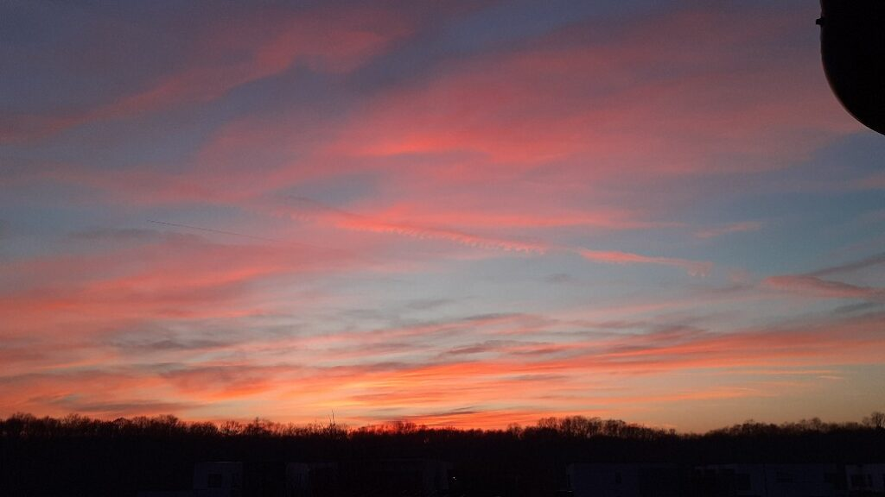
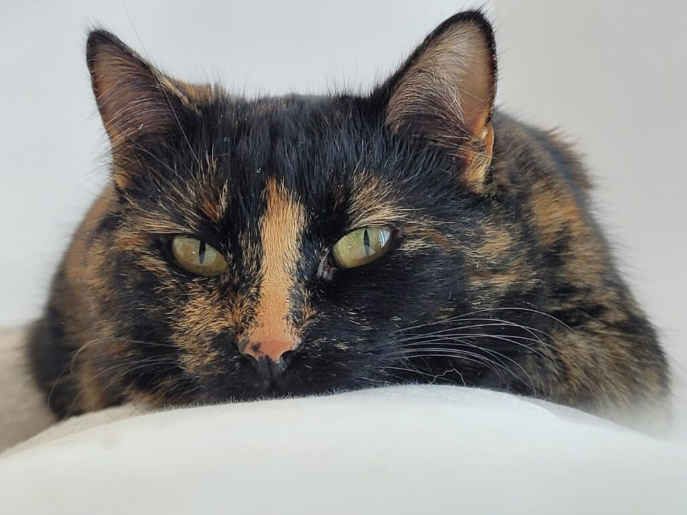

Prima noapte dintr-o bucată pe noul an tocmai s-a înscris pe răbojul proaspăt alocat unui calup fraged de viață a mea. Nu neapărat cea mai odihnitoare, dar mai lină, mai neforfecată de combustiile clasice care-mi ard nopțile în ultima perioadă, mai așezată pe-un pașnic fain, ce m-a legănat subliminal până în zori. O țâră uimită ce liniștea asta întinsă pe-o bucată așa mare de noapte, mă culcușesc mai cu voluptate-n pat, la căldurică și mă torn și răstorn în micul și intimul meu ritual de recunoștință. Sunt blândă cu mine, nu mă grăbesc spre nicăieri nici în afară, nici înăuntrul meu. Îmi împrăștii niște boabe de zăbavă pe cărarea asta imaterială, din mine, pe care-mi invit recunoștințele să pășească și să se înaripeze, să mi le ducă în șapte zări. Puiul ăla de drag de mine, de grijă a mea față de interiorul și exteriorul meu, îmi mulțumește pentru blajinătatea cu care mă încep într-o nouă zi. La cât mai multe, doamne-ajută!

Mi-am întins oscioarele și mușchii cât să pipăi cu degetele de la picioare o gălușcă blănoasă ce mă păzește, s-o zgândăr un strop fără să vreau și să mi se avânte spre față, să mă miroasă. Gata, fetiță, m-am trezit, chiar bine, hai să îmbucăm viață bună azi!

\*\*\*

Privesc cu ochi curioși cum zeama de lămâie se împrăștie în halba de apă caldă și pulpa de fruct care plutește la suprafață și dintr-odată înțeleg, la propriu, ce înseamnă sloganul ăla de-l vezi pe toate reclamele "Ești ceea ce mănânci!". La modul cel mai visceral posibil, uzina asta senzațională care este corpul uman procesează tot ce-i dăm ca hrană și o transformă într-adevăr în ceea ce suntem. Abia acum, cu ochii pe pulpa asta mică de lămâie, mă pătrunde sensul zicerii lui Sadhguru, că pâinea-ți devine corp. Luăm atât de multe for granted, nu suntem atenți o țâră, facem mecanic chestii de mici, întâi prin mimetism, apoi c-așa ne-am învățat, că nici nu mai vedem asta. Eu cred că dacă majoritatea omenirii ar bifa doar layerul ăsta, să priceapă, cu subiect și predicat, brut, carnal, că hrana de azi e corpul de mâine, ar fi un imens salt în conștiința colectivă. Pentru că sunt convinsă că următorul pas ar fi să privească cu ce se hrănește, cu ochi curioși și cu întrebarea de copiluț inocent "de ce?". Câtă analiză pe o picătură de carne de lămâie…

\*\*\*

Platoul de fructe începe să devină atrăgător dimineața, dar am și-un aghiuță pe umăr care mă îmbie să mai strecor și câte-un smoothie, din când în când. Am o grămadă de fructe în congelator pe care va trebui să le consum, iar smoothieul e singura variantă curată. Marea mea dilemă, pe care nu știu cum s-o rezolv, este cum aș putea să am zilnic afine de pădure proaspete. Am încercat să mănânc afine de pădure decongelate și sunt nașpa.

Nu mă încântă nici tv-ul, nici telefonul, nicio interacțiune cu exteriorul, doar cu cel din afara ferestrei mele, ce îmi deseanează zori cuminciori pe vechiul meu prieten, de vara trecută, seninul și înaltul cer.

Înainte de atacarea platoului, mă apuc de tema de la provocarea cu construirea de noi obiceiuri sănătoase și-mi place mult.

E o tehnică simplă de respirație, numită box breathing, care, după primele momente în care mă focusez pe vocea celui ce conduce tehnica, mă duce, în spatele ochilor închiși, într-o lume fantastică a energiei. Dacă până de curând, eu credeam că toată lumea vede ce văd și eu când închid ochi, apoi mi s-a părut rușinos să spun asta, acum îmi dau seama ce bogăție mi-aduce acest "defect": cu ochii închiși, legănată de vocea caldă a tipului, efectiv mă simt fulg care adie pe unde de energie, când pe sus la inspirație, când pe jos, la expirație. Sunt o luminiță mică și vie și năstrușnică ce pulsează cu energia asta care curge constant în jurul meu, prin mine, în mine, iar jocul ăsta aliniat cu curgerea e bucurie pură. Am trăit vreo 8 minute de joacă curată și plină și liberă și ușoară prin Univers. Nebunie!

Mi se pare extraordinar cum nu se predă în școală meditația sau măcar un stropșor de întoarcere la sine, la cine ești în spatele carcasei de carne, a fratelui porc. Simt eu că copiii ar prinde tare repede despre ce e vorba, pentru că n-au acumulat încă prea multe scame peste sufletul lor curat, pot găsi mult mai repede și mai ușor drumul către înapoi, comparativ cu adulții, care, ca mine de exemplu, aveam nevoie de instrucțiuni scrise, pas cu pas, să înțeleg o dată ce e aia meditație. Mi se părea așa un voodoo complex, până am priceput că tot ce trebe să faci este să te relaxezi. Să-ți lași bocancii cu încrâncenare la intrarea într-un spațiu și-un timp doar al tău cu tine, pe ritm de respirație, liniște, pace și, în cazul meu, tot felul de viziuni sau vedenii fantasmagorice, dar superbe. E o cheie de acces la o lume ușoară, la adevărata lume, la ce e real de fapt dar nu material.

În dimineața asta, în tăcerea din jur și din mine, mi-am dat seama din nou de imensitatea pe care o conțin, mi-am dat seama că dacă închid ochii, și nu mai văd materialul, nu se termină viața, în spatele ochilor închiși e tot viață, cu deosebirea esențială că n-are pereți sau ziduri nici la dreapta, nici la dreapta dreptei și nici la stânga stângii. Practic, nu mă pot cuprinde, iar asta e fascinant pentru cineva care a fost centrată pe palpabil, pe ce ESTE perceput de simțuri, nu pe abrambureli ezoterice care-mi tot circulau prin-mprejur.

\*\*\*

Mama își ia micul dejun aproape din picioare, pentru că e și Hitlerică la micul lui dejun pe terasă iar pentru ea asta e ca o atracție de circ. Repetă din 5 în 5 secunde "Dar ce blăniță _foarte_ curată are!", "E _foarte_ frumos!", "Eu n-am văzut pisică așa de frumoasă ca ea!". Cum deja m-am obișnuit, mama augmentează tot pe percepe interesant în jurul ei, e ca un bebeluș care vede pentru prima oară, are aceeași surprindere și încântare pură și neîntinată. A devenit actriță în varianta, cu aplicabilitate pe mental, a filmului The curious case of Benjamin Button, ușor-ușor redevine copiluță.

\*\*\*

Am petrecut timp de calitate și de suflet cu omul iubit, ne-am mai despuiat niște părți de suflet care se jenau de expunere, le-am ogoit si liniștit și ne-am uns inimile, fiecare cu el însuși, dar și unul altuia. S-ar putea spune că ne reinventăm pe noi și, prin asta, și relația dintre noi, care cuprinde și cunoaște noi valențe ori de câte ori suntem autentici, sinceri, uneori brutal dar necesar, și iubitori. Nu știu dacă alegerea mea, dar și a lui, de a pune lupa de mărire pe clipă și de a observa la microscop emoțiile și de ce-urile din spatele lor, e cauza, dar văd și simt că relațiile din viața mea, alea puținele, s-au schimbat genial, parcă și-au pus pelerină bogată și pufoasă pe ele, parcă mustesc de căldură.

\*\*\*

Mai am un strop de timp pe care mi-l iau să mă despletesc într-o scriere. Probabil că eu am un penel ascuns undeva într-o cută de suflet și de câte ori îl folosesc, am sunet de harpă-n mine, mă simt calificată la o altă frecvență de vibrație, mă simt elevată, mă simt ca un izvor din care cu cât tragi mai multă apă, cu atât se adună și mai multă. Iar pentru asta, ironic sau nu, trebe să-i mulțumesc demenței mamei, cu plecăciune și cu vârf și îndesat.

\*\*\*

De data asta, în vremea prânzului, mama are ea bucata ei de poveste, aia ce-i cuprinde anii de muncă la telegrafie, și o las, o împing de la spate, o ațâț și o fac să povestească, să mănânce, să plece aproape total în nostalgia acelor vremuri în care vreau și mă duc și eu. Ochii ei privesc peretele din bucătăria mea dar văd oficiul ei, unde în spate își făcea cafeaua în fiecare dimineață, desfăcea rebus în zilele fără prea multă muncă sau unde, la zile comuniste aniversare, transmitea prin telegraful ăla "de-i ieșeau ochii". Îmi povestește ca și cum a fost ieri, cum, la prima ei transmitere telegrafică, oficianta care-i dicta i-a spus "Vino joi la piață. Ai grijă, e Ana cu căciulă" iar ea exact așa a și scris și transmis mai departe neștiind că, în limbajul oficiantelor, A na cu căciulă e Ă. Râde cu poftă de rușinea pe care a simțit-o când oficianta căreia îi dicta mama de data asta i-a spus că spune prostii, că textul de transmis e de fapt doar "Vino la piață". Juma' de oră cât a mâncat, și mama dar și eu am fost plecate departe, într-un oraș mic, la o poștă mică, în niște timpuri vechi, toate cu o aromă tare mișto. Și cred că nu greșesc dacă zic că ne-a plăcut la amândouă prânzul ăsta. 

\*\*\*

Copila mi s-a anunțat într-o vizită de curtoazie, de vedere pe noul an și mă strâng și adun și mă pregătesc s-o primesc.

Observ cu încântare maximă cum puiuca mea s-a adunat din bucățile în care se spărsese în anii trecuți și se crește frumos. Recunosc că e aproape integral meritul ei, eu doar am fost capabilă să văd și să-i spun și să-i cer iertare pentru toată presiunea și aiurelile pe care i le-am pus pe umeri și pe viață, să facă ceva doar pentru că societatea asta așa cere. Restul, greul, l-a făcut ea, iar mie îmi place mai mult și mai mult de fiecare dată când vine la noi și descopăr părți din personalitatea ei curățate de traumă, de stresul cronic, de agitație, de nevoi și de negativismul ce ne-a îngriit tot neamul se pare, de la buni străbuni.

\*\*\*

Am căzut lată în seara asta, dar sunt bine. Iar apusul ăsta superb ce-nchide ziua e fix cireașa de pe tort.

Am în mine suflu nou, de pornire, de facere, de fiire, de putirință și șuvoi de recunoștință pentru:

1. Răbdarea asta nouă a mea cu mine!

3. Mine asta nouă în raport cu mama!

5. Creșterea copilei mele!

Clipă de fain în zi:

