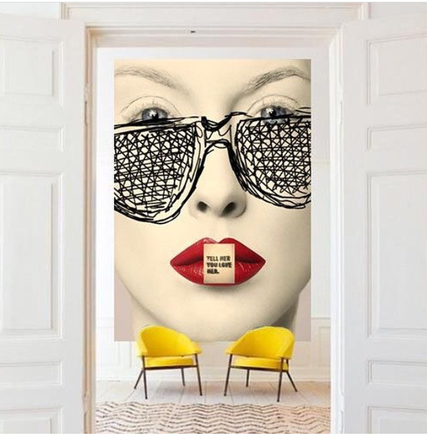

Încep să cred că animalele, dar cu precădere pisicile, au în ADN-ul lor codate tehnici de manipulare subtilă, subversive. După ce și-a verificat vârfurile gheruțelor în salteaua de la pat, pe partea mea de pat, tomberoneza noastră a făcut câteva defilări dintr-un capăt într-altul al dormitorului cu piciorușele ei de felină mărunțică și apoi, văzând că mă fac că plouă, a sărit în pat, pe marginea de pat pe care i-o las liberă, chipurile să vină să-mi ia pulsul și să mă adulmece. I-am simțit mustățile cum îmi gâdilă nasul, dar am făcut pe mortu-n păpușoi, tare aș mai sta și eu în pat, să mai lenevesc sub pilotă, să-mi desfac încetișor gândurile și corpul la o nouă zi, să mă sondez în adâncimi de emoție, să văd ce ape îmi scaldă azi malurile. Ok, dacă a văzut că nu-i iese manevra, s-a așezat pe la jumătatea zonei alocate ei din partea mea de pat și, cu spor și simț de răspundere, s-a apucat de spălat copănelele de balerină. Nu m-ar deranja prea tare toaletarea, dacă n-ar pune atât patos cât să imprime mișcare în saltea și să-i simt fiecare limbuță dată pe crăcănelul înălțat semeț în aer. Gen, mă așez și eu la tine în sufragerie, nu mă băga în seamă, ignoră-mă ca și până acum, dar eu mă apuc de dat cu aspiratorul.

Evident că nu mi s-a mai legat nicio liniște în fibre, ba din contră, am devenit acut atentă la fiecare "val" făcut de mișcarea ei de coconet cochet, așa că, cu juma' de zâmbet și juma' de nerv fâsâit, i-am dat satisfacție și m-am ridicat. Ce să vezi, dintr-odată s-a făcut cozonăcel, de parcă nici nu se spăla cu țâfnă acu' juma' de clipă, s-a întins, cât îi de lungă, s-o alint și apoi a pornit triumfătoare, înaintea mea, spre scări. N-am cum să n-o iubesc și nu pot să nu-i recunosc meritul: a obținut ce a vrut de la bun început.

***

Nu știu de ce sau de la ce, dar în dimineața asta am o senzație de full de abia intră, chinuită și înghesuită, halba de apă caldă. Din același considerent, nu-mi pregătesc platoul de fructe, pentru că nu mi-e clar dacă voi fi capabilă să le mănânc sau nu. E o stare nouă, cel puțin în ultima perioadă apa părea că nu-mi ajunge, iar ideea de smoothie, înlocuită de fructe, îmi ploua la propriu apă în gură de poftă. Uite că în dimineața asta, n-am chef, deocamdată, de ele.

Deschid larg geamul de la living, să iasă și Spikylina dar și să intre zori și lumină crudă, să primenească interiorul și să mă scuture puțin cu răcorică.

Este tare cald afară pentru perioada în care ne aflăm iar pământul cred că suferă din lipsa precipitațiilor, de orice fel. Tare mi-aș dori o zăpadă, dar acum e bună și suficientă și o ploaie zdravănă. Domnițele cârtițe, cred eu că-s femei la cât de harnice sunt, au înălțat vreo șapte noi castele, iar curtea mea pare că a trecut printr-un asediu. În fiecare zi nivelez cu grebla castelele, să nu se întărească și să am numa' dâmburi pe teren, dar în ziua următoare sunt alte și alte castele și pare că rugămintea mea eterică nu le impresionează deloc. Nu vreau să le fac rău, am tot sperat că vor pleca ele la un moment dat, apoi m-am bucurat că mirosul de pisică cică le alungă, dar m-am dezumflat când am văzut cum Spiky le păzește castelele și nu se întâmplă nimic, ele tot sapă tranșee și tot scot la suprafață surplusul. Asta e, partea bună e că solul e clar bun, plin de râme, hrana lor preferată, deci voi încerca să găsesc o cale de a trăi cu toții sub soare, sau sub pământ, după caz și aplicabilitate. Poate face Hitlerică vreo minune.

***

Pentru prima oară într-un an jumate, nu mi-am mâncat fructele la prima masă, ci am devorat cu o poftă imensă, 2 bucăți mari de portokalopita vegană. În secunda doi m-am simțit vinovată că i-am dat organismului așa o culme glucozică, iar în secunda trei m-am luat în brațe singură și mi-am permis. Cine a zis că lucrurile TREBE făcute numa' într-un fel?! Am voie să mă abat câteodată dacă simt că vreau să fac asta, așa că secunda patru m-a găsit cu un zâmbet larg pe față, lingându-mi buzele de pe care am mai recules încă o dată gustul ăla bun de dulce portocal. Vorba lui Jessie, GlucoseGoddess, în viață ai dreptul la două alegeri: sănătoase sau de plăcere. Azi am bifat-o larg pe a doua și încerc să reduc la minim vocea critică din mine care e mare cutră.

***

Mi-e clar că mama a intrat pe făgașul normal și azi m-a bucurat, din nou, că a mâncat bine. Îmi observ, mai ales în ultimele trei săptămâni, cum îmi dau și eu reset la așteptările în ceea ce o privește, cum mă bucur din nou și din nou că ea e bine, că mănâncă, că se mișcă cât de cât autonom, că și-a reluat repetițiile. Iar ca să fie și ea aliniată cu mine, la prime dăți, după vreo trei săptămâni de pauză, azi dimineață s-a jucat pe tabletă. Puțin, dar a făcut-o. Nu e incredibil cum omul se poate adapta la orice? La reducerea spațiului în care viețuiește, la reducerea libertății în care trăiește, la reducerea conexiunilor pe care le hrănește? Și apoi, când ceva trunchiază și mai mult astea, se înghesuie și se adaptează și la noile dimensiuni iar dacă, vreo conjunctură favorabilă le dospește o țâră, mamă, ce bucurie, ce larghețe, ce mărinimie de spațiu. Așa și eu, mă strofocam toată ca mama uită, repetă, e absentă dar, după ce a trecut moartea fluierând pe lângă ea de i-am simțit fâlfâirea, mi se pare boierie că uită, repetă, e absentă. Poate-mi înțeleg lecția de aici.

***

Am poftă adâncă să scriu, așa că-mi dau drumul la jazz pe fundal, îmi iau ceaiul și durerea de cap, la fel de în surdină, și-mi aștern prin taste și litere trăirile pe care mi le-am schițat în agendă.

De fiecare dată mă încântă cum prezența pe care am pus-o la rădăcina fiecărui cuvânt din agendă e capabilă să-mi reînvie aceeași aromă pe care am gustat-o la momentul pe care-l descriu, memoria stărilor s-a dezlipit din mine și s-a făcut parteneră cu cuvintele, așteptând cumincioară s-o aduc din nou la lumină, s-o mai iau o dată la rumegat, s-o despic în coajă și miez și să-mi iau comoara de acolo. Scriu, și descarc, și devin una cu ziua pe care-o depăn și-n spațiul ăsta astfel creat vine, cu putere gălăgioasă, o realizare nouă: câtă esență are o virgulă. Deși gândul ăsta a pornit fix de la sensul propriu, am înțeles în timp ce scriu că am primit o nouă șansă, că n-a fost punct în viața mamei ci doar o virgulă, periculos de arcuită ce-i drept, dar cursivă și nefinală. M-am oprit din deșertarea mea pe un ecran, am respirat conștientizarea asta de mi-am umflat plămânii, am mulțumit umilă realității care a permis virgula și m-am întors, limpede, curată, nou născută parcă, la scrisul din mine.

***

Ca să mai dreg oleacă busuiocul, îmi fac o salată mare de crudități și mă fâțâi pe lânga ea alea 40 de minute necesare sulforafanului din conopidă să se activeze, deși îmi cam chiorăie stomacul de foame. Încă o dată, observ că eu îmi nasc și bătaia pe umăr, a felicitare pentru salata sănătoasă, fix cum mi-am născut matinal și vinovăția. Nu știu cam de câte dovezi d-astea, atât de explicite, mai am nevoie, să mă dau odată la o parte din calea mea. Știu însă că uneori îs mai tardivă și știu și că uit repede, că nu le pot cuprinde pe toate. Mintea mea are filtrul propriu și un sistem pe care încă nu l-am descifrat prin care pune ștampila de "admis" pe unele conștientizări și "respins" pe altele. Dar am început să gust nectarul dragului de mine și, în stilu-mi de broască țestoasă, ușor-ușor îmi dau atenție și grijă. Are engleza un cuvânt care, deși are traducere în română, mie nu mi se pare că românescul concentrează tot ce simt la englezescul **Nurture**. Da, încep să mă hrănesc, că tare însetată și avidă sunt. Și nepedepsitul meu de către mine, când nu mă aliniez la perfecționistul sabotor din mine, e tot o formă de hrană.

***

O îmbrățișez și pe mama cu starea mea domoală și-și mănâncă prânzul în povești scurte și calme despre Spiky și Hitlerică. Chiar n-am mari noutăți pe marginea căror să brodez, să-i aduc la masă povești spumoase și nici interiorul meu nu este efervescent ca să-i presare sclipici pe modul cum povestesc, dar, la un nivel subtil, nevorbit, simt că mama e aliniată cu mine în stare. Nu e nevoie de cuvinte, e ceva care plutește de la ea spre mine, iar eu sunt capabilă să citesc acest ceva și să-l convertesc într-o stare cumincioară. Oare atunci când mintea coțofană nu mai e la pupitrul de control, ce rămâne în ființa umană are un alt limbaj și-și croiește noi căi de exprimare? Parcă m-am întors în timp, la momentul când mama sigur îmi înțelegea nevoile de bebeluș fără vorbe ce nu-mi existau în vocabular, cu diferența notabilă că acum eu sunt mama și ea bebelușul.

***

O postare de pe Facebook a acționat ca o catapultă a mea din mine. Un comentariu de judecată, crudă, rece, calculată și dură, m-a smuls brutal din papucii mei liniștiți și mi-a dat cu vulcan pe la tâmple. Și după ce am fost indignată moral că cineva poate să judece atât de dur și mai și pierde timp și energie să și scrie asta, am făcut un pas în afara mea, asta uimită, și-n afara situației, și am putut să fiu incredibil de observatoare și de imparțială.

Majoritatea oamenilor, myself included, dintr-o aroganță maximă la suprafață și-o tristețe groasă mai în adâncime, și-a pus ochelari special croiți cu decupaj tip grilă, prin care strecoară strâmt și scrutinitor oamenii cu care vin în contact. Dacă, feri-te-ar Sfântu, ai picat c-o părere șuie pe-o margine de grilă sau ți-a reușit ceva și-ai ofensat cealaltă margine, te-ai ars și, mai mult ca sigur, ai "contribuit" la desființarea ta. Târziu, dar târziu de tot, am citit, și apoi experimentat pe pielea mea, că cei care judecă cel mai iute și mai mult, sunt, în primul rând, cei mai mare judecători ai propriei ființe. Astăzi, din scaunul ăsta distant în care m-am așezat, am putut să înțeleg, fără să mă mai încarc și cu simțitul, cât de gol trebe să fie la cel care judecă și cât de aspru trebe să se fi simțit la cel judecat. Și toate belelele astea vin din nevoia aia nesecată de validare, mama ei de nevoie. Vine din umbra aia în care am aruncat și mascat și ascuns ce nu ne plăcea și ea s-a împlinit, s-a îngrășat și-acum cere și mai mult ca să supraviețuiască. Dintr-o frică de lipsă, nu avem curajul să lăsăm lucruri din noi să moară, mai ales dacă avem și ceva lăcomie la purtător.

Mi-a fost cristal de limpede că dacă m-aș ridica deasupra mea și m-aș privi cu un ochi curat și m-aș sorta la sânge și m-aș lăsa să mor acolo unde nu-mi mai sunt utilă, aș face mult spațiu în mine, disponibil pentru o mine nouă. Dar eu, crescută într-o mentalitate de lipsă, sunt ca pisicul luat de pe stradă căruia-i dai un bol cu bobițe și el se pune cu tot corpul pe bol și apără toate bobițele de teamă să nu i le ia cineva, deși clar nu le poate mânca pe toate. Sunt și eu o tomberoneză, dar mă tratez.

***

O zi cu aromă de portocală și de potolit, căreia-i sunt recunoscătoare pentru:

1. Cărămida aia mică pusă la temelia dragului de mine pe care vreau să-l cultiv și să-l cresc și să mă hrănesc cu el!

2. Noul limbaj non-verbal prin care comunic cu mama!

3. Oameni!

Clipa de frumos mi-a fost:

