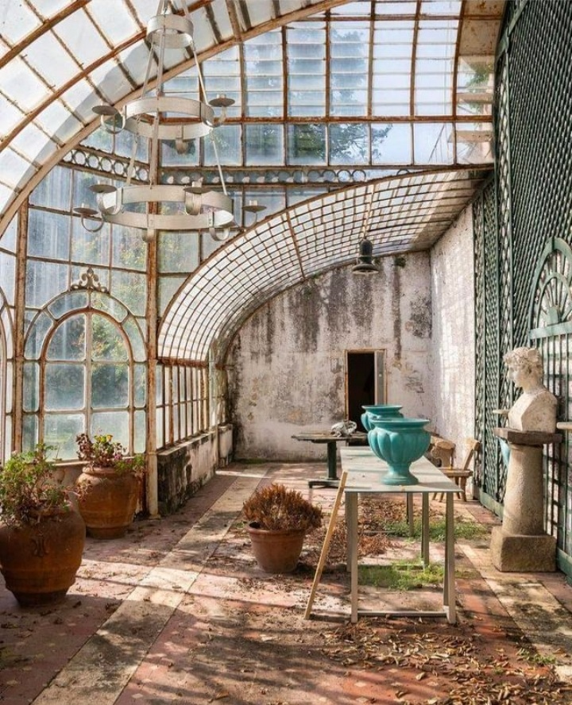

Hahahaha! 

Fix așa-mi vine să-i râd în nas nopții trecute, sau Universului, sau destinului sau cauzelor sau mai știu eu căror sfinți și mucenici, care zici că s-au adunat la un mare sfat al înțelepților și-au pus de-o încercare maximă pentru somnul meu. Nici noaptea ce-a trecut nu mi-am adunat niscai sevă de odihnă prin instalație și evident, am o scuză în mânecă pe care o pot servi. De parcă am nevoie să justific cuiva imensa oboseală care mi se adună sistematic, pic cu pic, în corpul ăsta și-așa destul de hărtănit în viața asta. Vecinul nostru cred că pleacă la drum lung cu mașina că de pe la miez negru de noapte a început să încarce, aranjeze lucruri, închidă, deschidă, trântească uși de mașină iar garajul lor dă, unde altundeva, decât spre dormitorul nostru. La 5 și 23 am renunțat la stropii de somn pe care-i tot încropeam sub pleoape, că bușiturile din curtea vecină deja mă scârțâie pe nervi. Asta e unul din marele defecte ale unei case de lemn: orice zgomot este preluat de lemn și livrat direct în perna ta.

Hai că-s sculată direct în papucii ciufuțeniei, nici măcar Spiky, fericită de trezirea asta supermatinală, nu reușește să mă aducă la o linie de zero, de unde să mă îmbarc în noua zi. Am început de la minus deja…

\*\*\*

La ușă de la bucătărie, pe dinafară, e și Hitlerică, iar vederea lui îmi stârnește instinctele materne de grijă și uit de nervii bigudați de plecarea vecinului. Aerul înghețat de afară intră cu repeziciune în camera caldă și-mi da un chill de trezire în tot corpul: îl mângâi pe pufarinul ăsa mare cât pot eu de blând și îi ignor ochii mari, speriați, care mă privesc circumspect. Noroc că inimile noastre comunică altfel și ne percepem unul altuia intenția bună, așa că am reușit doar să îngheț, nu să mă și zgârii pe mâini. Cu ușa larg deschisă, am avut surpriza ca acest sălbatic miorlăcios să intre în casă, doar o țâră mai departe de prag, unde continui să-l mângâi și să-i vorbesc cât pot eu de cald, având în vedere că deja îmi tremură coloana de frig. Cum vede că apropii ușa, îl apucă așa o frică și o miorlăială, de-i simt până în stomac groaza și îi deschid rapid larg ușa, calea lui spre siguranță. 

Atât s-a putut azi, e un pas uriaș în relația noastră, nu vreau să forțez nimic, așa că închid ușa, el se retrage în cușcuța de pe terasă iar Spiky vine să (mă) cerceteze. Simte imediat miros străin, mirosul pufarinului, și face pe supărata, se freacă insistent, cu spor și obidă, de papucii unde câteva minute mai devreme a stat Hitlerică, să imprime ea mirosul ei și să-l șteargă rapid pe cel străin, și mă capsează cu dințișorii ei mici, așa, de atenționare. Eu trebe să fiu doar a ei, la fel și casa și împrejurimile. Tupeistă, ghemotocul ăsta de pisică. Dar cred eu că taman tupeul ăsta a ținut-o în viață atunci când n-avea pe nimeni care să-i țină spatele. Yep, my sister from another mister.

\*\*\*

Încă pe jumate înghețată, mă întorc în bucătăria semi-călduță și întunecată, unde mă așteaptă cuminți apa caldă și fructele. La platoul obișnuit am adus două noi invitate, o juma' de mango și o felie de ananas suculent și recunosc că-mi plouă-n gură de poftă. Mi-e corpul însetat și de apa caldă, pe care o absoarbe ca o sugativă, instant, dar și de fructe, pe care le devorez. 

Azi e sâmbătă și gândul ăsta parcă-mi dă o răscoală-n corp și mă face să-mi trag de prin toate colțurile puteri cu miros de relaxare, cu aromă de weekend. Chiar dacă-i un concept uman, destul de strâmb, ce presupune muncă la greu 5 zile cu 2 zile de pauză, ideea asta parcă-mi îmbălsămează interiorul, parcă-mi dă spor la zugrăvit acolo, în adâncurile mele acum o țâră umbrite, o atmosferă de blând și frumos.

În mine adastă clar programul pe care l-am instalat când eram mică și când duminica (p-atunci se muncea la greu 6 zile) eram toți acasă. Pentru mine weekendul mereu a simbolizat familia, chiar dacă aia a mea, din 4 oameni complet diferiți, s-a destrămat când aveam 11 ani. D-aia și mirosurile de mâncare gătită, care te îmbie dacă te plimbi printr-un cartier de blocuri sămbăta dimineața, pentru mine sunt un tren ce mă duce invariabil către acele duminici. Doamne, cum au zburat anii! Chiar dacă mă încearcă nostalgia amintirilor, știu că ele sunt și vor fi întotdeauna acolo, că timpul ăla n-a trecut de fapt, că le pot accesa și mirosi și vedea și trăi ori de câte ori îmi voi aduce aminte. Păcat că am pierdut atâția ani din viață, ducându-le dorul, până când m-am înțelepțit să înțeleg că le am pe toate în mine. Doar că trebe să le scutur de greutatea dorului, că nu e loc pentru el în asta care-am devenit.

Azi, pe lângă că e sâmbătă, e și zi de sărbătoare, nu că le-aș ține eu neapărat. Dar azi e ziua de nume a copilei mele, ocazie care mă invită să accesez amintiri oleacă mai recente și să simt în nas mirosul ei de bebeluș proaspăt livrat în lumea asta. Din nou mă minunez de timpul trecut, cu nuanța că, de data asta, timpul are un rod, care-a crescut și s-a desfăcut și a pornit la rândul ei în viață și în lume. 

\*\*\*

Sendvișul cald și laptele bătut, plus un strugure negru spălat și dezbrobonat, își încearcă norocul cu pofta de mâncare a mamei. Urc s-o aduc la micul dejun și o rog să vorbim în șoaptă, că domnul meu încă doarme și aș prefera să-l las să se odihnească mai mult. Mereu uit că hipocampul ei dă delete în secunda următoare și după câteva trepte coborâte, mă surprind surprinsă că ea mă întreabă cu ce mașină a plecat Mr. H la birou că ea-i vede mașina. Draga de ea, eu cred că, printr-o zona neblurată din ea, se prinde că ceva nu e tocmai cum era și încearcă să-mi demonstreze că e încă în control, că e ok, că totul e bine. Peste surprinderea din mine se așează o compasiune imensă pe care tare aș vrea s-o fac prelată care să cuprindă toate și orice neliniște de a ei, atunci când le are. Că, de cele mai multe ori, ori nu le are, ori nu le lasă văzute.

Fix ca un copil mic, în fiecare zi se bucură de bradul din living pentru că în fiecare zi e, pentru ea, prima oară când îl vede. Are și demența părțile ei bune, dacă pot să le numesc așa. 

\*\*\*

Termin cu strânsul de mic dejunuri și-mi pun jazz să-mi răsune în exterior, poate împrumută muzicalitate și interiorului, un strop zgâriat în ziua asta de oboseală, de amintiri, de un preaplin de emoții care s-au despletit neinvitate. Nu vreau să stau cu ele așa că mă pun pe o repriză de scris, desfac pe un ecran sec notițele mele din agendă, să le urc pe blog. Întreg procesul e mângâietor și revelator și cred că sunt în stare să stau și să curg în scris la nesfârșit, atât de bine îmi face și atât de mult îmi place. Din nou, mi se umplu ochii de recunoștință, din nou simt în viscere, că n-am niciun merit și niciun credit pentru asta, am impresia că accesez o zonă din imensa bibliotecă akashică care varsă cuvinte în mintea mea și le așează într-o asemenea ordine încât să facă click și-n inima mea. Practic, chiar dacă eu scriu despre viața mea, pare că acolo, sus, în eter, în akasha, există deja toate astea și mi se revelează pe parcurs ce-mi trăiesc, mai mult sau mai puțin prezentă, viața. E greu de articulat această înțelegere dar e tare ușor de simțit în mine. Și ce mi se pare cel mai fascinant este că în loc să mă golesc prin vărsarea de tumult prin cuvinte, eu mă umplu de înțelegere nouă prin simțire.

\*\*\*

În locul ăsta tihnit nou creat în mine azi, după un început nu la fel de prielnic, mi se face poftă să depăn cu prietenele mele, așa că mă pun pe sunat. 

Cred că unul din plusurile mari ale faptului că am prietene puține este că discuțiile mele cu ele nu sunt flecăreală și, aproape întotdeauna, aceste conversații sunt prezență pură a mea în acum: sunt atentă la tot ce spun eu și la tot ce spun ele, nu-mi fuge mintea nicăieri altundeva, nu plec în altă parte pentru că-mi doresc să fiu acolo, în moment, cu ele, să fim complete, prin schimbul ăsta de cuvinte care se face la distanță dar și printr-un alt fel de schimb, infinit mai subtil și mai plin, care se face între sufletele noastre. 

Sunt la un pas mic de timp de prânzul mamei și profit de el să-mi fac paste. Sângele ăsta cu aromă de italian ce-mi curge prin vene mi se revelează în toată splendoarea lui când vine vorba despre paste: aș mânca oricând și orice fel de paste, atât de mult îmi plac. Plus că iarna au parcă altă savoare, fac, cel puțin la mine, parte din categoria de comfort food. O porție de paste aburinde îmi desăvârșesc plăcerea vieții din această zi.

\*\*\*

Pun prânzul pentru mama și se nimerește ca și Mr. H să-l vrea în același timp așa că iată-ne pe toți trei la aceeași masă. Știu, istoric, din vremuri de demență, că alăturarea noastră nu e tocmai fericită, că se simte în aer, pentru cine mai e capabil să simtă, un fel de stânjeneală, de nesimțire în largul fiecăruia iar eu, care sunt numitorul comun cu aste două ființe importante în istoria mea personală, încerc să dau la o parte norii ăștia aiurea, să răsar soarele prin conversație, deși în mine taman ce m-am așternut cuminte și n-am niciun chef de prefăcătorie. Dar mecanismul pe care mi l-am tras mănușă, de a le rezolva eu pe toate, ca și cum aș putea să fac vreodată asta cu adevărat, mă conduce inconștient și iată-mă cum sporovăiesc să spulber jena asta ce plutește în afara mea dar și liniștea ce stătea bunuță înăuntrul meu.

Salvată de clopoțel, îmi sună telefonul și trebe să mă ridic și să ies din bucătărie. Port conversația pe de o parte ușurată, pe de altă parte observ prin geam cât de nelalocul lui e domnul meu și cât de pierdută pare ea. Niciunul nu mai vorbește și bănui eu că fiecare, unul mai conștient decât celălalt, vrea să termine cât mai repede de mâncat.

\*\*\*

Spăl vasele și fac curat după ei și mi-aș dori s-o fac și la figurat, nu doar la propriu. Cum nimic nu se pierde în Universul ăsta, energia care a băltit între ei încă-i în bucătărie iar eu mă bălăcesc în ea. Cred că am devenit fie mai paranoia, ceea ce nu e exclus, fie mai senzitivă, la fel de veridică și varianta asta, cert este că simt nevoia de aer proaspăt, așa că deschid larg ușa de la bucătărie, să intre aer rece, aer nou, aer primenit, fără scame, fără păreri, fără minte pierdută. Numa' bine, că de afară mă privesc 2 ochi mari și verzi, la început temători, dar, la auzul vocii mele, mai încrezători. Hitlerică e trimis de univers să-mi alunge starea neguroasă și eu continui cunoașterea noastră, pas cu pas, cu răbdare și cu tandrețe. Băietul ăsta blănos este avid după mângâierea palmelor mele, după căldura din vocea mea, după dragul pe care-l imping cu putere în energia mea, la care el se conectează intuitiv. E extrem de vocal, dar dacă reușesc să pun mâna pe el, fără să mă zgârie sau să mă muște, se topește și se îmblânzește instantaneu.

Nu știu cât a trecut dar știu că ne-a plăcut la nebunie la amândoi întâlnirea, căpătăm mai multe încredere unul în altul, mie nu mi se mai pare atât de fioros și sper că nici eu lui nu-i mai par așa de sperietoare.

\*\*\*

Mi-am mai acordat sufletul la un alt suflet într-o conversație, am mai scris un strop, mi-am înmuiat oasele într-o baie cu sare amară și stropi de ulei de lavandă, pe note de jazz instrumental și pot să zic că a fost o zi neașteptat de mișto, după cum a început. Slavă cerului că am blogul ăsta, că va rămâne scris, și pentru mine și poate și pentru alții, să nu uit că viața asta, dacă-i dai credite și o șansă, ți le întoarce nesperat înapoi.

Cu ochii plini de lacrimi bune, mulțumesc scurt, cuprinzător și recapitulativ pentru:

1. Pufarinul care-mi demonstrează că iubire poți găsi, din belșug, oricând în viață, dacă ești deschis s-o primești!

3. Fetele astea ce-mi sunt confidente de inimă, fix croite pentru inima mea!

5. Pofta de viață ce e încastrată intrinsec în noi și ce stă cuminte, sub zoaie de nemulțumiri, s-o scoatem la lumină!

O clipă de frumos: 

