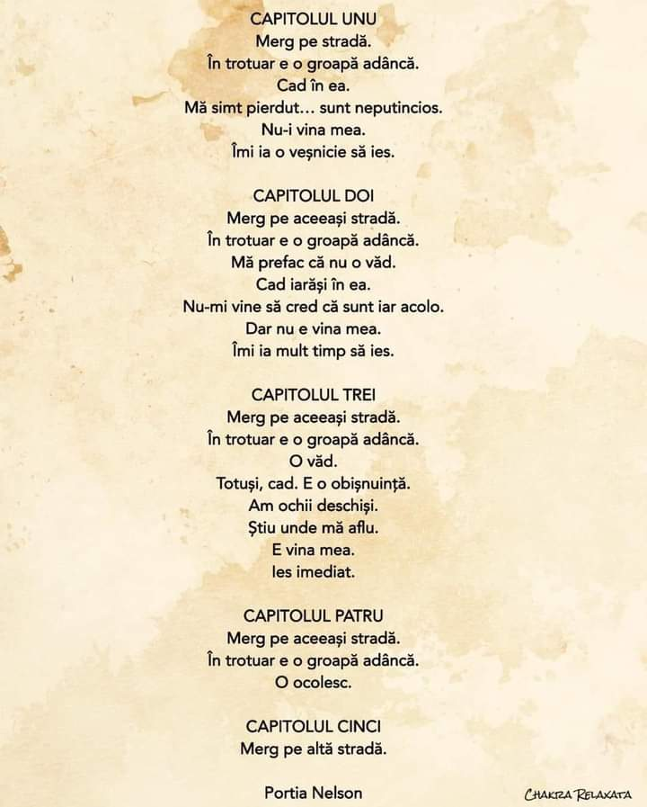

Am intrat pe panta descendentă a crizei biliare. Durerea de cap și senzația de vomă au mai slăbit din strânsoare și în dimineața asta am o senzație de ceva mai multă odihnă. Am adormit buștean azi-noapte și nu cred că m-am mișcat tot somnul. Chiar dacă la 5 și un pic am început să mă fâțâi, începutul de zi e bunuț. Singurul lucru pe care-l lansez în eter este să mă însoțească claritatea mentală tot timpul.

\*\*\*

În drumul meu spre bucătărie, trec pe lângă o oglindă și-mi aduc aminte că mi-am propus să mă salut în fiecare dimineață, cu drag și susținere că doar îmi sunt partenerul cel mai apropiat în această experiență.

Mă uit cu atenție la figura ciufulită care mă privește din oglindă și mi se ivește un zâmbet pe față. Văd zâmbetul care mi se întoarce din oglindă și-mi fixez privirea pe ochi. S-au arcuit și ei a zâmbet. Totul a durat câteva secunde dar zâmbetul din exterior a generat un zvâc în interior. Un mare drag mi s-a cuibărit în inimă pentru ciufulita asta adormită care mă privește curioasă. Probabil că despre asta e vorba, poate că scopul exercițiului ăsta este să întinzi mâna ȘI către tine, să te ajuți și pe tine, că în restul zilei faci de toate pentru toți, trăgând de tine în toate direcțiile fără pic de milă și compasiune și înțelegere față de cea mai apropiată ființă a ta. 

\*\*\*

Încă cu urma de zâmbet în mine, parcă mi-e mai ușor la bucătărie, deși am durerea de cap, deși voma asta îmi strânge stomacul, am o pornire mai mare care nu ține de fizicalitate. E un voit mai puternic.

Mama s-a trezit, a deschis singură geamul să aerisească, mă pornesc către ea cu inima mai deschisă. Până la urmă, deocamdată nu e dracul așa de negru, încă e aici cu mine, cu mici scăpări. 

\*\*\*

În timpul meu magic, vreau să mă cuprindă din nou starea mișto, portocalie, de picoteală pe care am trăit-o și ieri. Și-mi iese! Am câteva plecări într-un somn ca o ciocolată caldă că zău c-aș face asta toată ziua. Dacă aș avea toată ziua la dispoziție…

Durerea de cap se accentuează dar încerc să o anunț că știu că e acolo, să ne împrietenim și să nu mă mai țină în menghină ca zilele trecute. Nu mai vreau pastile. Hai că se poate, parcă ne înțelegem!

\*\*\*

Am un moment de liniște cu domnul meu și cu Spiky, care mă umple de maximă recunoștință. 

Tot ce cuprind cu ochii acum mă încântă și parcă-mi ciocăne în craca aia a sufletului care uită câte are și se plânge de ce n-are. Da, am multe dar recunosc că dacă acum aș avea libertate, m-ș sui cu domnul meu în mașină și aș fugi la munte. Sau la Paris. Sau în Toscana.

Nu degeaba libertatea este o valoare fundamentală care amputează, prin lipsă, un colț de suflet.

\*\*\*

Mamei nu îi e foame și îi propun să îi dau mai târziu sendvișul încălzit afară, pe terasă. E de acord.

Fac un pact cu durerea de cap și îi promit că dacă mă lasă să spăl terasa, să ud grădinița și să fac puțină ordine, voi sta cuminte toată ziua. 

Are pământul meu drag atâta nevoie de apă așa că am pornit sistemul de irigație în curtea mare iar coana mare e extaziată, pe terasă, cu sendvișul în brațe. Mi s-a umplut inima! 

Mi s-a confirmat bănuiala că mama încă e capabilă să împrumute stări. Chiar dacă nu pare, starea ei nu e bună dacă a mea nu e bună și invers: dacă eu sunt veselă, pare că se lipește puțin și de ea.

\*\*\*

Hai că e loc și de niște rufe de spălat. Hai că trebe să gătesc ceva și pentru prânz. Și uite așa mă întind mai mult decât mi-e plapuma și i-am promis durerii, care începe să mă strângă pe la tâmple. Noroc că domnul meu preia conducerea la parter și aspiră el peste tot. Mare noroc! 

\*\*\*

Mă așez în living să-mi trag sufletul, cu Spiky lângă mine. Liniștea asta a mea cu mine vine și cu mici sondări de teren emoțional: cum ți-e sufletul azi, Biannca? Mai binișor. De ce, ce e diferit față de ieri? Păi nu mă mai dor toate așa de rău. Și ce înveți tu de aici? Că totul trece.

Știu că totul trece dar sunt aproape convinsă că data viitoare voi face la fel. Și  următoarea dată peste data viitoare la fel. Îmi iau însă două învățăminte de aici: să îmi aduc aminte mereu că totul trece și să nu mă învinovățesc când, umană fiind, cad în aceeași groapă. Dacă am putea să facem toate greșelile doar o dată poate ne-ar ajunge o viață să devenim experți. 

\*\*\*

Mama a mirosit că sunt mai bine și vrea table. Oricum îmi propusesem de ieri să joc așa că îi confirm. Dar nu 2 ore ci doar o oră, pentru că azi vreau să mă culc foarte devreme. Să mă aduc cât de cât la zi cu odihna.

\*\*\*

Chiar înainte să urc la table, cerul îmi sărută ziua cu minutul de aur. A intrat atâta culoare în living și-n inima mea că rămân pe loc și sorb cu toată puterea lumina asta în mine. 

Mama a jucat excelent, fără greșeală și am adunat și reușita asta la câștigurile zilei. 

\*\*\*

Când să trag linia și să-mi dea cu plus, au început știrile la televizorul ei și am văzut o frântură din oroarea războiului. Eu nu vreau să duc emoțional asta așa că mă tirez repede din orice loc în care se aud știri. E al naibii de dureros un război, e greu să-ți lași o viață în spate, poate și soțul care trebe să lupte (gizzz, nu-mi vine să cred că aud asta în zilele noastre!!!) dar media pune atât de mult accent pe aspectele emoționale și smulge atâta suferință de la telespectatori încât eu refuz să gogoșesc și mai mult containerul ăsta. Așa a fost și în covid, așa e și acum.

Tot ce pot să fac este să îi îmbrățișez pe toți cei care au nevoie de asta, în mintea mea, să trimit gânduri de liniște celor deschiși să le primească și un strop de iubire celui care a pornit o nebunie dintr-o imensă incapacitare emoțională.

\*\*\*

Life goes on and so are we, e vorba unei tipe tare faine de la Lugera, așa că azi, spre deosebire de nu mai târziu de ieri, sunt recunoscătoare pentru:

1. High five!
2. Faptul că domnul meu iubit e lângă mine!
3. Primăvară!
4. Aurul soarelui!
