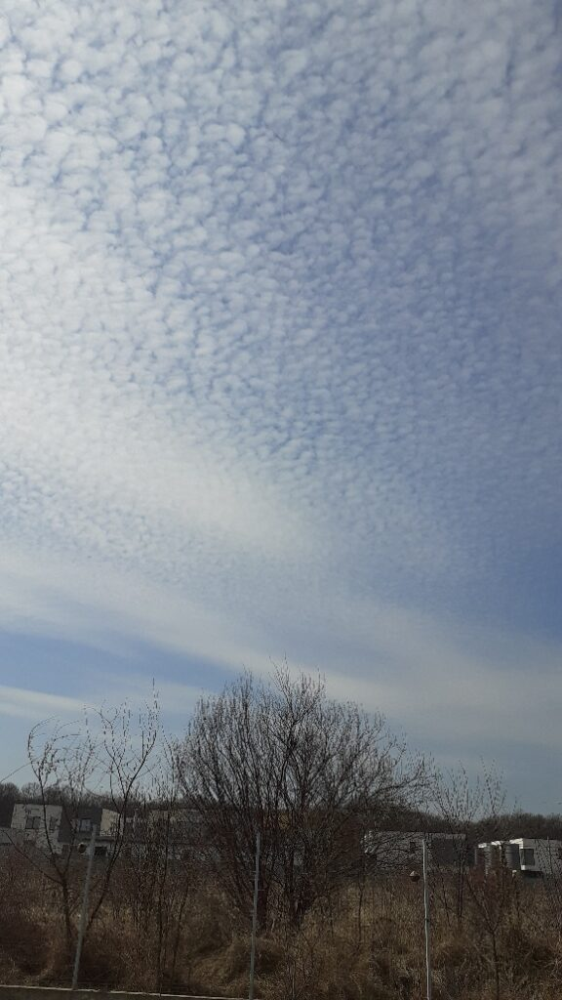

Din nou, o noapte de tip on-off, cu vise urâte, presărate de treziri frecvente generate de cățelele vecinului. Ori a intrat iarăși vreuna în călduri, ori au avut discuții cu vreo vietate nefericită care a trecut prin apropiere, că a fost o hărmălaie de nedescris. La 5 și ceva aproape că eram bucuroasă că trebe să mă trezesc. Am nisip în ochi, în liniștea din jur parcă aud cum trosnesc pleoapele când clipesc.

Mă ambalez să mă urnesc din pat. Timid și timidă, fac o scanare rapidă de corp. Nu mă doare capul, am însă o presiune intracraniană. E doar o senzație de apăsare, poate o fi tensiune.

Nu îi dau mai multă atenție decât e necesar, s-a prezentat, eu am luat notă de prezența ei, nu e chimie între noi așa că hai să ne vedem fiecare de drumul ei în zi.

***

Prepar cu bucurie smoothieurile și ceaiul, în timp ce-mi beau apa fierbinte și vreau să imprim în ele și în gesturile pregătitoare cât mai multă stare de bine. Sper eu ca smoothieul mamei, încărcat cu energie bună de la mine, să îi ridice nițel nivelul. În ultima perioadă devine din ce în ce mai tăcută, mănâncă din ce în ce mai puțin, parcă e într-un proces de shutdown. Sau poate așa îmi pare mie.

Mă duc la ea și la Sassy, azi e o zi caldă și curată la ele, doar deschid să aerisesc puțin și îi dau tratamentul. E bine. Trimit Universului gând de recunoștință pentru starea ei și rog să se mențină cel puțin la fel toată ziua.

***

Mai puțin timp la ea, mai mult timp pentru mine. Azi dacă mă întreabă cineva ce am făcut în timpul meu magic, zău dacă știu ce să răspund. Că nu știu unde a fugit iar eu nu am fost nici prea prezentă. Mi-au zburat gândurile în amintiri sau în planuri iar prezentul mi se strecurat pe sub nas nebăgat în seamă și netratat regește cum merită.

Singura chestie conștientă a fost că am ascultat un video de la Secretele grădinarului despre creșterea roșiilor de la A la Z. Anul ăsta o să fie un an de încercare, o să pun câteva fire de roșii, ardei, castraveți și aromatice, urmând ca în toamnă să-mi pregătesc cu simț de răspundere straturile înălțate și să fac treaba cum trebe. Azi am învățat primii pași.

***

Am adus-o pe mama la micul dejun și mă bucur că l-a mâncat cu poftă și integral. De altfel, micul dejun, când îl vrea, e masa pe care o mănâncă cel mai bine.

Aseară m-a rugat să o tund. Am mai tuns-o o dată, mai cam cu ciobul așa și nu mai vreau asta. I-am propus să o duc la coafor, la un răsfăț. Spre bucuria mea, a fost de acord. Numai că între timp s-a mai scurs o noapte, s-a pus întunericul pe acordul ei iar azi nu mai vrea la tuns, vrea o foarfecă și se tunde singură. Ok, o să încercăm amândouă diseară că și așa e seară de baie.

***

Când a fost cu mine la Lidl, și-a luat chipsuri. Ieri mi-a cerut să-i dau deși eu speram că a uitat de ele. Azi mi-a cerut din nou însă i-am zis că le-a mâncat Daria. Fals însă sunt niște prostii pe care nu vreau să le mănânce zilnic. Nu i-am refuzat cumpărarea lor în speranța că uită. Uite că sunt unele lucruri care deși fac parte din memoria de scurtă durată, se strecoară, habar n-am prin ce mecanism, in memoria de lungă durată. Nu am reușit să descopăr care este tiparul după care mintea ei face selecția însă am observat că, în genere, reține dacă este vorba despre mâncare.

Ca să nu aibă totuși senzația că sunt gardianul ei la cămara cu bunătățuri, i-am făcut o cafea mică și diluată. Mare bucurie mare! Lucruri mărunte cu impact mare.

***

Am lăsat-o liniștită la ea și eu am dat o fugă la Hornbach să-mi iau pământ pentru răsaduri. Pentru că e primăvară, pentru că toate magazinele au bulbi și flori și explozie de varietăți, iar am scăpat pedala de accelerație și m-am năpustit ca nebuna. În topul meu, la flori de grădină, după bujori și glicină, fericitul de pe locul trei este ranunculus. M-a fermecat întotdeauna învolburarea de petale pe care o etalează țantoș, deși, în realitatea l-am văzut doar o singură dată. Azi mi-am cumpărat un pachet de bulbi cu mai multe varietăți: 10 buc ranuncullus, 1 liliac, anemone, gladiole și un iris. Pe lângă, am mai băgat și trei "bărboși", adică trei iriși cu barbă, că ăștia-mi plac mie. Somebody stop me!

Am citit undeva și mi-a plăcut: To plant a garden is to believe în tomorrow. Cam așa e, uite eu îmi continui viața chiar dacă câteodată, în momentele mele de tăciune-n gând, zic că nu mai vreau viața asta.

***

Clar, e o zi cu bine. M-am conversat cu profa mea de curs, care mi-a devenit prietenă dar mi se pare mai cool să-i zic profă. Deși mai crudă în ani decât mine, am învățat și învăț de la ființa asta cât n-am învățat de la nimeni. Cu ajutorul ei, mi-am spălat ochii și văd viața din viață. Ce mi se pare mișto este că mă conectez cu ea extrem de fain, ne citim una alteia energia și câteodată știm dinainte ce vrea să zică cealaltă. E un om mișto care face parte din oamenii noi aliniați versiunii noi de Biannca.

***

Mai am timp să-mi fac salata și să o și mănânc până o cobor pe coana mare la prânz. Soarele blând mă invită afară. Păi de ce n-aș mânca eu salata pe terasă?!

Ca momentul de ieri dimineață, ronțăitul de crudități în curte, în soare, cu Spiky alergând prin curte, cu ciripit de păsărele, cu un cer marmorat superb, a fost o poezie. În toată poezia asta, cel mai tare a fost că nu am avut gânduri. Că doar am mâncat, privit și absorbit ce-mi transmiteau senzorii. Uite că îmi mai iese și mie ce zice Eckhart Tolle, cu prezentul. Că dacă-l cureți de scamele din trecut și undițele din viitor, te recompensează cu aur pur. Fix așa a și fost!

***

Ce mă oprește pe mine să-mi creez momente d-astea faine? Mintea mea. Da, poate era mai mișto să fi mâncat un ananas în Maldive, pe plajă sau în Sri Lanka dar, ce să vezi, m-am simțit tare bine și la mine-n curte, la trifoi, cu spanac și conopidă sub mustăți! Nota bene pentru mine: când te mai apucă și te dai cu curul de pământ că haules și că baules, uite că poți să-ți faci singură momente de plin.

***

O aduc pe mama la prânz dar după 3 înghițituri, respinge mâncarea. Nu are o stare psihică rea, poate nu e nici cea mai bună dar asta cu mâncarea mă agasează. Încerc să o țin de vorbă, să nu fie atentă la cât mănâncă ci doar să mănânce dar nu-mi reușește prea mult. Înghit halucinațiile ei și născocirile zilei în speranța că va înghiți și ea ceva mai multă hrană. Se oprește. Mă opresc și eu că nu-mi place să înfrâng voința nimănui. O avea și ea totuși un radar care-i spune când îi e foame și când nu.

***

Eu ies din nou în curte, să-mi fac planul de plantare și descopăr cu mare, mare bucurie că alți doi bujori s-au ițit din pământ! Din 8 bujori doar Lemon, cel galben, încă nu a dat niciun semn. Restul, au scos căpșoarele și le vorbesc în fiecare zi. Îmi place la nebunie să văd cum o viață nouă crește sub ochii mei. Mai ales că sunt bujori, preferații mei. Mi-au ieșit și laleluțele, 8 la număr. Iupiiii!

***

Stau cu domnul meu cât timp mânăncă și am o conștientizare.

Cred că omenirea ar face un salt de vibrație dacă fiecare om și-ar da jos ochelarii prin care judecă alți oameni sau situații sau lucruri și și-ar pune ochelarii curiozității.

Dacă în loc să te judec că ești mai sus, mai jos, mai altfel decât mine, să fiu curios să observ "măi, da' tu cum ești?" E ca la bomboane. Una are aromă de cioco, alta de cocos. Să nu o judec p-aia de cocos ci să fiu încântată că există și curioasă să văd cum e. Am mai descoperit ideea asta în timpul cursului dar uite că îi prind noi și noi valențe.

***

Dermatita pe care o am începe să îți facă simțită prezența tot mai des. Am senzația că am pielea de hârtie, mă înțeapă mai tot timpul, mă mănâncă peste tot, am răni în coate și pe partea superioară a palmelor. În Noua Medicină Germanică, dermatita indică un conflict de separare.

Epiderma este asociată cu atingerile, cu contactul fizic cu alte ființe și obiecte.

Separarea se poate manifesta în două sensuri: nu vreau să fiu separat fizic de cineva/ceva (drag) sau vreau să mă separ de cineva/ceva.

Am mai spus-o, cred cu tărie că un disconfort psihic, de la traumă, care a săpat în fizic, până la frustrări adunate, vorbe înghițite și nespuse, se vor oglindi, mai devreme sau mai târziu, într-un disconfort fizic. Nu vreau să-i mai zic boală pentru că sună așa de dramatic. E un disconfort, o deviație a corpului de la starea lui naturală, deviație care, întotdeauna, poate fi rezolvată. Nu e ușor dar eu știu, în mine, că orice se vindecă. Trebe însă o abordare holistică de la gânduri, la dietă, la mișcare, la ce punem pe piele, la ce respirăm, la ce bem și la cum ne trăim viața.

La mine, neacceptarea situației mamei cu care mă confrunt, de care vreau să mă separ pentru că nu-mi place, generează dermatita. Deja cred că am făcut primul pas, adică am înțeles ce anume a generat dermatita. Acum rămâne să fac pace cu asta, să abordez holistic și să am încredere în natură și natural. Atipic dar când nimic nu e imposibil totul e posibil.

***

My time is up și azi: mă duc la table, apoi o tund, apoi baie, masaj, tratamente și deja o să pic frântă.

***

Oricum ar fi, ziua asta a fost tare bună cu mine. De fapt, cred că eu am fost bună cu mine. Cred că am zărit astăzi că am setat niște reguli și am niște idei rigide despre cum trebe să se întâmple lucrurile cu mama. De fapt, pot să fac lucruri, pot să-mi iau ceva timp dar cel mai important, am simțit azi că acel timp pe care îl am poate fi desenat oricum vreau eu. Eu sunt singura responsabilă de rozul din el.

În rest, podiumul de azi al recunoștinței arată așa:

1. Lipsa durerilor acute!
2. Flori, multe flori, din ce în ce mai multe flori!
3. Momentul prezent, acumul meu plin de tot și de toate!
