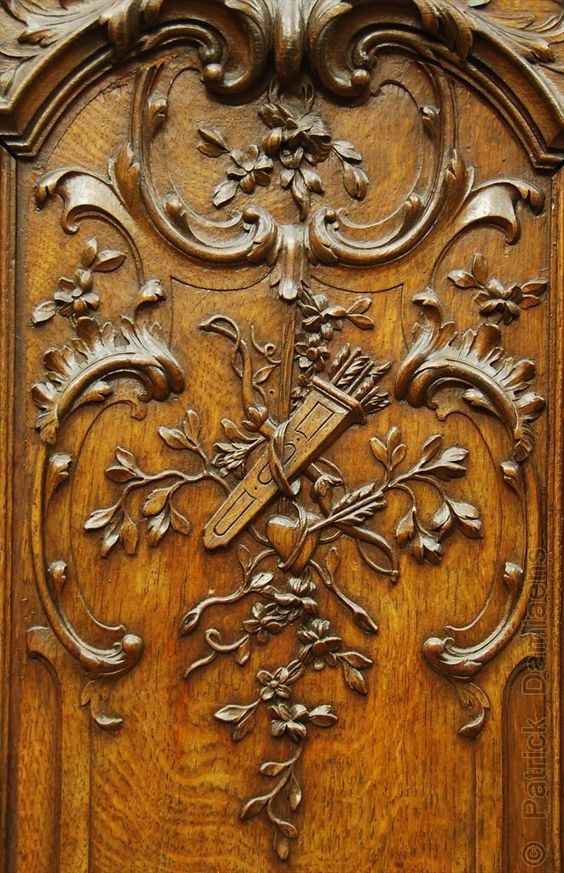

Prințesa Spiky a tronat în patul nostru aproape toată noaptea. Domnul meu, dintr-o delicatețe exagerată, era aliniat pe marginea patului, dezvelit, pentru că don'șoara dormea profund pe pilota lui și nu a vrut să o deranjeze. Ei, poftim!

Am luat-o de-o aripioară și am ieșit ușurel din dormitor, să mai apuce și el un strop de somn sub pilotă, lăfăit în tot patul, dacă vrea.

\*\*\*

E beznă densă afară, soarele nu vrea să ne salutăm de dimineață bună așa că aprind lumina în bucătărie, ce ne orbește pe amândouă. M-a bușit râsul uitându-mă cu juma' de ochi la Spikylina care și ea se uita înapoi la mine tot cu juma' de ochi. Două adormite!

Chiar trei, dacă o pun și pe mama la numărătoare. Deși se mișcă în pat, nu vrea să se trezească încă. Mă apuc de trebușoare că, de obicei, de la momentul la care începe să se foiască și până se dă jos din pat, nu mai trece mult timp.

Așa e, s-a trezit dar, ca să avem elementul de noutate prezent în fiecare zi, nu s-a dat jos din pat, nu s-a dus la baie ci a luat direct tableta în brațe și a început să se joace. Deși mă bucur că se joacă, deși mă ajută acest jucat al ei să pot să mai și respir și să fac și alte lucruri, eu mă întreb cum poate sta cu orele mufată în joc. În afară de mese și de ritualul serii, ea este aproape non stop pe tabletă. 

\*\*\*

Le duc să pape la amândouă, deschid să se aerisească, că e nevoie, fac curățenie și vreau să îi iau pulsul, să văd ce stare de spirit are. Încerc o glumă și-mi răspunde cu altă glumă înapoi. Wow, chiar că zi cu noutăți! Bun așa, poate am, și are, noroc și acul barometrului de stare rămâne fixat aici pentru tot restul zilei. Sau al vieții, dacă nu cer prea mult. 

Mai stau cu ea, că-mi place că e ea, apoi mă duc să iau sacul de gunoi cu mizeria din baie și când mă întorc și dau să ies, îi mai arunc o glumiță. Șoc și groază, nicio reacție! Se uită la mine dar are și fața și privirea aia glaciară, prin care nu pătrunde nimic înăuntru dar nici nu iese nimic în afară. Doamne, atât de repede se schimbă macazul?! Nici nu apucasem să mă bucur deplin de starea bună că s-a dus naibii și, cu ea, s-a dus și bucuria mea. 

\*\*\*

Cobor un strop tristă și îmi dau seama că, în mine, s-a activat un dialog cu demența, în care urlu la ea și o judec și mă enervează că o acaparează pe mama. Îmi dau seama că am creat entitatea Demență și mă cert cu ea și aș vrea să mă răzbun pe ea de fiecare dată când apare câte un conflict d-ăsta de stări atât de rapid. În genere, pot să spun că m-am obișnuit cu ideea.  Speranța mea, că la mama nu va fi cum se scrie peste tot, de fapt stă mică și pitită dar sare și se expandează când văd semne bune, de viață, de viața ei, așa cum o știu eu. Mă năucesc schimbările astea bruște. Nu reușesc să mă repliez atât de repede și-mi dau lovituri sub centură.

\*\*\*

Realizez că cu cât înaintez în vârstă, cu atât au mai multă greutate lucrurile. Adică sunt mai adâncă în simțire. Mă uit la Spiky care, invariabil, în fiecare dimineață, în timpul meu magic, se așează în așa fel încât să mă atingă cumva. Mi-a intrat sub piele, asta e clar, dar e ceva mai mult decât atât. În diminețile astea ale noastre, îmi dau seama cât de greu îmi pică gândul că într-o zi nu va mai fi aici.

Cu cât cresc în ani, cu atât cresc și-n simțire și devin mai atentă la timpul pe care-l petrec cu fiecare ființă dragă mie și la calitatea lui. Când ești tânăr și neliniștit, ești într-o fuștereală așa, parcă nu te apasă prea tare "ăia bătrâni", sau cățelul sau purcelul. Eu, plecată de acasă de la 18 ani și tot de atunci fortață de conjunctură să produc bani, nu am mai avut timp să mă gândesc prea mult la mama. Plus că, în mine, era o țâră vinovată că ajunsesem la facultate, prima din neamul meu, și acolo m-am trezit că nu au bani să-mi dea și mor de foame. Așa că drumurile mele spre casă erau rare pentru că lucram și când veneam, eram mai mult în oraș, că, deh, orgoliul de studentă era-n pârg. E drept că nici ea nu începea niciun dialog cu mine, mult mai târziu punând asta pe seama discreției ei. Nu am hotărât încă dacă să o cred sau nu, nu reușesc să decelez unde începe indiferența, se termină discreția sau intervine egoismul ei. Oricum, nici nu mai contează.

\*\*\*

Probabil că în ultima mea viață sau una trăită chiar acum, în paralel, că timpul e relativ, am fost fie tâmplar, fie castelan. Efectiv, am o bucurie aproape de plutire, greu de pus în cuvinte și explicat, când văd stilul rococo aplicat în lemn, în ipsos, în marmură. Parcă simt pe buricele degetelor cum mângâi suportul care găzduiește superbul stil. E un stil alambicat, bogat în detalii, de o finețe sublimă, pe care fie îl iubești, fie îl urăști.

În timpul meu magic de azi, am simțit nevoia să mă hrănesc cu imagini rococo. Mi-au ridicat starea de spirit extraordinar de mult și parcă începe să-mi placă jocul ăsta nou cu Universul: îmi livrează circumstanța ce-mi generează o stare aiurea, eu caut una nouă care să limiteze daunele create. Poate reușesc să-mi fac un obicei din asta. Poate nu uit.

\*\*\*

Coana mare a coborât singură la micul dejun iar eu mi-am pus șortul vorbăriei pe mine, că zău dacă-mi place starea aia bolândă care se așează între noi două. Ce dacă nu reacționează, poate o să am surpriza să aibă reacții! Surprinzătoare cum e demența, niciodată nu știi. Îi povestesc din nou despre coțofanul și coțofana care-și fac cuibușor, despre domnul meu care s-a dus la birou, despre ce floricele am eu în curte, despre răsaduri. Poate mâine coboară și cu reacțiile. Azi nu le-a avut la ea.

\*\*\*

Ies puțin prin curte. E înnorat, un pic cam rece dar e atât de bine, oricum ar fi. Vecinul pesemne că mă pândea că imediat m-a interpelat. Voia, dragul de el, să-mi spună să sap puțin la rădăcina pomișorilor, că a văzut el cum trifoiul îi acaparează. Are dreptate, era pe lista mea de făcut. Îi mulțumesc, îmi promite că, dacă mai trăiește (!), în toamnă mă ajută cu toaletarea, îmi spune că se duce la el acasă dar când vine, mi-aduce trandafiri. O minune de om. Din nou îi mulțumesc și închei, cum o fac eu de obicei, cu "Vă pup!".

Aici am avut claritatea rupturilor care se petrec între generații. Și evoluțiile sau involuțiile dintre ele.

M-a întrebat dacă așa spun eu sau îi spun doar lui?! Nu, așa spun eu oamenilor dragi. El nu și-a permis niciodată să spună asta! Doamne, cât de închistați au trăit bunii noștri. Câte călușuri și-au pus la suflet și la gură, pentru că nu se cade. Câte pierderi, de toate felurile, au suferit pentru că așa ceva nu se spune. Mă bucur să văd că generațiile care vin sunt mult mai deschise, mai nepăsătoare, mai neconvenționale. Mă bucur să văd că există rupturi chiar dacă asta înseamnă că se rupe și podul comunicării. L-am șocat dar pentru că ne știm de ceva timp, am mai avut situații în care am interacționat și s-a prins, în linii mari, de felul meu, uite că nu mă respinge. În mintea lui, e greu să proceseze un "Vă pup!" venit de la o străină dar spiritul lui alege să nu-mi taie craca și să continuăm să vorbim. Sunt atât de fragili! Dar sunt parte din noi la fel de mult cum și noi suntem parte din ei.

\*\*\*

Mi-am vizitat toți pomișorii, m-am umplut de extaz când am văzut că hortensiile au pâlpâiri verzi pe la faldurile tulpinilor vechi, mi-am salutat bujorașii, liliacul meu scoate frunzulițe după frunzulițe, e o țâșnire de viață în curtea mea. N-are cum să nu trezească viață și în mine!

\*\*\*

Pentru că mă încearcă surd durerea de cap, azi îmi fac legume la abur. Pe care mi le mănânc în curte. Cu Spiky și cu coțofenii. Cât de mișto se adaptează orice ființă la mediu. Din bucătărie, îi vedeam pe geam cum fac și ei probabil curățenie în cuib. Cum am ieșit pe terasă, au zburat, să nu cumva să mă prind că e casa lor acolo. Pentru că eu am rămas pe terasă, i-am urmărit cu privirea. Zburau pe câmp, se întorceau la copacul ce le e gazdă dar niciuna nu se ducea la cuib. Ca și cum, chipurile, erau prin zonă, în trecere nu că acolo le-ar fi casa. Sub o formă sau altă, sub o denumire sau alta, șmecheria sau abaterea atenției există la toate speciile. Doar că se numește adaptare și că doar ființa umană a dus șmecheria la nivel de artă a manipulării și disimulării.

Chiar dacă nu mai e la fel de cald ca ieri, așa aș sta afară să ascult păsările, bondarii, e și o ciocănitoare pe fundal, mai sunt și zgomotele inerente ale șantierelor din jur, dar e zgomot de viață. Eu, băgată în casă și-n gânduri și-n griji, nu mai văd viața asta, uit că e doar la doi pași de mine. Ah, și uit că e și în mine. Mă lamentez și mă pierd. Dar sunt și asta.

\*\*\*

Mama nu a vrut prânz deloc. A mâncat o portocală și atât. Bun și așa. Din nou, și azi am primit informația că factorii care nu susțin funcționarea la parametrii la care a fost construit să funcționeze corpul, sunt mâncarea (cea procesată, cu risc maxim) și ZAHĂRUL. De altfel, zahărul este cel care se leagă cel mai mult de demență. Dar pe mama, care neagă că ar avea vreo problemă cu creierul, nu o pot convinge să renunțe la dulce. Nu reușesc nici eu, care sunt întreagă la minte (cred eu) așa că ce pretenție să am de la ea?! Scuza mea e că le implementez pe rând. Întâi să scap de pâinică și apoi de dulce. Sau invers. Deocamdată le am pe amândouă pe farfurie...

\*\*\*

Ceas de table. Nu mai pun muzică. Mi s-a părut aiurea data trecută așa că zic pas. Îmi propun să las să curgă totul. Nici nu mă apucă vorba, nici nu stau într-o tăcere încrâncenată. Chiar dacă așa se desfășoară tot jocul, pentru că nu am avut așteptări, nu a fost nicicum. Tare senzația. Și nouă.

\*\*\*

Sunt gata să trag obloanele peste ziua asta, peste bucata asta de timp din viața mea în care m-am mai  îmbogățit cu ceva conștientizări, cu ceva trăiri, cu ceva recunoștință:

1. Pentru trezirea la viață, și la propriu și la figurat!
2. Pentru rococo-ul ăsta care-mi curge prin vene și-mi cârlionțează inima după placul lui, în fiori de plăcere!
3. Pentru vibe-ul ăsta mișto care planează peste toți primăvara!

Am citit de mult o întrebare care mi-a rămas în minte și care m-a pus pe gânduri: dacă ar fi să retrăiesc o zi din viața mea, IDENTIC cum a fost când am trăit-o, ce zi aș alege? Grea întrebare. Nici acum nu am un răspuns pentru ea.

Iar clipa mea de frumos, cum altfel, decât rococo:

