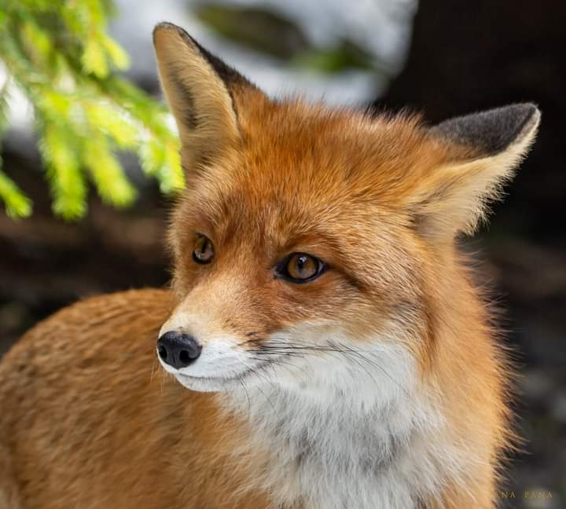

Am dormit neîntoarsă. Și cred că mai dormeam mult și bine dacă nu mă trezea Spiky. Am auzit lăbuțele, am simțit-o în cameră dar o fi ajuns-o vreo undă din energia mea de ieri și azi a fost nesperat de cuminte. Doar a venit, a văzut, a plecat. Bun, mai dormim nițeluș. Nu știu cât a fost nițelușul că iar am auzit lăbuțele pe parchet, într-un ritm alert. Nici de data asta nu a fost perturbatoare. A treia oară de auzit lăbuțele, într-un crescendo, m-am prins că devine impacientată. Avea și dreptate, afară e deja lumină bine de tot, e 6! Mă arunc în papuci, o culeg de pe la jumătatea drumului și pornim în viteză spre bucătărie. Ea de fapt voia afară, o treceau toate cele, d-aia era așa de grăbită.

***

Mă bucur că mama nu s-a trezit încă pentru că vreau să ciupesc și eu câteva minuțele pe terasă. E friguț afară, pe trifoi e o pojghiță de gheață, dar e numa' bine pentru mine care-mi aștept venirea în fire și în corp, pentru că pe ăsta din urmă l-am luat cu japca rapid și nu a apucat să se echipeze și cu mintea.

Mi-am încălzit apa și, contrar obiceiului, am sorbit-o privind pe geam, nu trebăluind. Mi-am odihnit ochii în verdele crud superb al trifoiului care și-a pornit viața pe anul ăsta și e o nebunie, în cerul de un albastru intens presărat cu nori aruncați pe ici pe colo, în copăcei, în coțofenele ce scârmă ele prin curte, în fazanul ce a aterizat în fundul grădinii. Mi-a priit apa mult mai mult așa. Poate mi-agăț în minte și obicei noul rendez vous cu ea, cu natura, cu dimineața și-l mai accesez.

***

Mama e bine, mă întâmpină cu un zâmbet frumos când deschid ușa. Ce frumoși sunt oamenii îmbrăcați în zâmbete! Îmi băgasem nasul la înaintare când am deschis ușa și în loc să mă trăznească mirosul, m-a cucerit zâmbetul. Cât mă bucur! Chiar dacă mă pune să îi fixez ceasul că nu știe unde e șase, zâmbetul ăla a șters orice rezistență a mea la ea sau la vreo meteahnă de-a demenței. Fac ce trebe făcut la ea în cameră și în baie, ne uităm amândouă pe geam, ea-mi spune că a nins, eu ignor și nu las nicio vorbă să intre pe ringul unde zâmbetele noastre dansează. Să fie vals!

***

Domnul meu pleacă la birou azi așa că trebe să se trezească devreme ca să nu ia tot traficul în piept. Una din părțile bune ale pandemiei este că i-a permis lui Mr. H să lucreze de acasă și, pentru că s-a dovedit eficient, a rămas așa. Știu cazuri când relațiile s-au rupt de la atâta stat împreună dar la noi a fost și este atât de fain.

Timpul meu magic de azi nu mai e al meu dar nu-i bai, n-au intrat zilele în sac. Mai bibilesc puțin răsadurile care s-au cam tuflit de la căldura prea mare din biroul domnului meu, mai pun rufe la spălat, le strâng pe cele spălate ieri și mă pregătesc sufletește pentru epidosul doi din serialul Clisa de trifoi.

***

Ca de obicei, când suntem doar noi două acasă, mama se întinde la vorbă și amintiri. O las să depene o nouă variantă a acelorași amintiri pe care le știu și mă amuză noile adăugiri pe care le face. E fascinant creierul uman, indiferent că e sau nu afectat de vreo boală mintală.

Mi-a adus aminte de un tip, care are o memorie colosală și povestea într-un interviu metoda prin care el reține: dacă este o înșiruire de obiecte și/sau numere, el și le imaginează unul peste altul și face tot felul de asocieri. Azi, când am auzit-o pe mama, am avut aceeași senzație: că a luat o amintire și a început să pună peste ea alta și alta și alta până s-a făcut ditamai gogomănia. Dar ea nu vede asta, e ca și cum gura rostește cuvintele și mintea vine repede cu mopul și le șterge. Deja când îi dă drumul la următorul, p-ăla dinainte l-a și șters.

Nu mă mai înfioară, încep să mă obișnuiesc, încep să-i recunosc momentele astea după ochi. Când ochii ei par pierduți la propriu în niște vremuri pe care doar ea le vede, când nu se mai cuplează la prezentul în care sunt eu și în care povestește, mă prind că e plecată. E bine că acum revine rapid, de obicei după ce termină ce are de spus plus încă puțin timp în care se lasă o liniște ciudată. Și cu asta m-am obișnuit.

***

Dacă nu mi-a căzut tot părul din nas la primul episod, de scoatere a clisei de trifoi formată într-un an, cu siguranță episodul doi și-a luat revanșa. De altfel, noroc că aveam un baticuț pe cap de mi-a ținut podoaba capilară pe loc pentru că cred că mi-a căzut părul de pe peste tot la ce mirosuri am îndurat! Odios!

Trebuia să mă fi prins de la prima furcă înfiptă: pentru că a plouat, pentru că apucasem să zgândăr în maldărul ce se adunase în colțul cel mai îndepărtat al curții noastre, zona mustea. Nu mai puteam să încarc cu furca pentru că mi se prelingea totul printre coarne așa că a trebuit să iau cu lopata. După vreo câteva lopeți, am rămas cu coada de lemn în brațe și cu lopata înfiptă în clisă: a sărit holzșurubul care le ținea împreună. O feerie să bag mâna să scot lopata.

Planul meu, să car cu roaba toată clisa pe câmpul pârloagă de lângă noi și să-l răsfir la soare, să se usuce și să îngrașe pământul, este genial dar, frate, atât de departe mi se pare.

După prima roabă, mi-am zis că nu e așa de greu. A doua a mers și ea binișor. La dus, cu roaba încărcată, e cel mai rău, mai ales că e ceva de mers și de împins dar la întoarcere e floare la ureche. La a treia roabă, am început să respir mai greu dar, Agripină cum sunt, îi dau înainte. De la a patra, mi s-a părut cea mai proastă idee de-a mea ever! Și nu dovedisem decât o treime din muntele de clisă. Că acum mi se părea că e cât muntele de mare. De la roaba numărul cinci încolo am pierdut șirul, îmi ieșise limba de-un cot, ce floare la ureche la întoarcere, m-aș fi întins pe jos numa' să nu mai împing la roabă. Cred că pe la roaba numărul nouă, s-a schimbat ceva. Am avut un gând de recunoștință! În toată oboseala aia care-mi zdruncina fiecare mușchi și nerv, s-a pus o liniște și un zâmbet. Mi-a trecut prin minte gândul că alții nu au cum să facă asta, că sunt o răsfățată a sorții că am o clisă de cărat pentru că asta presupune că am trifoi iar asta presupune că am o curte! Mi s-a topit toată încrâncenarea și toată rezistența și până la roaba habar n-am a câta, am fost numa' zâmbet. O ditamai experiența și la propriu și la figurat.

***

La fiecare tură de roabă aveam și o pauză de privit la camera de la mama. Doarme. Foarte bine, măcar nu am și grija ei.

Mai aveam doar un strop și terminam și văd pe cameră că mama și-a pus botoșii pe picioare, iar ăsta e semnul că coboară. Doar ce-am apucat să ajung și eu în bucătărie, că vine ca o floare, toată numai zâmbet. Mai că-mi vine să o iau în brațe dar nu-s tocmai curată și nici nu prea am fost noi obișnuite să avem gesturi d-astea afectuoase.

Îi pun să mănânce de prânz dar mie mi-a rămas în nas duhoarea, că nu pot să mă ating de mâncare. Probabil că și eu put dar mama oricum nu zice nimic și dacă ar fi așa. Din nou, are chef de vorbă și, deși în mintea mea voiam să termin o dată cu căratul, mi-am permis să mă relaxez cu ea și să o ascult. Vrea la ea acasă, îi e tare dor de casa ei. O aprob, nu zic nimic dar știu că atunci când va ajunge acolo, nu va vrea să rămână. A fost casa ei, tot ce e acolo e cumpărat de ea, știu și eu cum e, dar nu sunt condiții pentru un om în vârstă. Plus că e la etajul 4, fără lift.

***

Termin saga clisei. Încă duhnește zona dar acum că e curățată se va usca și va trece și mirosul. Am o mare satisfacție. Dublă satisfacție. O dată că am scăpat de grija asta, de colcăiala de șoricei și de viermuiala ce era acolo și a doua oară că am impregnat o acțiune, de o așa anvergură și greutate pentru o femeie, cu zâmbete. Dacă vrei, se poate să poți.

***

Apa asta călduță ce curge pe mine și mă limpezește nu reușește însă să-mi spele și mirosul. Orice aș face, putoarea mi-este în nări. Hahaha, ăsta e simptom de anti-covid de trifoi! Noul trend în modă primăvara asta.

***

Mă felicit pentru cum mi-am croit ziua de azi. Și mă recompensez cu o lălăială pe terasă, pe scaun, la soare, ca reptila. Încep să percep și alte mirosuri, pe undeva cineva gătește ceva cu usturoi că mi-a venit și apă-n gură. Vânticelul ce adie mi-aduce pe la nas, în reprize, duhoarea de la clisa pe care am întins-o pe câmp. Spiky stă și ea cu mine, după ce a fost să inspecteze fundul grădinii, ca un membru al comisiei de control și calitate ce se află. E totul bine, mama se joacă pe tabletă, pot să stau să-mi trag sufletul.

Pentru că mi-am oprit motoarele, mi s-a făcut somn. Aș mai avea timp, până la table. Dar cred că somnul nu era scris în stele pentru mine azi că domnul meu a venit neașteptat de devreme acasă și vrea să tundă trifoiul. Șoc și groază! Pe bune?! Hai lasă pe altă dată, te rog eu! Nope, dacă îi intră ceva în cap, cu greu îi mai scoți așa că a început "rașchetarea". De obicei, îl ajut dar azi nu mai intră nicio picătură de efort în mine. Oricum, e timpul de table și azi, asta mi se pare cea mai mișto scuză.

***

Am încercat și reușit să mă relaxez cât joc table. Mă doare puțin mijlocul, probabil de la încărcatul roabei, iar poziția de stat în șezut nu-i cea mai bună. Din păcate, alta n-am așa că mă gândesc că dacă am reușit eu să zâmbesc mai devreme, în toată truda aia, oi reuși să mă relaxez și acum pe scaun, la table.

Mi-a ieșit parțial dar a trecut nesperat de repede. Cu tot cu duș, masaj și tratamente, m-am descurcat onorabil cu timpul meu în această zi.

***

Faină tare ziua mea! Pentru că mi se pare nedrept să acord recunoștință doar unelor părți din ea, nu pot să numesc doar câteva. O să dau însă Cezarului ce e al Cezarului și să recunosc că cea mai mare recunoștință care a pornit din pieptul meu astăzi a fost pentru momentul "clisa". Atât de intens și de plin a fost acest moment că cred că o să-l țin minte toată viața.

Clipa mea de frumos mi-a fost dăruită azi:

