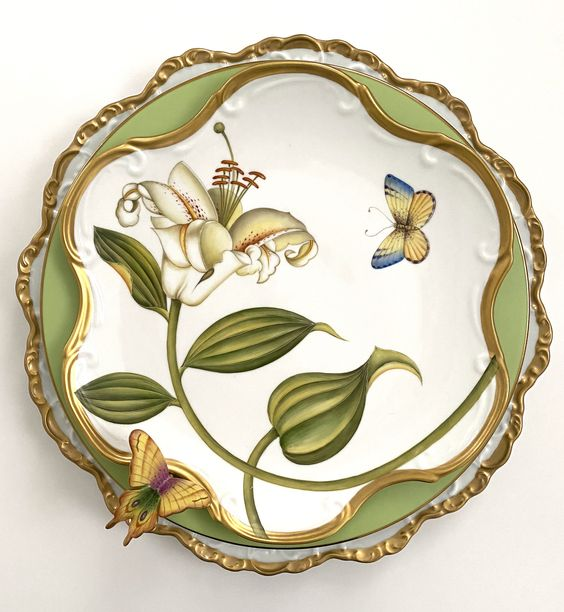

Prima trezire la 4.30. Asta nu e o oră de trezit. Închid ochii, îmi pun perna pe cap să nu mai aud nici sforăiturile, nici pe Spiky care greblează printre lenjerii. Dar nu-mi reușește figura decât pentru încă juma' de oră și trebe să-mi iau tălpășița, cu Spiky la subraț și să ne tirăm la bucătărie. Normal că la ora asta nimeni nu e trezit în casă. Decât eu și Spiky care începe să aibă veleități și de cocoș.

\*\*\*

Afară e frig, îmi face bine să mă scuture de adormirea asta care-mi stăruie în carne și să-mi dea un start mișto în zi. Frig și liniște is the new black.

M-a vizitat, la ora asta atât de matinală, ideea lui Sadhguru: noi, ființele umane nu suntem creatori, suntem imitatori. Noi nu am creat și vom crea vreodată ceva ce nu există deja în natură, într-o formă sau alta. Încă nu am rumegat ideea asta și nu știu dacă întră în mine sau o scuip înapoi, cert este că natura asta e absolută. Fascinantă. Nu există cuvinte pentru ea. Cum din nimic să explodeze verde, unde mai ieri era uscat, să fie vibrație de viață, dacă merită cineva descrierea de creatoare, acel cineva e Mama Natură.

Intru în casă un pic zgribulită dar cu sângele în instalație, gata de acțiune pentru o nouă zi. Dau drumul la motoare în bucătărie, să fac tot ce e de făcut înainte să se trezească coana mare. Pe la jumătatea acțiunilor, văd că se aprinde lumina. Las că e numa' bine, până se schimbă ea, ajung și eu cu păpica și zâmbetul în mine.

\*\*\*

Poate că are și mimetismul vreo influență, dar când deschid ușa cu zâmbetul, de după ușă, întâlnesc alt zâmbet. Parcă se luminează camera de bun și de bine și ne ține pe amândouă în căuș fain. E curat, doar deschid să aerisesc, mama e luminoasă, iar eu mai cresc în bucurie. 

\*\*\*

Și astăzi Mr. H pleacă la birou așa că noutatea asta schimbă puțin ordinea timpului meu magic. Nu cu mult, pentru că el pleacă grăbit dar îndeajuns încât să așez o nouă ordine în timpul meu. Mă duc în birou, camera cu cea mai mișto energie din casă, mă așez pe Bătrânu, un fotoliu imens, stil baroc, chilipir luat de pe olx și-mi sorb smoothieul cu ochii pe cer. 

Dacă ești atent la prezentul din viața ta, ești capabil să sesizezi și micile momente care nu pică-n tiparul pe care l-ai croit pentru ele. Și tot dacă ești atent la tine, le poți ajusta pe ele sau te poți ajusta tu la ele, atunci când se întâmplă. Așa, ești o plastilină în continuă modelare în mâinile minții și inimii tale. Dacă însă alegi să ignori micile experiențe sau clipe în care intuiția a strigat scurt că-i dă cu virgulă, ele se adună unele peste altele și când va veni momentul decartării, o să zdruncine și va forța dezlipirea unei bucăți mari din tine dintr-odată. Așa am reușit să percep eu suferința. Ca fiind consecința micro-deciziilor mele când am decis că nu contează, că mi s-a părut, că merge și așa, deși, la un nivel pe care încă nu îl stăpânesc, ȘTIAM că nu.

Omul are o capacitate dar și o dorință imensă de a se minți. Ne place să ne amorțim și adormim demonii pentru că e călduță situația. Pacea asta așa câștigată va lovi mult mai intens când se vor dezlănțui și vor plesni realitatea aia pe care am spoit-o cu floricele. D-aia eu cred că iadul dar și raiul sunt aici, în noi, ni le fabricăm zi de zi.

\*\*\*

Nic nu știu când mi-a trecut timpul (hahaha, și la propriu și la figurat) dar trebe să o aduc pe mama la micul dejun. Azi mi-ar plăcea să fiu doar cu mine, să mă ascult, îmi place cum curg în gândire și cum mi se împletesc ideile, cum am momente de wow mental dar nu am luxul ăsta. Și, pentru că suntem singure, mama se va întinde la povești.

I-am pregătit micul dejun, am surprins-o și cu o cafea și ea m-a surprins înapoi cu "beau cafeluța sus, la mine". Cam așa se întâmplă când pleci cu mintea și decizi că știi tu un viitor ce este posibil, și de cele mai multe ori așa este, să nu se întâmple niciodată. Mama nu a vrut povești în meniul de azi așa că demența asta mă învață și asta: să nu mai fac presupuneri. Să nu mai plasez nicio posibilitate nici măcar peste câteva minute pentru că totul este doar acum. Trăim miliarde și miliarde de acumuri. Punct.

\*\*\*

A sosit ziua în care trebe să tai de pe lista de to do-uri aranjarea pământului de la baza pomișorilor mei fructiferi. E mișto trifoiul, te invită maxim să calci desculță prin el dar este și un mic invadator, s-a întins până-n buza tulpinilor fructiferilor noștri și suge toate substanțele nutritive doar pentru el. Așa că delimitez un cerc în jurul tulpinii, pun carton peste trifoi și apoi acopăr cu mulci din scoarță de copac. În felul ăsta, trifoiul se sufocă iar mulciul ține și umezeala și nu-i nevoie să ud în disperare. Ar fi o singură "problemă": sunt "decât" vreo 26 de pomișori la care trebe să fac șmecheria asta. 

\*\*\*

În timp ce-mi scoteam uneltele și accesoriile de care am nevoie, vecinul meu, bătrânul, mă strigă pe la gard. Prima întrebare: eu țin post? Îi răspund că eu țin numa' post de vreo 3 ani acuș dar că nu am nevoie să-mi aducă nimic. Îmi dau seama că vrea să stea la socializare așa că îl invit la mine în curte. Deși are 80 și ceva de ani, așa de sprintenel s-a pornit spre curtea noastră, că ziceai că-i un copiluț ce merge la Disneyland. Pesemne că stă tare mult singur.

I-am prezentat curtea, din nou, și inginerul agronom din el a recunoscut toți copăcei, caprifoiul de pe gard, bujorii mei iubiți, liliacul, pinul și la fiecare îmi spunea câte ceva interesant. Doamne, sunt o minune oamenii în vârstă! Au atâta bogăție în ei iar noi nu îi mai luăm în seamă, că știm noi mai bine, s-au schimbat vremurile, nu mai e "ca pe vremea lor". Dar ei vin cu o înțelepciune pusă peste niște tehnici vechi care-s faine tocmai pentru că nu sunt alterate de modernism. 

Deși aveam multă treabă în fața mea, mi-a plăcut enorm interacțiunea. Apoi, în drum spre poartă, mi-a spus din nou că el scrie o carte (!), că se trezește pe la 4.30 și scrie în fiecare dimineață și că lui îi place viața. Nu era nicio urmă de regret în vocea lui, doar o sinceritate candidă. Superb! 

Omul este echipat cu bun simț, știa că am treabă așa că îmi tot repeta că nu vrea să mă rețină. Iar la final, mi-a spus că el când muncește la curtea și grădina lui, mintea lui e la curtea și grădina lui. Nu la război, nu la boală, nu la moarte. E acolo unde muncește. Asta a fost diamantul de pe coroană și a fost ideea care mi-a setat tonul întregii munci pe care am făcut-o după.

\*\*\*

4 ore mai târziu și 9 pomișori îngrădiți, am rămas fără mulci. Știam de la început că nu o să-mi ajungă dar prefer să iau mai puțin și apoi să completez. Urca la coana mare să-i iau pulsul, să văd dacă îi e foame și decid să dau o fugă să cumpăr mulci, că ea stă cuminte. Bun, bun, bun!

\*\*\*

Gata, m-am întors cu tot ce-mi trebe și mamei îi e foame.

Hai să mâncăm, că poate ar fi bine să mă alătur și eu prânzului. Și râdem, povestim, îi zic de bătrânel, ea mă întreabă dacă băiatul lui de la Bruxelles se mai întoarce în țară, eu îi răspund șocată, dar cu zâmbetul larg oprit în urechi, că mă bucur că a reținut și totul e azi o poezie. Am chef de pâine cu unt vegetal și dulceață și pentru că mănânc cu poftă, vrea și ea. Râdem amândouă și ne mozolim de dulceața fluidă care ni se scurge printre degete. Me happy, happy!

\*\*\*

Înapoi la munca de jos, cu spiritul sus dar cu energia jos, că a plecat toată se digere ce tocmai am deșertat în stomac. Că nu puteam să mănânc și eu o salată de crudități sau doar fructe. 

Asta e, hai să-i dam înainte. După încă 9 copăcei, m-am prins că nu mai pot. Mă dor toate cele și sunt epuizată. Nu are sens să forțez pentru că știu, istoric, că după aia intru în criza de bilă și zac câteva zile. Mă opresc fix la timp să apuc să fac sucul, să spăl văsăraia strânsă și să-mi fac un duș, pentru că urmează prețioasele table.

\*\*\*

Nu aș juca dacă nu aș vedea bucuria mamei când intru în cameră cu sucul și îi zic "hai". Se luminează toată, redevine o fâșneață în mișcări, nu pot să ignor și să suprim aceste momente doar pentru că nu mai suport eu tablele sau că pierd timp din viața mea.

Viața noastră pe această planetă nu cred că ar fi posibilă fără constructul timp, creat de ființa umană. Mintea noastră nu poate funcționa decât secvențial, în pași. De fapt, timpul este o iluzie dar noi nu suntem echipați încă și nu putem duce această informație. Cred că masterpiece-ul vieții ăsteia este să pricepi că totul se întâmplă DOAR acum dar și să accepți noțiunea de timp. E o spargere de minți ce mi se strecoară acum în gânduri iar tablele nu mă ajută să fac lumină în ideea asta. Dar o simt cum vibrează în mine ca fiind nestemată adevăr. O s-o pritocesc și o să scot din ea ce trebe.

\*\*\*

Cred că am adormit în drum spre pat. Sunt frântă-frântă dar am avut o zi frumoasă, cu recunoștintă, cel puțin, pentru:

1. Întâlnirea dintre două suflete, unul bătrân înțelept și singur, altul tânăr avid de cunoaștere și dispus de socializare!
2. Munca în natură, împământarea asta superbă!
3. Starea asta de atât de bine între mine și mama mea!

Frumosul meu de-o clipă:

[Anna Weatherley Designs](https://ro.pinterest.com/annaweatherleydesigns/)
