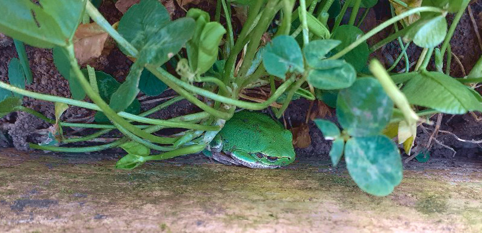

Zici că am câștigat castingul la filmul "Ziua cârtiței", cu Bill Murray, deși nu-mi amintesc să mă fi înscris. Exact ca-n film, prea-dimineața mea de azi este o reeditare a prea-dimineții de ieri. Aceiași protagoniști, Mr. H și Spiky. E drept că am căzut lată devreme aseară dar mie-mi trebe câteva zile bune de somn neîntrerupt ca să recuperez. E crud de devreme!

Picătura care a umplut paharul a fost când coconetul devenit cocoșul de serviciu a scos ea, din dulapul de lenjerii, ce o deranja, mai exact un întreg nivel de lenjerii. Când le-am văzut prăvălite pe jos, parc-am văzut roșu deși era o beznă totală. N-are sens să mă cert cu ea că oricum m-am trezit deja de nervi, așa că doar o ușuiesc încetișor să iasă din cameră, nu o iau în brațe, să simtă că-s supărată pe ea. Ei, aș! A luat-o la fugă și mă aștepta după ușă, să-mi sară la picioare. Ea are chef de joacă, o doare la bască că e 4 jumate dimineața!

\*\*\*

Am deschis timid ușa spre terasă, pentru că am parcă un frig în oase și testez cu vârful nasului temperatura de afară înainte să mă avânt cu tot corpul. E friguț! Hai lasă, nu ieși acum afară, mai târziu sau mâine. Ba bine că nu! Dialogul dintre mine și mine s-a terminat brusc pe terasă, când m-a luat tremuratul instant și mi s-a blocat mintea. Frate, dar e chiar frig! Mi-a plăcut blocajul ăsta așa că mai amân puțin intrarea la căldurică. Corpul începe să se ajusteze la temperatura de afară și tremuratul din toată șira spinării începe să-și piardă din intensitate. Mind over matter. Să nu forțez prea mult corpul care și-așa a trecut prin multe zilele astea, mă strecor înapoi, în intimitatea și căldurica din bucătăria mea frumoasă. M-am trezit, mi-am pus ochii limpezi și mi-e bine.

\*\*\*

Aseară, de obosită ce am fost, am uitat să scot afinele și vișinele de la congelator, am uitat să-mi pun apă în sticla mea de cupru să stea peste noapte liniștită, am uitat să scot la poartă sacul de reciclabile și gunoiul. Așa că, limpezită bine de frigul de afară, îmi dau seama că n-am pe ce să pun mâna să fac ce am de făcut. Am lăsat fructele înghețate bocnă în apă fierbinte și m-am apucat să umplu sacul de reciclabile. Știa ea Spiky de ce mă trezește așa devreme, să am timp să le fac pe toate înainte să se trezească mama.

Termin foarte micul dejun de smoothieuri, fac și ceaiul, apa am băut-o încet și calm, sunt cu toate regulamentar și la timp doar că mama încă doarme. Nu-i bai, îmi trag sufletul. Până m-am învârtit eu, până m-am sucit, s-a aprins lumina la coana mare. Bun, hai să bifez și etajul ca să mă cufund fără nicio grijă în timpul meu magic.

\*\*\*

Mama nu mai e la fel de zâmbitoare ca ieri. Mă prind repede și de ce, când vreau să deschid geamul. Îmi spune că poate e mai cald afară că ea a înghețat azi noapte, că tare frig i-a fost. I-am simțit reproșul din glas dar l-am respins din momentul în care mi-a atins mintea, să nu aibă timp să intre în miezul ei și să mă aricesc. Nu văd de ce i-ar fi frig, îi spun să-și ia halatul pufos și călduros când i se mai face frig și mă duc la baie să fac curat. Aici am din nou răspunsul: a dormit cu geamul întredeschis la baie. Normal că i-a fost frig…

Nu îi zic nimic, fac o glumă cu ea, mai dezgheț atmosfera și plec lăsând-o liniștită.

\*\*\*

Mi-a fost dor de timpul meu magic, așa cum mă obișnuisem cu el. Fără nicio tulburare exterioară, cu Spiky lipită de piciorul meu, azi călătorim prin Franța. 

Visul meu din ultimii ani este să-mi cumpăr un castel în Franța rurală, să-l iau pe Mr. H de o aripă și să ne mutăm acolo. Știu cum să fac rost de bani, am o idee nebunească însă vin din laterale tot felul de gânduri și de piedici. Că, e drept, nu mai întinerim. Că, și asta e drept, departe de țara ta și de limba ta, e greu. Că, aici nu știu ce să zic, nu o să mai ai putere. Eu știu că le pot para pe toate, știu că dacă mă hotărăsc, o să-mi iasă. Însă trebe să mă decid în mine ca să pot da startul acestei nebunii superbe. O să văd.

Până atunci, azi am trăit o zi la un castel de vis, cu oameni de vis, cu grădină, cu pădure, cu capelă proprie, sublim. Atât de mult am fost acolo că am avut un regret aproape fizic când m-am prins că s-a făcut 9…

\*\*\*

Întâi stau cu domnul meu la micul lui dejun apoi o aduc pe mama la micul ei dejun.

Ieri i-am spus mamei că vreau să o iau cu mine la cumpărăturile pentru Paști. Nu s-a opus, ba mai mult a și făcut o listuță cu ce vrea ea. Până aici, minunat. Doar că azi mi-a zis de listuța ei din minut în minut, la micul dejun. A intrat iarăși pe repeat, mintea ei alunecă din nou mereu și mereu în aceași văgăună unde ea a pus doar listuța ei. Nu mai avem alt subiect decât această listă. Degeaba îi arăt eu ce am făcut în curte, degeaba îi povestesc de Maya sau de copila mea, universul ei s-a redus dramatic la o bucată de hârtie cu câteva articole. Of, măi mamă! Poate că-n altă zi m-aș fi enervat la un moment dat însă azi mi-a fost iar drag de ea. Nu e ea vinovată. Nimeni nu e vinovat de nimic. Ăsta e un moment nefericit din traseul nostru împreună dar este trecător. Așa că mi-am pus și eu placa "Da? Bine că ai făcut-o!" pe repeat și asta e.

\*\*\*

Mi-am făcut salata de crudități și stau afară, pe scară, în soare și ronțăi. Ca să fie tacâmul complet, m-am și descălțat și stau cu picioarele afundate în trifoiul ăsta verde smarald. Mi-aleargă clorofila prin sânge de la spanacul din salată dar mă și mângâie pe piele. Fac schimb de energie cu mama pământ și las să mi se scurgă prin tălpi toată oboseala în același timp în care trag prin tălpi energie vibrantă și stare de bine din pântecul pământului. Mulțam Doamne, pentru acest moment de plin!

\*\*\*

Gata, sunt varianta feminină a lui Popeye Marinarul. Mi-am propus să termin de încercuit restul de pomișori și să curăț trifoiul și de la mure, caprifoi, clematite și yucca. Crește ăsta mic ca nebunul dar sugrumă așa că trebe să-l înfrânez cumva. 

Am terminat destul de repede restul de copăcei și m-am apucat de curățat de trifoiul de pe lângă gard și trotuar. Am găsit o întreagă planetă la scară redusă! Păienjeni de tot felul, mai mici sau mai mari, skinny sau grăsuni, colorați sau negri. Gândaci mici și mari, negri sau cu nuanțe superbe de verde în degrade, rădașcă, limacși, râme, furnici. Dar cel mai mult mi-a plăcut de micuțul Lem Lem, cum l-am numit eu pe broscuțul peste care am dat. Stătea cumincior, între soclul gardului de beton și pământul de sub trifoi și când l-am văzut, m-am speriat că l-am rănit. L-am atins încetișor și am văzut că-și mișcă lăbuțele. Era întreg, bine mersi, mă privea pitulat acolo dar nu îndrăznea să se miște. 

\*\*\*

Cufundată cu totul în fascinanta natură, nici nu știu când s-a făcut aproape de prânz. Trebe să mă opresc din grădinărit și să trec la bucătăreală. Am cumpărat niște pleurotus și vreau să le fac la cuptor înăbușite cu usturoi. Mai fierb și-o mămăligă și am făcut prânzul și azi, printre picături. 

De la efortul cumulat în ultimele zile, a început să-mi dea târcoale prietena mea, durerea de cap. Cât timp am stat în bucătărie, am simțit-o la propriu cum se accentuează. Tare aș vrea să mă lase să termin ce am început însă ea nu mă întreabă dac-o vreau. Termin bucătăreala, le dau să mănânce la amândoi, pe rând și ies afară, la aer și la soare. Poate pleacă durerea singură.

\*\*\*

Un strop mai înfrânată, reiau treaba de unde am lăsat-o. Ca să fie tabloul complet, spiritele trifoiului ucis cu mașina de tuns iarba s-au întors sub formă de clisă întinsă prin câmp, la uscat, iar putoarea mă bântuie. Nici nu-mi ieșise de tot din nări, că azi mi s-a dus până-n plămâni. Doamne, da' tare rău mai pute! Și Doamne, dă tu zile cu mult soare să se usuce naibii odată clisa asta că epilez nazal și vecinii, nu doar pe noi! La orice adiere mai vârtoasă de vânt, stihiile mi se strecurau în nări de mi se făcea pielea de găină la propriu. Din păcate, m-au împresurat tot timpul cât am terminat de jumulit trifoi, de spălat trotuare și terasă, de strâns și pus toate la locul lor. 

\*\*\*

Azi nu am cum să strecor în programul meu tablele. Nu am timp fizic. Trebe să fug la o tură de cumpărături la Lidl și deja e 17 și ceva. O anunț pe mama, care mă înțelege și nu se supără dar nu uită să-mi strecoare clasica ei rugăminte: dacă te duci la magazinul "ăla", îmi iei și mie prăjiturele "alea"? Nu reușește să țină minte că magazinul e Lidl și că prăjiturele sunt foietaje cu nuci pecan. Deși îi plac la nebunie, nu reține și pace.

\*\*\*

Ne aventurăm și plecăm amândoi la Lidl. N-am mai fost cu domnul meu într-un magazin de luni bune. Cu toate că ne grăbim, am o senzație de bine, mă bucur că suntem împreună. O urmăresc pe mama pe cameră, e bine și nici nu concep să nu fie bine până ajungem, noi acasă.

Cât mai spăl vasele, dezinfectez cumpărăturile, pregătesc pentru mâine fructele, strâng și șterg, se face târziu iar mi-e mi se opresc pe rând motoarele. Iar sunt obosită, a fost o zi plină, corpul îmi dă semnale că trebe să dau stingerea ca să mai pună ceva energie în container, altfel mâine o să fie pe butuci. 

\*\*\*

Cu ultimele puteri, îmi articulez recunoștința pentru:

1. Frigul dimineții care pătrunde adânc în carne și în minte și le pune pe făgașul unui nou început de zi!
2. Energia super mișto a pământului!
3. Imensa lume mică de sub tălpile noastre!

Iar clipa mea de frumos este dăruită de Lem Lem:

