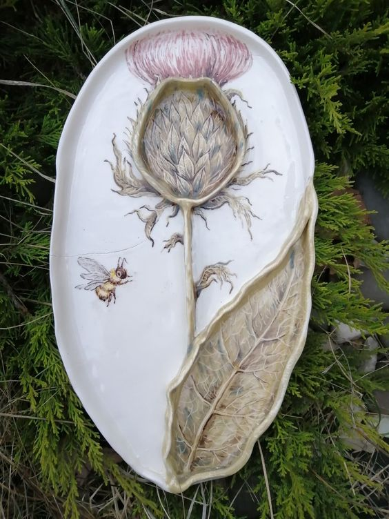

Deși m-a trezit coconetul mic devreme, în această dimineață chiar am avut chef să mă trezesc foarte devreme. Cu toate că iau în detrimentul somnului și odihnei, prefer să am mai mult timp dimineața, singurul meu timp curat și doar al meu. În ultima perioadă, parcă am intrat într-o mașină de spălat că nu mai pricep când e dimineață și când s-a făcut de table. 

Savurez timpul ăsta aproape fizic, îl înghit pic cu pic, cu mare grijă, să văd pe ce-l aloc și să mă bucur de fiecare clipă cât mai mult. Dacă n-aș fi puțin tristă că e așa, aș putea să mă felicit pentru trăirea prezentului la maxim. Însă știu că am ajuns să-l prețuiesc atât de mult și să-l ocup atât de intens pentru că mi-este resursă rară. Ca de altfel, la toată lumea, numai că nu toți resimt asta. Cea mai importantă resursă, în această viață pe pământ, este iluzia-timp. Și cu toate astea, nu-i dăm creditul pe care-l merită.

\*\*\*

În prea-dimineața asta, mi-am scos doar vârful de nas pe terasă și-a mirosit el o răcorică care nu mi-a fost pe plac. Spiky s-a dus, are scuza că ea e îmblănită, mie (încă) nu mi-au crescut pene pe spate, deși am momente în care am aripi. E frig bine, nu mersi, zic pas de data asta.

Pornesc gazul să pun de ceai și-mi dau seama cât de familiare și aproape automate mi-au devenit gesturile de dimineața. Cu toate astea, mi s-a părut interesant că sunetul gazului a fost un sunet reconfortant pentru mine. Eu fug de rutină dar trebe să recunosc că e plăcut și îți dă un sentiment, fals de altfel, de siguranță să te instalezi în ea. Dar cred că mai depinde și de rutină.

Am făcut și smoothieurile, miroase bestial în bucătărie de la cafea, afară e încă întuneric dar începe să se ridice perdeaua neagră pe la orizont, e liniște și eu sunt în viață. Și toți ai mei dragi la fel.

În mod ciudat, îmi place maxim mirosul de cafea, o asociez mental cu socializarea, cu oameni mișto cu care-ți place să stai la o vorbă, dar nu mi-a plăcut gustul niciodată. O beau pentru că am tensiunea foarte mică și pentru că, testat de nenumărate ori, îmi oprește în fașă durerea de cap. Nu mereu dar de obicei. Tot zic că o să caut alternative, am auzit diverse dar nu m-am învrednicit să citesc și să aprofundez. Iar acum, am și o scuză bună, nu mai am timp și pentru asta.

\*\*\*

E o vorbă care mi se pare tare sugestivă și pentru Spiky dar și pentru mine: poți să scoți o fată de la țară dar nu poți să scoți "țara" din fată. 

Pentru că a crescut pe coclauri, singură, tomberoneza noastră nu are stare chiar dacă acum și-a tras și stăpâni și casă. Îi place să plece zilnic, probabil pe unde o fi copilărit și-mi dă ceva emoții. În dimineața asta parcă s-a evaporat dar nici prin cap nu-mi trece să îmi ocup din timpul meu magic cu îngrijorări la adresa pufoșeniei.

La fel ca și ea, eu am copilărit la țară, unde munceam cot la cot cu măița mea, sau cel puțin așa mă lăsa ea să cred. Acum știu că "muncitul" ăsta avea dublu rol: mă avea sub observație cât ea muncea și mă învăța munca din grădină, mai în joacă așa. Sunt sigură că nu s-a gândit nicio clipă că voi munci propria mea grădină cândva iar asta îmi va turna sclipici în vene. Îmi place la nebunie să stau cu mâinile în pământ și asta se regăsește în manichiura mea. N-aș face însă schimb cu nimeni, pentru nimic.

\*\*\* 

Lumina de la mama m-a oprit din filozofie și parcă m-a și înfiorat puțin. Pentru că sunt o tipă vizuală, prea-dimineața sau timpul meu până mă duc la mama, timpul meu doar al meu, îl văd ca pe o urcare pe munte. Vârful muntelui e timpul alocat mamei și curățeniei din camera ei și apoi urmează restul zilei care este coborâșul de pe partea cealaltă. Mi se pare că timpul efectiv se prăvălește cu viteza înspăimântătoare după aia. Cu o marjă de maxim o oră cât mai am după ce ies din camera ei dimineața. Sunt flămândă după timp pentru mine, cu mine.

\*\*\*

Mulțumesc Universului pentru încă o dimineață bună și blândă cu mama, curat așa și așa dar nu contează, au fost dăți groaznice care m-au pregătit pentru ce e mai rău așa că orice vine sub acest rău, e mai ușor de dus. Oricum voi face curățenie ca la carte mâine așa că nu aloc mult timp acum.

Mama are o grijă în dimineața asta: când fac eu cumpărăturile ca să își facă sarmalele pentru Paște? Mă bucur că vrea să-și facă mâncare, că are un scop, eu sper să-și și amintească cum se fac sarmalele și o liniștesc spunându-i că azi fac cumpărăturile finale. Îmi dă minunata ei listă, pe care mi-o arată de fiecare dată când intru la ea. 

\*\*\*

Cobor, grăbită, să mă bucur de timpul ăsta mic pe care îl mai am până la mic dejunuri. Spiky e străjer la ușa bucătăriei, o bag înăuntru și o duc rapid la spălat de lăbuțe că-mi lasă numai noroi pe unde trece. Clar a fost la wc că a scârmat pământul și i-a rămas între pernuțe. E un copiluț tare docil Spikylina, deși nu-i place, nu ripostează tare mult și mă lasă să o curăț. Poate s-a prins și ea că mai bine o spăl eu decât linge ea atâta pământ.

\*\*\*

Gata, acum pot să mă relaxez. Să visez un strop la călătorii. Să-mi bucur ochii de lucruri frumoase. Să ascult chestii mișto. M-am relaxat atât de mult că mi se închid ochii, dar nu-mi dau voie la nicio picoteală. Nu am timp de dat pe asta. Mi se pare tare că încep să pricep, înăuntru, că timpul este moneda cu care plătesc. 

A trebuit să calc prin foc ca să pornească focul în sus și să-mi ardă părțile din mine care nu mă mai alcătuiesc pe mine, pentru binele meu. Nu m-am vindecat încă, sunt în proces, dar am scăpat de niște hălci mari de mine nefolositoare. Și cu ușurică m-am făcut!

\*\*\*

A coborât domnul meu pentru micul lui dejun, mă bucur să-l văd, apuc câteva vorbe cu el că nu-i o persoană matinală și urmează micul dejun al mamei.

Mă întreabă, din nou, când mă duc la cumpărături, uită că mi-a dat deja lista și vrea să mi-o dea din nou, dar pentru că evenimentul gătitului de sarmale pentru mintea ei e o bornă de care-și aduce aminte și pare că-i face bucurie, șterg orice altceva din cale și îi răspund calm. 

\*\*\*

Gata, fug la cumpărături dar îl rog pe domnul meu să fie străjer la cafea.

Pentru că memoria mamei se mufează în general la viața ei cu mulți ani în urmă, încă crede că are tensiunea mică și vrea cafea. Sau e o scuză, habar n-am. Cert este că în ultimii doi ani a avut tensiune oscilantă, destul de des mare iar riscul unui accident vascular e prezent mai tot timpul. Că ea nu reține asta sau nu vrea să rețină, e treaba ei dar eu vreau să fiu atentă pentru că știu ce înseamnă să rămână o legumă. Am văzut asta și greul nu e pe "legumă", ci pe familie. Cam cum e acum doar că mult mai rău.

O nebunie la hypermarket. La raionul de carne, a fost oribil pentru mine. O îmbulzeală pe plasele vidate cu animale omorâte de mi s-a ridicat părul de mine.

Când s-a așezat amnezia pe mintea noastră atât de mult și când am decis noi că specia umană are drept de viață asupra altor specii?! Sau și mai mult, când am uitat să descifrăm sensurile adânci ale Bibliei și luăm ad litteram ce scrie acolo și sacrificăm pui de alte specii?! Dar ferească să se atingă cineva de puii noștri. E o abrutizare colectivă. Nu e de judecat, fiecare va ajunge, sau nu, să vadă ce e de văzut când își va deschide inima și spăla ochii. Știu că, la mine, nu a mers niciodată nimic forțat. Dacă nu e decis în mine, mai devreme sau mai târziu, mă duc tot pe calea veche, pe care o știu eu. Așa e și la ceilalți probabil. Dar știu că la mine, când am fost deschisă să aud cu adevărat informațiile, nu a mai intrat picătură de ceva animal în mine. Habar n-aveam, și cred că așa e și la ceilalți, câtă cruzime presupune industria cărnii sau a lactatelor. Deși abundă internetul de ele, nefiind interesată, nu căutam. De aceea, eu plantez sămânța la oamenii din jurul meu. Pentru că știu, de la mine, că e un proces lung care începe cu primul pas, gândul , urmat îndeaproape de întrebare.

\*\*\*

Mă întorc sleită de energie. 

Oamenii, mai ales cei care nu-s prea prezenți în viața lor, tind să fie sugative de energie la un mod pe care nici nu-l conștientizează.

Am văzut, într-o reprezentare splendidă, cum frumusețea stă în ochii privitorului dar pornește de la chipul celui care este privit. Am văzut adolescente faine dar cu un sictir fals pus pe față și încremenit acolo. Joacă jocul intangibilelor. Been there, done that. Aș vrea să le iau deoparte și să le zic încețișor, să picur cuvintele în mintea lor lent, să intre ușor, să nu le zgârie tinerețea și încrederea în sine atât de fragilă, că frumusețea se trăiește cu bucurie plină. 

Am văzut un om de la pază, cocoșat și strâmb la corp dar cu un zâmbet care-i depășea cu mult limitele ființei. L-am urmărit cu privirea cât m-am așezat să-mi trag sufletul greu de la densitatea trăirilor de la carne, și mi-a ostoit el tumultul trist din mine. Eu știu acum că nu există oameni urâți. Știu că există oameni traumatizati, că toți suntem atinși în aripi, în diverse zone și cu diferite intensități. Știu că toți suntem aici să jucăm niște roluri, uitate sau nu, asumate sau nu. 

Dar încep să fiu fascinată de puterea impresionantă pe care o au lucrurile "simple": respirația, zâmbetul, pauza, clipa. Cum să împrăștii eu la toți oamenii ăștia care se ceartă pe plasele cu jumătăți de miel, toate astea? N-am cum. Vorba profei de curs, nu poți și nici nu trebe să fii salvatorul cuiva. Decât dacă-ți cere. Eu însă povestesc, în pătrățica mea, despre ele, că poate cândva, undeva, la cineva, informația se rostogolește printr-o crăpătură și ajunge la miezul ființei, acolo unde e doar adevăr, și începe să crească.

\*\*\*

Azi trebe neapărat să mut răsadurile în recipiente mai mari, că au crescut prea mult. Cât de firăvioare sunt totuși. E primul an al meu de experiență cu răsaduri și, din peste 50 de semințe puse, doar 35 au și reușit până acum. Trebe să fiu tare delicată cu mutarea lor pentru că mi se pare că o respirație mai adâncă de-a mea, le dărâmă. În toată mișcarea asta de balerină, mi s-a aprins un beculeț: oare cei care produc la scală industrială răsaduri, tot așa de în vârful degetelor merg? Clar că nu! Și apoi, este testul invingătorului, supraviețuiește cel care are ce-i trebe să facă față lumii în care vine. Fix ca la noi, oamenii.

\*\*\*

Mă duc să o aduc pe mama la prânz. 

A fost cuminte în ceea ce privește cafeaua însă tot a coborât cât am fost eu plecată. Mr. H a verificat ce caută în bucătărie dar pesemne că a ajuns câteva secunde mai târziu, secunde în care mama, cu dexteritatea unor ani în spate, a ascuns în bluza de trening punga cu singurul foietaj rămas. La întrebarea domnului meu, dacă vrea ceva anume, a răspuns evaziv că are ea niște sticksuri pe acolo, pe undeva pe care le caută și a tăiat-o la etaj. Când am revenit, am văzut că a dispărut foietajul și m-a întristat profund minciuna ei. Pentru că o face conștient. Și mi se pare al naibii de nenecesară. Orice mi-a cerut, i-am dat. Moderat, ca să nu-i fac rău nici ei, nici mie. Dar ea nu poate să vadă astea, pentru ea nu există decât ea și așa a fost cea mai mare parte a vieții ei. Știu asta, nu mai pot și nici nu e treaba mea să o schimb dar de ce trebe să facă atâtea artificii și să arunce minciuni aiurea? Mi-a picat tare greu pe suflet asta dar am încercat să nu arăt nimic.

Cu strâmbături, de zici că o duc la surghiun, a zis că coboară. Am plecat înaintea ei, că mie mi se citește pe față trăirea din interior.

Îi încălzesc mâncare, o mănâncă pe toată și, cât spălam vasele și eram cu spatele, a înșfăcat o banană și a ascuns-o repede în bluză. E incredibilă!! Nu mai judec, atât poate. O să îi organizez un bol cu fructe la ea în cameră, să le aibă mereu la îndemână și să nu mai fie tentată să palmeze mereu. Doar de fructe.

\*\*\*

Ies în curte. Pentru că au fost ploi, nu am reușit să-mi curăț curtea de flori de buruieni așa că, deși sunt în noroi juma' de cizme, mă apuc de pigulit. Simt nevoia să descarc starea asta pe care mi-a imprimat-o mama în cealalată mamă, mama pământ. Să mi se scurgă prin degete energia asta stagnantă și densă și să urce înapoi energie verde, vie. Îmi curăț de buruieni bujoreii mei iubiți, vorbesc cu ei și schimbul ăsta fain de energie se petrece subtil, fără să fac eforturi și fără să fiu încrâncenată. Am lepădat acolo toate mizeriile care mi-au trecut prin gând și suflet și mi-am pus suflu nou și bun, să mă ajute să joc tablele dintr-o poziție neutră, nu de judecată.

\*\*\*

Doar un duș rapid și mi s-a gătat și ziua asta. Pentru că vin tablele și tot restul de după. 

Mulțam naturii pentru reîncărcarea mișto, am putut să susțin 2 ore de joc calmă, să fac glume și să nu suflu o vorbă despre minciuni sau micile palmări pe care le face. Deși aș fi vrut să înțeleagă că la mine poate avea orice își dorește, când își dorește, dacă îi face bine, realizez că nu mai pot șterge anii în care ea și-a format obiceiul ăsta. Cum zice chiar ea, când e bine: nu mai înveți un cal bătrân să meargă în buiestru.

\*\*\*

O zi cu de toate, cu analize pe toate fronturile, cu multă înțelegere și cu recunoștintă pentru:

1. Univers și pentru mine că mi-am creat așa o atmosferă faină în căsuța noastră!
2. Lumea asta amestecată, plină de farmec și de conștientizări pentru mine, la fiecare pas!
3. Iubirea lui Spiky, care-mi încălzește inima rănită de plecarea Mayei!

Iar clipa care mi-a adus frumosul în suflet:

