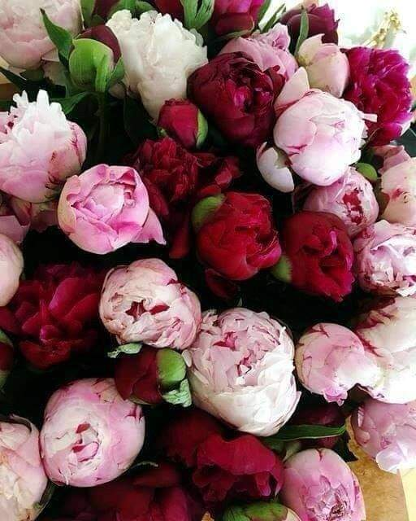

+++
date = 2022-04-21
title = "Ziua 100"
description = "Mie nu mi-a plăcut să învăț, la școală. Am urât școala din toți rărunchii mei. Dar pentru că eram avidă să fiu și eu văzută, să primesc apreciere, am fost premiantă mereu. Mai târziu, în liceu, sila asta s-a înfrățit cu frica. Deja aveam o 'reputație' de apărat, era în joc viitorul meu, eu voiam să plec de acolo, iar facultatea mi s-a părut o idee bună. Toată perioada aferentă învățării a fost însă traumatizantă pentru mine. În afară de profa de mate, care m-a învățat cum să gândesc și mi-a pus structură în minte, restul era toceală și risipă de timp și viață. Acum, învăț și absorb tot ce prind, sunt ca un burete. Am devenit autodidactă și-mi place să înțeleg, măcar câte puțin, din toate. Prietena mea îmi zice că-s enciclopedie, dar eu știu că doar vreau să cunosc și sunt atentă."
authors = ["Biannca Locatelli"]
[taxonomies]
tags = []
[extra]
math = false
diagram = false
image = "images/ziua-98-final-1.jpg"
+++
---

După o trezire în hopuri, a urmat și o dimineață pe măsură. Parcă pe țeava de energie, din loc în loc, sunt niște blocaje și vine în valuri. Nu am acum timp să desfac blocajele alea pentru că e deja târzior pentru mine. Și nici Spiky nu mai are răbdare.

Coborâm la rutina mea de toate diminețile și parcă începe să curgă și sângele în instalație și energia pe țeavă. Hai că m-am adunat din mers! Bun, că mișcările în reluare nu mă înaintau prea mult.

Văd pe cameră că mama s-a trezit dar nu se dă jos din pat. Dă drumul la TV și stă așa, pe întuneric. Ok, e și asta o variantă de trezire. Sper să-i fie și mintea pe-aproape.

Pas la terasă și azi, nu sunt pregătită pentru frigul ăsta, nu știu dacă e adevărul corpului meu, care-mi spune că e deja trudit și nu-i mai trebe și frig sau e mintea mea care a decis ea tranșant că nu e de ieșit.

***

Am avut vise urâte. Cât trebăluiesc, mintea mea caută să vadă dacă poate stoarce vreun adevăr din ele. Cel puțin ultimul, m-a pus pe gânduri.

Eram într-o zonă cu ape și voiam să ajung pe un dâmbușor format din pietre unde era o broască deosebită. Drumul până la dâmbușor era plin de șerpi morți, mai mari sau mai mici, era o atmosferă gri. Ajunsă unde voiam să ajung, am alunecat și am căzut în apa murdară și neagră, din care m-a salvat domnul meu. În realitate, niciunul din noi nu știe să înoate. M-a lovit adevărul ce poate își croiește drum spre mine: la nivel subconștient, eu mă bazez pe domnul meu. Nu la modul evident, că aduce bani în casă și eu nu, ci la un mod mai adânc. Adică fix acolo unde eu credeam că nu. Interesant a fost că, pe parcursul visului, nu am avut niciun strop frică. Doar îmi repugna atmosfera și mediul. Realizările astea, la prima oră, m-au pus pe gânduri.

***

Cu ele atârnânde-n mine, am ajuns la mama, la care mă izbește o dimineață rea. Aerisesc, curăț, spăl, toate tăcută că nici mama nu e prea gureșă. Am bifat mecanic și mi-am luat tălpășița rapid, din lașitate. În dimineața asta parcă nu mai e loc în cârca mea și de starea ei. Parcă aș vrea să mă fac că nu o văd.

***

Timpul meu magic nu e chiar așa de magic, s-a lipit ca scama atmosfera de la mama pe sufletul meu. Asta e, e o dimineață chefless, am și d-astea, trebe să le accept. Îmi propun doar să mai ascult o înregistrare și apoi să mă pornesc în zi.

Mie nu mi-a plăcut să învăț, la școală. Am urât școala din toți rărunchii mei. Dar pentru că eram avidă să fiu și eu văzută, să primesc apreciere, am fost premiantă mereu. Mai târziu, în liceu, sila asta s-a înfrățit cu frica. Deja aveam o "reputație" de apărat, era în joc viitorul meu, eu voiam să plec de acolo iar facultatea mi s-a părut o idee bună. Toată perioada aferentă învățării a fost însă traumatizantă pentru mine. În afară de profa de mate, care m-a învățat cum să gândesc și mi-a pus structură în minte, restul era toceală și risipă de timp și viață.

Acum, învăț și absorb tot ce prind, sunt ca un burete. Am devenit autodidactă și-mi place să înțeleg, măcar câte puțin, din toate. Prietena mea îmi zice că-s enciclopedie dar eu știu că doar vreau să cunosc și sunt atentă. În ultimii ani, m-am prins că ne-am autolimitat cunoașterea pentru că nu știm să punem întrebările care se cer a fi puse. Cunoașterea noastră cu adevărat este limitată doar de întrebări. Pentru că, de cele mai multe ori, ne oprim în pojghița lui de ce așa?, nu învârtim să vedem și altfel, nu punem întrebări decât dintr-un singur punct din care privim. Așa că acum revizitez, conștientă, cam tot ce am înmagazinat eu în baza mea de date și adaug noi valențe. E fascinant câte poți să faci când îți folosești mintea, nu o lași pe ea să te folosească. Efectiv o pui la treabă, că d-aia o ai.

***

Primul mic dejun în doi, protagoniști eu și Mr. H. S-a trezit cu fața la soare, e bine dispus și are chef și de vorbă iar eu aleg în fiecare zi să fiu interesată de experiența de viață a omului drag inimii mele.

Al doilea mic dejun, protagoniști tot eu dar cu mama, e antitetic cu primul. Bine că merge radioul că ea ar mânca dar n-ar mânca, ar ieși p-afară dar n-ar ieși, e într-o dilemă continuă. Hotărâm până la urmă ce să mănânce, îi pregătesc și discutăm pe marginea subiectului Sarmale. Știe ea că trebe să facă sarmale dar nu mai știe când. Îi spun că azi e ziua destinată curățeniei și că de mâine ne apucăm de gătit. Cu aceeași figură impasibilă, pleacă aproape încă mestecând la ea sus, lăsându-mă pe mine înfășurată în starea asta aiurea pe care o împrăștie, fără să vrea. Mă scutur, aduc înapoi starea pe care am avut-o cu domnul meu și îmi fac planul pentru treaba pe ziua de azi.

***

Mie-mi place să fac curat, e o satisfacție cu care am rămas de mică. Copila mea îmi zicea că am o baghetă magică când m-apuc de treabă, cu care trec peste dezastru și este lună.

Ce bine mi-ar prinde una acum! Că am o grămadă de geamuri, de scuturat, schimbat lenjerii, frecat, spălat, aranjat și tot tacâmul. Bine că îmi mai pun căști și mai ascult diverse ca să mă și îmbogățesc de perspective cât sărăcesc în mizerie.

3 ore mai târziu doar etajul e gata. Fac pauză pentru că trebe să pun prânzul pe masă, coanei mari îi e foame. Profit de ocazie să-i spun că nu jucăm table azi, că trebe să termin tot ce mi-am propus.

Alte 3 ore și am terminat și la parter. Doamne, au eu o casă mare sau nu mai am viteza și puterea de anul trecut? Cred că a doua e validă.

***

Domnul meu a încercat să mă ajute cu aspiratul la parter dar a trebuit să aibă o conversație cu cineva și s-a oprit. În schimb, mintea mea a pornit. Am observat, în timp, și la mine și la cei din jur, că am tendința să prioritizez timp pentru cei din afara familiei mele, în deficitul acestora. Nu vreau să etichetez dacă e greșit sau nu, pentru că nu există greșit sau nu. În oricare parte a situației m-aș plasa, văd că răspunsurile sunt corecte. Știu doar, acum mai mult ca niciodată, că cele mai frumoase cadouri pe care le poți face cuiva sunt timpul și atenția. Cu astea, nu dai greș niciodată.

***

Deși m-am înscris și aveam bilet, am uitat cu desăvârșire că azi la Arenele romane vine Sadhguru. Abia târziu, după ce am terminat treaba, am văzut o postare pe facebook care mi-a oprit respirația pentru o clipă. Era azi! La un nivel primar, m-a lovit regretul. Nu că nu l-am văzut pe Sadhguru, care și el e până la urmă un om ca și mine, doar cu ferestre mult mai largi către potențial. Am regretat că nu am făcut parte din energia momentului și locului. Chiar dacă l-am urmărit live, mic, în mine, nu m-a părăsit acest regret.

Mă bucură imens că există oameni ca el. Și dacă ar fi să dau mai departe ceva din ce a spus el ar fi să nu uităm că avem o voce. Și vocea asta trebe folosită nu când ești inconjurat de oameni care au aceeași credință ca și tine ci, din contră, când ești singur și întâlnești oameni care nu văd ce vezi tu. Atunci să ai voce. Și să faci o diferență.

Am fost șocată să aud statisticile sumbre care pândesc omenirea dacă nu facem ceva. Iar primul lucru pe care putem să-l facem, și nu costă nimic, este să nu ne desconsiderăm puterea. Puterea vocii, a exemplului, a curajului.

***

Am avut o zi de contribuție pentru viața mea. Chiar dacă nu sesizez eu mereu, fiecare zi îmi contribuie și vreau să fiu atentă și să recunosc asta. Nimic în acest Univers nu e o risipă. Nimic nu se întâmplă doar așa, ca să umple spațiul, ca reclamele într-o pauză publicitară. Că și alea au un sens.

Apropo de asta, mi-aduc aminte, anul trecut, cum un panou publicitar m-a liniștit.

Avusesem o discuție cu domnul meu și plecam la drum, la "țară", să coc saci de vinete și ardei. Nu am plecat bine că am dat peste un biciclist. Nici acum nu știu de unde a apărut, eu de abia plecasem de pe loc și voiam să fac stânga când am auzit ceva în portieră. M-am îngrozit! Domnul de pe bicicletă doar a căzut dar portiera a fost mai dură decât ghidonul și ăsta s-a strâmbat. Nu știu de unde s-a adunat lume, majoritatea bărbați, care urlau la mine că omor omul. Om, care de altfel, nu avea nimic. Am stat cu el să văd că e ok, i-am dat datele mele și când nu mai aveam ce face, am plecat, cu promisiunea că ne auzim și vedem când mă întorc, peste 3 zile. Am plecat de acolo cu pietre atârnând de suflet. Pe drum am plâns, am scurs toată groaza aia acumulată nu de accident în sine, cât de oamenii adunați care urlau. A fost o experiență marcantă dar a fost și prima în care am înțeles că mie viața îmi vorbește prin reclame. Când mi-era sufletul cel mai greu, am văzut pe marginea drumului un panou publicitar pe care scria mare "Eliberează-te de griji!". Era o reclamă la ceai dar doamne, cât de bine mi-a făcut bine acel îndemn! Am putut să arunc pietrele alea de pe spinare și să mă adun și scutur. Câteva zile mai târziu, omul nu a vrut decât o bicicletă, pe care și-a găsit-o singur la un târg second hand. Deși toată lumea mă avertiza că o să înceapă cu pretențiile financiare. Uite că dacă te eliberezi de griji și Universul ți le ia de pe cârcă.

***

Cam ăsta a fost ultimul gând al meu într-o zi în care am fost recunoscătoare pentru:
1. Viața mea cu Mr. H în ea!
2. Puterea fizică să fac tot ce mi-am propus să fac!
3. Setea mea de cunoaștere dublată de atenția pe care o acord fiecărei bucățele de informație!

Am adormit legănată de două stări: una de regret și teamă pentru viitorul ființei umane și a doua de bine și încredere, nu de speranță, că totul va fi bine.

Iar clipa mea de frumos, din nou dăruit de o ființă care știe cât iubesc bujorii:

  

P.S. azi e ziua 100! Motiv de sărbătoare pentru perseverență, pentru scrisul meu zilnic.

 

 

  

    <a href="/blog/ziua-99/">Postarea anterioară</a>
  

  

    <a href="/blog/ziua-101/">Postarea următoare</a>
  

