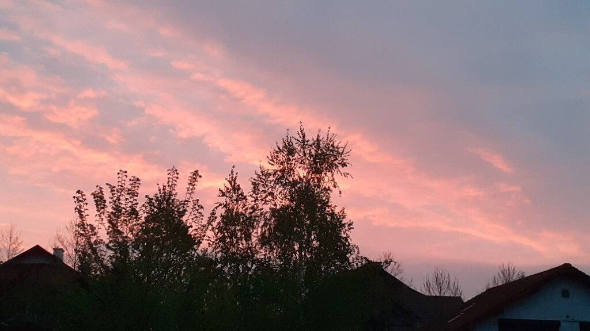
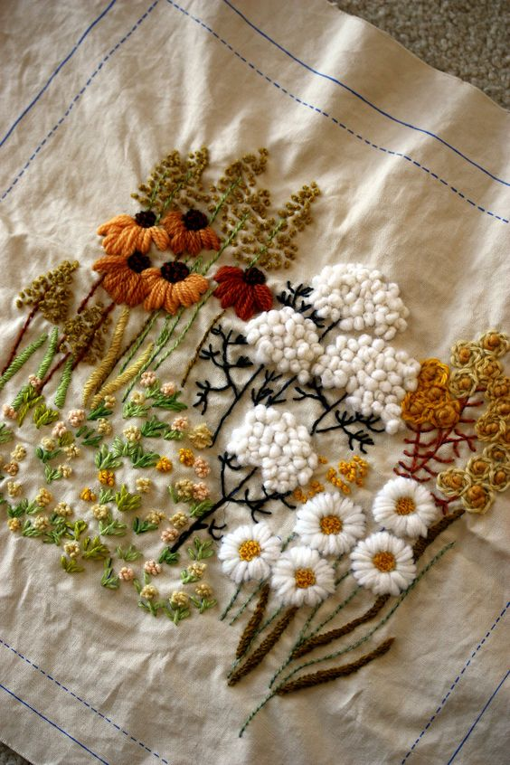

+++
date = 2022-04-22
title = "Ziua 101"
description = "A terminat de împachetat sarmalele și a plecat la ea. Mă bucur, termin eu restul în liniștea mea, pentru că nu-mi plăcea liniștea noastră. Mama are o tristețe aparte, nu i-am mai văzut-o până acum, nici măcar sarmalele nu au reușit să o alunge. Eu nici atât pentru că nu mă lasă să trec de ușa minții ei, nu mă primește sau nu știe să mă primească acolo. Nu zice nimic și nu se angajează în nicio conversație pe care încerc eu, stângace, să o inițiez. Cu subiecte care în trecut o stârneau. Nici măcar amintirile nu le mai aduce la masa discuțiilor. O învălui cu sufletul meu și o țin așa, parcă simt nevoia să o protejez de abisul ăsta al demenței. Azi e o nouă bornă pe care o trecem împreună. Sper doar ca starea să-i fie trecătoare."
authors = ["Biannca Locatelli"]
[taxonomies]
tags = []
[extra]
math = false
diagram = false
image = "images/ziua-101.jpg"
+++
---

Toată noaptea mi-a mocnit durerea de cap înăuntru. Pentru că ieri m-am încăpățânat să ridic patul cu mama în el, m-a durut tare rău și mijlocul și nu-mi venea să mă dau jos din pat peste noapte pentru nimic. Mai că aș fi rugat-o pe Spiky, care făcea excursii ba la etaj, ba la parter, să-mi aducă o pastilă ceva, să pot să adorm și eu că-s obosită. Așa că pe la 5 jumate, aproape că-mi doream să mă dau jos, să scap de toate durerile astea care s-au lipit pe mine ca sugativele.

***

Spiky deja mă așteaptă la parter, e fericită că vin să-i dau drumul la ușa libertății. Încerc să mă bucur și eu că m-am trezit, că doar ce l-am auzit aseară pe Sadhguru că ar fi mișto să începi ziua așa. Alți 250.000-300.000 de oameni nu mai au șansa asta.

Printre dureri, încerc un zâmbet șui. A ieșit de-o juma de zâmbet.

***

S-a trezit și mama, chiar mă întrebam unde intră atâtea ore de somn. Mă duc cu tot ce trebe la ea și o găsesc destul de absentă. Parcă somnul ăsta multe ore îi duce mintea pe meleaguri, departe, la o mare distanță și îi ia mult ăsteia să se întoarcă înapoi, când mama se trezește. Deschid geamul să aerisesc, să iasă și starea asta nevie din cameră, să anim puțin atmosfera și mă întâmpină un răsărit vălurit.

  

Mulțam Univers, că zugrăvești tu cerul așa de fain să nu mai văd alb-negrul sau doar negrul situației. E modul Creației de a-mi reaminti că există culoare dacă ridici capul din micimea situațiilor ce te "lovesc". Că d-aia te lovesc, sunt mesageri să te ajute, să te înalți un strop,  e o buclă bumerang. Ca-n fabula cu calul.

Un om are un cal bătrân de care vrea să scape. Sapă o groapă adâncă și-l aruncă pe cal acolo. Acesta plânge și se tânguie dar nu înduplecă inima omului care aruncă lopată după lopată de pământ peste cal. După un timp, nu se mai aude nicio tânguire iar omul se uită să vadă dacă a săvârșit ce-și propusese. Nu mică i-a fost uimirea să vadă cum calul a folosit fiecare lopată de pământ ca o treaptă, să iasă din groapă. Cam așa-i și la noi. Fiecare "lopată de pământ" care vine, nu vine să ne îngroape ci, dacă ne prindem de tâlcul ei, să ne ajute să ieșim la lumină mai înțelepți.

***

Îi spun că vin pe la 9 să o iau la micul dejun și-mi spune că să stau liniștită, că nu-i așa o mâncăcioasă. Ok. Nicio vorbă despre sarmale, mi-e clar că nu mai știe că azi le facem. Nu-i nimic, îi spun la micul dejun.

***

Aș vrea să mai dorm în timpul meu magic, să mă lase puțin durerile și să mă ocupe o stare de bine. Spiky e p-afară de ceva timp, iar nu e în raza mea vizuală dar m-a învățat să am încredere în ea și în ce trebuie să fie, va fi oricum. Așa că mă așez pe colțar și stau puțin cu ochii închiși.

Nu doar capul mă doare dar am și senzația aia de greață, care-mi cuprinde parcă tot corpul și care se răstoarnă parcă asupra întregului meu prezent. Mi-e silă de tot și de toate. Ok, am luat notă de starea asta și continui să-mi scanez corpul. Mai e doar o jenă mică la mijloc, doar capul doare puternic, în arcada ochiului stâng cu radiere spre miezul capului. Mă afund să simt cu totul această durere. Simt fiecare nerv dureros și-mi zic că vreau să o simt pe toată, să o primesc pe toată, să văd cât de mult poate să doară. Poate. Deși e clar că o durere de cap nu te omoară, când plonjezi în ea să-i simți intensitatea, apăi frate o simți!

***

Nu știu cât am stat așa, în durerea aia adâncă, într-o stare de prezență dureroasă, m-am trezit parcă aruncată brusc din ea de un foșnet. Lângă capul meu, e tableta cu camera de supraveghere, cu sonorul pe tare. Mama se încalță, semn că vrea să coboare. Mă uit la ceas, e 8:30. Giiiz, e prea devreme pentru micul dejun, chiar și pentru ea! Smoothieul ăla e destul de sățios, nu cred că îi e foame.

O aștept în bucătărie și, spre mirarea mea, îmi spune că îi e foame. Îi fierb un crenvurșt, îi dau o felie de cașcaval și după ce ia din fiecare câteva guri, se oprește. Nu mai poate. De fapt, ea coborâse pentru că și-adusese aminte că facem sarmale, nu de foame. Dar până a ajuns jos, a uitat… I-am spus că le facem după 10, să se trezească și domnul meu care e liber azi, și atunci am văzut în ochii ei că d-aia coborâse, am simțit efectiv clickul pe care l-a făcut informația de la mine în mintea ei.

***

După o oră jumate, a apărut și Spiky. E fleașcă și arată ca un șobolănel, cu blana toată lipită de corp, că ea nu e o pisică mare. O bag în casă și începe operațiunea spălat și cade lată de oboseală. A hălăduit zăpăcita, cine știe prin ce coclauri. Acum, că e acasă la ea, în siguranță, adoarme instant. Mi-e dragă tare, cu câtă încredere și-a pus asta mică viața în mâinile mele!

***

Micul dejun cu domnul meu trece prea repede ca să apuc să umplu de bine starea aia de rău, de durere, să o înlocuiesc cumva pentru că mă așteaptă o zi de treabă înainte. De fapt, mai multe zile de treabă.

***

Începem cu sarmalele și cu ciorba ei de perișoare și e o întreagă aventură. Deși convenția a fost că și le face singură, nu mai poate și nu mai știe. La sarmale uita să pună orezul, la perișoare oul care să le închege, doar împachetatul sarmalelor a mers ca uns. Și întrebarea ei obsedantă: dar zeamă de varză ai? Da, mamă, uite-o, e în sticla asta, în fața ta. Două sarmale mai târziu: dar zeamă de varză ai? E clar, azi proclamăm ziua zemei de varză.

***

A terminat de împachetat sarmalele și a plecat la ea. Mă bucur, termin eu restul în liniștea mea pentru că nu-mi plăcea liniștea noastră.

Mama are o tristețe aparte, nu i-am mai văzut-o până acum, nici măcar sarmalele nu au reușit să o alunge. Eu nici atât pentru că nu mă lasă să trec de ușa minții ei, nu mă primește sau nu știe să mă primească acolo. Nu zice nimic și nu se angajează în nicio conversație pe care încerc eu, stângace, să o inițiez. Cu subiecte care în trecut o stârneau. Nici măcar amintirile nu le mai aduce la masa discuțiilor. O învălui cu sufletul meu și o țin așa, parcă simt nevoia să o protejez de abisul ăsta al demenței. Azi e o nouă bornă pe care o trecem împreună. Sper doar ca starea să-i fie trecătoare.

***

Cuprinsă-n gânduri și întrebări fără răspuns deocamdată, am terminat bucătăreala atât vegană cat și non vegană, pentru azi.

Eu nu am afinități aparte cu zilele astea "deosebite", de sărbătoare, dar îmi place să gătesc și să îi adun pe cei dragi lângă o masă. De fapt, corect este că nu mai am afinitate pentru că, în trecut, mă tot chinuiam să cred și să intru în rând cu toată lumea care adula un om răstignit pe un crucifix. Pe lângă că acum înțeleg, și respect profund, că Iisus doar a desfăcut lacătul multor capabilități care zac și în mine, răstignirea asta oribil de privit, pentru răscumpărarea păcatelor noastre, mi se pare acum tribală, greu de priceput, pentru că nu există păcate. Însăși crucea, ca simbol, oferă răspunsul: lemnul orizontal este pus fix la mijlocul celui vertical nu întâmplător ci să simbolizeze egalitatea: între mine și oricare altă ființă umană pe orizontală și între mine și "Dumnezeu" pe verticală. Dar în timp sensul s-a pierdut iar biserica a preluat niște hățuri de control.

***

Am simțit corect că mama nu e deloc nici măcar în apele în care mă obișnuisem să fie. Nu vrea prânz, deși e ciorba ei de perișoare și sarmalele făcute de mâna ei. Nu insist, nu vreau să o tulbur deși recunosc că pe mine mă tulbură starea ei.

***

Așa cum fac în ultima perioadă și dă roade, ies în curte, în verdeață, să-mi absoarbă mama pământ tot ce nu-mi trebe și nu-mi face bine. Mai scot din buruienile din curtea de flori, mai vorbesc cu lalelele mele superbe, cu bujorii care stau să pleznească-n floare și-nghesuie în inima mea un neastâmpăr copilăresc, a surpriză-n așteptare, mai cu vreo buburuză sau vreun bondar. Mă simt ca Gulliver în țara piticilor dar mă fascinează lumea asta mică. Și liberă de gândurile care mie-mi împresoară mintea și se învârt în cerc, over and over. Încerc să cuprind cu înțelegerea ce va fi cu mama iar asta, pe lângă că-mi răpește clipa asta magică cu viața foșnind sub mâinile și picioarele mele, nu face decât să mă adâncească și mai mult într-o stare de părere de rău. Pentru că asta simt acut azi, când o văd atât de aproape și o simt atât de departe.

***

Cearta vecinilor mei m-a adus în prezent atât de brusc că m-am dezechilibrat și fizic. El strigă la ea, ea răspunde mic și umil iar asta îi întărește lui și mai mult poziția de dominare. De câte ori aud certuri, sau plânsete, sau simt vreo tensiune în jur sau în vreun film de-al lui Mr. H, mie mi se strânge stomacul, la propriu. Acolo somatizez eu tensiunile astea. Ei, asta-i bună, am ieșit să mă scutur de una și mă lipesc de alta! Încerc să-mi decuplez auzul de la sunetele care vin din partea vecinilor și să mă adâncesc în munca mea intelectuală de dezburuienit. Și-mi iese și apoi se așterne liniștea și-n partea aia. Dacă n-ar fi fost durerea de mijloc care să mă facă atentă că e cazul să mă opresc, și venirea serii, acolo mă pierdeam, lângă bujorii, anemonele, crinii și lalelele mele.

***

Pentru că nici azi nu am jucat table, mama s-a culcat de pe la 16 și a fost mai tot timpul un on-off. Acum o vedeam pe cameră că doarme, acum era trează. Nu am fizic cum să le împac pe toate și azi mi s-a părut că nici nu prea are chef de table, de mine, de viață.

***

S-a mai dus o zi, trăita mai mult sau mai puțin, și eu sunt recunoscătoare pentru că:
1. M-am trezit!
2. Am găsit-o pe Dolores Cannon, în toată imensitatea asta de informație din lumea asta mare, care-mi mai deschide niște uși în mine și mai face niște clickuri pe ici, pe colea!
3. Am o viață super mișto, cu tot ce e în ea, e o aventură pe cinste!

Clipa mea de frumos s-a plămădit în:

  

 

 

  

    <a href="/blog/ziua-100/">Postarea anterioară</a>
  

  

    <a href="/blog/ziua-102/">Postarea următoare</a>
  

