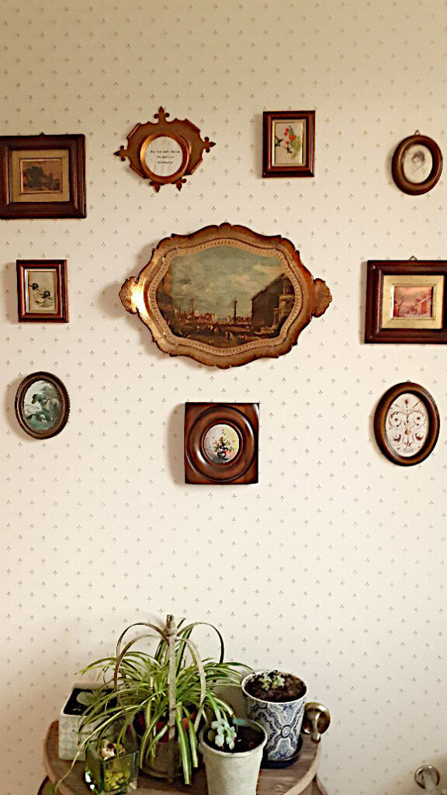
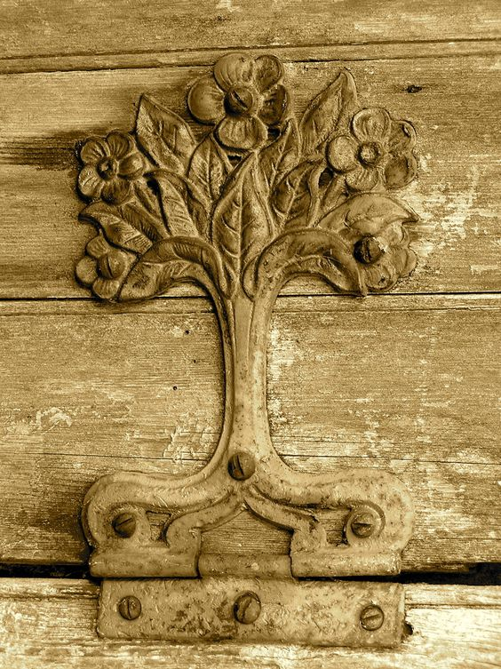

+++
date = 2022-04-30
title = "Ziua 109"
description = "Din nou, azi nu mi-a plăcut de ea și nici nu mi-a făcut plăcere să fiu în preajma ei. A avut scurte momente de căldură umană, în rest e de o placiditate care m-a scos din minți și din confort. Zici că tot extazul în fața vieții a fugit de la ea și s-a adăpostit în mine, pe cât de insensibilă și oarbă e ea, pe atât trag eu cu nesaț din jur frumusețe și o îndes în toate pliurile sufletului, să am de unde scoate când oi da de zile negre. Îmi dau seama că e o inepție să mă supăr pe ea că nu are reacții, dar nici nu pot să rămân impasibilă. Cred că, de fapt, vreau să scutur din ea și de pe ea starea asta mâzgăloasă, să o aduc înapoi pe mama mea care mă suna zilnic să-mi spună bancuri, cred că nici acum, deși trăiesc cu realitatea asta, eu nu accept demența ei. Sau poate mama așa era și la ea acasă, în intimitatea ei și eu nu vedeam decât micile momente de bancuri și le expandam, crezând că așa e viața ei, toată un zâmbet și un râs?"
authors = ["Biannca Locatelli"]
[taxonomies]
tags = []
[extra]
math = false
diagram = false
image = "images/ziua-109.jpg"
+++
---

O noapte intrigantă și ciudată. O mulțime de vise, amestecate, care se succedau rapid, treceam dintr-un vis într-altul într-un ritm ametițor, era ca o derulare în viteză și o concentrare de oameni, trăiri și stări. Spre dimineață, obosită de atâta încărcare, corpul meu a preluat o senzație de greutate, de apăsare și așa m-am și trezit. Parcă nici nu puteam să mă mișc, nu de oboseală, ci părea că-mi atârnă ceva de corp și mă țintuiește locului. Dacă tot n-am putut să mă urnesc la prima cheie, mi-am făcut micul ritual cu mantrele zilnice, am cerut să o am alături pe prietena mea de suflet, claritatea mentală și, dacă mai e loc în cerință, și un strop de răbdare, toleranță, înțelegere. Așa, să fie, că nu știi niciodată.

La o a doua încercare, s-a hotărât și corpul să coopereze, mintea mea deja era jos, făcea treburile. Cred că și Spiky a avut vise d-astea întortocheate că și ea pare la fel de bulversată ca mine. Plecăm totuși amândouă, cătinel, către bucătărie și terasă.

***

Afară-i liniște și recișor un strop, dar asta nu o împiedică pe zgubilitica mică să se prelingă pe lângă casă iar pe mine să mă așez și să trag aer puternic în piept. Acolo parcă mi s-a așezat greutatea aia din somn și vreau să-i fac vânt cu aer proaspăt, să se ducă în eter și să se disipeze. Habar n-am de la ce e și de ce a venit, nu mă deranjează dar nici nu țin neapărat să o car după mine în zi. Câteva respirații conștiente, intense mă ajută să mă echilibrez, să mă adun și să mă scutur de orice gând sau senzație ce nu ar fi la locul ei în acest moment. Sunt eu cu mine și cu respirația mea. Într-un loc în care mă simt în siguranță și cred că astea bifează esențialul necesar. Restul sunt clar bonusuri pentru care sunt, cred că în fiecare zi, recunoscătoare.

***

Cu părere de rău dar cu vânt nou în pupă, intru în casă să pregătesc smoothieurile. Mama încă doarme (!), deja mă pune pe gânduri cât poate să doarmă, dar până termin eu poate se trezește și ea. Pe Sassy o văd că patrulează de colo colo, mă așteaptă cu păpica ei dar până nu se trezește și mama, nu mă duc sus.

Am terminat toată treaba, cu tot cu curățat și mama tot nu s-a trezit. O văd că se întoarce când pe-o parte, când pe alta, o mai aud și pe Sassy cum miorlăie și decid că e cazul să întrerup somnul ăsta care deja mi se pare bolnăvicios.

Pare bine, nu e tocmai zâmbitoare dar nici nu e absentă. Deschid larg geamul și am senzația stranie că mă privește fix. Mă întorc și așa și este. Nu știu de ce dar privirea asta a ei fixă mie îmi dă fiori de gheață pe coloană și pe inimă. Sunt priviri fixe și priviri fixe: unele a curiozitate, altele a intimidare dar asta a mamei este ca și cum cineva din ea, dar nu ea, mă privește. Nu cu curiozitate, nu cu intimidare, ci doar se uită la mine și prin mine. Mă strepezesc în mine și mă reped în baie să strâng ce e de strâns și să plec repede. Brrr, chiar nu mi-a plăcut liniaritatea asta ei de pe față cuplată cu privirea asta fixă și ciudată.

***

Yuck, ce senzație tâmpită a rămas lipită de mine! Vreau să mă scutur de ea și asta repede, până nu începe mintea mea să croșeteze scenarii de filme de groază, că am predilecție în genă pentru așa ceva.

Simt nevoia să fug în direcția opusă iar ceea ce-mi face sufletul să cânte este frumosul.

Iar azi, s-a adunat dragul de el sub forma micii colecții de artă altfel din baia de serviciu. E aproape gata, mai vreau să fac o modificare mică dar încă nu am tot ce-mi trebe așa că, până atunci, mă declar satisfăcută. Totul la mine în casă este work în progress. În linii mari, mi-am știut stilul de decorare de la bun început dar, pe parcurs ce consum design pe pâine, mi se rafinează și stilul și vreau să adaug mici tușe cu mare impact. Pentru noi doi, că eu și domnul meu suntem destinatarii acestui frumos. Pe noi vreau să ne încânte zilnic și să ne aducă fie și un mic zâmbet cât mai des.

  

***

Recunosc că aș fi bibilit la frumos toată ziua numa' să nu fiu nevoită să o aduc pe mama la micul dejun. Nu știu de ce, dar mi-a rămas în energie privirea aia fixă nelalocul ei și parcă nu vreau să o văd din nou. Dar trebe să o aduc la prânz așa că îmi iau inima-n dinți și urc.

E zâmbitoare, e ea, are și n-are chef de mâncare dar coboară. Îi pun pe masă de toate, să-și aleagă ea ce vrea și-mi turuie gurița doar să nu existe niciun moment de liniște ca nu cumva să fugă mama mea și să vină mama mea cu demență. Azi nu sunt pregătită și nici dispusă să duc nicio stare aiurea.

***

Pfiu, am scăpat, pleacă mama și vine domnul meu, cred că niciodată nu i-am fost mai recunoscătoare tacit pentru existența lui în viața mea, ca azi. Ce simt pentru el are o putere extraordinară în fața altor lucruri, că mai întotdeauna astea pălesc. Îmi dau seama că eu, ca fire, fundamental, sunt o ființă veselă, glumeață dar nu știu cum fac de agăț stări aiurea. Bine că, în ultima vreme, am început să mă prind și să mă lepăd destul de repede de ele.

***

Ies din curte, la al nu știu câtelea episod din Dezburuienirea, și mă pierd cu totul în buruieni și prin pământ. Iar sunt fascinată de păienjenei, de gândăcei, azi am văzut unul care m-a dus cu gândul la un domn rasat, cu palton în dungi, sunt așa de faini și de delicați! Multele buburuze peste care am dat azi m-au convins să fac, în viitorul apropiat un "hotel" pentru insecte, tare util în orice grădină bio. Buburuzele sunt mâna naturii care mă ajută să scap de afide, puricii plantelor, care aduc după ei furnicile și strică tot feng shui-ul copăceilor sau florilor. Așa că merită din plin ca roșcovanele astea cu buline negre să fie răsfățate într-un loc cu bunătăți doar pentru ele.

***

După un timp, mi s-a alăturat și domnul meu, care s-a apucat de tuns trifoiul. A crescut ca nebunul de la ploile din ultima vreme și, deși e super fain, nu e sănătos nici pentru el, nici pentru noi că e tărâm de înmulțire pentru țânțari, nici pentru Spiky că la umezeală vin și căpușele. Din păcate, deși nu mai e demult dimineață, nu s-a uscat și a fost o adevărată provocare tunderea lui.

Eu mi-am văzut de buruienile mele, mi-am mai bifat fire noi de anemone, un ranunculus, vreo 2 vârfuri de iriși dar pândesc cu nerăbdare de copil bujorii.

***

Mama doarme, ce altceva să facă și ea. Am fost la ea să o anunț că amânăm prânzul pe mai târziu și am încercat să o scot pe terasă. Doar să stea la aer, să îi arăt floricele mele, să facă un strop de mișcare. Nu vrea, nu are chef, o dor toate cele, începe să scoată din toate buzunarele tot felul de scuze. Ok, ok, plec numa' să nu mai aud mnciunile în care ea crede. Sau nu, dar nu am de unde să știu adevărul.

***

Pregătesc prânzul și Mr. H sugerează să mâncăm pe terasă. La fix, uite așa o scot pe mama la aer. Așez masa festivă, cu față de masă înflorată și veselă și o umplu de bunătăți. Mă duc să o iau pe mama, care-mi taie tot elanul cu ochii dați peste cap, că ei nu îi e foame dar vine așa, să nu mă supăr eu. Mai bine nu! Cu toate că-i explic că un prânz nu e o masă cu forța, coboară totuși.

Nu înțeleg unde naiba i-a fugit toată bucuria de viață! Cum e posibil să nu ai nicio reacție?! Ok, nu vrei să mănânci, dar masa e așa de frumos aranjată, cu de toate, pe terasă miroase demențial a trifoi proaspăt tuns, totul e de un verde crud superb, sunt vrăbiuțe pe gard, adie un vânticel plăcut, nu e nici cald, nici rece și tu nu vezi nimic din toate astea?! Oftează și plimbă cu furculița mâncarea prin farfurie până o opresc eu și îi spun să se ducă sus, că nu are sens să se forțeze. Glonț a plecat!

***

Mai strecor un duș scurt și mă înființez pe scaun, la table.

Din nou, azi nu mi-a plăcut de ea și nici nu mi-a făcut plăcere să fiu în preajma ei. A avut scurte momente de căldură umană, în rest e de o placiditate care m-a scos din minți și din confort. Zici că tot extazul în fața vieții a fugit de la ea și s-a adăpostit în mine, pe cât de insensibilă și oarbă e ea, pe atât trag eu cu nesaț din jur frumusețe și o îndes în toate pliurile sufletului, să am de unde scoate când oi da de zile negre. Îmi dau seama că e o inepție să mă supăr pe ea că nu are reacții dar nici nu pot să rămân impasibilă. Cred că, de fapt, vreau să scutur din ea și de pe ea starea asta mâzgăloasă, să o aduc înapoi pe mama mea care mă suna zilnic să-mi spună bancuri, cred că nici acum, deși trăiesc cu realitatea asta, eu nu accept demența ei. Sau poate mama așa era și la ea acasă, în intimitatea ei și eu nu vedeam decât micile momente de bancuri și le expandam, crezând că așa e viața ei, toată un zâmbet și un râs?

***

Azi n-am avut decât întrebări și niciun răspuns. Dar am strecurat printre întrebări și recunostință pentru:
1. Episoadele antitetice prin care mă poartă viața, unul după altul: acum mă simt greoaie și împietrită, un clipa urmăatoare mă simt vibrantă și plină de viață!
2. Puterea mea de muncă care se vede în rezultate concrete!
3. Oamenii noi, care vin gentili în viața mea, plini de bunătățuri și de surprize și de gând bun pentru sufletul meu!

Premiul clipei de frumos merge la:

  

Old wooden hinge by Alien Banana
