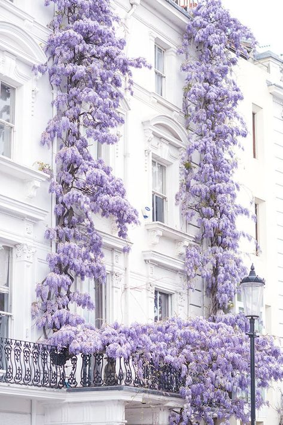

+++
date = 2022-05-03
title = "Ziua 112"
description = "Nu mă privește și nu sunt sigură că m-a auzit, motiv pentru care zic din nou. Un ok plat îmi certifică că a luat la cunoștință. Unde am lăsat iritarea tura trecută, fix de acolo am preluat-o din nou, să o duc mai departe. Împreună cu senzația aia ciudată de ceva dincolo de înțelegerea mea, de ceva dincolo de ce consider eu “normal”, un ceva care mă sperie. Mi le-am agățat pe amândouă ca două toarte de inimă și le car. Știu că la un moment dat o să mă satur de purtat chestii aiurea, dar uite că n-am ajuns încă acolo. Sau azi, m-o fi prins cu pieptul dezgolit și inima deschisă și în loc să ricoșeze, s-au lipit tâmpit."
authors = ["Biannca Locatelli"]
[taxonomies]
tags = []
[extra]
math = false
diagram = false
image = "images/ziua-111-1.jpg"
+++
---

Deși am căzut frântă de oboseală, se pare că pe mine somnul nu mă fură și nu mă duce undeva, departe, atât de departe încât să nu aud lătrăturile disperate ale lupițelor vecinului. Partea cea mai nasoală dintre toate este că geamul de la baia matrimonială dă fix lângă țarcul în care stau ele așa că orice aș face, nu pot să estompez sunetul. Nici măcar perna pe cap nu funcționează iar acum, când sunt singură cu mama, e un lux pe care nu mi-l permit, trebe să aud mișcări nelalocul lor în toi de noapte.

Așa că pe la 2 și ceva noaptea, tăiam frunze la câini. Am strigat la ele, am pus eu în vibrația vocii cea mai mare fermitate, să ajungă până la ele, nimic. La 3 și un pic, cred că au obosit așa că au băgat de-o pauză. De doar 35 de minute după care au reluat recitalul, pe două voci. La 4 și ceva deja nu mă mai deranjau, era un fundal cu care mintea mea se obișnuise deja iar eu oricum nu mai aveam somn.

***

Mă doare fiecare mușchiuleț și fiecare oscior. Orice mișcare mă doare, mi-e corpul muncit de la munca fizică din curte și neodihnit din cauze patrupede. Dar spiritul e sus, în ciuda tuturor. Mișto!

Chiar dacă nu dorm, mă lăfăi sub pilotă, să simt conștient căldurica de acolo, îmi intind corpul ca o felină, absorb senzația asta de moliciune care mă învăluie protector, e o stare faină de pornit în zi. Îmi spun mantrele dimineții și mă pun în palma Creației cu multă bucurie și încredere, că mai mult decât cu o moarte, nu am cu ce să plătesc această viață, iar până se va rupe ața uite că pot să mă bucur de un întins de oase și de o învăluire caldă de pilotă. Life is good!

***

Spiky a dormit liniștită toată noaptea lângă mine, chiar și când m-am agitat eu să le liniștesc pe lupițe, ea nu a catadicsit să deschidă vreun ochi. Toată ziulica a alergat pe afară și e și ea "epulizată", vorba fiică-mii.

La 5 și ceva, coborâm la ritualurile noastre și ea vrea afară chiar înainte să-i dau să pape. Devine pe zi ce trece mai încrezătoare în farmecele ei și știe că dacă insistă, primește. Au și animalele astea niște senzori de puncte slabe ale umanului care le are în grijă și știu al naibii de bine să le folosească.

Suntem pe terasă, cred că încă suntem amândouă, e beznă groasă și coconetul e mai mult neagră așa că se pierde ușor în întuneric. Miroase a crud, a ciuperci de pădure, a pământ reavăn, uguie pe undeva guguștiucii, mierlele sunt în plin tril deja, vrăbiuțele mai mult se aud decât se văd dar au început curățenia zilei la țânțarii gigant, e friguț și e așa de bine. O inimă plină de recunoștință mi se pune-n piept și cu fiecare bătaie nouă, aruncă bucurie în sânge și energie în corp. Yep, life is good!

***

Calmă și senină, îmi îndeplinesc acțiunile dimineții, cu un ochi pe cameră, că ar cam trebui să se trezească și coana mare. Pe Spiky am lăsat-o p-afară, ea știe pe unde cotelește și ce caută și acolo va rămâne până cobor eu de la mama și Sassy.

Am simțit fix dinaintea deschiderii ușii ceva aiurea, habar n-aveam ce dar cred că m-a atins energia care stagna la ele în cameră. Mama e trează dar lipsită de orice reacție, nici un zâmbet, nicio vorbă, parcă e un obiect de mobilă. Deschid geamul rapid, fac conversație ca să umplu liniștea asta tulburătoare și să aduc un pic de viață în cameră. Termin treaba, le dau să pape la amândouă și o anunț pe mama că azi o iau cu mine la Lidl, locul ăla cu "prăjiturelele" ei preferate. Nici da, nici nu. Nici nu mă privește și nu sunt sigură că m-a auzit, motiv pentru care zic din nou. Un ok plat îmi certifică că a luat la cunoștință. Unde am lăsat iritarea tura trecută, fix de acolo am preluat-o din nou, să o duc mai departe. Împreună cu senzația aia ciudată de ceva dincolo de înțelegerea mea, de ceva dincolo de ce consider eu "normal", un ceva care mă sperie. Mi le-am agățat pe amândouă ca două toarte de inimă și le car. Știu că la un moment dat o să mă satur de purtat chestii aiurea dar uite că n-am ajuns încă acolo. Sau azi, m-o fi prins cu pieptul dezgolit și inima deschisă și în loc să ricoșeze, s-au lipit tâmpit.

***

Plec de la ele din cameră fără să înțeleg nimic. Un singur bec mi-a filat aproape constant în creier: trebe să activez un paravan de protecție conștientă care să mă separe de această energie pâcloasă.

***

Am ieșit în curte, buruienile sunt încă ude dar nu-i bai, poate mă spală ele de ce mi s-a inflltrat în suflet. Nu știu de unde am avut puterea de muncă și sporul ăsta, dar, într-o oră, am terminat jumate din ultima bucată pe care o mai am de curățat. Bun, am descărcat undeva nervii ăia și sunt aptă să o aduc la micul dejun.

Pas la micul dejun dar vrea să meargă la Lidl. Parfum! Îi dau cu ce să se îmbrace, în câteva secunde sunt gata și eu și plecăm.

***

Cred că nu o să pot pune vreodată o explicație coerentă lângă consternarea mea: cum a fost posibil ca starea mamei să se deterioreze atât de rapid?! În noiembrie anul trecut fusesem la ea cu copila mea, totul era în limitele normale iar în decembrie totul să se prăbușească.

Mă uit la ea cum abia se mișcă iar ea urca și cobora în noiembrie patru etaje o dată la două zile. S-a topit, atârnă blugii de pe ea dar egoul ei la cote înalte, îmi cere la fiecare 2-3 minute confirmarea că "e o tipă mișto, nu-i așa?". Da, mamă, ești și o să rămâi pentru mine o tipă tare mișto! Cu ochii negri intenși, cu părul un strop ondulat în bucle largi, cu o figură frumoasă, armonioasă și cu un corp demențial.

***

La Lidl, primul raion peste care dai când intri, este cel de panificație. La foietajele ei preferate, vreo 10 bucăți. Îmi cere să i le iau pe toate, lucru pe care nu-l fac și o simt cum se crispează a nervi. Îi explic că noi sâmbătă mergem la ea acasă și n-are sens să stea foietajele și să se usuce, când pot să îi iau altele proaspete când le termină pe astea. S-a relaxat mâna crispată care mă ține de braț, semn că a înțeles.

Intrăm în adâncul magazinului, agață crenvurști de pui, (avem acasă), cașcaval afumat (avem acasă), lapte bătut (și d-ăsta avem) dar i le iau pe toate, să nu simtă lipsuri. Mi-a spus de acasă că vrea deodorant și acetonă, că ce i-am dat eu fie miroase urât, fie nu e bun. Ok, mergem la cosmetice și încearcă toate deodorantele. Niciunul nu miroase frumos. Mai bine ia un roll on, deși are acasă. O las acolo să decidă ce vrea și fug pe palierul următor să îi iau o sticlă de apă cu apă de dimensiuni mici că cea de 1 litru o deranjează. A durat fix câteva secunde, suficiente să pună în coș un deodorant, un roll on, 2 acetone și să-și dea masca jos, că se sufocă. Plus că ea nu găsește prăjiturelele ei preferate, nu ăsta e magazinul de unde i le iau? Că le tot caută și nu dă de ele. I le arăt în coș, sting agitația care o cuprinsese vădit și gata, vrea să plecăm acasă.

***

Mic dejun cu crenvurșt, cașcaval afumat și lapte bătut. Apoi fuga sus, că e tare obosită. Cât am terminat și eu de mâncat, ea deja dormea. Probabil că atâta energie a fost în containerul ei alocat dimineții.

***

În curte, uit de tot și toate, și mă trezesc în mijlocul unui concert de milioane dat de mierle. Cred că suratele lor, vrăbiuțele, au dat sfoară-n țară că la noi în curte sunt țânțari și râme și viermișori și eu știu ce mai scotocesc ele prin pământul proaspăt curățat de buruieni, că sunt vreo șapte mierle în curte. Nu știu dacă o fi și sezon de împerechere, dar știu că m-au uns pe suflet trilurile lor. Cântă absolut superb!

Atât de absorbită am fost de toată acțiunea, că nici nu l-am simțit pe bătrân apropiindu-se de gard și doar m-a speriat scurt strigarea lui. Vrea să ies la poartă dar eu îl invit la noi în curte. Vine, clasic, cu o punguță cu 2 mere și 2 portocale, pe care vreau să o refuz dar îl jignesc. Nu știu cum să-l fac să înțeleagă o dată că poate veni de câte ori vrea la mine cu mâna goală. Nu ajunge informația asta la sufletul lui generos.

Îmi iau o pauză de povești și îl las să turuie despre casa lui, despre oamenii de la el din sat, despre copilăria lui cocoțată prin copaci la cules, despre soția lui pe care a pierdut-o și îi e tare tare dor de ea. Îmi umple ochii dar nu las să vadă lacrimi, să nu alimentez o stare, tristă deja, și mai mult. Îmi umple și inima de duioșie și mi se pare fantastic cum omul ăsta m-a găsit confidenta lui iar mama de abia mai scoate câteva vorbe. O fi vreo balansare pe undeva, prin Univers.

***

Pentru că mă doare spatele, cât am ascultat povești de viață, am stat pe o buturugă, să-mi dau răgaz mijlocului să se mai potolească. N-am văzut că și buturuga, la rândul ei, stă pe un mușuroi. Well, mi s-au urcat și pe păr și m-au pișcat furnicile astea mici și negre de m-au zăpăcit. Singurul mod de a scăpa a fost să mă arunc în duș și să-mi arunc hainele pe geam, afară, să se ducă furnicile unde or vedea cu ochii.

Dacă tot am intrat în casă și e și momentul, îmi încerc norocul cu prânzul. Mama s-a trezit, dar stă în pat, băgată până la jumătatea feței sub pilotă. Nu are chef să mănânce dar coboară totuși. Și mănâncă totuși, chiar bine. Nu cred că o să mă mai prind vreodată care e șpilul cu pofta ei de mâncare și nici nu mai încerc.

În drumul ei spre etaj, se lipește și de o banană și de o pară și pleacă mulțumită. Profit de ocazie și îi spun că zilele astea nu cred că ajung la table, trebe să termin curtea că sunt în întârziere cu plantatul. Nu zice nimic dar știu că a auzit.

***

Mă reîntorc acolo unde-mi place cel mai mult zilele astea iar azi, cu precădere, datorită mierlelor. Doamne, câte feluri de a îndoi sunetul au fetele astea mici! Pentru că două dintre ele s-au așezat în nucul de la poartă și le și văd, am oprit orice mișcare și am căzut în extazul ascultării. Minunat!

Am terminat curtea de flori de curățat de buruiană, am și delimitat zonele astfel ca mâine să pot planta daliile și trandafirașii. Sunt mulțumită de rezultat dar și deșelată de oboseală. Am mai curățat și trifoiul de pe lângă gard sau pomișori din juma de curte mare, unde nu ajunge domnul meu cu mașina, am tuns via și am curățat de uscături zmeura și murele, am măturat puțin și terasa.

În locul tablelor, i-am dus sucul rece și bun și m-am asigurat că-și ia pastilele. Văd cu coada ochiului para exilată într-un colț și o întreb dacă îi place. Un nu vehement m-a scos din starea mea liniștită, câștigată cu atâta trudă afară. Nu, n-are niciun gust! În afară de foietaje, nu cred că există ceva care să-i placă. Iar de mirosuri, nici atât. Totul îi pute, chiar și parfumurile sunt "nașpa".

Nu mă mai încarc și cu astea că nu mai e loc. Nu-mi doresc decât un duș, o Spiky cuminte și o noapte fără lătrături. Hai că sunt așa de cuminte în cerințe, fă tu Creatorule cumva să mă auzi și să le așezi așa.

***

O zi faină overall, cu satisfacția muncii grele "la firul ierbii", cu sinusoide emoționale generate de mama și cu recunoștință pentru:
1. Triumful spiritului asupra materiei!
2. Cele mai frumoase cântece de mierlă ascultate de mine vreodată!
3. Mintea asta care începe să nu mai ruleze la foc continuu și nu mai ronțăie 'njde de mii de gânduri pe minut!

Clipa mea de frumos este dată de regina oricărei curți (sau clădiri), glicina:

  

Wisteria sinensis
