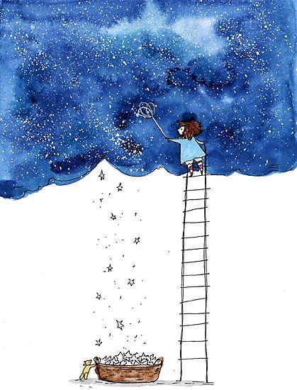

+++
date = 2022-05-04
title = "Ziua 113"
description = "Oricât de mult înțeleg că e egoist să deplângi un suflet care și-a terminat contractul aici și a plecat mai departe, în clipele astea de început, când afli, ți se pune o greutate imensă pe suflet. Și-ți vin lacrimile și ți se înnoadă-n bărbie, și-ți pare rău și știi că nu mai e nimic de făcut aici, în planul ăsta material în care rămâi cu dorul de om. Chiar dacă aprinzi o lumânare și-i trimiți gândul bun, de drag, să știe că ți-a atins sufletul și viața și-ți aduci aminte cu mult bun în inimă de ea, nodul ăla de-l simți în gât refuză să se deznoade."
authors = ["Biannca Locatelli"]
[taxonomies]
tags = []
[extra]
math = false
diagram = false
image = "images/ziua-111-2.jpg"
+++
---

Am dormit buștean azi-noapte. Munca "la câmp" își spune cuvântul asupra rezistenței corpului meu. Deși, de obicei, dorm iepurește să aud eu tot ce e de auzit, o mică manie a controlului, azi-noapte cred că putea să mă fure cineva cu tot cu casă că nu reacționam.

Cu toate astea, la 5 și un minut m-a trezit ascuțitul de gheare al Spikylinei fix în partea mea de pat, fix la capul meu, să nu cumva să ratez manifestul ei de libertate. Probabil că o fi dansat prin cameră de pe la 4 și ceva, cum îi e obiceiul, dar n-a avut cine să o audă așa că acum a venit mai aproape. Strig la ea să se oprească, că tare bine era acolo, pe tărâmul ăla miraculos al viselor unde totul e posibil și unde nu te doare niciun mușchiuleț și aș vrea să mă întorc. Ok, și-a mutat ofensiva asupra patului de la capul meu, la picioarele mele, dar în liniștea asta perfectă a dimineții, pentru mine parcă e același lucru. Mai strig o dată, că nu e voie, dar când m-am auzit, nici pe mine nu m-am convins darămite o felină trezită de ceva timp și cu simțurile toate active și la cote înalte.

Ok, gata, mă trezesc, numa' nu mai scârma în pat că mă strepezesc toată. Fericită că m-am rostogolit din pat, o taie către ușă, duduie pe scări și frânează brusc, că o și aud eu de pe scări, în fața ușii de la bucătărie. Asta nu e sensibilă la farmecele ei și nu se deschide singură, va trebui să aștepte să mă scobor pe scări dar eu vin mai încet, că-s neunsă pe la încheieturi și fiecare mișcare mă scârțâie.

***

Hai că ne adunarăm amândouă în bucătărie, ea vrea afară, eu aș vrea cafea direct în venă, că mi-s cârpiți ochii de somn și de oboseală, m-a luat și un tremurat a frig. Coconetul se tirează afară, eu nici nu pot să mă gândesc să mă scot pe terasă la cât îmi e de frig. Îmi încălzesc apa de băut și poate îmi dă ea un boost de energie sau măcar mă mai încălzește un strop.

De la ceai, parcă s-a mai încălzit atmosfera răcișoară din bucătărie dar nu într-atât încât să bravez cu o ieșire pe terasă. Lasă că or mai fi zile de ieșit și altădată.

O țâră desțelenită de apă, mă pornesc, în ralanti totuși, să fac și smoothierile. Azi mă trece un gând: oare o exista vreun aparat pe care să-l umpli cu de toate și să-l programezi de seara să facă singur smoothie dimineața? Dacă nu, poate inventez eu că tare bine mi-ar fi prins unul acum! Cu chiu, cu vai, am terminat trebușoarele și aștept să se trezească coana mare. S-a luminat de-a binelea așa că și dacă aș vrea, nu mă mai prinde niciun somn din urmă.

***

Mamei i-a fost frig peste noapte plus că, nu știu dacă a fost halucinație sau vis, îmi povestește cum la un moment dat s-a lăsat o liniște absolută și un întuneric absolut peste tot, în miez de noapte, că a crezut că a căzut curentul. N-a căzut, că aș fi văzut pe displayul de la cuptorul cu microunde, detectorul sigur că a existat o oprire de curent în casă, dar zic că o fi fost doar ca să nu lungesc vorba. Nu de alta dar n-am energie încă nici măcar de vorbit, mai trebe să stau un strop să crească nivelul din container.

Cei cu înclinații ezoterice, consideră co oamenii cu autism sau cu demență, nu au același "normal" ca al nostru, ăștia care am bifat tiparele majoritare, și că ajung în timp să aibă trăiri extrasenzoriale, să perceapă lucruri din câmpuri la care noi nu avem acces. Nu știu dacă e adevărat dar eu cred întotdeauna în echilibru, probabil că de unde a luat viața ceva, a pus altceva în loc.

Mă mișc cu greutate la ele dar le primenesc și omenesc și cobor să mă lățesc pe colțar, cu smoothieul meu.

***

Am adunat-o și pe Chichirica de afară, e fleașcă pe lăbuțe, o șterg și ne așezăm amândouă pe colțar, eu să-mi savurez fructele pasate, ea să se sprijine de gamba mea și să se spele. Îmi face tare bine momentul ăsta de liniște, de drag în două, de viață dar știu că mă ajută statul la orizontală, dacă m-aș ridica, cred că s-ar strica feng shui-ul.

Tot la capitolul savurat, am mai urmărit un episod al canalului de youtube pe care-l urmăresc, când am chef și timp, "Renovating a ruine" al lui Kylie Flavell. Are fătuca asta un farmec anume, un șarm în simplitatea și sinceritatea ei, care te agață fără să vrei și te reconfortează să o asculți și urmărești. Este una din puținele femei, cu canal youtube, care e autentică până în măduva oaselor, care nu se ascunde după scuze, care e like an open book și, cel mai important, simți că tot ce face, face pentru că nu poate trăi să nu facă. Nu pentru likeuri sau rating sau mai știu eu ce câștiguri. Iar asta mă atrage irezistibil.

Fac pauză cât să-mi fac cafeaua aia mult așteptată, care să-mi dea surplusul ăla, fals, de energie. Fals sau nu, am nevoie azi ca să funcționez, că mă așteaptă o zi plină de treabă. Again.

Mi-am permis ca timpul magic să țină cât a ținut și videoul ei și apoi, chefless, mă duc să o aduc pe mama la micul dejun.

***

Nu știu ce s-a întâmplat, pe ce buton oi fi apăsat, din greșeală, dar azi, mama a fost cea care a făcut conversația care să umple liniștea dintre noi! Asta a fost surpriza de proporții a dimineții!

Pentru că eram tăcută, a început ea să vorbească de m-am și speriat. M-am întors de la chiuvetă și m-am uitat la ea, că nu-mi venea să cred. Cu așa o surpriză, parcă a crescut vertiginos nivelul de energie în instalație și am participat, cu dragă inimă, la dialog. Îmi spune de Putin dar eu nu am cu ce să contribui la subiectul ăsta așa că moare-n fașă, apoi de dorul ei de casă iar aici începem să croșetăm amândouă pe marginea subiectului. De abia așteaptă și o înțeleg perfect.

Îmi dau seama că încă aștept semne din partea mamei, așa cum le-am așteptat toată viața. O urmă de semn dacă-mi dă, și sunt în stare să mut munții pentru ea. La fel și azi, deși sunt stoarsă de vlagă, la propriu, m-a umplut de adrenalină conversația asta pe care a început-o ea. Nu știu dacă a simțit la mine oboseala și a vrut, timid, să mă "mângâie" cu un dialog sau doar a vrut să vorbească cu mine, știu doar ce bine mi-a făcut suflul ăsta nou de viață din ea. Mulțam Universule, mulțam, mulțam!

***

Îmi fac curaj să ies în curte, să mă iau la luptă cu restul de trifoi pe care trebe să-l smulg din zonele greu accesibile mașinii de tuns. Mai scrollez un strop pe social media, așa, un pic, înainte să mă avânt.

Un mesaj pe whatsapp mă scoate din leneveală și-mi dă niște fiori de groază pe tot corpul. Citeam "a murit mama Geta!" și informația nu voia să intre în minte. Mintea mea respingea cuvintele astea cu oroare și cu groază și-mi dădea cu virgulă. Nu se poate! N-are cum! E imposibil!

Mama Geta este (giiiz, a fost) o femeie din familia mea extinsă, prin alianța cu iubitul copilei mele. Nu am interacționat cu ea, fizic, decât de vreo două ori, dar mi-a atins inima profund. O mână de fier, o gospodină exemplară, o inimă imensă, o generozitate până la cer și înapoi, un om care și-a sacrificat timpul din viață pentru alții, femeia asta a plecat atât de lin din viața asta, la fel cum a ajutat oamenii din ea. A murit în somn.

Oricât de mult înțeleg că e egoist să deplângi un suflet care și-a terminat contractul aici și a plecat mai departe, în clipele astea de început, când afli, ți se pune o greutate imensă pe suflet. Și-ți vin lacrimile și ți se înnoadă-n bărbie, și-ți pare rău și știi că nu mai e nimic de făcut aici, în planul ăsta material în care rămâi cu dorul de om. Chiar dacă aprinzi o lumânare și-i trimiți gândul bun, de drag, să știe că ți-a atins sufletul și viața și-ți aduci aminte cu mult bun în inimă de ea, nodul ăla de-l simți în gât refuză să se deznoade.

***

Pentru că natura e un mare vraci, și fizic, și emoțional, am ieșit la treabă dar m-am așezat într-o dinamică sufletească total diferită de până acum. Nu vreau să-i îngreunez zborul cu și mai multe lacrimi, încerc să nu mă întristez și mai mult. Invariabil și întotdeauna, mă gândesc și la mine.

Dacă m-aș pune la somn în seara asta și mâine nu m-aș mai trezi să fac smoothieuri, să ies pe terasă, să îi dau mamei micul dejun, să fac treabă, să toate astea și încă milioane de alte chestii, cum ar fi?

Se zice că greul nu e pe cel care pleacă, ci pe cei care rămân. Probabil, deocamdată nu s-a întors nimeni să confirme. Azi, după ce am privit așa, retrospectiv, cât am putut eu de obiectiv, am tras o concluzie cu două chestii mari și late:

1\. cum îți TRĂIEȘTI viața, care se poate termina într-un vis, astfel încât să nu-ți pară rău că ai irosit-o și

2\. cum atinge viața ta viața altora.

Restul e cancan, infloritură de amorul artei.

***

Am terminat și curtea și filozofia, mi-e sufletul un strop mai ușor, intru în casă să pregătesc prânzul mamei, care a dormit vreo două ore.

O aduc la masă, în bucătărie e un miros demențial de usturoi și ciuperci, am făcut niște paste cu sos alb și ciuperci, un deliciu, mâncăm amândouă, mama chiar cu poftă, așa că mă bucur de clipele astea noi, de șansa lor și mulțumesc mamei Geta în gând pentru lecția de azi. Drum lin să ai, suflet bun și cald și cuprinzător!

***

Fug la Hornbach să mai iau niște mulci, niște folie antiburuiană și sare pentru dedurizator. Plus un compost de grădină, să încerc să revigorez puțin răsadurile de roșii care sunt pipernicite de nici nu zici că le-am vorbit cu iubire toată viața lor de până acum. Poate nu le-a priit substratul folosit, așa că schimb tehnica.

2 saci de 50 litri de mulci, 2 saci de cate 25 kg fiecare de sare plus un sac de compost de 50 litri. Am crezut că-mi pică rinichii de la atâta ridicat și cărat. Iar mi-a apărut mama Geta în gând, parcă a ceartă, când simțeam că mă lasă genunchii. Pentru că nu m-am oprit doar la a-i aduce acasă, nu, eu m-am și pornit să completez cu mulci pe la pomișorii fructiferi, am și turnat sarea în dedurizator, am și adus compostul în garaj. Din soarele care era când am plecat, s-a stârnit, habar n-am de unde, o mică vijelie și norii negri, grei, s-au adunat deasupra zonei. Gata, am înțeles, o iau mai încet. Dar, vezi tu mamă Geta, mie îmi place să fac astea! Nu le fac nici din sacrificiu, nici de gura cuiva, pur și simplu îmi place să am treaba făcută. Iar dacă asta presupune și o țâră de cărat, asta e, o fac și p-asta.

***

Nici azi table, doar sucul și pastilele, nu vrea duș, nici nu insist că nici eu nu prea am chef de dușul ei. Îs frântă din nou, am și o apăsare pe suflet, vreau un duș și vreau să fac, de-oi mai fi în stare, o mică meditație pentru sufletul care-și începe înălțarea azi.

***

O zi plină, cu emoții mixte, un amalgam interesant, cu recunoștință pentru:
1. înțelepciune-n acceptare sau egoism în neacceptare, ambele sunt ale mele, nu neg pe niciuna, nu așez pe piedestal pe niciuna. Sunt ființă divină și ființă de carne, așa mă împletesc și așa trebe să mă privesc.
2. Scufundările în adâncurile mele și descoperirea rădăcinii bucuriilor cu mama mea. Fiecare om își dorește să fie văzut iar un copil nu prețuiește niciodată altceva mai mult decât recunoașterea din partea îngrijitorilor lui.
3. Faptul că experiențele mele, conștientizările mele, cuvintele mele așternute aici, pe blog, ajung totuși la câteva persoane și deschid acolo uși ferecate. Cât de surprinzătoare e viața asta!

Clipa mea de frumos e și un tribut mic către mama Geta:

  

P.S. nu pot să nu mă gândesc dacă nu cumva "pana de curent" pe care a simțit-o mama azi-noapte nu a fost cumva "pana de viață" a mamei Geta. E doar un gând...

  

    <a href="/blog/ziua-112/">Postarea anterioară</a>
  

  

    <a href="/blog/ziua-114/">Postarea următoare</a>
  

