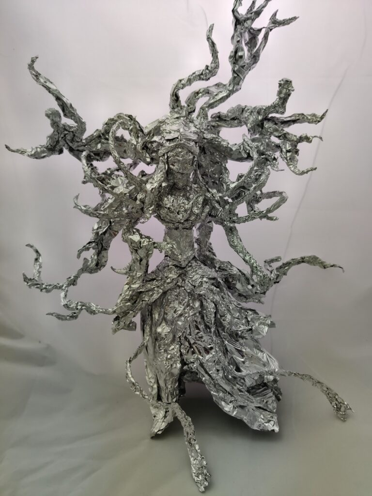

+++
date = 2022-05-05
title = "Ziua 114"
description = "Dar în dimineața asta sunt bine, chiar bine-bine, dacă mă bate gândul nebunesc să ies pe terasă. Nu e tocmai călduț afară, e totuși 5 fără ceva, însă viața-i scurtă și sunt atât de multe de înghesuit la trăit în scurtătura asta fantastică. Mda, e răcorică, dar mă încăpățânez să rămân pironită, pe terasă. Nici nu mă așez, sunt mai mult ca sigură (și mai mult ca perfectă, dar asta e o altă poveste, hihihi) că scaunul ăla ce a stat toată noaptea afară clar nu mă va încălzi, așa că mă bâțâi de pe un picior pe altul, să fentez tremurul ăsta care-mi urcă pe șira spinării. Și din bâțâială-n bâțâială, am făcut și-un joc de glezne, și din ăla și-o mișcare de șold și din una-n alta, m-am apucat de gimnastică. Eu, care n-am mai făcut gimnastică de ani de zile!"
authors = ["Biannca Locatelli"]
[taxonomies]
tags = []
[extra]
math = false
diagram = false
image = "images/ziua-114.jpg"
+++
---

Cred că am luat meteahna super matinală a lui Spiky, că m-am trezit, singură și nesilită de nimeni și nimic, la 4.30. S-au inversat rolurile și recunosc, cu o ușoară notă de ghidușie, că mi-a făcut o plăcere deosebită să-i suflu în urechiușe micului coconet care se lăfăia pe partea de pat a lui Mr. H, să-i dau și eu trezirea for once in my life. Pfiu, ce m-am răcorit! A fost trezirea asta bruscă a ei echivalentă a nu știu câte treziri bruște pe care mi le-a servit de când s-a calificat la a locui în casă. Nimic nu rămâne neplătit în viața asta, hahaha!

E o țâră buimacă, cred că mi-a trimis vreo două pe limba ei pisicească, dar nu-i bai, nu mă mai prind pentru că eu deja sunt în drum spre parter. Am lăsat-o acolo, în pat, habar n-are ce-a "lovit-o", probabil mai bagă o fisă pentru un somn mic. La mine, din nu știu ce motive, s-a gătat somnul. A fost o noapte dintr-o bucată, din nou, pentru că-s obosită tare fizic.

***

Dar în dimineața asta sunt bine, chiar bine-bine, dacă mă bate gândul nebunesc să ies pe terasă. Nu e tocmai călduț afară, e totuși 5 fără ceva însă viața-i scurtă și sunt atât de multe de înghesuit la trăit în scurtătura asta fantastică.

Mda, e răcorică dar mă încăpățânez să rămân pironită, pe terasă. Nici nu mă așez, sunt mai mult ca sigură (și mai mult ca perfectă, dar asta e o altă poveste, hihihi) că scaunul ăla ce a stat toată noaptea afară clar nu mă va încălzi, așa că mă bâțâi de pe un picior pe altul, să fentez tremurul ăsta care-mi urcă pe șira spinării. Și din bâțâială-n bâțâială, am făcut și-un joc de glezne, și din ăla și-o mișcare de șold și din una-n alta, m-am apucat de gimnastică. Eu, care n-am mai făcut gimnastică de ani de zile!

Cred că sunt o priveliște de basme: în pijamalele lui Mr. h (că mi-e dor), cu părul vâlvoi prins în vârf de cap, la 5 fără dimineața pe răcoare, cu rotiri de brațe, fandări și ce mișcări mi-am mai adus și eu aminte din tinerețe. Doamne, da' ce bine mi-a făcut!

***

A venit la fix apa caldă după mișcarea asta energizantă, au curs toate acțiunile dimineții ca unse, line, parcă nici gândurile nu mai sunt atât de multe și nu se mai foiesc bezmetice prin minte. Îmi trece unul, razant, că abia am apucat să-l prind de-o aripă ca să-l articulez: starea asta pe care o trăiesc acum probabil că o trăiesc și cei care inventează sau inovează. Sunt convinsă că e tare mișto să descoperi ceva pornind de la o joacă, de la o "lăsare să curgă" a momentului și a acțiunilor care vin în momentul ăla. Cam cum am făcut eu cu gimnastica azi. Dar cel mai tare mi se pare cum experiența asta a ștampilat în creier momentul ca fiind fain și mâine dimineață o să vreau să ies din nou pe terasă, să iau de acolo memoria clipei și să o activez din nou. Și poate-mi iese de-un nou obicei, în fiecare dimineață. Nu forțez nimic, voi vedea.

***

Evident că e prea devreme, până și Spiky doarme încă, nu a binevoit să coboare sau poate e încă șocată de trezirea ce i-am dat-o. Cert e că toată lumea din casă doarme numai eu nu. Dar azi nu le mai invidiez.

Sunt conștientă că mișcarea e bună și face bine prin endorfinele eliberate în organism dar sunt la fel de conștientă că m-am trezit cu o stare bună. În sămânța asta aș vrea eu să mă bag și să cercetez ce anume-mi setează ziua care mi se așterne într-una bună sau mai puțin bună. Că aș vrea să mă prind și apoi să masterizez jocul ăsta, să nu mai fiu așa ca o floare bătută de vânturile circumstanțelor.

***

Începe să se lumineze, ies pe terasă să-mi bucur ochii cu priveliștea curții, de-un verde brotăcel, curată și dichisită, că doar am muncit și eu și Mr. H de ne-au sărit capacele să fie așa. De câteva zile, s-a mutat un clan de mierle la noi în curte. Nu știu ce tot culeg ele cu cioculețul de prin trifoi dar știu că îmi plătesc pentru asta cu niște triluri demențiale. Statul meu pe afară perioade lungi mi-a fost presărat cu triluri geniale, de la sunete ca alea de pe șantier, de ai impresia că te fluieră un muncitor, până la octave de Mariah Carey.

Până anul ăsta nu am fost atentă la ciripitul păsărelelor. Îl auzeam dar nu eram atentă la el. Acum am și citit despre mierlă și așa am aflat că la noi în curte sunt mai mulți mierloi decât mierle, că ei sunt negri și fetele-s maronii, că fetele se orientează în alegerea perechii, care apropo e pe viață, după cioc, cu cât e mai portocaliu, cu atât posesorul are un sistem imunitar mai bun și deci e mai sănătos, bun de prăsilă cică, iar juvenilii învăță să cânte ca flautul prin imitarea adulților din jur. Cum ziceam, viața asta e prea scurtă! Și după ce că e așa, mai și fușterim timpul aiurea…

***

Gata, văd pe cameră că s-a trezit coana mare, mă duc la ele, sunt un buldozer de stare de bine. Probabil că n-am avut nici o boabă de îndoială în tot sistemul meu, am crezut cu toată ființa că am o stare bună, că așa cum m-am dus, așa am și plecat de la ele. Nu s-a lipit nimic aiurea, la mama e curat, doar aerisesc, le dau să pape și plec ușoară, cu zâmbet în toată fascia și cu un "ne vedem la mic dejun!" plin de voioșie. Am primit un "da, puiule!" la fel de voios.

***

La parter găsesc o Spiky nerăbdătoare, îi povestesc în două vorbe că a pierdut un spectacol pe cinste la prima oră și îi dau drumul să zburde pe afară, pe unde are ea nevoie sau nevoi.

Eu îmi iau smoothieul și mă las să curg pe colțar, sub păturică pufoasă, să mă uit la design interior.

Nu am căutat ceva anume dar a făcut-o Universul pentru mine și mi-a adus în feed un episod de Handmade by HGTV cu un tip senzațional. Deși cuvântul ăsta e mic și parcă nu-l cuprinde. Rajiv Surendra e numele de scenă pentru acest suflet care absoarbe viața asta într-un mod în care mi-ar plăcea să-l fac și eu. Are o dorință și o curiozitate ingenuă de afla și a experimenta care e molipsitoare. Iar la capitolul autenticitate marchează cu scor maxim. Când o să mă fac mare, o să fiu ca Rajiv!

<a href="https://www.youtube.com/watch?v=7Uo2nomf4I0" target="_blank">https://www.youtube.com/watch?v=7Uo2nomf4I0</a>

În aceeași notă de bucurie, o aduc pe mama la mic dejun, unde mănâncă ca în zilele ei bune. Și tot ca în zilele ei "bune", începe să depene amintiri despre tata, într-un mod întortocheat pe care nu-l recunosc și-mi dau seama că iar croșetează pe lângă realitate. Ce dacă, bine că povestește!

O ascult, nu o contrazic dar o aduc în prezentul meu anunțând-o că azi e zi de curățenie și că vin peste ele să schimb și scutur și spăl.

***

Săptămâna asta, cel puțin până acum, a fost plină de surprize de proporții, unele faine, una tare nefaină, dar sincronicitatea care mi se înfățișează are două capete: oameni dragi din vremuri vechi și oameni autentici. Nu neapărat diferiți.

Acum câteva zile, m-a sunat un fost șef de-al meu de la bancă, cu care nu am mai vorbit de vreo 8 ani. Surpriza zilei! M-am surprins cât de pragmatică și deschisă am devenit cu oameni în care, cu mulți ani în urmă, într-o altă viață a mea, mi-am investit toată puterea. Eram atât de lipsită de încredere în puterea proprie, încât mi se părea că orice zice altcineva e cu siguranță mai bun și mai valid decât orice aș avea eu de zis. Ei bine, acum, după ceremonia de început, am întrebat direct: "m-ai sunat că ai nevoie să te ajut cu ceva? Că ne lălăim și la bârfă după, hai să vedem dacă e ceva de rezolvat înainte!" Nu era nicio duritate în abordare, era o relaxare și o înțelegere care m-au uimit și pe mine. Minunea face ca omul să nu fi vrut decât să mă audă dar am ieșit de două ori câștigată din telefonul ăsta: o dată că am desfăcut o crustă din mine legată de acest om, cu care nu puteam să fiu eu pentru că "șefia" lui mă intimida și a doua oară că uite, sunt oameni care-și aduc aminte și mă sună și după opt ani. Asta relaționată la lecția primită ieri de la mama Geta și modul cum Sadhguru definește atât de frumos karma: modul cum viața ta atinge alte vieți.

Dintr-o vorbă-n alta, aflu că a trecut la bugetari și când îmi spune unde, mi-aduc aminte de un alt om drag ce mi-a cutreierat prin viață, care e fix la aceiași bugetari. A fost doar o secundă gândul dar o antenă receptivă la distanță mare l-a prins din zbor și azi, m-a sunat fix acest om. După "decât" vreo 6 ani!

Timpul ăsta e mic când vorbești cu oameni care te-au alcătuit și ei puțin cândva. Poți vorbi o dată la 6 ani și să ai impresia că nu te-ai auzit de ieri.

Eu cred că am încapsulat fiecare relație pe care am avut-o cu un om în viața asta și am împietrit-o la nivelul la care era ultima oară când am vorbit cu acea persoană. Dar doar ca acțiune nu și ca sentiment. M-am întâlnit cu oameni, în fața cărora am fost vulnerabil de rănit și ei n-au ratat ocazia, după ani de zile, iar prima mea reacție a fost de bucurie că-i revăd. Nu de ranchiună, nu de supărare.

***

E clar o săptămână de premiere importante. După ce am terminat curățenia de la etaj, după ce am întins deja a treia mașină de rufe spălate, mi-am permis o lălăială în soare, pe trepte. Spiky, și ea la o cură de vitamina D, dar de pe gard.

Cum stăteam eu cu ochii închiși și fața la soare, am simțit-o pe coconet cum mi se fâlfâie pe la picioarele goale. Dar am mai simțit și altceva. Deschid ochi și văd o sopârliță, cu gura larg deschisă și cu pieptișorul miscându-se intens, de frica pe care o trăia. Nebuna asta de Spiky mi-a adus vânatul ei, că poate oi fi nemâncată. O prind pe ea de ceafă cu o mână și cu cealaltă o prind pe șopârliță de ceafă și fug cu ea departe de tomberoneză, să o eliberez. Doamne, îi bate așa de tare inimioara că am împresia că o văd prin pielicică. Încerc eu să o liniștesc dar îmi dau seama rapid că nu o să mă înțeleagă așa că nu-i mai lungesc sperietura și îi dau drumul prin tufișuri. Spiky e acolo unde am lăsat-o.

Mă întorc la ea și o cert dar e de-o nepăsare cruntă. Sau bulversare, nu înțelege de ce nu îi apreciez darul. Închid capitolul și mă așez din nou pe trepte, să mai prind un picușor de soare și un strop mai mare de odihnă. Mă trezește o chițăială. Spiky, cu un șoricel de câmp în gură, vine spre mine, să-mi aducă ofranda. Măi, dar ești nebună de legat! Mă reped să-mi iau mănușile de grădină care-s aproape din fericire dar nu m-a dus capul că astea-s subțiri și că șoricelul nu se prinde care-i pisica bună și care-i aia rea, și capsează tot ce prinde. Îl scap când simt pișcătura, Spiky îl prinde, eu o prind pe Spiky și o forțez să-i dea drumul, e un circ intens dar reușesc să-l duc pe el spre gard și să o bag pe Spiky în casă, până o reuși el să plece în lumea largă. Timp în care eu îmi torn spirt la greu peste pișcătură și mă rog să nu pățesc nimic aiurea, că ar fi chiar de cacao. Dar poate ăsta e modul naturii de a-mi spune să-mi văd de treabă, să nu mă mai bag între pradă și prădător. Da, ok. Data viitoare o să fac fix la fel, nu mă pot abține.

***

Mama nu a vrut și prânz, lucru pe care de altfel îl așteptam la cât de bine a mâncat de dimineață, eu am transplantat răsadurile în pământ nou, cu compost, am terminat curățenia și la parter și retușurile pe terasă și 4 ore mai târziu s-a făcut 19. Când, I have no idea… Îi duc sucul, îi dau medicamentele și vrea somn, că e tare obosită. Nu înțeleg cum vine asta, muncesc eu dar e ea obosită, însă nu comentez, îi zic cât pot eu de voioasă, prin oboseala care mă prinde, că ne vedem mâine dimineață. E o promisiune pe care i-o fac în fiecare seară. Și-mi place când o fac, că o fac conștient. E și pentru ea dar și pentru mine. Parcă fac aproape certitudine o nouă zi.

***

Asta care s-a dus ca o părere a fost plină de fain și de neprevăzut, cu recunoștință pentru:
1. Gimnastica dimineții sau dimineața gimnasticii, vom vedea care pe care!
2. Modul cum mi se validează cât suntem de interconectați și cât de puternic e gândul ăla curat, fără pic de îndoială, teamă, grijă, analiză sau judecată!
3. Oamenii dragi din viața mea care au rămas oameni dragi în viața mea!

Iar clipa mea de frumos este:

  

Olivia Markov the Crimson Bride from Magic the Gathering - Aluminum Foil Sculpture

 

 

  

    <a href="/blog/ziua-113/">Postarea anterioară</a>
  

  

    <a href="/blog/ziua-115/">Postarea următoare</a>
  

