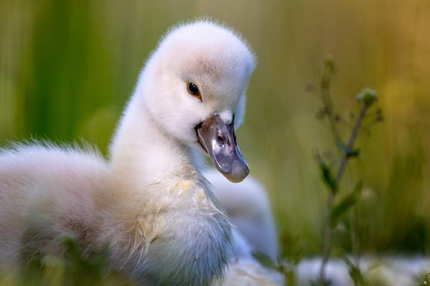

+++
date = 2022-05-10
title = "Ziua 119"
description = "Se zice că nu există nimic mai puternic decât ruga unei mame. Și cred că e așa, pentru că ruga aia vine dintr-o trăire pe care numai o mamă o poate avea atât de intensă, pentru puiul ei. Poate și de aia am fost eu atât de traumatizată mult timp. Fără să știu, eu mi-am pus candid așteptările de viață în ghetuțele inimii și le-am pus la ușa sufletului mamei dar ea, din nepricepere sau poate dintr-o lecție pe care a venit să mi-o dea, nu s-a obosit să le cerceteze și să le umple. Iar eu m-am angoasat și umplut de bube sufletești, neapărată de tăria unei rugi materne. Uite că acum cu fiecare duș pe care i-l fac, spăl bucăți de suflet de copilă și pun în loc o pace conștientă. Ne primenim amândouă."
authors = ["Biannca Locatelli"]
[taxonomies]
tags = []
[extra]
math = false
diagram = false
image = "images/ziua-119.jpg"
+++
---

Sunetele prin care alarma patrupedă de trezire dimineața își încearcă rezistența unghiilor versus materialul saltelei din patul nostru m-au zgâriat direct pe creier. Nu că aș fi dormit dusă, eram într-o picoteală mai mult, așteptând involuntar și inconștient să mă trezească. D-aia nici nu am mai reacționat nervos, m-am supus cuminte momentului, mi-am adunat papucii de pe sub pat unde-i îndesase în alergăturile ei coconetul, m-am adunat și pe mine să mă bag în papuci și hai să tragem perdeaua zilei să intre viață nouă în mine. În noi.

***

E o liniște ușor nefirească la parter dar îmi place cum mă întâmpină. În cămară, unde-am intrat să iau laptele de migdale, pe lângă liniște, era și un picușor mai cald decât în rest, că mi-a trecut prin cap să mă ascund acolo, o bucată de timp, să mă bucur de muzica plăcută urechilor mele, liniștea, și de căldurică pentru corpul meu obosit. Dacă m-aș strecura între dulapuri și marele boiler, nu m-ar descoperi nimeni, nici chiar Spiky ce scârțâie strident, cât poate ea de strident, lângă ușa de la terasă.

***

Ok, hai să vedem cum e afară. Nici cald, nici frig, mi se pare că nu se întrevede niciun soare pe la orizonturi dar fac prezența ciripitului de vrăbiuțe, trilurilor de mierle, ceva uguieli de porumbei, fazanii sunt nelipsiți și a apărut și un nou protagonist, cucul. Ieri au lipsit de la apelul de dimineață iar acum mă bucur că suntem din nou cu toții, ba chiar ne-am înmulțit. Yep, omul are nevoie de rutine, pentru că ele generează familiar și familiarul dă un sens de siguranță.

***

Am început să plâng de frumusețea clipei și de nevoia mea de ducă. 2 în 1. Și de bine și de rău, ca să nu bag două plânsuri separate.

Da, clipa e superbă, și vrăbiuțele și mierlele și toate sunt, dar eu le vreau în termenii mei. Că nu le pot accepta așa, cum sunt. Mintea vrea să contorsioneze realitatea exterioară la ce dictează interiorul și cu cât se înverșunează mai mult, cu atât mi se pare că mă îndepărtez și mai mult. Vreau să le aud, pe ele sau suratele lor, și de pe o prispă de cabană de munte sau de pe un deal italian sau o Franță rurală, sau orice, oriunde, unde să pot dormi până nu mai încape, unde să uit de mine și de timp și de făcut mâncare, curățenie, vorbit întruna, eu care sunt o taciturnă, unde să zbor.

Natura, ca o maimuță, îmi imită starea și pornește să plouă cu stropi mari. E o plângere totală, singura diferență dintre noi două este că ea o face cu un scop nobil, eu doar mă scald într-un butoi de neputință.

***

Mama doarme fără griji, insoțită de gândul meu mic de invidie și de judecată, de parcă ar dormi să-mi facă mie în ciudă. Mă prind repede că judec prostește dar nu înseamnă neapărat că mă oprește data viitoare, auto-observarea asta doar a mai rărit dățile.

Mă apăs pe butonul de pilot automat și-mi las corpul să facă ce deja a intrat în reflex diminețile. Nu sunt decât pe jumătate în bucătărie, jumătatea aia mai densă. Mintea mea a plecat în plimbare, nu înainte de a-mi arunca un gând de frică: dacă experiența asta cu mama, e o traumă prin privarea mea de libertate și eu, ca să fac față, evadez doar mental? Că așa a făcut și mama și uite unde a dus-o asta!

Ei, hai, or fi de la vreme toate gândurile și stările astea apoteotice, fii bărbată!

***

S-a trezit dar nu s-a sinchisit să se coboare din pat, la ea nu e tocmai curat, tocmai ce pusesem ieri lanterna laudativă pe asta, dar asta e, face parte din principiul rahatului la rostogolire: pornești cu unul mic, care o ia la vale și întâlnește-n cale fix numa' rahat și se gogoșește, și se gogoșește până când te acoperă și înăbușă cu totul. Sunt la prima rostogolire, poate fac ceva să nu mă sufoc azi totuși, că doar stă în puterea mea.

***

Gata, mi-am propus ca atunci când trag după mine ușa de la ea, să tai cordonul stării care m-a îmbrățișat pe terasă. Să mă scutur ca să pot să mă duc liniștită și să-mi savurez strop cu strop timpul meu al meu.

Nu mi-a ieșit integral, nu știu dacă mi-am activat mintea analitică sau e doar o mostră de claritate, că parcă m-a lovit o revelație: mi-am criptat eu, ascuns și întortocheat, cum numai mintea umană poate face, în tainele mele interioare, dorința de a alerga după cai verzi pe pereți? Pentru că pot să fac pariu că atunci când o să am libertatea mult jinduită, o să mă apuce dorul de mama. Și tot așa, o să alerg când după una, când după alta, dacă nu devin acut atentă acum. Nu degeaba mi se spune veșnic nemulțumita.

Cred că mi-am prins tendința asta cu mâța-n sac și trebe să o așez la o cafea, să văd cum o împac cu prezentul meu, să nu ajung nici la vânătoare de fantome, nici la pescuit de regrete.

***

Nu știu dacă contextual sau e un mesager pentru prezentul meu, mi-am adus aminte de abundență, despre care am învățat nuanțe și perspective noi atât la cursul de Pace cu mine cât și la cursul mișto de 21 de zile al lui Deepak Chopra.

Când îți deschizi frecvențele și receptezi abundența în orice te înconjoară, de la lumina ce se revarsă nemărginit diminețile până la stelele de pe cer, de la firul ierbii până la cele de nisip și gândurile minții, totul e abundent și îți stă la dispoziție. Numai că, cel puțin eu, îmi pusesem ochelari de cal și-mi setasem banii drept unică țintă a abundenței iar restul nu mai conta.

Abundența e și ploaie de griji, dacă acolo mi se duce energia și atenția. Dacă îmi micesc privirea pe problemele insignifiante și nu mai văd măreția vieții, abundența se va prăvăli peste mine fix cu ce mi-am consumat eu energia să văd. Că d-aia ne suntem creatori de viață și d-aia avem liberul arbitru. Dacă în oală mi-am pus tristețe și grijă sau frică sau lipsă de curaj și îmi folosesc energia și atenția să le gătesc, cu siguranță nu o să iasă o ciorbă de bine, că n-are cum!

***

Apropo de abundență financiară, mi-aduc aminte că trebuia să îi fac mamei un CT cerebral, anul trecut, pe la început, când m-am prins eu că ceva nu e în regulă cu mintea ei. Am sunat la un lanț privat de spital și am găsit un loc în Târgoviște, cel mai aproape de casa mamei. Am explicat problema, am spus că avem trimitere și am aflat când și cât.

Ajungem acolo, la recepție, verificăm programarea, ne spune că plătim la final și aștept afară, că eram în contextul pandemic. Nu a durat mult, m-au strigat, am luat CD-ul CT-ului iar doctorul a anunțat recepția că nu plătim nimic. Deși aflasem, telefonic, că ne costă 265 ron.

Ăsta e un mod superb prin care Universul mi-a arătat cum poate să arate abundența financiară. Cine s-ar fi gândit?! Eu credeam că înseamnă să-ți intre bani în buzunar! Uite că poate să însemne și să nu-ți iasă bani din buzunar.

***

Micul dejun a adus pe tavă o nouă variantă în care mama a început să vadă ziua când am fost la ea acasă. Fie ea s-a tot gândit la experiențele zilei și ca bilele de loterie, i s-au învârtit în memorie de nu mai știe care bucățică cu care se cuplează, cert este că azi a început să extragă una câte una și le spune total diferit de cum au fost. Draga de ea! A fost atât de impresionată! În lumea ei în care nu se întâmplă prea multe, ziua aia a fost cireașa de pe tort. O ascult cum le deșiră ea și le înnoadă la loc, mă minunez câteodată de iscusința îmbrobodirii dar nici nu comentez, nici nu încurajez. Doar ascult.

***

Afară s-a pornit bine de tot ploaia, e o vreme britanică iar eu nu am chef să fac vreo treabă gospodărească.

Pentru că nu mai intră, nici nu mă mai chinui să-mi îndes pe gât ce nu vreau să fac așa că mă scufund cu o plăcere infinită în site-uri de antichități, în ebay, în etsy, să văd de minuni mai găsește lumea și să mă inspir de acolo. Vreau să-mi creez în toată casa atmosfera aia frumoasă de boem pe care am reușit-o în baia mică. De câte ori trec pe acolo, de atâtea ori mi se umple sufletul de mișto. Va trece timp până voi finaliza dar tocmai ăsta e farmecul unei (re)decorări: emoția și parcursul până la rezultatul dorit. Casa noastră e și ea un organism viu și evoluează odată cu noi.

***

Mi-a scris cineva că-i place să meargă, lângă mine, în călătoria mea cu postări zilnice. Că s-a observat cum devine mai atent la propria viață. Da, cred și știu și de ce e așa. Pentru că întotdeauna suntem fascinați de ce se petrece în viețile altora și pentru că, protejați de un ecran, putem rumega liniștiți informațiile. Nu e ca la un curs unde crăcănezi cu ranga mintea  și inima să poți turna cât mai mult, că e informație condensată și timp scurt. Aici iei zi cu zi, rezonezi sau nu, aplici sau nu, nimeni nu te verifică dacă ai priceput sau n-ai înțeles și asta e mișto. Că ai libertatea asta plină și ea e primul pas. Eu nu pot decât să mă bucur imens și să simt monstruos când aud așa o confesiune. Dacă ating o viață și ea atinge la rândul ei altă viață și tot așa, nu poate fi decât miraculos. Mulțam pentru curajul de a spune!

***

Nu știu unde a zburat timpul, dar mi-a plăcut visarea mea prin obiectele din trecutul unora. S-a făcut de prânz, o aduc pe mama, îl adun și pe Mr. H și punem de-un prânz în trei. A fost delicios și la propriu, și la figurat pentru că Mr. H s-a dezghețat în ceea ce o privește pe coana mare și azi am început eu cu o glumă, apoi el cu un banc, apoi iar eu și uite așa ni s-au întins zâmbete cât fețele iar mama a râs cu poftă. Am tăcut chitic și nici ea nu a zis nimic dar mama era expertă în bancuri, putea să spună ore întregi și nu repeta vreunul. Acum e un mare vid acolo în zona aia destinată distracției dar mă bucur că azi le-a sorbit pe cele de la noi. Mici și stângace, că niciunul din noi nu le are cu glumițele, dar îndeajuns să avem un prânz fain. Hai că se poate!

***

Atmosfera asta de afară, un strop mohorâtă prin lipsa soarelui, mă trage greu spre somn. După prânz, cu bruma de energie pe care o mai aveam plecată brusc să digere, am simțit că mă scurg. Și m-am scurs, dar în patul nostru, unde am adormit! O oră! O, cât de bine a fost! Iar când m-am trezit, ieșise și soarele. Mulțam cerule, ai reținut tu până la urmă când te-am rugat să-mi dai un bon de somn și condiția să-l valorific! Iupiiiii!

***

M-am trezit și pentru că i-am promis mamei table azi și n-am vrut să ratez momentul din nou. Știu că de abia așteaptă, probabil că invers proporțional de cum le aștept eu. Momentul ăsta de odihnă, în care mi-am mai ostoit și corpul și mintea, a mai făcut loc și intră și ce nu vreau să fac. Azi. Am învățat să nu mai pun ștampile definitive pe nimic. Ce va fi mâine, e în cu totul alt registru și o să văd atunci.

***

Sucul, tablele, dușul, masajul se succed și-mi mănâncă trei ore din seară dar îmi las o mamă fericită și bibilită.

Eu cred că ea e conștientă de mult mai multe lucruri decât cred eu. Încep să cred că ea, ocazional, își dă seama că nu a fost apropiată de mine. Știu că-i povesteam într-o zi un moment dramatic din viața mea, după plecarea de acasă, care a impresionat-o dar nu a zis nimic. Nu pentru că nu ar fi găsit cuvintele, sunt sigură că a gâtuit-o emoția sufletului meu pe tavă, ci pentru că s-a simțit vinovată. Deși nu asta era ce-mi doream.

Se zice că nu există nimic mai puternic decât ruga unei mame. Și cred că e așa, pentru că ruga aia vine dintr-o trăire pe care numai o mamă o poate avea atât de intensă, pentru puiul ei. Poate și de aia am fost eu atât de traumatizată mult timp. Fără să știu, eu mi-am pus candid așteptările de viață în ghetuțele inimii și le-am pus la ușa sufletului mamei dar ea, din nepricepere sau poate dintr-o lecție pe care a venit să mi-o dea, nu s-a obosit să le cerceteze și să le umple. Iar eu m-am angoasat și umplut de bube sufletești, neapărată de tăria unei rugi materne.

Uite că acum cu fiecare duș pe care i-l fac, spăl bucăți de suflet de copilă și pun în loc o pace conștientă. Ne primenim amândouă.

***

"Încă o zi faină" sper să devina lozinca cu care să închei zilele mele, și cu bune și cu rele, dar întotdeauna cu recunoștință. Azi a plecat tințit pentru:
1. Frumusețea clipei! Sper să devin atât de incluzivă cândva să schimb din asta în frumusețea **oricărei** clipe!
2. Abundența asta care mă înconjoară din toate părțile, dar mai ales în trăiri!
3. Ora asta minunată de somn curat, fără vis, fără grijă, fără stres! LIN, așa cum mi-a urat o doamnă dragă la prima oră! Mulțam, nici nu știi tu cât ai impregnat ziua mea de LIN!

Iar frumosul meu se duce la gălușca asta mică și dulce:

  

