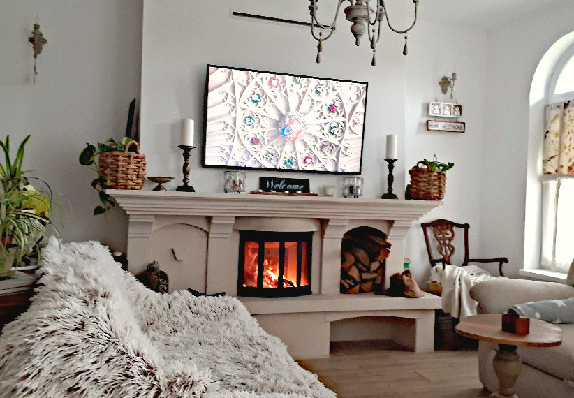

+++
date = 2022-01-23
title = "Ziua 12"
description = "short description din storage"
authors = ["Biannca Locatelli"]
[taxonomies]
tags = []
[extra]
math = false
diagram = false
image = "images/Ziua-12-final.jpg"
+++

La 6 dimineața m-a trezit Spiky, pe care o apucase scărmănatul la ușa dormitorului nostru. M-am trezit pe aceeași parte pe care am adormit. Nu știu dacă nu m-am mișcat deloc în timpul somnului, dar știu că am dormit buștean, fără vise de care să-mi amintesc. Nu sunt odihnită, dar sunt mai bine.

***

După vizita matinală obișnuită, astăzi m-am așezat în living și am căutat pe Youtube filmulețe cu castele, ca să-mi mai nasc puțin suflet nou. Simțeam nevoia acută să văd ceva care să-mi hrănească inima, care să mă bucure.

**The things that excite you are not random. They are connected to your purpose. So follow them.**

Cele de mai sus au șters în mintea mea, care avea nevoie de o înțelegere, de un sens, ideea că viața mea anterioară am trăit-o la un castel și în viața aia am fost extrem de fericită. Simțeam nevoia, de fapt mințișoara mea simțea nevoia să pună o etichetă pe trăirile tare pline de mișto pe care le am în preajma castelelor. Sau când văd castele. Sau când le vizitez. Țin minte că am fost odată la palatul Mogoșoaia și, când am pus palmele pe zidurile de piatră, din suflet mi-a țâșnit pur și simplu, ca o săgeată care mi-a brăzdat cerul zilei, un dor imens de ceva ce nici măcar nu experimentasem în această viață. Știu că sună complicat, dar it’s a fact.

Urmărind pe youtube filmulețe cu minunății de castele din Franța, mai mult sau mai puțin prezentă, am simțit fizic că I’m larger than this. Că sunt mult mai mult decât un corp și o stare mizerabilă. Abia acum înțeleg de ce anul trecut, când lucram în garaj la diversele mele proiecte de casă și îl ascultam pe Sadhguru, parcă la fiecare video de al lui spunea că **nu poți schimba împrejurările vieții dar poți schimba modul în care reacționezi tu la ele.** Cum spuneam ieri, totul vine la tine la momentul potrivit.

***

Am momente, ca ăsta, în care, dacă fac un pas în spate, în afara bulei de rahat în care mă tot zbat (deși “fac” e mult spus, pentru că nu e un act conștient, practic sunt expulzată câteodată, cred că de această inteligență iubitoare) văd mici semne peste tot, văd de la distanță imaginea de ansamblu și văd firul care leagă toate acțiunile, mari sau mici și neînsemnate, între ele.

Nu există nimic fără sens în acest Univers.

Faptul că am văzut cu coada ochiului ceva este ca acel ceva să se înregistreze și să-mi folosească la un moment dat, mai târziu. Cred că nimic nu e o risipă de energie. Doar că noi, în costumul ăsta de ființă umană, de carne și oase, parcă avem și amnezie, suntem și orbi și surzi, noi suntem fiecare în parte cel mai cel și le știm pe toate. Și nouă, fiecăruia dintre noi, ni se întâmplă cele mai cele... când de fapt, orice pas faci, te duci mai departe. Fie că te duce într-un loc nașpa, din care să vrei să scapi și să acționezi în direcția aia, fie te duce într-o zona mișto, din care să vrei să crești și mai mult. Either way, câștigi. Doamne, ce bună sunt la teorie… cred că pot să scriu și cărți de dezvoltare personală! Hai să văd cum ies eu din “locul nașpa”.

***

Am făcut focul în șemineu. La TV e un documentar despre Viena, imperiu și dinastie, castele, domnii și o nebunie de artă. Lângă mine, Spiky doarme liniștită. Toată atmosfera asta alină suflet. Și am nevoie de asta. Într-adevăr omul sfințește locul. Nu e nici lipsă de modestie, nici umflare de pene. Mi-am dorit tare mult șemineul și deși, la momentul când trebuia făcut, eram strânsă cu cheltuielile, nu am renunțat la acest vis. Și ce bine am făcut!! Iar pe Spiky nu o să regret niciodată (cum aș putea?!) că am adoptat-o. De fapt, eu cred că ea m-a adoptat pe mine.

Când am început construcția casei, ea era deja stăpână pe teren. Cu toate că era sălbatică, nu cred că cunoscuse căldura sau mângâierea umană, ușor ușor m-a lăsat să intru în micul ei univers. Nu voi uita niciodată cât de uimite am fost amândouă: ea de prima atingere umană, iar eu de încrederea ei și de blănița moale. Era o “mână” de pisică, mică și slabă, dar cu o dungă portocalie pe năsucul negru și cu ochii de jad. Uite că amândouă am avut nevoie una de alta.

  

***

O căldură și o liniște tămăduitoare… și un timp pentru reflecție. Până acum, locul de dormit al lui Spiky era camera tehnică, pentru că oricât am încercat, Maya nu a vrut să o accepte și pace. Și uite, că după 2 ani de cameră tehnică, s-a “calificat” la living, lângă șemineu. Este o lecție de viață pentru mine Spikylina mea dragă. Nicio furtună nu durează o veșnicie. Și apoi, ai bilet pe primul rând. Lângă șemineu. Totul în viață e o alegere. Câtă dreptate ai, Sadhguru! Măi, dar parcă câteodată nu poți să faci alegerea aia bună... sau ți-e greu… sau nu o vezi.

***

Anyway, azi mi-a fost mai bine. Știu că voi ieși din asta și știu că cheia este să accept schimbarea, să accept că asta e viața mea acum și, asta mi se pare cel mai greu acum, să mă bucur de ea, așa cum este! Culmea este că ȘTIU că ăsta e adevărul, că asta e calea însă tot mă tăvălesc pe jos, cu neputința-n carne. Dar voi ieși. Mai puternică. De două ori mai puternică. Una că ies și două că am trecut singură prin ea. Vrând-mai mult nevrând.

***

Mi-e dor de copilă și de Maya. Mi-a făcut bine liniștea de la șemineu, dar aș fi vrut să împart și cu ele. Înainte, când făceam focul, Maya stătea în fața lui și moțăia a plăcere. Iar eu și puiul meu ne lățeam pe colțar, înmuiate până-n măduvă de căldurică și de bine. Amintiri.

***

Pentru că mama nu a fost în apele ei azi, i-am refuzat vizita fiică-mii, care voia să treacă pe la noi. Am observat că mama se izolează treptat și că sunt singura pe care o acceptă complet. Și când la masă e și domnul meu, ea povestește și se uită la mine, nu la el. Iar azi, nu avea chef de nimeni. Nu a vrut nici suc, nici duș. Doar table și doar cu mine.

Am mai avut o senzație astăzi, dar nu vreau să o pun pe tapet până nu o mai verific o dată: devine geloasă pe timpul meu pe care nu îl petrec cu ea. Dacă s-ar putea să stau cu ea în cameră sau să mă joc table cu ea tot timpul ar fi fericită. Când îi spun că nu pot, că am treabă, îmi zice “las-o naibii de treabă” și se enervează. Sper să mă înșel și să nu văd/simt eu corect. Oi fi și eu obosită.

***

Azi îmi sunt recunoscătoare mie că mi-am permis șemineul. Și, săpând adânc, vieții că mi-a dat șansa să îl concretizez în fizic. Nu am trei lucruri dar e un prim pas.

Mâine e o nouă zi.
