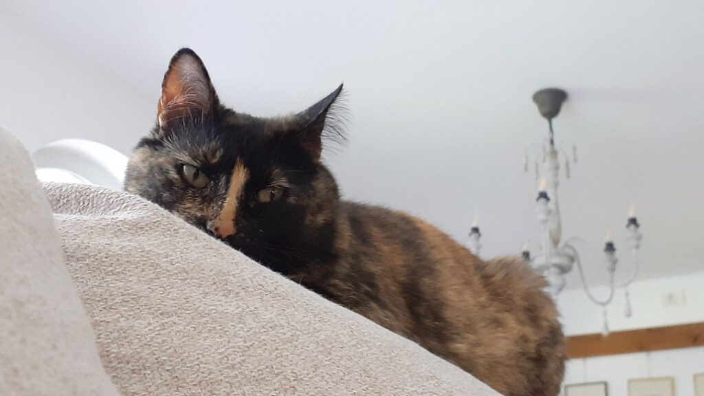
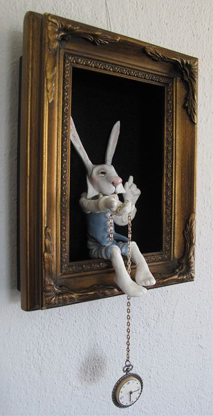

+++
date = 2022-05-11
title = "Ziua 120"
description = "Am urlat în mașina până când am simțit că nu mai am urlet în mine. Până n-am mai avut voce și n-am mai simțit nevoia unei voci. Am lovit cu pumnii în volan până am descărcat toată furia asta ce-a mocnit în mine. Am decompresat tot ce am putut, cu o încredere imensă în suflet că mă răcoresc, că spăl și curăț și mă încarc cu poftă de viață și cu înțelegere și cu toleranță și răbdare. Mi-am vizualizat momentul ăsta mic în viață ca pe o foaie de hârtie pe care scriu tot ce vreau să mă imprime iar scrisul ăsta de bune scrie peste toată nebunia care m-a împins azi la un așa paroxism, dând-o la o parte. Ori sunt pe cale să înnebunesc, ori am descoperit unul din secretele unei vieți trăite fain: atât mintea cât și corpul sunt plastilină în mâna voinței spiritului. Poți să te îndoi și să te târăști și să te încovoi și apoi să te netezești și să mergi mai departe."
authors = ["Biannca Locatelli"]
[taxonomies]
tags = []
[extra]
math = false
diagram = false
image = "images/ziua-120.jpg"
+++
---

Dimineața asta a debutat cu stângul, cred că de fapt chiar înnodarea dintre noapte și dimineață a pornit prost, cu o durere super intensă de cap. Nu e prietena mea, pe care o recunosc după pulsațiile în arcada stângă, e o durere nouă, de fapt e mama durerilor de cap, că doare ca dracu'. De la baza craniului radiază în toate direcțiile că nici nu știu cum să-mi țin capul, în ce poziție aș putea să respir și eu nițeluș.

Maxim, asta e dimineața mea "ideală"!

Spikylina, cu motorașul ei pornit și cu revărsarea de iubire pentru mine, a simțit ea pesemne ceva că m-a urmat tăcută și cumincioară și nu m-a pisat la capul dureros nici pentru terasă, nici pentru nevoi, nici pentru mâncare. Pur și simplu m-a urmat peste tot, fără să zică pâs (pe care oricum nu-l zice).

***

Evident, că doar deja încep să-mi recunosc și singură tiparele, m-au apucat niște nervi cumpliți. Cum mama mă-sii de treabă să funcționez eu azi când nici ochii parcă nu i-aș ține deschiși? Și până la urmă, de ce trebe neapărat să funcționez every fucking day?! Vreau să pot să zic și eu piua, să stau naibii în pat până mă fac bine, să fiu și eu drăgălită și îngrijită și ocrotită.

N-am răspuns că știu deja că pun întrebări și tâmpite dar și retorice pentru prezentul meu.

Trebe să fac eforturi să fac smoothieurile și tot tacâmul, fie că vreau, fie că nu. Mama doarme, că ea nu are nicio grijă și nicio treabă. Doar uitându-mă pe cameră, mă enervez și mai rău. Și apoi mi-aduc aminte că nu sunt obligată cu pistolul de nimeni să le fac. Dar dacă nu le fac, cine naiba le face?! Sunt din nou în bucla aia nenorocită din care nu pot ieși și macin întruna gânduri antitetice. În aceste momente, îmi trebe putere de superom, pentru că singura variantă este să fac eu ceva cu mine, cu durerea mea, să mă ridic deasupra ei. Nu există alta. Mama ei de treabă!!

***

S-a trezit, mă duc cu smoothieul, din nou e mizerie, mai bag în mintea mea vreo două cuvinte de "duh", cu capul zvâcnind din toate celulele lui, mă apuc de treabă iar mama de plângeri: că i-a fost frig rău azi-noapte, că au lătrat cățelele întruna, că una, că alta, iar eu sunt la o limită infimă să nu explodez. I-o fi fost frig dar are halate de cameră pufoase și călduroase la dispoziție să și le pună peste. Nu stai ca fraierul într-o bluzică și tremuri din tot corpul, pui ceva pe tine. Mă abțin greu, tare greu, de abia scot două cuvinte că, dacă deschid gura, mi-e că se prăvălesc grămadă toate alea care stau nerostite dar gândite. Adică fix echivalente, că nici nu contează dacă le scuip sau nu, din moment ce am pus intensitatea în energia cu care le-am gândit. Mi-am închis frecvența, am dat drumul la televizorul ei să nu o mai aud, termin curățenia în baie, le las mâncarea și plec să mă dau cu capul de ceva să fac durerea asta să se oprească în vreun fel.

***

Mi-am pus clasicul prosopel cu apă fiartă pe frunte, m-am trântit pe colțar, Spiky e lângă mine, mă supraveghează puiul ăsta scump iar eu fierb de nervi și de durere.

  

Cu toate încercările mele conștiente, cu respirația, cu mintea, cu tot ce am putut, de a-mi potoli starea asta haotică și durerea asta răscolitoare, nu am reușit nimic. Are iritarea asta o putere de zici că a fost ținută în oala cu presiune și acum a ieșit și împroașcă ca disperata peste tot.

Știu că atunci când nu mi-e bine fizic, nu mi-e bine de niciun fel. Dar azi, mă doare rău. Tare rău. Atât de rău că iar plâng. Nu am în casă pastile de durere, doar niște parasinus rămas de la domnul meu, pentru răceală și gripă. Nici nu contează ce e, iau 2 pastile și mai împrospătez prosopelul cu apă fiartă. Nu găsesc deloc o poziție în care să-mi fie cât de cât ok așa că, în disperare de cauză, mă abandonez cu totul durerii și momentului. Fie ce-o fi, să le naiba pe toate!

***

Am stat așa, într-un întuneric abisal până a coborât domnul meu. Are el o vorbă preferată cu care mă alintă când am momente d-astea mai de minus, mai de sub nivelul mării: "prăpădito!". Mereu mi-aduce un zâmbet pe față când și cum o spune și chiar și azi, sub torentul ăsta de durere, mi-e drag de el și mi-e drag de vorba asta. Poate am atins nivelul minim, poate pornesc și eu în sus, ce zici Universule, se poate să se poată?

***

Nu, încă mai am de coborât, pentru că mama, deși sunt sigură că îi e foame, așteaptă să mă duc eu să o iau, ea nu poate procesa singură să coboare pur și simplu. Cu nervii la purtător, mă duc să-i fac invitația specială și se pornește către bucătărie.

Mă vede că stau cu prosopul priponit pe frunte, nu mă întreabă de ce și se așează să fie servită. Foarte bine-mi face, că așa am învățat-o. Pentru că nu sunt în stare să deschid gura și să-i zic să se descurce și ea cu micul dejun, că are variante în frigider. Nu, eu, idiot de politicoasă, o întreb ce vrea să mănânce, îmi înghit nervii când strâmbă din nas la ce-i ofer, până la urmă cădem de acord asupra unei opțiuni și, cu mișcări greoaie, îi pun masa. Ea mă întreabă unde-i Spiky, e-n vervă dar nu transpiră din starea ei nicio picătură de grijă sau de empatie sau măcar de curiozitate să vadă ce naiba fac cu prosopul ăla lipit de frunte. Nu mai rezist sub greutatea momentului, plec și, pentru prima oară de când e la mine, o las singură la masă. E radioul pornit, e muzică, nu mai trebe să stau și eu ca un papițoi acolo că nu mai pot fizic, iar emoțional, mă face praf. Nu mai vreau să duc și basta!

A terminat, și-a spălat farfuria și a urcat, trecând prin living unde eram, fără niciun cuvânt. Foarte bine! Nu-mi trebe niciunul acum.

***

Am stat în lâncezeala asta și m-am bălăcit în lacrimi o bună bucată de timp.

Fizic oricum nu sunt în stare de altceva dar măcar emoțional aș putea să mă salt o țâră. Că la mine e telecomanda stărilor mele și tot la mine e și voința, sau ar trebui să fie. Nu, nu pot muta canalul până nu las șuvoiul ăsta de iritare să se exprime. Culmea, probabil de la pastilele luate, începe să se înmoaie durerea de cap. Unde dai și unde crapă, unde speri că poți rezolva și de fapt unde se rezolvă.

***

Îmi dau seama că la prânz, pentru mama, nu mai e decât varză călită dar a mâncat asta în ultimele două zile și știu că ulciorul nu merge de multe ori la apă.

Fug la Lidl și pe drum mi s-a rupt zăgazul.

Am urlat în mașina până când am simțit că nu mai am urlet în mine. Până n-am mai avut voce și n-am mai simțit nevoia unei voci. Am lovit cu pumnii în volan până am descărcat toată furia asta ce-a mocnit în mine. Am decompresat tot ce am putut, cu o încredere imensă în suflet că mă răcoresc, că spăl și curăț și mă încarc cu poftă de viață și cu înțelegere și cu toleranță și răbdare. Mi-am vizualizat momentul ăsta mic în viață ca pe o foaie de hârtie pe care scriu tot ce vreau să mă imprime iar scrisul ăsta de bune scrie peste toată nebunia care m-a împins azi la un așa paroxism, dând-o la o parte.

Ori sunt pe cale să înnebunesc, ori am descoperit unul din secretele unei vieți trăite fain: atât mintea cât și corpul sunt plastilină în mâna voinței spiritului. Poți să te îndoi și să te târăști și să te încovoi și apoi să te netezești și să mergi mai departe.

La Lidl, în cazul meu, să iau ce am nevoie pentru prânzul lor, pe care l-am făcut mult mai liniștită.

***

Mama a coborât la prânz doar așa, "de gura mea de soacră", nu că i-ar fi ei foame. Fermă, dar nu iritată, îi spun că dacă nu îi e foame, să nu vină. Intonația din glasul meu m-a uimit și pe mine, aproape că nu mi s-a părut că am glăsuit eu și a avut efect și asupra mamei. Nu, nu, ai dreptate, parcă mi-e foame totuși.

Da, i-a fost, că a mâncat totul, și-a luat foietajul și a plecat la ea. Nici nu mă așteptam să mă întrebe cum sunt, n-a făcut-o când eram îmbrobodită cu prosopelul, acum, fără el, nici atât. Doar că am înștiințat-o, la fel de ferm, că după amiaza asta voi sta cuminte în pat, să am grijă de mine. N-am primit niciun răspuns.

***

Am reușit să mă conving pe mine să-mi fiu parteneră bună în această după amiază, să las să curgă și să se scurgă tot răul ăla de m-a circulat azi, să nu blochez pe nicăieri vreo energie aiurea care să stagneze și să colecteze puroi, să bifez, pentru sufletul meu, măcar un rest de zi bun, să mă bucur de lucruri faine, să mă lăfăi în patul nostru imens și superb, să mă îmbib cu tot ce pot să-mi fie bine. Că dacă eu nu fac asta pentru mine, altcineva în locul meu nici nu trebe și nici nu poate.

***

Mi-a luat ceva până am derulat ziua ca să-mi premiez momentele de recunoștință:

1. Grija lui Spiky ce nu s-a dezlipit de colțar în dimineața asta! Incredibil cum miros animalele starea mai puțin bună a partenerilor lor umani.
2. Inspirația și transpirația momentului în care am decis că aruncarea în afară a răului ce se cocea în mine e cea mai rapidă și la îndemână opțiune!
3. Internetul ăsta care este o sursă imensă de frumos pentru o evadare dintr-un prezent sau pentru o completare de prezent! Ambele mi se aplică azi!

Clipa mea de frumos a fost umplută de:

  

by [Lucia Friedericy, Friedericy Dolls]
<a href="https://www.thetoyshoppe.com/products/?manufacturer=5647" target="_blank">https://www.thetoyshoppe.com/products/?manufacturer=5647</a>
